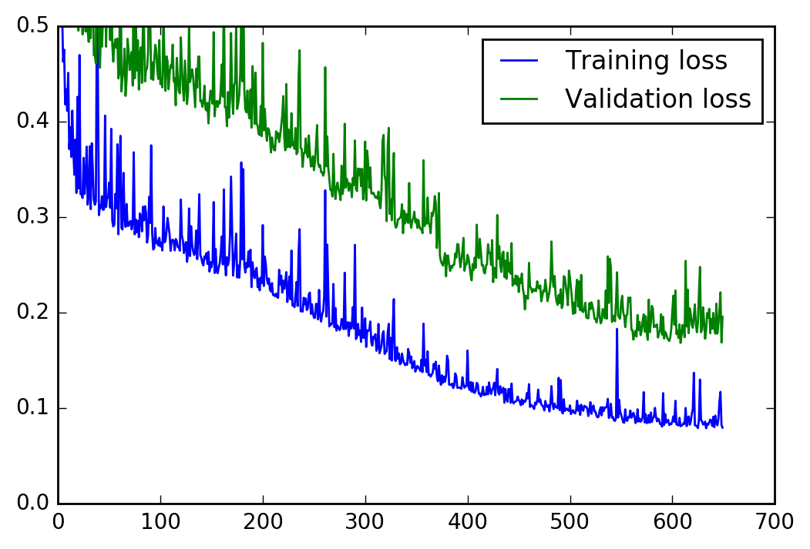

# Your first neural network

In this project, you'll build your first neural network and use it to predict daily bike rental ridership. We've provided some of the code, but left the implementation of the neural network up to you (for the most part). After you've submitted this project, feel free to explore the data and the model more.


```python
%matplotlib inline
%config InlineBackend.figure_format = 'retina'

import numpy as np
import pandas as pd
import matplotlib.pyplot as plt
```

## Load and prepare the data

A critical step in working with neural networks is preparing the data correctly. Variables on different scales make it difficult for the network to efficiently learn the correct weights. Below, we've written the code to load and prepare the data. You'll learn more about this soon!


```python
data_path = 'Bike-Sharing-Dataset/hour.csv'

rides = pd.read_csv(data_path)
```


```python
rides.head()
```


<div>
<table border="1" class="dataframe">
  <thead>
    <tr style="text-align: right;">
      <th></th>
      <th>instant</th>
      <th>dteday</th>
      <th>season</th>
      <th>yr</th>
      <th>mnth</th>
      <th>hr</th>
      <th>holiday</th>
      <th>weekday</th>
      <th>workingday</th>
      <th>weathersit</th>
      <th>temp</th>
      <th>atemp</th>
      <th>hum</th>
      <th>windspeed</th>
      <th>casual</th>
      <th>registered</th>
      <th>cnt</th>
    </tr>
  </thead>
  <tbody>
    <tr>
      <th>0</th>
      <td>1</td>
      <td>2011-01-01</td>
      <td>1</td>
      <td>0</td>
      <td>1</td>
      <td>0</td>
      <td>0</td>
      <td>6</td>
      <td>0</td>
      <td>1</td>
      <td>0.24</td>
      <td>0.2879</td>
      <td>0.81</td>
      <td>0.0</td>
      <td>3</td>
      <td>13</td>
      <td>16</td>
    </tr>
    <tr>
      <th>1</th>
      <td>2</td>
      <td>2011-01-01</td>
      <td>1</td>
      <td>0</td>
      <td>1</td>
      <td>1</td>
      <td>0</td>
      <td>6</td>
      <td>0</td>
      <td>1</td>
      <td>0.22</td>
      <td>0.2727</td>
      <td>0.80</td>
      <td>0.0</td>
      <td>8</td>
      <td>32</td>
      <td>40</td>
    </tr>
    <tr>
      <th>2</th>
      <td>3</td>
      <td>2011-01-01</td>
      <td>1</td>
      <td>0</td>
      <td>1</td>
      <td>2</td>
      <td>0</td>
      <td>6</td>
      <td>0</td>
      <td>1</td>
      <td>0.22</td>
      <td>0.2727</td>
      <td>0.80</td>
      <td>0.0</td>
      <td>5</td>
      <td>27</td>
      <td>32</td>
    </tr>
    <tr>
      <th>3</th>
      <td>4</td>
      <td>2011-01-01</td>
      <td>1</td>
      <td>0</td>
      <td>1</td>
      <td>3</td>
      <td>0</td>
      <td>6</td>
      <td>0</td>
      <td>1</td>
      <td>0.24</td>
      <td>0.2879</td>
      <td>0.75</td>
      <td>0.0</td>
      <td>3</td>
      <td>10</td>
      <td>13</td>
    </tr>
    <tr>
      <th>4</th>
      <td>5</td>
      <td>2011-01-01</td>
      <td>1</td>
      <td>0</td>
      <td>1</td>
      <td>4</td>
      <td>0</td>
      <td>6</td>
      <td>0</td>
      <td>1</td>
      <td>0.24</td>
      <td>0.2879</td>
      <td>0.75</td>
      <td>0.0</td>
      <td>0</td>
      <td>1</td>
      <td>1</td>
    </tr>
  </tbody>
</table>
</div>


## Checking out the data

This dataset has the number of riders for each hour of each day from January 1 2011 to December 31 2012. The number of riders is split between casual and registered, summed up in the `cnt` column. You can see the first few rows of the data above.

Below is a plot showing the number of bike riders over the first 10 days in the data set. You can see the hourly rentals here. This data is pretty complicated! The weekends have lower over all ridership and there are spikes when people are biking to and from work during the week. Looking at the data above, we also have information about temperature, humidity, and windspeed, all of these likely affecting the number of riders. You'll be trying to capture all this with your model.


```python
rides[:24*10].plot(x='dteday', y='cnt')
```


    <matplotlib.axes._subplots.AxesSubplot at 0x10f459b70>


### Dummy variables
Here we have some categorical variables like season, weather, month. To include these in our model, we'll need to make binary dummy variables. This is simple to do with Pandas thanks to `get_dummies()`.


```python
dummy_fields = ['season', 'weathersit', 'mnth', 'hr', 'weekday']
for each in dummy_fields:
    dummies = pd.get_dummies(rides[each], prefix=each, drop_first=False)
    rides = pd.concat([rides, dummies], axis=1)

fields_to_drop = ['instant', 'dteday', 'season', 'weathersit', 
                  'weekday', 'atemp', 'mnth', 'workingday', 'hr']
data = rides.drop(fields_to_drop, axis=1)
data.head()
```


<div>
<table border="1" class="dataframe">
  <thead>
    <tr style="text-align: right;">
      <th></th>
      <th>yr</th>
      <th>holiday</th>
      <th>temp</th>
      <th>hum</th>
      <th>windspeed</th>
      <th>casual</th>
      <th>registered</th>
      <th>cnt</th>
      <th>season_1</th>
      <th>season_2</th>
      <th>...</th>
      <th>hr_21</th>
      <th>hr_22</th>
      <th>hr_23</th>
      <th>weekday_0</th>
      <th>weekday_1</th>
      <th>weekday_2</th>
      <th>weekday_3</th>
      <th>weekday_4</th>
      <th>weekday_5</th>
      <th>weekday_6</th>
    </tr>
  </thead>
  <tbody>
    <tr>
      <th>0</th>
      <td>0</td>
      <td>0</td>
      <td>0.24</td>
      <td>0.81</td>
      <td>0.0</td>
      <td>3</td>
      <td>13</td>
      <td>16</td>
      <td>1.0</td>
      <td>0.0</td>
      <td>...</td>
      <td>0.0</td>
      <td>0.0</td>
      <td>0.0</td>
      <td>0.0</td>
      <td>0.0</td>
      <td>0.0</td>
      <td>0.0</td>
      <td>0.0</td>
      <td>0.0</td>
      <td>1.0</td>
    </tr>
    <tr>
      <th>1</th>
      <td>0</td>
      <td>0</td>
      <td>0.22</td>
      <td>0.80</td>
      <td>0.0</td>
      <td>8</td>
      <td>32</td>
      <td>40</td>
      <td>1.0</td>
      <td>0.0</td>
      <td>...</td>
      <td>0.0</td>
      <td>0.0</td>
      <td>0.0</td>
      <td>0.0</td>
      <td>0.0</td>
      <td>0.0</td>
      <td>0.0</td>
      <td>0.0</td>
      <td>0.0</td>
      <td>1.0</td>
    </tr>
    <tr>
      <th>2</th>
      <td>0</td>
      <td>0</td>
      <td>0.22</td>
      <td>0.80</td>
      <td>0.0</td>
      <td>5</td>
      <td>27</td>
      <td>32</td>
      <td>1.0</td>
      <td>0.0</td>
      <td>...</td>
      <td>0.0</td>
      <td>0.0</td>
      <td>0.0</td>
      <td>0.0</td>
      <td>0.0</td>
      <td>0.0</td>
      <td>0.0</td>
      <td>0.0</td>
      <td>0.0</td>
      <td>1.0</td>
    </tr>
    <tr>
      <th>3</th>
      <td>0</td>
      <td>0</td>
      <td>0.24</td>
      <td>0.75</td>
      <td>0.0</td>
      <td>3</td>
      <td>10</td>
      <td>13</td>
      <td>1.0</td>
      <td>0.0</td>
      <td>...</td>
      <td>0.0</td>
      <td>0.0</td>
      <td>0.0</td>
      <td>0.0</td>
      <td>0.0</td>
      <td>0.0</td>
      <td>0.0</td>
      <td>0.0</td>
      <td>0.0</td>
      <td>1.0</td>
    </tr>
    <tr>
      <th>4</th>
      <td>0</td>
      <td>0</td>
      <td>0.24</td>
      <td>0.75</td>
      <td>0.0</td>
      <td>0</td>
      <td>1</td>
      <td>1</td>
      <td>1.0</td>
      <td>0.0</td>
      <td>...</td>
      <td>0.0</td>
      <td>0.0</td>
      <td>0.0</td>
      <td>0.0</td>
      <td>0.0</td>
      <td>0.0</td>
      <td>0.0</td>
      <td>0.0</td>
      <td>0.0</td>
      <td>1.0</td>
    </tr>
  </tbody>
</table>
<p>5 rows × 59 columns</p>
</div>


### Scaling target variables
To make training the network easier, we'll standardize each of the continuous variables. That is, we'll shift and scale the variables such that they have zero mean and a standard deviation of 1.

The scaling factors are saved so we can go backwards when we use the network for predictions.


```python
quant_features = ['casual', 'registered', 'cnt', 'temp', 'hum', 'windspeed']
# Store scalings in a dictionary so we can convert back later
scaled_features = {}
for each in quant_features:
    mean, std = data[each].mean(), data[each].std()
    scaled_features[each] = [mean, std]
    data.loc[:, each] = (data[each] - mean)/std
```

### Splitting the data into training, testing, and validation sets

We'll save the last 21 days of the data to use as a test set after we've trained the network. We'll use this set to make predictions and compare them with the actual number of riders.


```python
# Save the last 21 days 
test_data = data[-21*24:]
data = data[:-21*24]

# Separate the data into features and targets
target_fields = ['cnt', 'casual', 'registered']
features, targets = data.drop(target_fields, axis=1), data[target_fields]
test_features, test_targets = test_data.drop(target_fields, axis=1), test_data[target_fields]
```

We'll split the data into two sets, one for training and one for validating as the network is being trained. Since this is time series data, we'll train on historical data, then try to predict on future data (the validation set).


```python
# Hold out the last 60 days of the remaining data as a validation set
train_features, train_targets = features[:-60*24], targets[:-60*24]
val_features, val_targets = features[-60*24:], targets[-60*24:]
```

## Time to build the network

Below you'll build your network. We've built out the structure and the backwards pass. You'll implement the forward pass through the network. You'll also set the hyperparameters: the learning rate, the number of hidden units, and the number of training passes.

The network has two layers, a hidden layer and an output layer. The hidden layer will use the sigmoid function for activations. The output layer has only one node and is used for the regression, the output of the node is the same as the input of the node. That is, the activation function is $f(x)=x$. A function that takes the input signal and generates an output signal, but takes into account the threshold, is called an activation function. We work through each layer of our network calculating the outputs for each neuron. All of the outputs from one layer become inputs to the neurons on the next layer. This process is called *forward propagation*.

We use the weights to propagate signals forward from the input to the output layers in a neural network. We use the weights to also propagate error backwards from the output back into the network to update our weights. This is called *backpropagation*.

> **Hint:** You'll need the derivative of the output activation function ($f(x) = x$) for the backpropagation implementation. If you aren't familiar with calculus, this function is equivalent to the equation $y = x$. What is the slope of that equation? That is the derivative of $f(x)$.

Below, you have these tasks:
1. Implement the sigmoid function to use as the activation function. Set `self.activation_function` in `__init__` to your sigmoid function.
2. Implement the forward pass in the `train` method.
3. Implement the backpropagation algorithm in the `train` method, including calculating the output error.
4. Implement the forward pass in the `run` method.
  


```python
class NeuralNetwork(object):
    def __init__(self, input_nodes, hidden_nodes, output_nodes, learning_rate):
        # Set number of nodes in input, hidden and output layers.
        self.input_nodes = input_nodes
        self.hidden_nodes = hidden_nodes
        self.output_nodes = output_nodes

        # Initialize weights
        self.weights_input_to_hidden = np.random.normal(0.0, self.hidden_nodes**-0.5, 
                                       (self.hidden_nodes, self.input_nodes))

        self.weights_hidden_to_output = np.random.normal(0.0, self.output_nodes**-0.5, 
                                       (self.output_nodes, self.hidden_nodes))
        self.lr = learning_rate
        
        #### Set this to your implemented sigmoid function ####
        # Activation function is the sigmoid function
        self.activation_function = lambda x: 1.0 / (1+np.exp(-x))
    
    def train(self, inputs_list, targets_list):
        # Convert inputs list to 2d array
        inputs = np.array(inputs_list, ndmin=2).T
        targets = np.array(targets_list, ndmin=2).T
        #### Implement the forward pass here ####
        ### Forward pass ###
        # TODO: Hidden layer
        hidden_inputs = np.dot(self.weights_input_to_hidden, inputs) #self.weights_input_to_hidden * inputs[:,None]
        # signals into hidden layer
        
        hidden_outputs = self.activation_function(hidden_inputs)
        # signals from hidden layer
        
        
        # TODO: Output layer
#         print(hidden_outputs.shape)
#         print(self.weights_hidden_to_output.shape)
        final_inputs = np.dot(self.weights_hidden_to_output, hidden_outputs) #np.dot(hidden_outputs, self.weights_hidden_to_output)
        # signals into final output layer
        final_outputs = final_inputs
        # signals from final output layer
        
        #### Implement the backward pass here ####
        ### Backward pass ###
        
        # TODO: Output error
        output_errors = targets - final_outputs
        # Output layer error is the difference between desired target and actual output.
        
        # TODO: Backpropagated error
       
        hidden_errors = np.dot(self.weights_hidden_to_output.T, output_errors)
        # output_errors #np.dot(output_errors, self.weights_input_to_hidden) * final_outputs * (1 - final_outputs)   
        # errors propagated to the hidden layer
        hidden_grad = hidden_outputs * (1 - hidden_outputs)
        #np.dot(hidden_errors, self.weights_hidden_to_output) * hidden_outputs * (1 - hidden_outputs)
        # hidden layer gradients
        print (hidden_outputs.shape)
        print (hidden_errors.shape)
        # TODO: Update the weights
        self.weights_hidden_to_output += self.lr * output_errors * hidden_outputs.T
        # update hidden-to-output weights with gradient descent step
        self.weights_input_to_hidden += self.lr * np.dot((hidden_errors * hidden_grad), inputs.T)
        # update input-to-hidden weights with gradient descent step

# # TODO: Backpropagated error
#     hidden_errors = np.dot(self.weights_hidden_to_output.T, output_errors)  # errors propagated to the hidden layer
#     hidden_grad = hidden_outputs * (1 - hidden_outputs) # hidden layer gradients

#     # TODO: Update the weights
#     self.weights_hidden_to_output += self.lr * output_errors * hidden_outputs.T  # update hidden-to-output weights with gradient descent step
#     self.weights_input_to_hidden += self.lr * np.dot((hidden_errors * hidden_grad), inputs.T)   # update input-to-hidden weights with gradient descent step   
    
    def run(self, inputs_list):
        # Run a forward pass through the network
        inputs = np.array(inputs_list, ndmin=2).T
        
        #### Implement the forward pass here ####
        # TODO: Hidden layer
        hidden_inputs = np.dot(self.weights_input_to_hidden, inputs)
        # signals into hidden layer
        hidden_outputs = self.activation_function(hidden_inputs)
        # signals from hidden layer
        
        # TODO: Output layer
        final_inputs = np.dot(self.weights_hidden_to_output, hidden_outputs)
        # signals into final output layer
        final_outputs = final_inputs
        # signals from final output layer 
        
        return final_outputs
```


```python
def MSE(y, Y):
    return np.mean((y-Y)**2)
```

## Training the network

Here you'll set the hyperparameters for the network. The strategy here is to find hyperparameters such that the error on the training set is low, but you're not overfitting to the data. If you train the network too long or have too many hidden nodes, it can become overly specific to the training set and will fail to generalize to the validation set. That is, the loss on the validation set will start increasing as the training set loss drops.

You'll also be using a method know as Stochastic Gradient Descent (SGD) to train the network. The idea is that for each training pass, you grab a random sample of the data instead of using the whole data set. You use many more training passes than with normal gradient descent, but each pass is much faster. This ends up training the network more efficiently. You'll learn more about SGD later.

### Choose the number of epochs
This is the number of times the dataset will pass through the network, each time updating the weights. As the number of epochs increases, the network becomes better and better at predicting the targets in the training set. You'll need to choose enough epochs to train the network well but not too many or you'll be overfitting.

### Choose the learning rate
This scales the size of weight updates. If this is too big, the weights tend to explode and the network fails to fit the data. A good choice to start at is 0.1. If the network has problems fitting the data, try reducing the learning rate. Note that the lower the learning rate, the smaller the steps are in the weight updates and the longer it takes for the neural network to converge.

### Choose the number of hidden nodes
The more hidden nodes you have, the more accurate predictions the model will make. Try a few different numbers and see how it affects the performance. You can look at the losses dictionary for a metric of the network performance. If the number of hidden units is too low, then the model won't have enough space to learn and if it is too high there are too many options for the direction that the learning can take. The trick here is to find the right balance in number of hidden units you choose.


```python
import sys

### Set the hyperparameters here ###
epochs = 100
learning_rate = 0.1
hidden_nodes = 2
output_nodes = 1

N_i = train_features.shape[1]
network = NeuralNetwork(N_i, hidden_nodes, output_nodes, learning_rate)

losses = {'train':[], 'validation':[]}
for e in range(epochs):
    # Go through a random batch of 128 records from the training data set
    batch = np.random.choice(train_features.index, size=128)
    for record, target in zip(train_features.ix[batch].values, 
                              train_targets.ix[batch]['cnt']):
        network.train(record, target)
    
    # Printing out the training progress
    train_loss = MSE(network.run(train_features), train_targets['cnt'].values)
    val_loss = MSE(network.run(val_features), val_targets['cnt'].values)
    sys.stdout.write("\rProgress: " + str(100 * e/float(epochs))[:4] \
                     + "% ... Training loss: " + str(train_loss)[:5] \
                     + " ... Validation loss: " + str(val_loss)[:5])
    
    losses['train'].append(train_loss)
    losses['validation'].append(val_loss)
```

    (2, 1)
    (2, 1)
    (2, 1)
    (2, 1)
    (2, 1)
    (2, 1)
    (2, 1)
    (2, 1)
    (2, 1)
    (2, 1)
    (2, 1)
    (2, 1)
    (2, 1)
    (2, 1)
    (2, 1)
    (2, 1)
    (2, 1)
    (2, 1)
    (2, 1)
    (2, 1)
    (2, 1)
    (2, 1)
    (2, 1)
    (2, 1)
    (2, 1)
    (2, 1)
    (2, 1)
    (2, 1)
    (2, 1)
    (2, 1)
    (2, 1)
    (2, 1)
    (2, 1)
    (2, 1)
    (2, 1)
    (2, 1)
    (2, 1)
    (2, 1)
    (2, 1)
    (2, 1)
    (2, 1)
    (2, 1)
    (2, 1)
    (2, 1)
    (2, 1)
    (2, 1)
    (2, 1)
    (2, 1)
    (2, 1)
    (2, 1)
    (2, 1)
    (2, 1)
    (2, 1)
    (2, 1)
    (2, 1)
    (2, 1)
    (2, 1)
    (2, 1)
    (2, 1)
    (2, 1)
    (2, 1)
    (2, 1)
    (2, 1)
    (2, 1)
    (2, 1)
    (2, 1)
    (2, 1)
    (2, 1)
    (2, 1)
    (2, 1)
    (2, 1)
    (2, 1)
    (2, 1)
    (2, 1)
    (2, 1)
    (2, 1)
    (2, 1)
    (2, 1)
    (2, 1)
    (2, 1)
    (2, 1)
    (2, 1)
    (2, 1)
    (2, 1)
    (2, 1)
    (2, 1)
    (2, 1)
    (2, 1)
    (2, 1)
    (2, 1)
    (2, 1)
    (2, 1)
    (2, 1)
    (2, 1)
    (2, 1)
    (2, 1)
    (2, 1)
    (2, 1)
    (2, 1)
    (2, 1)
    (2, 1)
    (2, 1)
    (2, 1)
    (2, 1)
    (2, 1)
    (2, 1)
    (2, 1)
    (2, 1)
    (2, 1)
    (2, 1)
    (2, 1)
    (2, 1)
    (2, 1)
    (2, 1)
    (2, 1)
    (2, 1)
    (2, 1)
    (2, 1)
    (2, 1)
    (2, 1)
    (2, 1)
    (2, 1)
    (2, 1)
    (2, 1)
    (2, 1)
    (2, 1)
    (2, 1)
    (2, 1)
    (2, 1)
    (2, 1)
    (2, 1)
    (2, 1)
    (2, 1)
    (2, 1)
    (2, 1)
    (2, 1)
    (2, 1)
    (2, 1)
    (2, 1)
    (2, 1)
    (2, 1)
    (2, 1)
    (2, 1)
    (2, 1)
    (2, 1)
    (2, 1)
    (2, 1)
    (2, 1)
    (2, 1)
    (2, 1)
    (2, 1)
    (2, 1)
    (2, 1)
    (2, 1)
    (2, 1)
    (2, 1)
    (2, 1)
    (2, 1)
    (2, 1)
    (2, 1)
    (2, 1)
    (2, 1)
    (2, 1)
    (2, 1)
    (2, 1)
    (2, 1)
    (2, 1)
    (2, 1)
    (2, 1)
    (2, 1)
    (2, 1)
    (2, 1)
    (2, 1)
    (2, 1)
    (2, 1)
    (2, 1)
    (2, 1)
    (2, 1)
    (2, 1)
    (2, 1)
    (2, 1)
    (2, 1)
    (2, 1)
    (2, 1)
    (2, 1)
    (2, 1)
    (2, 1)
    (2, 1)
    (2, 1)
    (2, 1)
    (2, 1)
    (2, 1)
    (2, 1)
    (2, 1)
    (2, 1)
    (2, 1)
    (2, 1)
    (2, 1)
    (2, 1)
    (2, 1)
    (2, 1)
    (2, 1)
    (2, 1)
    (2, 1)
    (2, 1)
    (2, 1)
    (2, 1)
    (2, 1)
    (2, 1)
    (2, 1)
    (2, 1)
    (2, 1)
    (2, 1)
    (2, 1)
    (2, 1)
    (2, 1)
    (2, 1)
    (2, 1)
    (2, 1)
    (2, 1)
    (2, 1)
    (2, 1)
    (2, 1)
    (2, 1)
    (2, 1)
    (2, 1)
    (2, 1)
    (2, 1)
    (2, 1)
    (2, 1)
    (2, 1)
    (2, 1)
    (2, 1)
    (2, 1)
    (2, 1)
    (2, 1)
    (2, 1)
    (2, 1)
    (2, 1)
    (2, 1)
    (2, 1)
    (2, 1)
    (2, 1)
    (2, 1)
    (2, 1)
    (2, 1)
    (2, 1)
    (2, 1)
    (2, 1)
    (2, 1)
    (2, 1)
    (2, 1)
    (2, 1)
    (2, 1)
    (2, 1)
    (2, 1)
    Progress: 0.0% ... Training loss: 0.964 ... Validation loss: 1.622(2, 1)
    (2, 1)
    (2, 1)
    (2, 1)
    (2, 1)
    (2, 1)
    (2, 1)
    (2, 1)
    (2, 1)
    (2, 1)
    (2, 1)
    (2, 1)
    (2, 1)
    (2, 1)
    (2, 1)
    (2, 1)
    (2, 1)
    (2, 1)
    (2, 1)
    (2, 1)
    (2, 1)
    (2, 1)
    (2, 1)
    (2, 1)
    (2, 1)
    (2, 1)
    (2, 1)
    (2, 1)
    (2, 1)
    (2, 1)
    (2, 1)
    (2, 1)
    (2, 1)
    (2, 1)
    (2, 1)
    (2, 1)
    (2, 1)
    (2, 1)
    (2, 1)
    (2, 1)
    (2, 1)
    (2, 1)
    (2, 1)
    (2, 1)
    (2, 1)
    (2, 1)
    (2, 1)
    (2, 1)
    (2, 1)
    (2, 1)
    (2, 1)
    (2, 1)
    (2, 1)
    (2, 1)
    (2, 1)
    (2, 1)
    (2, 1)
    (2, 1)
    (2, 1)
    (2, 1)
    (2, 1)
    (2, 1)
    (2, 1)
    (2, 1)
    (2, 1)
    (2, 1)
    (2, 1)
    (2, 1)
    (2, 1)
    (2, 1)
    (2, 1)
    (2, 1)
    (2, 1)
    (2, 1)
    (2, 1)
    (2, 1)
    (2, 1)
    (2, 1)
    (2, 1)
    (2, 1)
    (2, 1)
    (2, 1)
    (2, 1)
    (2, 1)
    (2, 1)
    (2, 1)
    (2, 1)
    (2, 1)
    (2, 1)
    (2, 1)
    (2, 1)
    (2, 1)
    (2, 1)
    (2, 1)
    (2, 1)
    (2, 1)
    (2, 1)
    (2, 1)
    (2, 1)
    (2, 1)
    (2, 1)
    (2, 1)
    (2, 1)
    (2, 1)
    (2, 1)
    (2, 1)
    (2, 1)
    (2, 1)
    (2, 1)
    (2, 1)
    (2, 1)
    (2, 1)
    (2, 1)
    (2, 1)
    (2, 1)
    (2, 1)
    (2, 1)
    (2, 1)
    (2, 1)
    (2, 1)
    (2, 1)
    (2, 1)
    (2, 1)
    (2, 1)
    (2, 1)
    (2, 1)
    (2, 1)
    (2, 1)
    (2, 1)
    (2, 1)
    (2, 1)
    (2, 1)
    (2, 1)
    (2, 1)
    (2, 1)
    (2, 1)
    (2, 1)
    (2, 1)
    (2, 1)
    (2, 1)
    (2, 1)
    (2, 1)
    (2, 1)
    (2, 1)
    (2, 1)
    (2, 1)
    (2, 1)
    (2, 1)
    (2, 1)
    (2, 1)
    (2, 1)
    (2, 1)
    (2, 1)
    (2, 1)
    (2, 1)
    (2, 1)
    (2, 1)
    (2, 1)
    (2, 1)
    (2, 1)
    (2, 1)
    (2, 1)
    (2, 1)
    (2, 1)
    (2, 1)
    (2, 1)
    (2, 1)
    (2, 1)
    (2, 1)
    (2, 1)
    (2, 1)
    (2, 1)
    (2, 1)
    (2, 1)
    (2, 1)
    (2, 1)
    (2, 1)
    (2, 1)
    (2, 1)
    (2, 1)
    (2, 1)
    (2, 1)
    (2, 1)
    (2, 1)
    (2, 1)
    (2, 1)
    (2, 1)
    (2, 1)
    (2, 1)
    (2, 1)
    (2, 1)
    (2, 1)
    (2, 1)
    (2, 1)
    (2, 1)
    (2, 1)
    (2, 1)
    (2, 1)
    (2, 1)
    (2, 1)
    (2, 1)
    (2, 1)
    (2, 1)
    (2, 1)
    (2, 1)
    (2, 1)
    (2, 1)
    (2, 1)
    (2, 1)
    (2, 1)
    (2, 1)
    (2, 1)
    (2, 1)
    (2, 1)
    (2, 1)
    (2, 1)
    (2, 1)
    (2, 1)
    (2, 1)
    (2, 1)
    (2, 1)
    (2, 1)
    (2, 1)
    (2, 1)
    (2, 1)
    (2, 1)
    (2, 1)
    (2, 1)
    (2, 1)
    (2, 1)
    (2, 1)
    (2, 1)
    (2, 1)
    (2, 1)
    (2, 1)
    (2, 1)
    (2, 1)
    (2, 1)
    (2, 1)
    (2, 1)
    (2, 1)
    (2, 1)
    (2, 1)
    (2, 1)
    (2, 1)
    (2, 1)
    (2, 1)
    (2, 1)
    (2, 1)
    (2, 1)
    (2, 1)
    (2, 1)
    (2, 1)
    (2, 1)
    (2, 1)
    (2, 1)
    Progress: 1.0% ... Training loss: 0.913 ... Validation loss: 1.474(2, 1)
    (2, 1)
    (2, 1)
    (2, 1)
    (2, 1)
    (2, 1)
    (2, 1)
    (2, 1)
    (2, 1)
    (2, 1)
    (2, 1)
    (2, 1)
    (2, 1)
    (2, 1)
    (2, 1)
    (2, 1)
    (2, 1)
    (2, 1)
    (2, 1)
    (2, 1)
    (2, 1)
    (2, 1)
    (2, 1)
    (2, 1)
    (2, 1)
    (2, 1)
    (2, 1)
    (2, 1)
    (2, 1)
    (2, 1)
    (2, 1)
    (2, 1)
    (2, 1)
    (2, 1)
    (2, 1)
    (2, 1)
    (2, 1)
    (2, 1)
    (2, 1)
    (2, 1)
    (2, 1)
    (2, 1)
    (2, 1)
    (2, 1)
    (2, 1)
    (2, 1)
    (2, 1)
    (2, 1)
    (2, 1)
    (2, 1)
    (2, 1)
    (2, 1)
    (2, 1)
    (2, 1)
    (2, 1)
    (2, 1)
    (2, 1)
    (2, 1)
    (2, 1)
    (2, 1)
    (2, 1)
    (2, 1)
    (2, 1)
    (2, 1)
    (2, 1)
    (2, 1)
    (2, 1)
    (2, 1)
    (2, 1)
    (2, 1)
    (2, 1)
    (2, 1)
    (2, 1)
    (2, 1)
    (2, 1)
    (2, 1)
    (2, 1)
    (2, 1)
    (2, 1)
    (2, 1)
    (2, 1)
    (2, 1)
    (2, 1)
    (2, 1)
    (2, 1)
    (2, 1)
    (2, 1)
    (2, 1)
    (2, 1)
    (2, 1)
    (2, 1)
    (2, 1)
    (2, 1)
    (2, 1)
    (2, 1)
    (2, 1)
    (2, 1)
    (2, 1)
    (2, 1)
    (2, 1)
    (2, 1)
    (2, 1)
    (2, 1)
    (2, 1)
    (2, 1)
    (2, 1)
    (2, 1)
    (2, 1)
    (2, 1)
    (2, 1)
    (2, 1)
    (2, 1)
    (2, 1)
    (2, 1)
    (2, 1)
    (2, 1)
    (2, 1)
    (2, 1)
    (2, 1)
    (2, 1)
    (2, 1)
    (2, 1)
    (2, 1)
    (2, 1)
    (2, 1)
    (2, 1)
    (2, 1)
    (2, 1)
    (2, 1)
    (2, 1)
    (2, 1)
    (2, 1)
    (2, 1)
    (2, 1)
    (2, 1)
    (2, 1)
    (2, 1)
    (2, 1)
    (2, 1)
    (2, 1)
    (2, 1)
    (2, 1)
    (2, 1)
    (2, 1)
    (2, 1)
    (2, 1)
    (2, 1)
    (2, 1)
    (2, 1)
    (2, 1)
    (2, 1)
    (2, 1)
    (2, 1)
    (2, 1)
    (2, 1)
    (2, 1)
    (2, 1)
    (2, 1)
    (2, 1)
    (2, 1)
    (2, 1)
    (2, 1)
    (2, 1)
    (2, 1)
    (2, 1)
    (2, 1)
    (2, 1)
    (2, 1)
    (2, 1)
    (2, 1)
    (2, 1)
    (2, 1)
    (2, 1)
    (2, 1)
    (2, 1)
    (2, 1)
    (2, 1)
    (2, 1)
    (2, 1)
    (2, 1)
    (2, 1)
    (2, 1)
    (2, 1)
    (2, 1)
    (2, 1)
    (2, 1)
    (2, 1)
    (2, 1)
    (2, 1)
    (2, 1)
    (2, 1)
    (2, 1)
    (2, 1)
    (2, 1)
    (2, 1)
    (2, 1)
    (2, 1)
    (2, 1)
    (2, 1)
    (2, 1)
    (2, 1)
    (2, 1)
    (2, 1)
    (2, 1)
    (2, 1)
    (2, 1)
    (2, 1)
    (2, 1)
    (2, 1)
    (2, 1)
    (2, 1)
    (2, 1)
    (2, 1)
    (2, 1)
    (2, 1)
    (2, 1)
    (2, 1)
    (2, 1)
    (2, 1)
    (2, 1)
    (2, 1)
    (2, 1)
    (2, 1)
    (2, 1)
    (2, 1)
    (2, 1)
    (2, 1)
    (2, 1)
    (2, 1)
    (2, 1)
    (2, 1)
    (2, 1)
    (2, 1)
    (2, 1)
    (2, 1)
    (2, 1)
    (2, 1)
    (2, 1)
    (2, 1)
    (2, 1)
    (2, 1)
    (2, 1)
    (2, 1)
    (2, 1)
    (2, 1)
    (2, 1)
    (2, 1)
    (2, 1)
    (2, 1)
    (2, 1)
    (2, 1)
    (2, 1)
    (2, 1)
    (2, 1)
    (2, 1)
    (2, 1)
    Progress: 2.0% ... Training loss: 0.949 ... Validation loss: 1.349(2, 1)
    (2, 1)
    (2, 1)
    (2, 1)
    (2, 1)
    (2, 1)
    (2, 1)
    (2, 1)
    (2, 1)
    (2, 1)
    (2, 1)
    (2, 1)
    (2, 1)
    (2, 1)
    (2, 1)
    (2, 1)
    (2, 1)
    (2, 1)
    (2, 1)
    (2, 1)
    (2, 1)
    (2, 1)
    (2, 1)
    (2, 1)
    (2, 1)
    (2, 1)
    (2, 1)
    (2, 1)
    (2, 1)
    (2, 1)
    (2, 1)
    (2, 1)
    (2, 1)
    (2, 1)
    (2, 1)
    (2, 1)
    (2, 1)
    (2, 1)
    (2, 1)
    (2, 1)
    (2, 1)
    (2, 1)
    (2, 1)
    (2, 1)
    (2, 1)
    (2, 1)
    (2, 1)
    (2, 1)
    (2, 1)
    (2, 1)
    (2, 1)
    (2, 1)
    (2, 1)
    (2, 1)
    (2, 1)
    (2, 1)
    (2, 1)
    (2, 1)
    (2, 1)
    (2, 1)
    (2, 1)
    (2, 1)
    (2, 1)
    (2, 1)
    (2, 1)
    (2, 1)
    (2, 1)
    (2, 1)
    (2, 1)
    (2, 1)
    (2, 1)
    (2, 1)
    (2, 1)
    (2, 1)
    (2, 1)
    (2, 1)
    (2, 1)
    (2, 1)
    (2, 1)
    (2, 1)
    (2, 1)
    (2, 1)
    (2, 1)
    (2, 1)
    (2, 1)
    (2, 1)
    (2, 1)
    (2, 1)
    (2, 1)
    (2, 1)
    (2, 1)
    (2, 1)
    (2, 1)
    (2, 1)
    (2, 1)
    (2, 1)
    (2, 1)
    (2, 1)
    (2, 1)
    (2, 1)
    (2, 1)
    (2, 1)
    (2, 1)
    (2, 1)
    (2, 1)
    (2, 1)
    (2, 1)
    (2, 1)
    (2, 1)
    (2, 1)
    (2, 1)
    (2, 1)
    (2, 1)
    (2, 1)
    (2, 1)
    (2, 1)
    (2, 1)
    (2, 1)
    (2, 1)
    (2, 1)
    (2, 1)
    (2, 1)
    (2, 1)
    (2, 1)
    (2, 1)
    (2, 1)
    (2, 1)
    (2, 1)
    (2, 1)
    (2, 1)
    (2, 1)
    (2, 1)
    (2, 1)
    (2, 1)
    (2, 1)
    (2, 1)
    (2, 1)
    (2, 1)
    (2, 1)
    (2, 1)
    (2, 1)
    (2, 1)
    (2, 1)
    (2, 1)
    (2, 1)
    (2, 1)
    (2, 1)
    (2, 1)
    (2, 1)
    (2, 1)
    (2, 1)
    (2, 1)
    (2, 1)
    (2, 1)
    (2, 1)
    (2, 1)
    (2, 1)
    (2, 1)
    (2, 1)
    (2, 1)
    (2, 1)
    (2, 1)
    (2, 1)
    (2, 1)
    (2, 1)
    (2, 1)
    (2, 1)
    (2, 1)
    (2, 1)
    (2, 1)
    (2, 1)
    (2, 1)
    (2, 1)
    (2, 1)
    (2, 1)
    (2, 1)
    (2, 1)
    (2, 1)
    (2, 1)
    (2, 1)
    (2, 1)
    (2, 1)
    (2, 1)
    (2, 1)
    (2, 1)
    (2, 1)
    (2, 1)
    (2, 1)
    (2, 1)
    (2, 1)
    (2, 1)
    (2, 1)
    (2, 1)
    (2, 1)
    (2, 1)
    (2, 1)
    (2, 1)
    (2, 1)
    (2, 1)
    (2, 1)
    (2, 1)
    (2, 1)
    (2, 1)
    (2, 1)
    (2, 1)
    (2, 1)
    (2, 1)
    (2, 1)
    (2, 1)
    (2, 1)
    (2, 1)
    (2, 1)
    (2, 1)
    (2, 1)
    (2, 1)
    (2, 1)
    (2, 1)
    (2, 1)
    (2, 1)
    (2, 1)
    (2, 1)
    (2, 1)
    (2, 1)
    (2, 1)
    (2, 1)
    (2, 1)
    (2, 1)
    (2, 1)
    (2, 1)
    (2, 1)
    (2, 1)
    (2, 1)
    (2, 1)
    (2, 1)
    (2, 1)
    (2, 1)
    (2, 1)
    (2, 1)
    (2, 1)
    (2, 1)
    (2, 1)
    (2, 1)
    (2, 1)
    (2, 1)
    (2, 1)
    (2, 1)
    (2, 1)
    (2, 1)
    (2, 1)
    (2, 1)
    (2, 1)
    (2, 1)
    (2, 1)
    (2, 1)
    (2, 1)
    (2, 1)
    Progress: 3.0% ... Training loss: 0.810 ... Validation loss: 1.354(2, 1)
    (2, 1)
    (2, 1)
    (2, 1)
    (2, 1)
    (2, 1)
    (2, 1)
    (2, 1)
    (2, 1)
    (2, 1)
    (2, 1)
    (2, 1)
    (2, 1)
    (2, 1)
    (2, 1)
    (2, 1)
    (2, 1)
    (2, 1)
    (2, 1)
    (2, 1)
    (2, 1)
    (2, 1)
    (2, 1)
    (2, 1)
    (2, 1)
    (2, 1)
    (2, 1)
    (2, 1)
    (2, 1)
    (2, 1)
    (2, 1)
    (2, 1)
    (2, 1)
    (2, 1)
    (2, 1)
    (2, 1)
    (2, 1)
    (2, 1)
    (2, 1)
    (2, 1)
    (2, 1)
    (2, 1)
    (2, 1)
    (2, 1)
    (2, 1)
    (2, 1)
    (2, 1)
    (2, 1)
    (2, 1)
    (2, 1)
    (2, 1)
    (2, 1)
    (2, 1)
    (2, 1)
    (2, 1)
    (2, 1)
    (2, 1)
    (2, 1)
    (2, 1)
    (2, 1)
    (2, 1)
    (2, 1)
    (2, 1)
    (2, 1)
    (2, 1)
    (2, 1)
    (2, 1)
    (2, 1)
    (2, 1)
    (2, 1)
    (2, 1)
    (2, 1)
    (2, 1)
    (2, 1)
    (2, 1)
    (2, 1)
    (2, 1)
    (2, 1)
    (2, 1)
    (2, 1)
    (2, 1)
    (2, 1)
    (2, 1)
    (2, 1)
    (2, 1)
    (2, 1)
    (2, 1)
    (2, 1)
    (2, 1)
    (2, 1)
    (2, 1)
    (2, 1)
    (2, 1)
    (2, 1)
    (2, 1)
    (2, 1)
    (2, 1)
    (2, 1)
    (2, 1)
    (2, 1)
    (2, 1)
    (2, 1)
    (2, 1)
    (2, 1)
    (2, 1)
    (2, 1)
    (2, 1)
    (2, 1)
    (2, 1)
    (2, 1)
    (2, 1)
    (2, 1)
    (2, 1)
    (2, 1)
    (2, 1)
    (2, 1)
    (2, 1)
    (2, 1)
    (2, 1)
    (2, 1)
    (2, 1)
    (2, 1)
    (2, 1)
    (2, 1)
    (2, 1)
    (2, 1)
    (2, 1)
    (2, 1)
    (2, 1)
    (2, 1)
    (2, 1)
    (2, 1)
    (2, 1)
    (2, 1)
    (2, 1)
    (2, 1)
    (2, 1)
    (2, 1)
    (2, 1)
    (2, 1)
    (2, 1)
    (2, 1)
    (2, 1)
    (2, 1)
    (2, 1)
    (2, 1)
    (2, 1)
    (2, 1)
    (2, 1)
    (2, 1)
    (2, 1)
    (2, 1)
    (2, 1)
    (2, 1)
    (2, 1)
    (2, 1)
    (2, 1)
    (2, 1)
    (2, 1)
    (2, 1)
    (2, 1)
    (2, 1)
    (2, 1)
    (2, 1)
    (2, 1)
    (2, 1)
    (2, 1)
    (2, 1)
    (2, 1)
    (2, 1)
    (2, 1)
    (2, 1)
    (2, 1)
    (2, 1)
    (2, 1)
    (2, 1)
    (2, 1)
    (2, 1)
    (2, 1)
    (2, 1)
    (2, 1)
    (2, 1)
    (2, 1)
    (2, 1)
    (2, 1)
    (2, 1)
    (2, 1)
    (2, 1)
    (2, 1)
    (2, 1)
    (2, 1)
    (2, 1)
    (2, 1)
    (2, 1)
    (2, 1)
    (2, 1)
    (2, 1)
    (2, 1)
    (2, 1)
    (2, 1)
    (2, 1)
    (2, 1)
    (2, 1)
    (2, 1)
    (2, 1)
    (2, 1)
    (2, 1)
    (2, 1)
    (2, 1)
    (2, 1)
    (2, 1)
    (2, 1)
    (2, 1)
    (2, 1)
    (2, 1)
    (2, 1)
    (2, 1)
    (2, 1)
    (2, 1)
    (2, 1)
    (2, 1)
    (2, 1)
    (2, 1)
    (2, 1)
    (2, 1)
    (2, 1)
    (2, 1)
    (2, 1)
    (2, 1)
    (2, 1)
    (2, 1)
    (2, 1)
    (2, 1)
    (2, 1)
    (2, 1)
    (2, 1)
    (2, 1)
    (2, 1)
    (2, 1)
    (2, 1)
    (2, 1)
    (2, 1)
    (2, 1)
    (2, 1)
    (2, 1)
    (2, 1)
    (2, 1)
    (2, 1)
    (2, 1)
    (2, 1)
    (2, 1)
    (2, 1)
    (2, 1)
    (2, 1)
    (2, 1)
    (2, 1)
    Progress: 4.0% ... Training loss: 0.778 ... Validation loss: 1.205(2, 1)
    (2, 1)
    (2, 1)
    (2, 1)
    (2, 1)
    (2, 1)
    (2, 1)
    (2, 1)
    (2, 1)
    (2, 1)
    (2, 1)
    (2, 1)
    (2, 1)
    (2, 1)
    (2, 1)
    (2, 1)
    (2, 1)
    (2, 1)
    (2, 1)
    (2, 1)
    (2, 1)
    (2, 1)
    (2, 1)
    (2, 1)
    (2, 1)
    (2, 1)
    (2, 1)
    (2, 1)
    (2, 1)
    (2, 1)
    (2, 1)
    (2, 1)
    (2, 1)
    (2, 1)
    (2, 1)
    (2, 1)
    (2, 1)
    (2, 1)
    (2, 1)
    (2, 1)
    (2, 1)
    (2, 1)
    (2, 1)
    (2, 1)
    (2, 1)
    (2, 1)
    (2, 1)
    (2, 1)
    (2, 1)
    (2, 1)
    (2, 1)
    (2, 1)
    (2, 1)
    (2, 1)
    (2, 1)
    (2, 1)
    (2, 1)
    (2, 1)
    (2, 1)
    (2, 1)
    (2, 1)
    (2, 1)
    (2, 1)
    (2, 1)
    (2, 1)
    (2, 1)
    (2, 1)
    (2, 1)
    (2, 1)
    (2, 1)
    (2, 1)
    (2, 1)
    (2, 1)
    (2, 1)
    (2, 1)
    (2, 1)
    (2, 1)
    (2, 1)
    (2, 1)
    (2, 1)
    (2, 1)
    (2, 1)
    (2, 1)
    (2, 1)
    (2, 1)
    (2, 1)
    (2, 1)
    (2, 1)
    (2, 1)
    (2, 1)
    (2, 1)
    (2, 1)
    (2, 1)
    (2, 1)
    (2, 1)
    (2, 1)
    (2, 1)
    (2, 1)
    (2, 1)
    (2, 1)
    (2, 1)
    (2, 1)
    (2, 1)
    (2, 1)
    (2, 1)
    (2, 1)
    (2, 1)
    (2, 1)
    (2, 1)
    (2, 1)
    (2, 1)
    (2, 1)
    (2, 1)
    (2, 1)
    (2, 1)
    (2, 1)
    (2, 1)
    (2, 1)
    (2, 1)
    (2, 1)
    (2, 1)
    (2, 1)
    (2, 1)
    (2, 1)
    (2, 1)
    (2, 1)
    (2, 1)
    (2, 1)
    (2, 1)
    (2, 1)
    (2, 1)
    (2, 1)
    (2, 1)
    (2, 1)
    (2, 1)
    (2, 1)
    (2, 1)
    (2, 1)
    (2, 1)
    (2, 1)
    (2, 1)
    (2, 1)
    (2, 1)
    (2, 1)
    (2, 1)
    (2, 1)
    (2, 1)
    (2, 1)
    (2, 1)
    (2, 1)
    (2, 1)
    (2, 1)
    (2, 1)
    (2, 1)
    (2, 1)
    (2, 1)
    (2, 1)
    (2, 1)
    (2, 1)
    (2, 1)
    (2, 1)
    (2, 1)
    (2, 1)
    (2, 1)
    (2, 1)
    (2, 1)
    (2, 1)
    (2, 1)
    (2, 1)
    (2, 1)
    (2, 1)
    (2, 1)
    (2, 1)
    (2, 1)
    (2, 1)
    (2, 1)
    (2, 1)
    (2, 1)
    (2, 1)
    (2, 1)
    (2, 1)
    (2, 1)
    (2, 1)
    (2, 1)
    (2, 1)
    (2, 1)
    (2, 1)
    (2, 1)
    (2, 1)
    (2, 1)
    (2, 1)
    (2, 1)
    (2, 1)
    (2, 1)
    (2, 1)
    (2, 1)
    (2, 1)
    (2, 1)
    (2, 1)
    (2, 1)
    (2, 1)
    (2, 1)
    (2, 1)
    (2, 1)
    (2, 1)
    (2, 1)
    (2, 1)
    (2, 1)
    (2, 1)
    (2, 1)
    (2, 1)
    (2, 1)
    (2, 1)
    (2, 1)
    (2, 1)
    (2, 1)
    (2, 1)
    (2, 1)
    (2, 1)
    (2, 1)
    (2, 1)
    (2, 1)
    (2, 1)
    (2, 1)
    (2, 1)
    (2, 1)
    (2, 1)
    (2, 1)
    (2, 1)
    (2, 1)
    (2, 1)
    (2, 1)
    (2, 1)
    (2, 1)
    (2, 1)
    (2, 1)
    (2, 1)
    (2, 1)
    (2, 1)
    (2, 1)
    (2, 1)
    (2, 1)
    (2, 1)
    (2, 1)
    (2, 1)
    (2, 1)
    (2, 1)
    (2, 1)
    (2, 1)
    (2, 1)
    (2, 1)
    (2, 1)
    (2, 1)
    (2, 1)
    (2, 1)
    (2, 1)
    Progress: 5.0% ... Training loss: 0.849 ... Validation loss: 1.130(2, 1)
    (2, 1)
    (2, 1)
    (2, 1)
    (2, 1)
    (2, 1)
    (2, 1)
    (2, 1)
    (2, 1)
    (2, 1)
    (2, 1)
    (2, 1)
    (2, 1)
    (2, 1)
    (2, 1)
    (2, 1)
    (2, 1)
    (2, 1)
    (2, 1)
    (2, 1)
    (2, 1)
    (2, 1)
    (2, 1)
    (2, 1)
    (2, 1)
    (2, 1)
    (2, 1)
    (2, 1)
    (2, 1)
    (2, 1)
    (2, 1)
    (2, 1)
    (2, 1)
    (2, 1)
    (2, 1)
    (2, 1)
    (2, 1)
    (2, 1)
    (2, 1)
    (2, 1)
    (2, 1)
    (2, 1)
    (2, 1)
    (2, 1)
    (2, 1)
    (2, 1)
    (2, 1)
    (2, 1)
    (2, 1)
    (2, 1)
    (2, 1)
    (2, 1)
    (2, 1)
    (2, 1)
    (2, 1)
    (2, 1)
    (2, 1)
    (2, 1)
    (2, 1)
    (2, 1)
    (2, 1)
    (2, 1)
    (2, 1)
    (2, 1)
    (2, 1)
    (2, 1)
    (2, 1)
    (2, 1)
    (2, 1)
    (2, 1)
    (2, 1)
    (2, 1)
    (2, 1)
    (2, 1)
    (2, 1)
    (2, 1)
    (2, 1)
    (2, 1)
    (2, 1)
    (2, 1)
    (2, 1)
    (2, 1)
    (2, 1)
    (2, 1)
    (2, 1)
    (2, 1)
    (2, 1)
    (2, 1)
    (2, 1)
    (2, 1)
    (2, 1)
    (2, 1)
    (2, 1)
    (2, 1)
    (2, 1)
    (2, 1)
    (2, 1)
    (2, 1)
    (2, 1)
    (2, 1)
    (2, 1)
    (2, 1)
    (2, 1)
    (2, 1)
    (2, 1)
    (2, 1)
    (2, 1)
    (2, 1)
    (2, 1)
    (2, 1)
    (2, 1)
    (2, 1)
    (2, 1)
    (2, 1)
    (2, 1)
    (2, 1)
    (2, 1)
    (2, 1)
    (2, 1)
    (2, 1)
    (2, 1)
    (2, 1)
    (2, 1)
    (2, 1)
    (2, 1)
    (2, 1)
    (2, 1)
    (2, 1)
    (2, 1)
    (2, 1)
    (2, 1)
    (2, 1)
    (2, 1)
    (2, 1)
    (2, 1)
    (2, 1)
    (2, 1)
    (2, 1)
    (2, 1)
    (2, 1)
    (2, 1)
    (2, 1)
    (2, 1)
    (2, 1)
    (2, 1)
    (2, 1)
    (2, 1)
    (2, 1)
    (2, 1)
    (2, 1)
    (2, 1)
    (2, 1)
    (2, 1)
    (2, 1)
    (2, 1)
    (2, 1)
    (2, 1)
    (2, 1)
    (2, 1)
    (2, 1)
    (2, 1)
    (2, 1)
    (2, 1)
    (2, 1)
    (2, 1)
    (2, 1)
    (2, 1)
    (2, 1)
    (2, 1)
    (2, 1)
    (2, 1)
    (2, 1)
    (2, 1)
    (2, 1)
    (2, 1)
    (2, 1)
    (2, 1)
    (2, 1)
    (2, 1)
    (2, 1)
    (2, 1)
    (2, 1)
    (2, 1)
    (2, 1)
    (2, 1)
    (2, 1)
    (2, 1)
    (2, 1)
    (2, 1)
    (2, 1)
    (2, 1)
    (2, 1)
    (2, 1)
    (2, 1)
    (2, 1)
    (2, 1)
    (2, 1)
    (2, 1)
    (2, 1)
    (2, 1)
    (2, 1)
    (2, 1)
    (2, 1)
    (2, 1)
    (2, 1)
    (2, 1)
    (2, 1)
    (2, 1)
    (2, 1)
    (2, 1)
    (2, 1)
    (2, 1)
    (2, 1)
    (2, 1)
    (2, 1)
    (2, 1)
    (2, 1)
    (2, 1)
    (2, 1)
    (2, 1)
    (2, 1)
    (2, 1)
    (2, 1)
    (2, 1)
    (2, 1)
    (2, 1)
    (2, 1)
    (2, 1)
    (2, 1)
    (2, 1)
    (2, 1)
    (2, 1)
    (2, 1)
    (2, 1)
    (2, 1)
    (2, 1)
    (2, 1)
    (2, 1)
    (2, 1)
    (2, 1)
    (2, 1)
    (2, 1)
    (2, 1)
    (2, 1)
    (2, 1)
    (2, 1)
    (2, 1)
    (2, 1)
    (2, 1)
    (2, 1)
    (2, 1)
    (2, 1)
    (2, 1)
    (2, 1)
    (2, 1)
    (2, 1)
    Progress: 6.0% ... Training loss: 0.758 ... Validation loss: 1.234(2, 1)
    (2, 1)
    (2, 1)
    (2, 1)
    (2, 1)
    (2, 1)
    (2, 1)
    (2, 1)
    (2, 1)
    (2, 1)
    (2, 1)
    (2, 1)
    (2, 1)
    (2, 1)
    (2, 1)
    (2, 1)
    (2, 1)
    (2, 1)
    (2, 1)
    (2, 1)
    (2, 1)
    (2, 1)
    (2, 1)
    (2, 1)
    (2, 1)
    (2, 1)
    (2, 1)
    (2, 1)
    (2, 1)
    (2, 1)
    (2, 1)
    (2, 1)
    (2, 1)
    (2, 1)
    (2, 1)
    (2, 1)
    (2, 1)
    (2, 1)
    (2, 1)
    (2, 1)
    (2, 1)
    (2, 1)
    (2, 1)
    (2, 1)
    (2, 1)
    (2, 1)
    (2, 1)
    (2, 1)
    (2, 1)
    (2, 1)
    (2, 1)
    (2, 1)
    (2, 1)
    (2, 1)
    (2, 1)
    (2, 1)
    (2, 1)
    (2, 1)
    (2, 1)
    (2, 1)
    (2, 1)
    (2, 1)
    (2, 1)
    (2, 1)
    (2, 1)
    (2, 1)
    (2, 1)
    (2, 1)
    (2, 1)
    (2, 1)
    (2, 1)
    (2, 1)
    (2, 1)
    (2, 1)
    (2, 1)
    (2, 1)
    (2, 1)
    (2, 1)
    (2, 1)
    (2, 1)
    (2, 1)
    (2, 1)
    (2, 1)
    (2, 1)
    (2, 1)
    (2, 1)
    (2, 1)
    (2, 1)
    (2, 1)
    (2, 1)
    (2, 1)
    (2, 1)
    (2, 1)
    (2, 1)
    (2, 1)
    (2, 1)
    (2, 1)
    (2, 1)
    (2, 1)
    (2, 1)
    (2, 1)
    (2, 1)
    (2, 1)
    (2, 1)
    (2, 1)
    (2, 1)
    (2, 1)
    (2, 1)
    (2, 1)
    (2, 1)
    (2, 1)
    (2, 1)
    (2, 1)
    (2, 1)
    (2, 1)
    (2, 1)
    (2, 1)
    (2, 1)
    (2, 1)
    (2, 1)
    (2, 1)
    (2, 1)
    (2, 1)
    (2, 1)
    (2, 1)
    (2, 1)
    (2, 1)
    (2, 1)
    (2, 1)
    (2, 1)
    (2, 1)
    (2, 1)
    (2, 1)
    (2, 1)
    (2, 1)
    (2, 1)
    (2, 1)
    (2, 1)
    (2, 1)
    (2, 1)
    (2, 1)
    (2, 1)
    (2, 1)
    (2, 1)
    (2, 1)
    (2, 1)
    (2, 1)
    (2, 1)
    (2, 1)
    (2, 1)
    (2, 1)
    (2, 1)
    (2, 1)
    (2, 1)
    (2, 1)
    (2, 1)
    (2, 1)
    (2, 1)
    (2, 1)
    (2, 1)
    (2, 1)
    (2, 1)
    (2, 1)
    (2, 1)
    (2, 1)
    (2, 1)
    (2, 1)
    (2, 1)
    (2, 1)
    (2, 1)
    (2, 1)
    (2, 1)
    (2, 1)
    (2, 1)
    (2, 1)
    (2, 1)
    (2, 1)
    (2, 1)
    (2, 1)
    (2, 1)
    (2, 1)
    (2, 1)
    (2, 1)
    (2, 1)
    (2, 1)
    (2, 1)
    (2, 1)
    (2, 1)
    (2, 1)
    (2, 1)
    (2, 1)
    (2, 1)
    (2, 1)
    (2, 1)
    (2, 1)
    (2, 1)
    (2, 1)
    (2, 1)
    (2, 1)
    (2, 1)
    (2, 1)
    (2, 1)
    (2, 1)
    (2, 1)
    (2, 1)
    (2, 1)
    (2, 1)
    (2, 1)
    (2, 1)
    (2, 1)
    (2, 1)
    (2, 1)
    (2, 1)
    (2, 1)
    (2, 1)
    (2, 1)
    (2, 1)
    (2, 1)
    (2, 1)
    (2, 1)
    (2, 1)
    (2, 1)
    (2, 1)
    (2, 1)
    (2, 1)
    (2, 1)
    (2, 1)
    (2, 1)
    (2, 1)
    (2, 1)
    (2, 1)
    (2, 1)
    (2, 1)
    (2, 1)
    (2, 1)
    (2, 1)
    (2, 1)
    (2, 1)
    (2, 1)
    (2, 1)
    (2, 1)
    (2, 1)
    (2, 1)
    (2, 1)
    (2, 1)
    (2, 1)
    (2, 1)
    (2, 1)
    (2, 1)
    (2, 1)
    (2, 1)
    (2, 1)
    (2, 1)
    (2, 1)
    (2, 1)
    (2, 1)
    Progress: 7.0% ... Training loss: 0.750 ... Validation loss: 1.240(2, 1)
    (2, 1)
    (2, 1)
    (2, 1)
    (2, 1)
    (2, 1)
    (2, 1)
    (2, 1)
    (2, 1)
    (2, 1)
    (2, 1)
    (2, 1)
    (2, 1)
    (2, 1)
    (2, 1)
    (2, 1)
    (2, 1)
    (2, 1)
    (2, 1)
    (2, 1)
    (2, 1)
    (2, 1)
    (2, 1)
    (2, 1)
    (2, 1)
    (2, 1)
    (2, 1)
    (2, 1)
    (2, 1)
    (2, 1)
    (2, 1)
    (2, 1)
    (2, 1)
    (2, 1)
    (2, 1)
    (2, 1)
    (2, 1)
    (2, 1)
    (2, 1)
    (2, 1)
    (2, 1)
    (2, 1)
    (2, 1)
    (2, 1)
    (2, 1)
    (2, 1)
    (2, 1)
    (2, 1)
    (2, 1)
    (2, 1)
    (2, 1)
    (2, 1)
    (2, 1)
    (2, 1)
    (2, 1)
    (2, 1)
    (2, 1)
    (2, 1)
    (2, 1)
    (2, 1)
    (2, 1)
    (2, 1)
    (2, 1)
    (2, 1)
    (2, 1)
    (2, 1)
    (2, 1)
    (2, 1)
    (2, 1)
    (2, 1)
    (2, 1)
    (2, 1)
    (2, 1)
    (2, 1)
    (2, 1)
    (2, 1)
    (2, 1)
    (2, 1)
    (2, 1)
    (2, 1)
    (2, 1)
    (2, 1)
    (2, 1)
    (2, 1)
    (2, 1)
    (2, 1)
    (2, 1)
    (2, 1)
    (2, 1)
    (2, 1)
    (2, 1)
    (2, 1)
    (2, 1)
    (2, 1)
    (2, 1)
    (2, 1)
    (2, 1)
    (2, 1)
    (2, 1)
    (2, 1)
    (2, 1)
    (2, 1)
    (2, 1)
    (2, 1)
    (2, 1)
    (2, 1)
    (2, 1)
    (2, 1)
    (2, 1)
    (2, 1)
    (2, 1)
    (2, 1)
    (2, 1)
    (2, 1)
    (2, 1)
    (2, 1)
    (2, 1)
    (2, 1)
    (2, 1)
    (2, 1)
    (2, 1)
    (2, 1)
    (2, 1)
    (2, 1)
    (2, 1)
    (2, 1)
    (2, 1)
    (2, 1)
    (2, 1)
    (2, 1)
    (2, 1)
    (2, 1)
    (2, 1)
    (2, 1)
    (2, 1)
    (2, 1)
    (2, 1)
    (2, 1)
    (2, 1)
    (2, 1)
    (2, 1)
    (2, 1)
    (2, 1)
    (2, 1)
    (2, 1)
    (2, 1)
    (2, 1)
    (2, 1)
    (2, 1)
    (2, 1)
    (2, 1)
    (2, 1)
    (2, 1)
    (2, 1)
    (2, 1)
    (2, 1)
    (2, 1)
    (2, 1)
    (2, 1)
    (2, 1)
    (2, 1)
    (2, 1)
    (2, 1)
    (2, 1)
    (2, 1)
    (2, 1)
    (2, 1)
    (2, 1)
    (2, 1)
    (2, 1)
    (2, 1)
    (2, 1)
    (2, 1)
    (2, 1)
    (2, 1)
    (2, 1)
    (2, 1)
    (2, 1)
    (2, 1)
    (2, 1)
    (2, 1)
    (2, 1)
    (2, 1)
    (2, 1)
    (2, 1)
    (2, 1)
    (2, 1)
    (2, 1)
    (2, 1)
    (2, 1)
    (2, 1)
    (2, 1)
    (2, 1)
    (2, 1)
    (2, 1)
    (2, 1)
    (2, 1)
    (2, 1)
    (2, 1)
    (2, 1)
    (2, 1)
    (2, 1)
    (2, 1)
    (2, 1)
    (2, 1)
    (2, 1)
    (2, 1)
    (2, 1)
    (2, 1)
    (2, 1)
    (2, 1)
    (2, 1)
    (2, 1)
    (2, 1)
    (2, 1)
    (2, 1)
    (2, 1)
    (2, 1)
    (2, 1)
    (2, 1)
    (2, 1)
    (2, 1)
    (2, 1)
    (2, 1)
    (2, 1)
    (2, 1)
    (2, 1)
    (2, 1)
    (2, 1)
    (2, 1)
    (2, 1)
    (2, 1)
    (2, 1)
    (2, 1)
    (2, 1)
    (2, 1)
    (2, 1)
    (2, 1)
    (2, 1)
    (2, 1)
    (2, 1)
    (2, 1)
    (2, 1)
    (2, 1)
    (2, 1)
    (2, 1)
    (2, 1)
    (2, 1)
    (2, 1)
    (2, 1)
    (2, 1)
    (2, 1)
    (2, 1)
    (2, 1)
    (2, 1)
    (2, 1)
    Progress: 8.0% ... Training loss: 0.757 ... Validation loss: 1.039(2, 1)
    (2, 1)
    (2, 1)
    (2, 1)
    (2, 1)
    (2, 1)
    (2, 1)
    (2, 1)
    (2, 1)
    (2, 1)
    (2, 1)
    (2, 1)
    (2, 1)
    (2, 1)
    (2, 1)
    (2, 1)
    (2, 1)
    (2, 1)
    (2, 1)
    (2, 1)
    (2, 1)
    (2, 1)
    (2, 1)
    (2, 1)
    (2, 1)
    (2, 1)
    (2, 1)
    (2, 1)
    (2, 1)
    (2, 1)
    (2, 1)
    (2, 1)
    (2, 1)
    (2, 1)
    (2, 1)
    (2, 1)
    (2, 1)
    (2, 1)
    (2, 1)
    (2, 1)
    (2, 1)
    (2, 1)
    (2, 1)
    (2, 1)
    (2, 1)
    (2, 1)
    (2, 1)
    (2, 1)
    (2, 1)
    (2, 1)
    (2, 1)
    (2, 1)
    (2, 1)
    (2, 1)
    (2, 1)
    (2, 1)
    (2, 1)
    (2, 1)
    (2, 1)
    (2, 1)
    (2, 1)
    (2, 1)
    (2, 1)
    (2, 1)
    (2, 1)
    (2, 1)
    (2, 1)
    (2, 1)
    (2, 1)
    (2, 1)
    (2, 1)
    (2, 1)
    (2, 1)
    (2, 1)
    (2, 1)
    (2, 1)
    (2, 1)
    (2, 1)
    (2, 1)
    (2, 1)
    (2, 1)
    (2, 1)
    (2, 1)
    (2, 1)
    (2, 1)
    (2, 1)
    (2, 1)
    (2, 1)
    (2, 1)
    (2, 1)
    (2, 1)
    (2, 1)
    (2, 1)
    (2, 1)
    (2, 1)
    (2, 1)
    (2, 1)
    (2, 1)
    (2, 1)
    (2, 1)
    (2, 1)
    (2, 1)
    (2, 1)
    (2, 1)
    (2, 1)
    (2, 1)
    (2, 1)
    (2, 1)
    (2, 1)
    (2, 1)
    (2, 1)
    (2, 1)
    (2, 1)
    (2, 1)
    (2, 1)
    (2, 1)
    (2, 1)
    (2, 1)
    (2, 1)
    (2, 1)
    (2, 1)
    (2, 1)
    (2, 1)
    (2, 1)
    (2, 1)
    (2, 1)
    (2, 1)
    (2, 1)
    (2, 1)
    (2, 1)
    (2, 1)
    (2, 1)
    (2, 1)
    (2, 1)
    (2, 1)
    (2, 1)
    (2, 1)
    (2, 1)
    (2, 1)
    (2, 1)
    (2, 1)
    (2, 1)
    (2, 1)
    (2, 1)
    (2, 1)
    (2, 1)
    (2, 1)
    (2, 1)
    (2, 1)
    (2, 1)
    (2, 1)
    (2, 1)
    (2, 1)
    (2, 1)
    (2, 1)
    (2, 1)
    (2, 1)
    (2, 1)
    (2, 1)
    (2, 1)
    (2, 1)
    (2, 1)
    (2, 1)
    (2, 1)
    (2, 1)
    (2, 1)
    (2, 1)
    (2, 1)
    (2, 1)
    (2, 1)
    (2, 1)
    (2, 1)
    (2, 1)
    (2, 1)
    (2, 1)
    (2, 1)
    (2, 1)
    (2, 1)
    (2, 1)
    (2, 1)
    (2, 1)
    (2, 1)
    (2, 1)
    (2, 1)
    (2, 1)
    (2, 1)
    (2, 1)
    (2, 1)
    (2, 1)
    (2, 1)
    (2, 1)
    (2, 1)
    (2, 1)
    (2, 1)
    (2, 1)
    (2, 1)
    (2, 1)
    (2, 1)
    (2, 1)
    (2, 1)
    (2, 1)
    (2, 1)
    (2, 1)
    (2, 1)
    (2, 1)
    (2, 1)
    (2, 1)
    (2, 1)
    (2, 1)
    (2, 1)
    (2, 1)
    (2, 1)
    (2, 1)
    (2, 1)
    (2, 1)
    (2, 1)
    (2, 1)
    (2, 1)
    (2, 1)
    (2, 1)
    (2, 1)
    (2, 1)
    (2, 1)
    (2, 1)
    (2, 1)
    (2, 1)
    (2, 1)
    (2, 1)
    (2, 1)
    (2, 1)
    (2, 1)
    (2, 1)
    (2, 1)
    (2, 1)
    (2, 1)
    (2, 1)
    (2, 1)
    (2, 1)
    (2, 1)
    (2, 1)
    (2, 1)
    (2, 1)
    (2, 1)
    (2, 1)
    (2, 1)
    (2, 1)
    (2, 1)
    (2, 1)
    (2, 1)
    (2, 1)
    (2, 1)
    (2, 1)
    (2, 1)
    (2, 1)
    (2, 1)
    (2, 1)
    Progress: 9.0% ... Training loss: 0.675 ... Validation loss: 1.026(2, 1)
    (2, 1)
    (2, 1)
    (2, 1)
    (2, 1)
    (2, 1)
    (2, 1)
    (2, 1)
    (2, 1)
    (2, 1)
    (2, 1)
    (2, 1)
    (2, 1)
    (2, 1)
    (2, 1)
    (2, 1)
    (2, 1)
    (2, 1)
    (2, 1)
    (2, 1)
    (2, 1)
    (2, 1)
    (2, 1)
    (2, 1)
    (2, 1)
    (2, 1)
    (2, 1)
    (2, 1)
    (2, 1)
    (2, 1)
    (2, 1)
    (2, 1)
    (2, 1)
    (2, 1)
    (2, 1)
    (2, 1)
    (2, 1)
    (2, 1)
    (2, 1)
    (2, 1)
    (2, 1)
    (2, 1)
    (2, 1)
    (2, 1)
    (2, 1)
    (2, 1)
    (2, 1)
    (2, 1)
    (2, 1)
    (2, 1)
    (2, 1)
    (2, 1)
    (2, 1)
    (2, 1)
    (2, 1)
    (2, 1)
    (2, 1)
    (2, 1)
    (2, 1)
    (2, 1)
    (2, 1)
    (2, 1)
    (2, 1)
    (2, 1)
    (2, 1)
    (2, 1)
    (2, 1)
    (2, 1)
    (2, 1)
    (2, 1)
    (2, 1)
    (2, 1)
    (2, 1)
    (2, 1)
    (2, 1)
    (2, 1)
    (2, 1)
    (2, 1)
    (2, 1)
    (2, 1)
    (2, 1)
    (2, 1)
    (2, 1)
    (2, 1)
    (2, 1)
    (2, 1)
    (2, 1)
    (2, 1)
    (2, 1)
    (2, 1)
    (2, 1)
    (2, 1)
    (2, 1)
    (2, 1)
    (2, 1)
    (2, 1)
    (2, 1)
    (2, 1)
    (2, 1)
    (2, 1)
    (2, 1)
    (2, 1)
    (2, 1)
    (2, 1)
    (2, 1)
    (2, 1)
    (2, 1)
    (2, 1)
    (2, 1)
    (2, 1)
    (2, 1)
    (2, 1)
    (2, 1)
    (2, 1)
    (2, 1)
    (2, 1)
    (2, 1)
    (2, 1)
    (2, 1)
    (2, 1)
    (2, 1)
    (2, 1)
    (2, 1)
    (2, 1)
    (2, 1)
    (2, 1)
    (2, 1)
    (2, 1)
    (2, 1)
    (2, 1)
    (2, 1)
    (2, 1)
    (2, 1)
    (2, 1)
    (2, 1)
    (2, 1)
    (2, 1)
    (2, 1)
    (2, 1)
    (2, 1)
    (2, 1)
    (2, 1)
    (2, 1)
    (2, 1)
    (2, 1)
    (2, 1)
    (2, 1)
    (2, 1)
    (2, 1)
    (2, 1)
    (2, 1)
    (2, 1)
    (2, 1)
    (2, 1)
    (2, 1)
    (2, 1)
    (2, 1)
    (2, 1)
    (2, 1)
    (2, 1)
    (2, 1)
    (2, 1)
    (2, 1)
    (2, 1)
    (2, 1)
    (2, 1)
    (2, 1)
    (2, 1)
    (2, 1)
    (2, 1)
    (2, 1)
    (2, 1)
    (2, 1)
    (2, 1)
    (2, 1)
    (2, 1)
    (2, 1)
    (2, 1)
    (2, 1)
    (2, 1)
    (2, 1)
    (2, 1)
    (2, 1)
    (2, 1)
    (2, 1)
    (2, 1)
    (2, 1)
    (2, 1)
    (2, 1)
    (2, 1)
    (2, 1)
    (2, 1)
    (2, 1)
    (2, 1)
    (2, 1)
    (2, 1)
    (2, 1)
    (2, 1)
    (2, 1)
    (2, 1)
    (2, 1)
    (2, 1)
    (2, 1)
    (2, 1)
    (2, 1)
    (2, 1)
    (2, 1)
    (2, 1)
    (2, 1)
    (2, 1)
    (2, 1)
    (2, 1)
    (2, 1)
    (2, 1)
    (2, 1)
    (2, 1)
    (2, 1)
    (2, 1)
    (2, 1)
    (2, 1)
    (2, 1)
    (2, 1)
    (2, 1)
    (2, 1)
    (2, 1)
    (2, 1)
    (2, 1)
    (2, 1)
    (2, 1)
    (2, 1)
    (2, 1)
    (2, 1)
    (2, 1)
    (2, 1)
    (2, 1)
    (2, 1)
    (2, 1)
    (2, 1)
    (2, 1)
    (2, 1)
    (2, 1)
    (2, 1)
    (2, 1)
    (2, 1)
    (2, 1)
    (2, 1)
    (2, 1)
    (2, 1)
    (2, 1)
    (2, 1)
    (2, 1)
    (2, 1)
    (2, 1)
    (2, 1)
    (2, 1)
    (2, 1)
    Progress: 10.0% ... Training loss: 0.659 ... Validation loss: 1.040(2, 1)
    (2, 1)
    (2, 1)
    (2, 1)
    (2, 1)
    (2, 1)
    (2, 1)
    (2, 1)
    (2, 1)
    (2, 1)
    (2, 1)
    (2, 1)
    (2, 1)
    (2, 1)
    (2, 1)
    (2, 1)
    (2, 1)
    (2, 1)
    (2, 1)
    (2, 1)
    (2, 1)
    (2, 1)
    (2, 1)
    (2, 1)
    (2, 1)
    (2, 1)
    (2, 1)
    (2, 1)
    (2, 1)
    (2, 1)
    (2, 1)
    (2, 1)
    (2, 1)
    (2, 1)
    (2, 1)
    (2, 1)
    (2, 1)
    (2, 1)
    (2, 1)
    (2, 1)
    (2, 1)
    (2, 1)
    (2, 1)
    (2, 1)
    (2, 1)
    (2, 1)
    (2, 1)
    (2, 1)
    (2, 1)
    (2, 1)
    (2, 1)
    (2, 1)
    (2, 1)
    (2, 1)
    (2, 1)
    (2, 1)
    (2, 1)
    (2, 1)
    (2, 1)
    (2, 1)
    (2, 1)
    (2, 1)
    (2, 1)
    (2, 1)
    (2, 1)
    (2, 1)
    (2, 1)
    (2, 1)
    (2, 1)
    (2, 1)
    (2, 1)
    (2, 1)
    (2, 1)
    (2, 1)
    (2, 1)
    (2, 1)
    (2, 1)
    (2, 1)
    (2, 1)
    (2, 1)
    (2, 1)
    (2, 1)
    (2, 1)
    (2, 1)
    (2, 1)
    (2, 1)
    (2, 1)
    (2, 1)
    (2, 1)
    (2, 1)
    (2, 1)
    (2, 1)
    (2, 1)
    (2, 1)
    (2, 1)
    (2, 1)
    (2, 1)
    (2, 1)
    (2, 1)
    (2, 1)
    (2, 1)
    (2, 1)
    (2, 1)
    (2, 1)
    (2, 1)
    (2, 1)
    (2, 1)
    (2, 1)
    (2, 1)
    (2, 1)
    (2, 1)
    (2, 1)
    (2, 1)
    (2, 1)
    (2, 1)
    (2, 1)
    (2, 1)
    (2, 1)
    (2, 1)
    (2, 1)
    (2, 1)
    (2, 1)
    (2, 1)
    (2, 1)
    (2, 1)
    (2, 1)
    (2, 1)
    (2, 1)
    (2, 1)
    (2, 1)
    (2, 1)
    (2, 1)
    (2, 1)
    (2, 1)
    (2, 1)
    (2, 1)
    (2, 1)
    (2, 1)
    (2, 1)
    (2, 1)
    (2, 1)
    (2, 1)
    (2, 1)
    (2, 1)
    (2, 1)
    (2, 1)
    (2, 1)
    (2, 1)
    (2, 1)
    (2, 1)
    (2, 1)
    (2, 1)
    (2, 1)
    (2, 1)
    (2, 1)
    (2, 1)
    (2, 1)
    (2, 1)
    (2, 1)
    (2, 1)
    (2, 1)
    (2, 1)
    (2, 1)
    (2, 1)
    (2, 1)
    (2, 1)
    (2, 1)
    (2, 1)
    (2, 1)
    (2, 1)
    (2, 1)
    (2, 1)
    (2, 1)
    (2, 1)
    (2, 1)
    (2, 1)
    (2, 1)
    (2, 1)
    (2, 1)
    (2, 1)
    (2, 1)
    (2, 1)
    (2, 1)
    (2, 1)
    (2, 1)
    (2, 1)
    (2, 1)
    (2, 1)
    (2, 1)
    (2, 1)
    (2, 1)
    (2, 1)
    (2, 1)
    (2, 1)
    (2, 1)
    (2, 1)
    (2, 1)
    (2, 1)
    (2, 1)
    (2, 1)
    (2, 1)
    (2, 1)
    (2, 1)
    (2, 1)
    (2, 1)
    (2, 1)
    (2, 1)
    (2, 1)
    (2, 1)
    (2, 1)
    (2, 1)
    (2, 1)
    (2, 1)
    (2, 1)
    (2, 1)
    (2, 1)
    (2, 1)
    (2, 1)
    (2, 1)
    (2, 1)
    (2, 1)
    (2, 1)
    (2, 1)
    (2, 1)
    (2, 1)
    (2, 1)
    (2, 1)
    (2, 1)
    (2, 1)
    (2, 1)
    (2, 1)
    (2, 1)
    (2, 1)
    (2, 1)
    (2, 1)
    (2, 1)
    (2, 1)
    (2, 1)
    (2, 1)
    (2, 1)
    (2, 1)
    (2, 1)
    (2, 1)
    (2, 1)
    (2, 1)
    (2, 1)
    (2, 1)
    (2, 1)
    (2, 1)
    (2, 1)
    (2, 1)
    (2, 1)
    (2, 1)
    (2, 1)
    (2, 1)
    (2, 1)
    Progress: 11.0% ... Training loss: 0.652 ... Validation loss: 0.997(2, 1)
    (2, 1)
    (2, 1)
    (2, 1)
    (2, 1)
    (2, 1)
    (2, 1)
    (2, 1)
    (2, 1)
    (2, 1)
    (2, 1)
    (2, 1)
    (2, 1)
    (2, 1)
    (2, 1)
    (2, 1)
    (2, 1)
    (2, 1)
    (2, 1)
    (2, 1)
    (2, 1)
    (2, 1)
    (2, 1)
    (2, 1)
    (2, 1)
    (2, 1)
    (2, 1)
    (2, 1)
    (2, 1)
    (2, 1)
    (2, 1)
    (2, 1)
    (2, 1)
    (2, 1)
    (2, 1)
    (2, 1)
    (2, 1)
    (2, 1)
    (2, 1)
    (2, 1)
    (2, 1)
    (2, 1)
    (2, 1)
    (2, 1)
    (2, 1)
    (2, 1)
    (2, 1)
    (2, 1)
    (2, 1)
    (2, 1)
    (2, 1)
    (2, 1)
    (2, 1)
    (2, 1)
    (2, 1)
    (2, 1)
    (2, 1)
    (2, 1)
    (2, 1)
    (2, 1)
    (2, 1)
    (2, 1)
    (2, 1)
    (2, 1)
    (2, 1)
    (2, 1)
    (2, 1)
    (2, 1)
    (2, 1)
    (2, 1)
    (2, 1)
    (2, 1)
    (2, 1)
    (2, 1)
    (2, 1)
    (2, 1)
    (2, 1)
    (2, 1)
    (2, 1)
    (2, 1)
    (2, 1)
    (2, 1)
    (2, 1)
    (2, 1)
    (2, 1)
    (2, 1)
    (2, 1)
    (2, 1)
    (2, 1)
    (2, 1)
    (2, 1)
    (2, 1)
    (2, 1)
    (2, 1)
    (2, 1)
    (2, 1)
    (2, 1)
    (2, 1)
    (2, 1)
    (2, 1)
    (2, 1)
    (2, 1)
    (2, 1)
    (2, 1)
    (2, 1)
    (2, 1)
    (2, 1)
    (2, 1)
    (2, 1)
    (2, 1)
    (2, 1)
    (2, 1)
    (2, 1)
    (2, 1)
    (2, 1)
    (2, 1)
    (2, 1)
    (2, 1)
    (2, 1)
    (2, 1)
    (2, 1)
    (2, 1)
    (2, 1)
    (2, 1)
    (2, 1)
    (2, 1)
    (2, 1)
    (2, 1)
    (2, 1)
    (2, 1)
    (2, 1)
    (2, 1)
    (2, 1)
    (2, 1)
    (2, 1)
    (2, 1)
    (2, 1)
    (2, 1)
    (2, 1)
    (2, 1)
    (2, 1)
    (2, 1)
    (2, 1)
    (2, 1)
    (2, 1)
    (2, 1)
    (2, 1)
    (2, 1)
    (2, 1)
    (2, 1)
    (2, 1)
    (2, 1)
    (2, 1)
    (2, 1)
    (2, 1)
    (2, 1)
    (2, 1)
    (2, 1)
    (2, 1)
    (2, 1)
    (2, 1)
    (2, 1)
    (2, 1)
    (2, 1)
    (2, 1)
    (2, 1)
    (2, 1)
    (2, 1)
    (2, 1)
    (2, 1)
    (2, 1)
    (2, 1)
    (2, 1)
    (2, 1)
    (2, 1)
    (2, 1)
    (2, 1)
    (2, 1)
    (2, 1)
    (2, 1)
    (2, 1)
    (2, 1)
    (2, 1)
    (2, 1)
    (2, 1)
    (2, 1)
    (2, 1)
    (2, 1)
    (2, 1)
    (2, 1)
    (2, 1)
    (2, 1)
    (2, 1)
    (2, 1)
    (2, 1)
    (2, 1)
    (2, 1)
    (2, 1)
    (2, 1)
    (2, 1)
    (2, 1)
    (2, 1)
    (2, 1)
    (2, 1)
    (2, 1)
    (2, 1)
    (2, 1)
    (2, 1)
    (2, 1)
    (2, 1)
    (2, 1)
    (2, 1)
    (2, 1)
    (2, 1)
    (2, 1)
    (2, 1)
    (2, 1)
    (2, 1)
    (2, 1)
    (2, 1)
    (2, 1)
    (2, 1)
    (2, 1)
    (2, 1)
    (2, 1)
    (2, 1)
    (2, 1)
    (2, 1)
    (2, 1)
    (2, 1)
    (2, 1)
    (2, 1)
    (2, 1)
    (2, 1)
    (2, 1)
    (2, 1)
    (2, 1)
    (2, 1)
    (2, 1)
    (2, 1)
    (2, 1)
    (2, 1)
    (2, 1)
    (2, 1)
    (2, 1)
    (2, 1)
    (2, 1)
    (2, 1)
    (2, 1)
    (2, 1)
    (2, 1)
    (2, 1)
    (2, 1)
    (2, 1)
    (2, 1)
    (2, 1)
    Progress: 12.0% ... Training loss: 0.637 ... Validation loss: 1.046(2, 1)
    (2, 1)
    (2, 1)
    (2, 1)
    (2, 1)
    (2, 1)
    (2, 1)
    (2, 1)
    (2, 1)
    (2, 1)
    (2, 1)
    (2, 1)
    (2, 1)
    (2, 1)
    (2, 1)
    (2, 1)
    (2, 1)
    (2, 1)
    (2, 1)
    (2, 1)
    (2, 1)
    (2, 1)
    (2, 1)
    (2, 1)
    (2, 1)
    (2, 1)
    (2, 1)
    (2, 1)
    (2, 1)
    (2, 1)
    (2, 1)
    (2, 1)
    (2, 1)
    (2, 1)
    (2, 1)
    (2, 1)
    (2, 1)
    (2, 1)
    (2, 1)
    (2, 1)
    (2, 1)
    (2, 1)
    (2, 1)
    (2, 1)
    (2, 1)
    (2, 1)
    (2, 1)
    (2, 1)
    (2, 1)
    (2, 1)
    (2, 1)
    (2, 1)
    (2, 1)
    (2, 1)
    (2, 1)
    (2, 1)
    (2, 1)
    (2, 1)
    (2, 1)
    (2, 1)
    (2, 1)
    (2, 1)
    (2, 1)
    (2, 1)
    (2, 1)
    (2, 1)
    (2, 1)
    (2, 1)
    (2, 1)
    (2, 1)
    (2, 1)
    (2, 1)
    (2, 1)
    (2, 1)
    (2, 1)
    (2, 1)
    (2, 1)
    (2, 1)
    (2, 1)
    (2, 1)
    (2, 1)
    (2, 1)
    (2, 1)
    (2, 1)
    (2, 1)
    (2, 1)
    (2, 1)
    (2, 1)
    (2, 1)
    (2, 1)
    (2, 1)
    (2, 1)
    (2, 1)
    (2, 1)
    (2, 1)
    (2, 1)
    (2, 1)
    (2, 1)
    (2, 1)
    (2, 1)
    (2, 1)
    (2, 1)
    (2, 1)
    (2, 1)
    (2, 1)
    (2, 1)
    (2, 1)
    (2, 1)
    (2, 1)
    (2, 1)
    (2, 1)
    (2, 1)
    (2, 1)
    (2, 1)
    (2, 1)
    (2, 1)
    (2, 1)
    (2, 1)
    (2, 1)
    (2, 1)
    (2, 1)
    (2, 1)
    (2, 1)
    (2, 1)
    (2, 1)
    (2, 1)
    (2, 1)
    (2, 1)
    (2, 1)
    (2, 1)
    (2, 1)
    (2, 1)
    (2, 1)
    (2, 1)
    (2, 1)
    (2, 1)
    (2, 1)
    (2, 1)
    (2, 1)
    (2, 1)
    (2, 1)
    (2, 1)
    (2, 1)
    (2, 1)
    (2, 1)
    (2, 1)
    (2, 1)
    (2, 1)
    (2, 1)
    (2, 1)
    (2, 1)
    (2, 1)
    (2, 1)
    (2, 1)
    (2, 1)
    (2, 1)
    (2, 1)
    (2, 1)
    (2, 1)
    (2, 1)
    (2, 1)
    (2, 1)
    (2, 1)
    (2, 1)
    (2, 1)
    (2, 1)
    (2, 1)
    (2, 1)
    (2, 1)
    (2, 1)
    (2, 1)
    (2, 1)
    (2, 1)
    (2, 1)
    (2, 1)
    (2, 1)
    (2, 1)
    (2, 1)
    (2, 1)
    (2, 1)
    (2, 1)
    (2, 1)
    (2, 1)
    (2, 1)
    (2, 1)
    (2, 1)
    (2, 1)
    (2, 1)
    (2, 1)
    (2, 1)
    (2, 1)
    (2, 1)
    (2, 1)
    (2, 1)
    (2, 1)
    (2, 1)
    (2, 1)
    (2, 1)
    (2, 1)
    (2, 1)
    (2, 1)
    (2, 1)
    (2, 1)
    (2, 1)
    (2, 1)
    (2, 1)
    (2, 1)
    (2, 1)
    (2, 1)
    (2, 1)
    (2, 1)
    (2, 1)
    (2, 1)
    (2, 1)
    (2, 1)
    (2, 1)
    (2, 1)
    (2, 1)
    (2, 1)
    (2, 1)
    (2, 1)
    (2, 1)
    (2, 1)
    (2, 1)
    (2, 1)
    (2, 1)
    (2, 1)
    (2, 1)
    (2, 1)
    (2, 1)
    (2, 1)
    (2, 1)
    (2, 1)
    (2, 1)
    (2, 1)
    (2, 1)
    (2, 1)
    (2, 1)
    (2, 1)
    (2, 1)
    (2, 1)
    (2, 1)
    (2, 1)
    (2, 1)
    (2, 1)
    (2, 1)
    (2, 1)
    (2, 1)
    (2, 1)
    (2, 1)
    (2, 1)
    (2, 1)
    (2, 1)
    (2, 1)
    (2, 1)
    (2, 1)
    Progress: 13.0% ... Training loss: 0.599 ... Validation loss: 0.904(2, 1)
    (2, 1)
    (2, 1)
    (2, 1)
    (2, 1)
    (2, 1)
    (2, 1)
    (2, 1)
    (2, 1)
    (2, 1)
    (2, 1)
    (2, 1)
    (2, 1)
    (2, 1)
    (2, 1)
    (2, 1)
    (2, 1)
    (2, 1)
    (2, 1)
    (2, 1)
    (2, 1)
    (2, 1)
    (2, 1)
    (2, 1)
    (2, 1)
    (2, 1)
    (2, 1)
    (2, 1)
    (2, 1)
    (2, 1)
    (2, 1)
    (2, 1)
    (2, 1)
    (2, 1)
    (2, 1)
    (2, 1)
    (2, 1)
    (2, 1)
    (2, 1)
    (2, 1)
    (2, 1)
    (2, 1)
    (2, 1)
    (2, 1)
    (2, 1)
    (2, 1)
    (2, 1)
    (2, 1)
    (2, 1)
    (2, 1)
    (2, 1)
    (2, 1)
    (2, 1)
    (2, 1)
    (2, 1)
    (2, 1)
    (2, 1)
    (2, 1)
    (2, 1)
    (2, 1)
    (2, 1)
    (2, 1)
    (2, 1)
    (2, 1)
    (2, 1)
    (2, 1)
    (2, 1)
    (2, 1)
    (2, 1)
    (2, 1)
    (2, 1)
    (2, 1)
    (2, 1)
    (2, 1)
    (2, 1)
    (2, 1)
    (2, 1)
    (2, 1)
    (2, 1)
    (2, 1)
    (2, 1)
    (2, 1)
    (2, 1)
    (2, 1)
    (2, 1)
    (2, 1)
    (2, 1)
    (2, 1)
    (2, 1)
    (2, 1)
    (2, 1)
    (2, 1)
    (2, 1)
    (2, 1)
    (2, 1)
    (2, 1)
    (2, 1)
    (2, 1)
    (2, 1)
    (2, 1)
    (2, 1)
    (2, 1)
    (2, 1)
    (2, 1)
    (2, 1)
    (2, 1)
    (2, 1)
    (2, 1)
    (2, 1)
    (2, 1)
    (2, 1)
    (2, 1)
    (2, 1)
    (2, 1)
    (2, 1)
    (2, 1)
    (2, 1)
    (2, 1)
    (2, 1)
    (2, 1)
    (2, 1)
    (2, 1)
    (2, 1)
    (2, 1)
    (2, 1)
    (2, 1)
    (2, 1)
    (2, 1)
    (2, 1)
    (2, 1)
    (2, 1)
    (2, 1)
    (2, 1)
    (2, 1)
    (2, 1)
    (2, 1)
    (2, 1)
    (2, 1)
    (2, 1)
    (2, 1)
    (2, 1)
    (2, 1)
    (2, 1)
    (2, 1)
    (2, 1)
    (2, 1)
    (2, 1)
    (2, 1)
    (2, 1)
    (2, 1)
    (2, 1)
    (2, 1)
    (2, 1)
    (2, 1)
    (2, 1)
    (2, 1)
    (2, 1)
    (2, 1)
    (2, 1)
    (2, 1)
    (2, 1)
    (2, 1)
    (2, 1)
    (2, 1)
    (2, 1)
    (2, 1)
    (2, 1)
    (2, 1)
    (2, 1)
    (2, 1)
    (2, 1)
    (2, 1)
    (2, 1)
    (2, 1)
    (2, 1)
    (2, 1)
    (2, 1)
    (2, 1)
    (2, 1)
    (2, 1)
    (2, 1)
    (2, 1)
    (2, 1)
    (2, 1)
    (2, 1)
    (2, 1)
    (2, 1)
    (2, 1)
    (2, 1)
    (2, 1)
    (2, 1)
    (2, 1)
    (2, 1)
    (2, 1)
    (2, 1)
    (2, 1)
    (2, 1)
    (2, 1)
    (2, 1)
    (2, 1)
    (2, 1)
    (2, 1)
    (2, 1)
    (2, 1)
    (2, 1)
    (2, 1)
    (2, 1)
    (2, 1)
    (2, 1)
    (2, 1)
    (2, 1)
    (2, 1)
    (2, 1)
    (2, 1)
    (2, 1)
    (2, 1)
    (2, 1)
    (2, 1)
    (2, 1)
    (2, 1)
    (2, 1)
    (2, 1)
    (2, 1)
    (2, 1)
    (2, 1)
    (2, 1)
    (2, 1)
    (2, 1)
    (2, 1)
    (2, 1)
    (2, 1)
    (2, 1)
    (2, 1)
    (2, 1)
    (2, 1)
    (2, 1)
    (2, 1)
    (2, 1)
    (2, 1)
    (2, 1)
    (2, 1)
    (2, 1)
    (2, 1)
    (2, 1)
    (2, 1)
    (2, 1)
    (2, 1)
    (2, 1)
    (2, 1)
    (2, 1)
    (2, 1)
    (2, 1)
    (2, 1)
    (2, 1)
    (2, 1)
    (2, 1)
    Progress: 14.0% ... Training loss: 0.606 ... Validation loss: 0.875(2, 1)
    (2, 1)
    (2, 1)
    (2, 1)
    (2, 1)
    (2, 1)
    (2, 1)
    (2, 1)
    (2, 1)
    (2, 1)
    (2, 1)
    (2, 1)
    (2, 1)
    (2, 1)
    (2, 1)
    (2, 1)
    (2, 1)
    (2, 1)
    (2, 1)
    (2, 1)
    (2, 1)
    (2, 1)
    (2, 1)
    (2, 1)
    (2, 1)
    (2, 1)
    (2, 1)
    (2, 1)
    (2, 1)
    (2, 1)
    (2, 1)
    (2, 1)
    (2, 1)
    (2, 1)
    (2, 1)
    (2, 1)
    (2, 1)
    (2, 1)
    (2, 1)
    (2, 1)
    (2, 1)
    (2, 1)
    (2, 1)
    (2, 1)
    (2, 1)
    (2, 1)
    (2, 1)
    (2, 1)
    (2, 1)
    (2, 1)
    (2, 1)
    (2, 1)
    (2, 1)
    (2, 1)
    (2, 1)
    (2, 1)
    (2, 1)
    (2, 1)
    (2, 1)
    (2, 1)
    (2, 1)
    (2, 1)
    (2, 1)
    (2, 1)
    (2, 1)
    (2, 1)
    (2, 1)
    (2, 1)
    (2, 1)
    (2, 1)
    (2, 1)
    (2, 1)
    (2, 1)
    (2, 1)
    (2, 1)
    (2, 1)
    (2, 1)
    (2, 1)
    (2, 1)
    (2, 1)
    (2, 1)
    (2, 1)
    (2, 1)
    (2, 1)
    (2, 1)
    (2, 1)
    (2, 1)
    (2, 1)
    (2, 1)
    (2, 1)
    (2, 1)
    (2, 1)
    (2, 1)
    (2, 1)
    (2, 1)
    (2, 1)
    (2, 1)
    (2, 1)
    (2, 1)
    (2, 1)
    (2, 1)
    (2, 1)
    (2, 1)
    (2, 1)
    (2, 1)
    (2, 1)
    (2, 1)
    (2, 1)
    (2, 1)
    (2, 1)
    (2, 1)
    (2, 1)
    (2, 1)
    (2, 1)
    (2, 1)
    (2, 1)
    (2, 1)
    (2, 1)
    (2, 1)
    (2, 1)
    (2, 1)
    (2, 1)
    (2, 1)
    (2, 1)
    (2, 1)
    (2, 1)
    (2, 1)
    (2, 1)
    (2, 1)
    (2, 1)
    (2, 1)
    (2, 1)
    (2, 1)
    (2, 1)
    (2, 1)
    (2, 1)
    (2, 1)
    (2, 1)
    (2, 1)
    (2, 1)
    (2, 1)
    (2, 1)
    (2, 1)
    (2, 1)
    (2, 1)
    (2, 1)
    (2, 1)
    (2, 1)
    (2, 1)
    (2, 1)
    (2, 1)
    (2, 1)
    (2, 1)
    (2, 1)
    (2, 1)
    (2, 1)
    (2, 1)
    (2, 1)
    (2, 1)
    (2, 1)
    (2, 1)
    (2, 1)
    (2, 1)
    (2, 1)
    (2, 1)
    (2, 1)
    (2, 1)
    (2, 1)
    (2, 1)
    (2, 1)
    (2, 1)
    (2, 1)
    (2, 1)
    (2, 1)
    (2, 1)
    (2, 1)
    (2, 1)
    (2, 1)
    (2, 1)
    (2, 1)
    (2, 1)
    (2, 1)
    (2, 1)
    (2, 1)
    (2, 1)
    (2, 1)
    (2, 1)
    (2, 1)
    (2, 1)
    (2, 1)
    (2, 1)
    (2, 1)
    (2, 1)
    (2, 1)
    (2, 1)
    (2, 1)
    (2, 1)
    (2, 1)
    (2, 1)
    (2, 1)
    (2, 1)
    (2, 1)
    (2, 1)
    (2, 1)
    (2, 1)
    (2, 1)
    (2, 1)
    (2, 1)
    (2, 1)
    (2, 1)
    (2, 1)
    (2, 1)
    (2, 1)
    (2, 1)
    (2, 1)
    (2, 1)
    (2, 1)
    (2, 1)
    (2, 1)
    (2, 1)
    (2, 1)
    (2, 1)
    (2, 1)
    (2, 1)
    (2, 1)
    (2, 1)
    (2, 1)
    (2, 1)
    (2, 1)
    (2, 1)
    (2, 1)
    (2, 1)
    (2, 1)
    (2, 1)
    (2, 1)
    (2, 1)
    (2, 1)
    (2, 1)
    (2, 1)
    (2, 1)
    (2, 1)
    (2, 1)
    (2, 1)
    (2, 1)
    (2, 1)
    (2, 1)
    (2, 1)
    (2, 1)
    (2, 1)
    (2, 1)
    (2, 1)
    (2, 1)
    (2, 1)
    (2, 1)
    (2, 1)
    (2, 1)
    Progress: 15.0% ... Training loss: 0.586 ... Validation loss: 0.816(2, 1)
    (2, 1)
    (2, 1)
    (2, 1)
    (2, 1)
    (2, 1)
    (2, 1)
    (2, 1)
    (2, 1)
    (2, 1)
    (2, 1)
    (2, 1)
    (2, 1)
    (2, 1)
    (2, 1)
    (2, 1)
    (2, 1)
    (2, 1)
    (2, 1)
    (2, 1)
    (2, 1)
    (2, 1)
    (2, 1)
    (2, 1)
    (2, 1)
    (2, 1)
    (2, 1)
    (2, 1)
    (2, 1)
    (2, 1)
    (2, 1)
    (2, 1)
    (2, 1)
    (2, 1)
    (2, 1)
    (2, 1)
    (2, 1)
    (2, 1)
    (2, 1)
    (2, 1)
    (2, 1)
    (2, 1)
    (2, 1)
    (2, 1)
    (2, 1)
    (2, 1)
    (2, 1)
    (2, 1)
    (2, 1)
    (2, 1)
    (2, 1)
    (2, 1)
    (2, 1)
    (2, 1)
    (2, 1)
    (2, 1)
    (2, 1)
    (2, 1)
    (2, 1)
    (2, 1)
    (2, 1)
    (2, 1)
    (2, 1)
    (2, 1)
    (2, 1)
    (2, 1)
    (2, 1)
    (2, 1)
    (2, 1)
    (2, 1)
    (2, 1)
    (2, 1)
    (2, 1)
    (2, 1)
    (2, 1)
    (2, 1)
    (2, 1)
    (2, 1)
    (2, 1)
    (2, 1)
    (2, 1)
    (2, 1)
    (2, 1)
    (2, 1)
    (2, 1)
    (2, 1)
    (2, 1)
    (2, 1)
    (2, 1)
    (2, 1)
    (2, 1)
    (2, 1)
    (2, 1)
    (2, 1)
    (2, 1)
    (2, 1)
    (2, 1)
    (2, 1)
    (2, 1)
    (2, 1)
    (2, 1)
    (2, 1)
    (2, 1)
    (2, 1)
    (2, 1)
    (2, 1)
    (2, 1)
    (2, 1)
    (2, 1)
    (2, 1)
    (2, 1)
    (2, 1)
    (2, 1)
    (2, 1)
    (2, 1)
    (2, 1)
    (2, 1)
    (2, 1)
    (2, 1)
    (2, 1)
    (2, 1)
    (2, 1)
    (2, 1)
    (2, 1)
    (2, 1)
    (2, 1)
    (2, 1)
    (2, 1)
    (2, 1)
    (2, 1)
    (2, 1)
    (2, 1)
    (2, 1)
    (2, 1)
    (2, 1)
    (2, 1)
    (2, 1)
    (2, 1)
    (2, 1)
    (2, 1)
    (2, 1)
    (2, 1)
    (2, 1)
    (2, 1)
    (2, 1)
    (2, 1)
    (2, 1)
    (2, 1)
    (2, 1)
    (2, 1)
    (2, 1)
    (2, 1)
    (2, 1)
    (2, 1)
    (2, 1)
    (2, 1)
    (2, 1)
    (2, 1)
    (2, 1)
    (2, 1)
    (2, 1)
    (2, 1)
    (2, 1)
    (2, 1)
    (2, 1)
    (2, 1)
    (2, 1)
    (2, 1)
    (2, 1)
    (2, 1)
    (2, 1)
    (2, 1)
    (2, 1)
    (2, 1)
    (2, 1)
    (2, 1)
    (2, 1)
    (2, 1)
    (2, 1)
    (2, 1)
    (2, 1)
    (2, 1)
    (2, 1)
    (2, 1)
    (2, 1)
    (2, 1)
    (2, 1)
    (2, 1)
    (2, 1)
    (2, 1)
    (2, 1)
    (2, 1)
    (2, 1)
    (2, 1)
    (2, 1)
    (2, 1)
    (2, 1)
    (2, 1)
    (2, 1)
    (2, 1)
    (2, 1)
    (2, 1)
    (2, 1)
    (2, 1)
    (2, 1)
    (2, 1)
    (2, 1)
    (2, 1)
    (2, 1)
    (2, 1)
    (2, 1)
    (2, 1)
    (2, 1)
    (2, 1)
    (2, 1)
    (2, 1)
    (2, 1)
    (2, 1)
    (2, 1)
    (2, 1)
    (2, 1)
    (2, 1)
    (2, 1)
    (2, 1)
    (2, 1)
    (2, 1)
    (2, 1)
    (2, 1)
    (2, 1)
    (2, 1)
    (2, 1)
    (2, 1)
    (2, 1)
    (2, 1)
    (2, 1)
    (2, 1)
    (2, 1)
    (2, 1)
    (2, 1)
    (2, 1)
    (2, 1)
    (2, 1)
    (2, 1)
    (2, 1)
    (2, 1)
    (2, 1)
    (2, 1)
    (2, 1)
    (2, 1)
    (2, 1)
    (2, 1)
    (2, 1)
    (2, 1)
    (2, 1)
    (2, 1)
    (2, 1)
    Progress: 16.0% ... Training loss: 0.565 ... Validation loss: 0.867(2, 1)
    (2, 1)
    (2, 1)
    (2, 1)
    (2, 1)
    (2, 1)
    (2, 1)
    (2, 1)
    (2, 1)
    (2, 1)
    (2, 1)
    (2, 1)
    (2, 1)
    (2, 1)
    (2, 1)
    (2, 1)
    (2, 1)
    (2, 1)
    (2, 1)
    (2, 1)
    (2, 1)
    (2, 1)
    (2, 1)
    (2, 1)
    (2, 1)
    (2, 1)
    (2, 1)
    (2, 1)
    (2, 1)
    (2, 1)
    (2, 1)
    (2, 1)
    (2, 1)
    (2, 1)
    (2, 1)
    (2, 1)
    (2, 1)
    (2, 1)
    (2, 1)
    (2, 1)
    (2, 1)
    (2, 1)
    (2, 1)
    (2, 1)
    (2, 1)
    (2, 1)
    (2, 1)
    (2, 1)
    (2, 1)
    (2, 1)
    (2, 1)
    (2, 1)
    (2, 1)
    (2, 1)
    (2, 1)
    (2, 1)
    (2, 1)
    (2, 1)
    (2, 1)
    (2, 1)
    (2, 1)
    (2, 1)
    (2, 1)
    (2, 1)
    (2, 1)
    (2, 1)
    (2, 1)
    (2, 1)
    (2, 1)
    (2, 1)
    (2, 1)
    (2, 1)
    (2, 1)
    (2, 1)
    (2, 1)
    (2, 1)
    (2, 1)
    (2, 1)
    (2, 1)
    (2, 1)
    (2, 1)
    (2, 1)
    (2, 1)
    (2, 1)
    (2, 1)
    (2, 1)
    (2, 1)
    (2, 1)
    (2, 1)
    (2, 1)
    (2, 1)
    (2, 1)
    (2, 1)
    (2, 1)
    (2, 1)
    (2, 1)
    (2, 1)
    (2, 1)
    (2, 1)
    (2, 1)
    (2, 1)
    (2, 1)
    (2, 1)
    (2, 1)
    (2, 1)
    (2, 1)
    (2, 1)
    (2, 1)
    (2, 1)
    (2, 1)
    (2, 1)
    (2, 1)
    (2, 1)
    (2, 1)
    (2, 1)
    (2, 1)
    (2, 1)
    (2, 1)
    (2, 1)
    (2, 1)
    (2, 1)
    (2, 1)
    (2, 1)
    (2, 1)
    (2, 1)
    (2, 1)
    (2, 1)
    (2, 1)
    (2, 1)
    (2, 1)
    (2, 1)
    (2, 1)
    (2, 1)
    (2, 1)
    (2, 1)
    (2, 1)
    (2, 1)
    (2, 1)
    (2, 1)
    (2, 1)
    (2, 1)
    (2, 1)
    (2, 1)
    (2, 1)
    (2, 1)
    (2, 1)
    (2, 1)
    (2, 1)
    (2, 1)
    (2, 1)
    (2, 1)
    (2, 1)
    (2, 1)
    (2, 1)
    (2, 1)
    (2, 1)
    (2, 1)
    (2, 1)
    (2, 1)
    (2, 1)
    (2, 1)
    (2, 1)
    (2, 1)
    (2, 1)
    (2, 1)
    (2, 1)
    (2, 1)
    (2, 1)
    (2, 1)
    (2, 1)
    (2, 1)
    (2, 1)
    (2, 1)
    (2, 1)
    (2, 1)
    (2, 1)
    (2, 1)
    (2, 1)
    (2, 1)
    (2, 1)
    (2, 1)
    (2, 1)
    (2, 1)
    (2, 1)
    (2, 1)
    (2, 1)
    (2, 1)
    (2, 1)
    (2, 1)
    (2, 1)
    (2, 1)
    (2, 1)
    (2, 1)
    (2, 1)
    (2, 1)
    (2, 1)
    (2, 1)
    (2, 1)
    (2, 1)
    (2, 1)
    (2, 1)
    (2, 1)
    (2, 1)
    (2, 1)
    (2, 1)
    (2, 1)
    (2, 1)
    (2, 1)
    (2, 1)
    (2, 1)
    (2, 1)
    (2, 1)
    (2, 1)
    (2, 1)
    (2, 1)
    (2, 1)
    (2, 1)
    (2, 1)
    (2, 1)
    (2, 1)
    (2, 1)
    (2, 1)
    (2, 1)
    (2, 1)
    (2, 1)
    (2, 1)
    (2, 1)
    (2, 1)
    (2, 1)
    (2, 1)
    (2, 1)
    (2, 1)
    (2, 1)
    (2, 1)
    (2, 1)
    (2, 1)
    (2, 1)
    (2, 1)
    (2, 1)
    (2, 1)
    (2, 1)
    (2, 1)
    (2, 1)
    (2, 1)
    (2, 1)
    (2, 1)
    (2, 1)
    (2, 1)
    (2, 1)
    (2, 1)
    (2, 1)
    (2, 1)
    (2, 1)
    (2, 1)
    (2, 1)
    (2, 1)
    Progress: 17.0% ... Training loss: 0.500 ... Validation loss: 0.752(2, 1)
    (2, 1)
    (2, 1)
    (2, 1)
    (2, 1)
    (2, 1)
    (2, 1)
    (2, 1)
    (2, 1)
    (2, 1)
    (2, 1)
    (2, 1)
    (2, 1)
    (2, 1)
    (2, 1)
    (2, 1)
    (2, 1)
    (2, 1)
    (2, 1)
    (2, 1)
    (2, 1)
    (2, 1)
    (2, 1)
    (2, 1)
    (2, 1)
    (2, 1)
    (2, 1)
    (2, 1)
    (2, 1)
    (2, 1)
    (2, 1)
    (2, 1)
    (2, 1)
    (2, 1)
    (2, 1)
    (2, 1)
    (2, 1)
    (2, 1)
    (2, 1)
    (2, 1)
    (2, 1)
    (2, 1)
    (2, 1)
    (2, 1)
    (2, 1)
    (2, 1)
    (2, 1)
    (2, 1)
    (2, 1)
    (2, 1)
    (2, 1)
    (2, 1)
    (2, 1)
    (2, 1)
    (2, 1)
    (2, 1)
    (2, 1)
    (2, 1)
    (2, 1)
    (2, 1)
    (2, 1)
    (2, 1)
    (2, 1)
    (2, 1)
    (2, 1)
    (2, 1)
    (2, 1)
    (2, 1)
    (2, 1)
    (2, 1)
    (2, 1)
    (2, 1)
    (2, 1)
    (2, 1)
    (2, 1)
    (2, 1)
    (2, 1)
    (2, 1)
    (2, 1)
    (2, 1)
    (2, 1)
    (2, 1)
    (2, 1)
    (2, 1)
    (2, 1)
    (2, 1)
    (2, 1)
    (2, 1)
    (2, 1)
    (2, 1)
    (2, 1)
    (2, 1)
    (2, 1)
    (2, 1)
    (2, 1)
    (2, 1)
    (2, 1)
    (2, 1)
    (2, 1)
    (2, 1)
    (2, 1)
    (2, 1)
    (2, 1)
    (2, 1)
    (2, 1)
    (2, 1)
    (2, 1)
    (2, 1)
    (2, 1)
    (2, 1)
    (2, 1)
    (2, 1)
    (2, 1)
    (2, 1)
    (2, 1)
    (2, 1)
    (2, 1)
    (2, 1)
    (2, 1)
    (2, 1)
    (2, 1)
    (2, 1)
    (2, 1)
    (2, 1)
    (2, 1)
    (2, 1)
    (2, 1)
    (2, 1)
    (2, 1)
    (2, 1)
    (2, 1)
    (2, 1)
    (2, 1)
    (2, 1)
    (2, 1)
    (2, 1)
    (2, 1)
    (2, 1)
    (2, 1)
    (2, 1)
    (2, 1)
    (2, 1)
    (2, 1)
    (2, 1)
    (2, 1)
    (2, 1)
    (2, 1)
    (2, 1)
    (2, 1)
    (2, 1)
    (2, 1)
    (2, 1)
    (2, 1)
    (2, 1)
    (2, 1)
    (2, 1)
    (2, 1)
    (2, 1)
    (2, 1)
    (2, 1)
    (2, 1)
    (2, 1)
    (2, 1)
    (2, 1)
    (2, 1)
    (2, 1)
    (2, 1)
    (2, 1)
    (2, 1)
    (2, 1)
    (2, 1)
    (2, 1)
    (2, 1)
    (2, 1)
    (2, 1)
    (2, 1)
    (2, 1)
    (2, 1)
    (2, 1)
    (2, 1)
    (2, 1)
    (2, 1)
    (2, 1)
    (2, 1)
    (2, 1)
    (2, 1)
    (2, 1)
    (2, 1)
    (2, 1)
    (2, 1)
    (2, 1)
    (2, 1)
    (2, 1)
    (2, 1)
    (2, 1)
    (2, 1)
    (2, 1)
    (2, 1)
    (2, 1)
    (2, 1)
    (2, 1)
    (2, 1)
    (2, 1)
    (2, 1)
    (2, 1)
    (2, 1)
    (2, 1)
    (2, 1)
    (2, 1)
    (2, 1)
    (2, 1)
    (2, 1)
    (2, 1)
    (2, 1)
    (2, 1)
    (2, 1)
    (2, 1)
    (2, 1)
    (2, 1)
    (2, 1)
    (2, 1)
    (2, 1)
    (2, 1)
    (2, 1)
    (2, 1)
    (2, 1)
    (2, 1)
    (2, 1)
    (2, 1)
    (2, 1)
    (2, 1)
    (2, 1)
    (2, 1)
    (2, 1)
    (2, 1)
    (2, 1)
    (2, 1)
    (2, 1)
    (2, 1)
    (2, 1)
    (2, 1)
    (2, 1)
    (2, 1)
    (2, 1)
    (2, 1)
    (2, 1)
    (2, 1)
    (2, 1)
    (2, 1)
    (2, 1)
    (2, 1)
    (2, 1)
    (2, 1)
    (2, 1)
    (2, 1)
    (2, 1)
    Progress: 18.0% ... Training loss: 0.475 ... Validation loss: 0.740(2, 1)
    (2, 1)
    (2, 1)
    (2, 1)
    (2, 1)
    (2, 1)
    (2, 1)
    (2, 1)
    (2, 1)
    (2, 1)
    (2, 1)
    (2, 1)
    (2, 1)
    (2, 1)
    (2, 1)
    (2, 1)
    (2, 1)
    (2, 1)
    (2, 1)
    (2, 1)
    (2, 1)
    (2, 1)
    (2, 1)
    (2, 1)
    (2, 1)
    (2, 1)
    (2, 1)
    (2, 1)
    (2, 1)
    (2, 1)
    (2, 1)
    (2, 1)
    (2, 1)
    (2, 1)
    (2, 1)
    (2, 1)
    (2, 1)
    (2, 1)
    (2, 1)
    (2, 1)
    (2, 1)
    (2, 1)
    (2, 1)
    (2, 1)
    (2, 1)
    (2, 1)
    (2, 1)
    (2, 1)
    (2, 1)
    (2, 1)
    (2, 1)
    (2, 1)
    (2, 1)
    (2, 1)
    (2, 1)
    (2, 1)
    (2, 1)
    (2, 1)
    (2, 1)
    (2, 1)
    (2, 1)
    (2, 1)
    (2, 1)
    (2, 1)
    (2, 1)
    (2, 1)
    (2, 1)
    (2, 1)
    (2, 1)
    (2, 1)
    (2, 1)
    (2, 1)
    (2, 1)
    (2, 1)
    (2, 1)
    (2, 1)
    (2, 1)
    (2, 1)
    (2, 1)
    (2, 1)
    (2, 1)
    (2, 1)
    (2, 1)
    (2, 1)
    (2, 1)
    (2, 1)
    (2, 1)
    (2, 1)
    (2, 1)
    (2, 1)
    (2, 1)
    (2, 1)
    (2, 1)
    (2, 1)
    (2, 1)
    (2, 1)
    (2, 1)
    (2, 1)
    (2, 1)
    (2, 1)
    (2, 1)
    (2, 1)
    (2, 1)
    (2, 1)
    (2, 1)
    (2, 1)
    (2, 1)
    (2, 1)
    (2, 1)
    (2, 1)
    (2, 1)
    (2, 1)
    (2, 1)
    (2, 1)
    (2, 1)
    (2, 1)
    (2, 1)
    (2, 1)
    (2, 1)
    (2, 1)
    (2, 1)
    (2, 1)
    (2, 1)
    (2, 1)
    (2, 1)
    (2, 1)
    (2, 1)
    (2, 1)
    (2, 1)
    (2, 1)
    (2, 1)
    (2, 1)
    (2, 1)
    (2, 1)
    (2, 1)
    (2, 1)
    (2, 1)
    (2, 1)
    (2, 1)
    (2, 1)
    (2, 1)
    (2, 1)
    (2, 1)
    (2, 1)
    (2, 1)
    (2, 1)
    (2, 1)
    (2, 1)
    (2, 1)
    (2, 1)
    (2, 1)
    (2, 1)
    (2, 1)
    (2, 1)
    (2, 1)
    (2, 1)
    (2, 1)
    (2, 1)
    (2, 1)
    (2, 1)
    (2, 1)
    (2, 1)
    (2, 1)
    (2, 1)
    (2, 1)
    (2, 1)
    (2, 1)
    (2, 1)
    (2, 1)
    (2, 1)
    (2, 1)
    (2, 1)
    (2, 1)
    (2, 1)
    (2, 1)
    (2, 1)
    (2, 1)
    (2, 1)
    (2, 1)
    (2, 1)
    (2, 1)
    (2, 1)
    (2, 1)
    (2, 1)
    (2, 1)
    (2, 1)
    (2, 1)
    (2, 1)
    (2, 1)
    (2, 1)
    (2, 1)
    (2, 1)
    (2, 1)
    (2, 1)
    (2, 1)
    (2, 1)
    (2, 1)
    (2, 1)
    (2, 1)
    (2, 1)
    (2, 1)
    (2, 1)
    (2, 1)
    (2, 1)
    (2, 1)
    (2, 1)
    (2, 1)
    (2, 1)
    (2, 1)
    (2, 1)
    (2, 1)
    (2, 1)
    (2, 1)
    (2, 1)
    (2, 1)
    (2, 1)
    (2, 1)
    (2, 1)
    (2, 1)
    (2, 1)
    (2, 1)
    (2, 1)
    (2, 1)
    (2, 1)
    (2, 1)
    (2, 1)
    (2, 1)
    (2, 1)
    (2, 1)
    (2, 1)
    (2, 1)
    (2, 1)
    (2, 1)
    (2, 1)
    (2, 1)
    (2, 1)
    (2, 1)
    (2, 1)
    (2, 1)
    (2, 1)
    (2, 1)
    (2, 1)
    (2, 1)
    (2, 1)
    (2, 1)
    (2, 1)
    (2, 1)
    (2, 1)
    (2, 1)
    (2, 1)
    (2, 1)
    (2, 1)
    (2, 1)
    (2, 1)
    (2, 1)
    (2, 1)
    Progress: 19.0% ... Training loss: 0.489 ... Validation loss: 0.715(2, 1)
    (2, 1)
    (2, 1)
    (2, 1)
    (2, 1)
    (2, 1)
    (2, 1)
    (2, 1)
    (2, 1)
    (2, 1)
    (2, 1)
    (2, 1)
    (2, 1)
    (2, 1)
    (2, 1)
    (2, 1)
    (2, 1)
    (2, 1)
    (2, 1)
    (2, 1)
    (2, 1)
    (2, 1)
    (2, 1)
    (2, 1)
    (2, 1)
    (2, 1)
    (2, 1)
    (2, 1)
    (2, 1)
    (2, 1)
    (2, 1)
    (2, 1)
    (2, 1)
    (2, 1)
    (2, 1)
    (2, 1)
    (2, 1)
    (2, 1)
    (2, 1)
    (2, 1)
    (2, 1)
    (2, 1)
    (2, 1)
    (2, 1)
    (2, 1)
    (2, 1)
    (2, 1)
    (2, 1)
    (2, 1)
    (2, 1)
    (2, 1)
    (2, 1)
    (2, 1)
    (2, 1)
    (2, 1)
    (2, 1)
    (2, 1)
    (2, 1)
    (2, 1)
    (2, 1)
    (2, 1)
    (2, 1)
    (2, 1)
    (2, 1)
    (2, 1)
    (2, 1)
    (2, 1)
    (2, 1)
    (2, 1)
    (2, 1)
    (2, 1)
    (2, 1)
    (2, 1)
    (2, 1)
    (2, 1)
    (2, 1)
    (2, 1)
    (2, 1)
    (2, 1)
    (2, 1)
    (2, 1)
    (2, 1)
    (2, 1)
    (2, 1)
    (2, 1)
    (2, 1)
    (2, 1)
    (2, 1)
    (2, 1)
    (2, 1)
    (2, 1)
    (2, 1)
    (2, 1)
    (2, 1)
    (2, 1)
    (2, 1)
    (2, 1)
    (2, 1)
    (2, 1)
    (2, 1)
    (2, 1)
    (2, 1)
    (2, 1)
    (2, 1)
    (2, 1)
    (2, 1)
    (2, 1)
    (2, 1)
    (2, 1)
    (2, 1)
    (2, 1)
    (2, 1)
    (2, 1)
    (2, 1)
    (2, 1)
    (2, 1)
    (2, 1)
    (2, 1)
    (2, 1)
    (2, 1)
    (2, 1)
    (2, 1)
    (2, 1)
    (2, 1)
    (2, 1)
    (2, 1)
    (2, 1)
    (2, 1)
    (2, 1)
    (2, 1)
    (2, 1)
    (2, 1)
    (2, 1)
    (2, 1)
    (2, 1)
    (2, 1)
    (2, 1)
    (2, 1)
    (2, 1)
    (2, 1)
    (2, 1)
    (2, 1)
    (2, 1)
    (2, 1)
    (2, 1)
    (2, 1)
    (2, 1)
    (2, 1)
    (2, 1)
    (2, 1)
    (2, 1)
    (2, 1)
    (2, 1)
    (2, 1)
    (2, 1)
    (2, 1)
    (2, 1)
    (2, 1)
    (2, 1)
    (2, 1)
    (2, 1)
    (2, 1)
    (2, 1)
    (2, 1)
    (2, 1)
    (2, 1)
    (2, 1)
    (2, 1)
    (2, 1)
    (2, 1)
    (2, 1)
    (2, 1)
    (2, 1)
    (2, 1)
    (2, 1)
    (2, 1)
    (2, 1)
    (2, 1)
    (2, 1)
    (2, 1)
    (2, 1)
    (2, 1)
    (2, 1)
    (2, 1)
    (2, 1)
    (2, 1)
    (2, 1)
    (2, 1)
    (2, 1)
    (2, 1)
    (2, 1)
    (2, 1)
    (2, 1)
    (2, 1)
    (2, 1)
    (2, 1)
    (2, 1)
    (2, 1)
    (2, 1)
    (2, 1)
    (2, 1)
    (2, 1)
    (2, 1)
    (2, 1)
    (2, 1)
    (2, 1)
    (2, 1)
    (2, 1)
    (2, 1)
    (2, 1)
    (2, 1)
    (2, 1)
    (2, 1)
    (2, 1)
    (2, 1)
    (2, 1)
    (2, 1)
    (2, 1)
    (2, 1)
    (2, 1)
    (2, 1)
    (2, 1)
    (2, 1)
    (2, 1)
    (2, 1)
    (2, 1)
    (2, 1)
    (2, 1)
    (2, 1)
    (2, 1)
    (2, 1)
    (2, 1)
    (2, 1)
    (2, 1)
    (2, 1)
    (2, 1)
    (2, 1)
    (2, 1)
    (2, 1)
    (2, 1)
    (2, 1)
    (2, 1)
    (2, 1)
    (2, 1)
    (2, 1)
    (2, 1)
    (2, 1)
    (2, 1)
    (2, 1)
    (2, 1)
    (2, 1)
    (2, 1)
    (2, 1)
    (2, 1)
    (2, 1)
    (2, 1)
    Progress: 20.0% ... Training loss: 0.445 ... Validation loss: 0.664(2, 1)
    (2, 1)
    (2, 1)
    (2, 1)
    (2, 1)
    (2, 1)
    (2, 1)
    (2, 1)
    (2, 1)
    (2, 1)
    (2, 1)
    (2, 1)
    (2, 1)
    (2, 1)
    (2, 1)
    (2, 1)
    (2, 1)
    (2, 1)
    (2, 1)
    (2, 1)
    (2, 1)
    (2, 1)
    (2, 1)
    (2, 1)
    (2, 1)
    (2, 1)
    (2, 1)
    (2, 1)
    (2, 1)
    (2, 1)
    (2, 1)
    (2, 1)
    (2, 1)
    (2, 1)
    (2, 1)
    (2, 1)
    (2, 1)
    (2, 1)
    (2, 1)
    (2, 1)
    (2, 1)
    (2, 1)
    (2, 1)
    (2, 1)
    (2, 1)
    (2, 1)
    (2, 1)
    (2, 1)
    (2, 1)
    (2, 1)
    (2, 1)
    (2, 1)
    (2, 1)
    (2, 1)
    (2, 1)
    (2, 1)
    (2, 1)
    (2, 1)
    (2, 1)
    (2, 1)
    (2, 1)
    (2, 1)
    (2, 1)
    (2, 1)
    (2, 1)
    (2, 1)
    (2, 1)
    (2, 1)
    (2, 1)
    (2, 1)
    (2, 1)
    (2, 1)
    (2, 1)
    (2, 1)
    (2, 1)
    (2, 1)
    (2, 1)
    (2, 1)
    (2, 1)
    (2, 1)
    (2, 1)
    (2, 1)
    (2, 1)
    (2, 1)
    (2, 1)
    (2, 1)
    (2, 1)
    (2, 1)
    (2, 1)
    (2, 1)
    (2, 1)
    (2, 1)
    (2, 1)
    (2, 1)
    (2, 1)
    (2, 1)
    (2, 1)
    (2, 1)
    (2, 1)
    (2, 1)
    (2, 1)
    (2, 1)
    (2, 1)
    (2, 1)
    (2, 1)
    (2, 1)
    (2, 1)
    (2, 1)
    (2, 1)
    (2, 1)
    (2, 1)
    (2, 1)
    (2, 1)
    (2, 1)
    (2, 1)
    (2, 1)
    (2, 1)
    (2, 1)
    (2, 1)
    (2, 1)
    (2, 1)
    (2, 1)
    (2, 1)
    (2, 1)
    (2, 1)
    (2, 1)
    (2, 1)
    (2, 1)
    (2, 1)
    (2, 1)
    (2, 1)
    (2, 1)
    (2, 1)
    (2, 1)
    (2, 1)
    (2, 1)
    (2, 1)
    (2, 1)
    (2, 1)
    (2, 1)
    (2, 1)
    (2, 1)
    (2, 1)
    (2, 1)
    (2, 1)
    (2, 1)
    (2, 1)
    (2, 1)
    (2, 1)
    (2, 1)
    (2, 1)
    (2, 1)
    (2, 1)
    (2, 1)
    (2, 1)
    (2, 1)
    (2, 1)
    (2, 1)
    (2, 1)
    (2, 1)
    (2, 1)
    (2, 1)
    (2, 1)
    (2, 1)
    (2, 1)
    (2, 1)
    (2, 1)
    (2, 1)
    (2, 1)
    (2, 1)
    (2, 1)
    (2, 1)
    (2, 1)
    (2, 1)
    (2, 1)
    (2, 1)
    (2, 1)
    (2, 1)
    (2, 1)
    (2, 1)
    (2, 1)
    (2, 1)
    (2, 1)
    (2, 1)
    (2, 1)
    (2, 1)
    (2, 1)
    (2, 1)
    (2, 1)
    (2, 1)
    (2, 1)
    (2, 1)
    (2, 1)
    (2, 1)
    (2, 1)
    (2, 1)
    (2, 1)
    (2, 1)
    (2, 1)
    (2, 1)
    (2, 1)
    (2, 1)
    (2, 1)
    (2, 1)
    (2, 1)
    (2, 1)
    (2, 1)
    (2, 1)
    (2, 1)
    (2, 1)
    (2, 1)
    (2, 1)
    (2, 1)
    (2, 1)
    (2, 1)
    (2, 1)
    (2, 1)
    (2, 1)
    (2, 1)
    (2, 1)
    (2, 1)
    (2, 1)
    (2, 1)
    (2, 1)
    (2, 1)
    (2, 1)
    (2, 1)
    (2, 1)
    (2, 1)
    (2, 1)
    (2, 1)
    (2, 1)
    (2, 1)
    (2, 1)
    (2, 1)
    (2, 1)
    (2, 1)
    (2, 1)
    (2, 1)
    (2, 1)
    (2, 1)
    (2, 1)
    (2, 1)
    (2, 1)
    (2, 1)
    (2, 1)
    (2, 1)
    (2, 1)
    (2, 1)
    (2, 1)
    (2, 1)
    (2, 1)
    (2, 1)
    (2, 1)
    (2, 1)
    (2, 1)
    Progress: 21.0% ... Training loss: 0.437 ... Validation loss: 0.673(2, 1)
    (2, 1)
    (2, 1)
    (2, 1)
    (2, 1)
    (2, 1)
    (2, 1)
    (2, 1)
    (2, 1)
    (2, 1)
    (2, 1)
    (2, 1)
    (2, 1)
    (2, 1)
    (2, 1)
    (2, 1)
    (2, 1)
    (2, 1)
    (2, 1)
    (2, 1)
    (2, 1)
    (2, 1)
    (2, 1)
    (2, 1)
    (2, 1)
    (2, 1)
    (2, 1)
    (2, 1)
    (2, 1)
    (2, 1)
    (2, 1)
    (2, 1)
    (2, 1)
    (2, 1)
    (2, 1)
    (2, 1)
    (2, 1)
    (2, 1)
    (2, 1)
    (2, 1)
    (2, 1)
    (2, 1)
    (2, 1)
    (2, 1)
    (2, 1)
    (2, 1)
    (2, 1)
    (2, 1)
    (2, 1)
    (2, 1)
    (2, 1)
    (2, 1)
    (2, 1)
    (2, 1)
    (2, 1)
    (2, 1)
    (2, 1)
    (2, 1)
    (2, 1)
    (2, 1)
    (2, 1)
    (2, 1)
    (2, 1)
    (2, 1)
    (2, 1)
    (2, 1)
    (2, 1)
    (2, 1)
    (2, 1)
    (2, 1)
    (2, 1)
    (2, 1)
    (2, 1)
    (2, 1)
    (2, 1)
    (2, 1)
    (2, 1)
    (2, 1)
    (2, 1)
    (2, 1)
    (2, 1)
    (2, 1)
    (2, 1)
    (2, 1)
    (2, 1)
    (2, 1)
    (2, 1)
    (2, 1)
    (2, 1)
    (2, 1)
    (2, 1)
    (2, 1)
    (2, 1)
    (2, 1)
    (2, 1)
    (2, 1)
    (2, 1)
    (2, 1)
    (2, 1)
    (2, 1)
    (2, 1)
    (2, 1)
    (2, 1)
    (2, 1)
    (2, 1)
    (2, 1)
    (2, 1)
    (2, 1)
    (2, 1)
    (2, 1)
    (2, 1)
    (2, 1)
    (2, 1)
    (2, 1)
    (2, 1)
    (2, 1)
    (2, 1)
    (2, 1)
    (2, 1)
    (2, 1)
    (2, 1)
    (2, 1)
    (2, 1)
    (2, 1)
    (2, 1)
    (2, 1)
    (2, 1)
    (2, 1)
    (2, 1)
    (2, 1)
    (2, 1)
    (2, 1)
    (2, 1)
    (2, 1)
    (2, 1)
    (2, 1)
    (2, 1)
    (2, 1)
    (2, 1)
    (2, 1)
    (2, 1)
    (2, 1)
    (2, 1)
    (2, 1)
    (2, 1)
    (2, 1)
    (2, 1)
    (2, 1)
    (2, 1)
    (2, 1)
    (2, 1)
    (2, 1)
    (2, 1)
    (2, 1)
    (2, 1)
    (2, 1)
    (2, 1)
    (2, 1)
    (2, 1)
    (2, 1)
    (2, 1)
    (2, 1)
    (2, 1)
    (2, 1)
    (2, 1)
    (2, 1)
    (2, 1)
    (2, 1)
    (2, 1)
    (2, 1)
    (2, 1)
    (2, 1)
    (2, 1)
    (2, 1)
    (2, 1)
    (2, 1)
    (2, 1)
    (2, 1)
    (2, 1)
    (2, 1)
    (2, 1)
    (2, 1)
    (2, 1)
    (2, 1)
    (2, 1)
    (2, 1)
    (2, 1)
    (2, 1)
    (2, 1)
    (2, 1)
    (2, 1)
    (2, 1)
    (2, 1)
    (2, 1)
    (2, 1)
    (2, 1)
    (2, 1)
    (2, 1)
    (2, 1)
    (2, 1)
    (2, 1)
    (2, 1)
    (2, 1)
    (2, 1)
    (2, 1)
    (2, 1)
    (2, 1)
    (2, 1)
    (2, 1)
    (2, 1)
    (2, 1)
    (2, 1)
    (2, 1)
    (2, 1)
    (2, 1)
    (2, 1)
    (2, 1)
    (2, 1)
    (2, 1)
    (2, 1)
    (2, 1)
    (2, 1)
    (2, 1)
    (2, 1)
    (2, 1)
    (2, 1)
    (2, 1)
    (2, 1)
    (2, 1)
    (2, 1)
    (2, 1)
    (2, 1)
    (2, 1)
    (2, 1)
    (2, 1)
    (2, 1)
    (2, 1)
    (2, 1)
    (2, 1)
    (2, 1)
    (2, 1)
    (2, 1)
    (2, 1)
    (2, 1)
    (2, 1)
    (2, 1)
    (2, 1)
    (2, 1)
    (2, 1)
    (2, 1)
    (2, 1)
    (2, 1)
    (2, 1)
    (2, 1)
    (2, 1)
    (2, 1)
    Progress: 22.0% ... Training loss: 0.436 ... Validation loss: 0.652(2, 1)
    (2, 1)
    (2, 1)
    (2, 1)
    (2, 1)
    (2, 1)
    (2, 1)
    (2, 1)
    (2, 1)
    (2, 1)
    (2, 1)
    (2, 1)
    (2, 1)
    (2, 1)
    (2, 1)
    (2, 1)
    (2, 1)
    (2, 1)
    (2, 1)
    (2, 1)
    (2, 1)
    (2, 1)
    (2, 1)
    (2, 1)
    (2, 1)
    (2, 1)
    (2, 1)
    (2, 1)
    (2, 1)
    (2, 1)
    (2, 1)
    (2, 1)
    (2, 1)
    (2, 1)
    (2, 1)
    (2, 1)
    (2, 1)
    (2, 1)
    (2, 1)
    (2, 1)
    (2, 1)
    (2, 1)
    (2, 1)
    (2, 1)
    (2, 1)
    (2, 1)
    (2, 1)
    (2, 1)
    (2, 1)
    (2, 1)
    (2, 1)
    (2, 1)
    (2, 1)
    (2, 1)
    (2, 1)
    (2, 1)
    (2, 1)
    (2, 1)
    (2, 1)
    (2, 1)
    (2, 1)
    (2, 1)
    (2, 1)
    (2, 1)
    (2, 1)
    (2, 1)
    (2, 1)
    (2, 1)
    (2, 1)
    (2, 1)
    (2, 1)
    (2, 1)
    (2, 1)
    (2, 1)
    (2, 1)
    (2, 1)
    (2, 1)
    (2, 1)
    (2, 1)
    (2, 1)
    (2, 1)
    (2, 1)
    (2, 1)
    (2, 1)
    (2, 1)
    (2, 1)
    (2, 1)
    (2, 1)
    (2, 1)
    (2, 1)
    (2, 1)
    (2, 1)
    (2, 1)
    (2, 1)
    (2, 1)
    (2, 1)
    (2, 1)
    (2, 1)
    (2, 1)
    (2, 1)
    (2, 1)
    (2, 1)
    (2, 1)
    (2, 1)
    (2, 1)
    (2, 1)
    (2, 1)
    (2, 1)
    (2, 1)
    (2, 1)
    (2, 1)
    (2, 1)
    (2, 1)
    (2, 1)
    (2, 1)
    (2, 1)
    (2, 1)
    (2, 1)
    (2, 1)
    (2, 1)
    (2, 1)
    (2, 1)
    (2, 1)
    (2, 1)
    (2, 1)
    (2, 1)
    (2, 1)
    (2, 1)
    (2, 1)
    (2, 1)
    (2, 1)
    (2, 1)
    (2, 1)
    (2, 1)
    (2, 1)
    (2, 1)
    (2, 1)
    (2, 1)
    (2, 1)
    (2, 1)
    (2, 1)
    (2, 1)
    (2, 1)
    (2, 1)
    (2, 1)
    (2, 1)
    (2, 1)
    (2, 1)
    (2, 1)
    (2, 1)
    (2, 1)
    (2, 1)
    (2, 1)
    (2, 1)
    (2, 1)
    (2, 1)
    (2, 1)
    (2, 1)
    (2, 1)
    (2, 1)
    (2, 1)
    (2, 1)
    (2, 1)
    (2, 1)
    (2, 1)
    (2, 1)
    (2, 1)
    (2, 1)
    (2, 1)
    (2, 1)
    (2, 1)
    (2, 1)
    (2, 1)
    (2, 1)
    (2, 1)
    (2, 1)
    (2, 1)
    (2, 1)
    (2, 1)
    (2, 1)
    (2, 1)
    (2, 1)
    (2, 1)
    (2, 1)
    (2, 1)
    (2, 1)
    (2, 1)
    (2, 1)
    (2, 1)
    (2, 1)
    (2, 1)
    (2, 1)
    (2, 1)
    (2, 1)
    (2, 1)
    (2, 1)
    (2, 1)
    (2, 1)
    (2, 1)
    (2, 1)
    (2, 1)
    (2, 1)
    (2, 1)
    (2, 1)
    (2, 1)
    (2, 1)
    (2, 1)
    (2, 1)
    (2, 1)
    (2, 1)
    (2, 1)
    (2, 1)
    (2, 1)
    (2, 1)
    (2, 1)
    (2, 1)
    (2, 1)
    (2, 1)
    (2, 1)
    (2, 1)
    (2, 1)
    (2, 1)
    (2, 1)
    (2, 1)
    (2, 1)
    (2, 1)
    (2, 1)
    (2, 1)
    (2, 1)
    (2, 1)
    (2, 1)
    (2, 1)
    (2, 1)
    (2, 1)
    (2, 1)
    (2, 1)
    (2, 1)
    (2, 1)
    (2, 1)
    (2, 1)
    (2, 1)
    (2, 1)
    (2, 1)
    (2, 1)
    (2, 1)
    (2, 1)
    (2, 1)
    (2, 1)
    (2, 1)
    (2, 1)
    (2, 1)
    (2, 1)
    (2, 1)
    (2, 1)
    (2, 1)
    (2, 1)
    Progress: 23.0% ... Training loss: 0.399 ... Validation loss: 0.613(2, 1)
    (2, 1)
    (2, 1)
    (2, 1)
    (2, 1)
    (2, 1)
    (2, 1)
    (2, 1)
    (2, 1)
    (2, 1)
    (2, 1)
    (2, 1)
    (2, 1)
    (2, 1)
    (2, 1)
    (2, 1)
    (2, 1)
    (2, 1)
    (2, 1)
    (2, 1)
    (2, 1)
    (2, 1)
    (2, 1)
    (2, 1)
    (2, 1)
    (2, 1)
    (2, 1)
    (2, 1)
    (2, 1)
    (2, 1)
    (2, 1)
    (2, 1)
    (2, 1)
    (2, 1)
    (2, 1)
    (2, 1)
    (2, 1)
    (2, 1)
    (2, 1)
    (2, 1)
    (2, 1)
    (2, 1)
    (2, 1)
    (2, 1)
    (2, 1)
    (2, 1)
    (2, 1)
    (2, 1)
    (2, 1)
    (2, 1)
    (2, 1)
    (2, 1)
    (2, 1)
    (2, 1)
    (2, 1)
    (2, 1)
    (2, 1)
    (2, 1)
    (2, 1)
    (2, 1)
    (2, 1)
    (2, 1)
    (2, 1)
    (2, 1)
    (2, 1)
    (2, 1)
    (2, 1)
    (2, 1)
    (2, 1)
    (2, 1)
    (2, 1)
    (2, 1)
    (2, 1)
    (2, 1)
    (2, 1)
    (2, 1)
    (2, 1)
    (2, 1)
    (2, 1)
    (2, 1)
    (2, 1)
    (2, 1)
    (2, 1)
    (2, 1)
    (2, 1)
    (2, 1)
    (2, 1)
    (2, 1)
    (2, 1)
    (2, 1)
    (2, 1)
    (2, 1)
    (2, 1)
    (2, 1)
    (2, 1)
    (2, 1)
    (2, 1)
    (2, 1)
    (2, 1)
    (2, 1)
    (2, 1)
    (2, 1)
    (2, 1)
    (2, 1)
    (2, 1)
    (2, 1)
    (2, 1)
    (2, 1)
    (2, 1)
    (2, 1)
    (2, 1)
    (2, 1)
    (2, 1)
    (2, 1)
    (2, 1)
    (2, 1)
    (2, 1)
    (2, 1)
    (2, 1)
    (2, 1)
    (2, 1)
    (2, 1)
    (2, 1)
    (2, 1)
    (2, 1)
    (2, 1)
    (2, 1)
    (2, 1)
    (2, 1)
    (2, 1)
    (2, 1)
    (2, 1)
    (2, 1)
    (2, 1)
    (2, 1)
    (2, 1)
    (2, 1)
    (2, 1)
    (2, 1)
    (2, 1)
    (2, 1)
    (2, 1)
    (2, 1)
    (2, 1)
    (2, 1)
    (2, 1)
    (2, 1)
    (2, 1)
    (2, 1)
    (2, 1)
    (2, 1)
    (2, 1)
    (2, 1)
    (2, 1)
    (2, 1)
    (2, 1)
    (2, 1)
    (2, 1)
    (2, 1)
    (2, 1)
    (2, 1)
    (2, 1)
    (2, 1)
    (2, 1)
    (2, 1)
    (2, 1)
    (2, 1)
    (2, 1)
    (2, 1)
    (2, 1)
    (2, 1)
    (2, 1)
    (2, 1)
    (2, 1)
    (2, 1)
    (2, 1)
    (2, 1)
    (2, 1)
    (2, 1)
    (2, 1)
    (2, 1)
    (2, 1)
    (2, 1)
    (2, 1)
    (2, 1)
    (2, 1)
    (2, 1)
    (2, 1)
    (2, 1)
    (2, 1)
    (2, 1)
    (2, 1)
    (2, 1)
    (2, 1)
    (2, 1)
    (2, 1)
    (2, 1)
    (2, 1)
    (2, 1)
    (2, 1)
    (2, 1)
    (2, 1)
    (2, 1)
    (2, 1)
    (2, 1)
    (2, 1)
    (2, 1)
    (2, 1)
    (2, 1)
    (2, 1)
    (2, 1)
    (2, 1)
    (2, 1)
    (2, 1)
    (2, 1)
    (2, 1)
    (2, 1)
    (2, 1)
    (2, 1)
    (2, 1)
    (2, 1)
    (2, 1)
    (2, 1)
    (2, 1)
    (2, 1)
    (2, 1)
    (2, 1)
    (2, 1)
    (2, 1)
    (2, 1)
    (2, 1)
    (2, 1)
    (2, 1)
    (2, 1)
    (2, 1)
    (2, 1)
    (2, 1)
    (2, 1)
    (2, 1)
    (2, 1)
    (2, 1)
    (2, 1)
    (2, 1)
    (2, 1)
    (2, 1)
    (2, 1)
    (2, 1)
    (2, 1)
    (2, 1)
    (2, 1)
    (2, 1)
    (2, 1)
    (2, 1)
    (2, 1)
    (2, 1)
    (2, 1)
    Progress: 24.0% ... Training loss: 0.388 ... Validation loss: 0.587(2, 1)
    (2, 1)
    (2, 1)
    (2, 1)
    (2, 1)
    (2, 1)
    (2, 1)
    (2, 1)
    (2, 1)
    (2, 1)
    (2, 1)
    (2, 1)
    (2, 1)
    (2, 1)
    (2, 1)
    (2, 1)
    (2, 1)
    (2, 1)
    (2, 1)
    (2, 1)
    (2, 1)
    (2, 1)
    (2, 1)
    (2, 1)
    (2, 1)
    (2, 1)
    (2, 1)
    (2, 1)
    (2, 1)
    (2, 1)
    (2, 1)
    (2, 1)
    (2, 1)
    (2, 1)
    (2, 1)
    (2, 1)
    (2, 1)
    (2, 1)
    (2, 1)
    (2, 1)
    (2, 1)
    (2, 1)
    (2, 1)
    (2, 1)
    (2, 1)
    (2, 1)
    (2, 1)
    (2, 1)
    (2, 1)
    (2, 1)
    (2, 1)
    (2, 1)
    (2, 1)
    (2, 1)
    (2, 1)
    (2, 1)
    (2, 1)
    (2, 1)
    (2, 1)
    (2, 1)
    (2, 1)
    (2, 1)
    (2, 1)
    (2, 1)
    (2, 1)
    (2, 1)
    (2, 1)
    (2, 1)
    (2, 1)
    (2, 1)
    (2, 1)
    (2, 1)
    (2, 1)
    (2, 1)
    (2, 1)
    (2, 1)
    (2, 1)
    (2, 1)
    (2, 1)
    (2, 1)
    (2, 1)
    (2, 1)
    (2, 1)
    (2, 1)
    (2, 1)
    (2, 1)
    (2, 1)
    (2, 1)
    (2, 1)
    (2, 1)
    (2, 1)
    (2, 1)
    (2, 1)
    (2, 1)
    (2, 1)
    (2, 1)
    (2, 1)
    (2, 1)
    (2, 1)
    (2, 1)
    (2, 1)
    (2, 1)
    (2, 1)
    (2, 1)
    (2, 1)
    (2, 1)
    (2, 1)
    (2, 1)
    (2, 1)
    (2, 1)
    (2, 1)
    (2, 1)
    (2, 1)
    (2, 1)
    (2, 1)
    (2, 1)
    (2, 1)
    (2, 1)
    (2, 1)
    (2, 1)
    (2, 1)
    (2, 1)
    (2, 1)
    (2, 1)
    (2, 1)
    (2, 1)
    (2, 1)
    (2, 1)
    (2, 1)
    (2, 1)
    (2, 1)
    (2, 1)
    (2, 1)
    (2, 1)
    (2, 1)
    (2, 1)
    (2, 1)
    (2, 1)
    (2, 1)
    (2, 1)
    (2, 1)
    (2, 1)
    (2, 1)
    (2, 1)
    (2, 1)
    (2, 1)
    (2, 1)
    (2, 1)
    (2, 1)
    (2, 1)
    (2, 1)
    (2, 1)
    (2, 1)
    (2, 1)
    (2, 1)
    (2, 1)
    (2, 1)
    (2, 1)
    (2, 1)
    (2, 1)
    (2, 1)
    (2, 1)
    (2, 1)
    (2, 1)
    (2, 1)
    (2, 1)
    (2, 1)
    (2, 1)
    (2, 1)
    (2, 1)
    (2, 1)
    (2, 1)
    (2, 1)
    (2, 1)
    (2, 1)
    (2, 1)
    (2, 1)
    (2, 1)
    (2, 1)
    (2, 1)
    (2, 1)
    (2, 1)
    (2, 1)
    (2, 1)
    (2, 1)
    (2, 1)
    (2, 1)
    (2, 1)
    (2, 1)
    (2, 1)
    (2, 1)
    (2, 1)
    (2, 1)
    (2, 1)
    (2, 1)
    (2, 1)
    (2, 1)
    (2, 1)
    (2, 1)
    (2, 1)
    (2, 1)
    (2, 1)
    (2, 1)
    (2, 1)
    (2, 1)
    (2, 1)
    (2, 1)
    (2, 1)
    (2, 1)
    (2, 1)
    (2, 1)
    (2, 1)
    (2, 1)
    (2, 1)
    (2, 1)
    (2, 1)
    (2, 1)
    (2, 1)
    (2, 1)
    (2, 1)
    (2, 1)
    (2, 1)
    (2, 1)
    (2, 1)
    (2, 1)
    (2, 1)
    (2, 1)
    (2, 1)
    (2, 1)
    (2, 1)
    (2, 1)
    (2, 1)
    (2, 1)
    (2, 1)
    (2, 1)
    (2, 1)
    (2, 1)
    (2, 1)
    (2, 1)
    (2, 1)
    (2, 1)
    (2, 1)
    (2, 1)
    (2, 1)
    (2, 1)
    (2, 1)
    (2, 1)
    (2, 1)
    (2, 1)
    (2, 1)
    (2, 1)
    (2, 1)
    (2, 1)
    (2, 1)
    (2, 1)
    (2, 1)
    Progress: 25.0% ... Training loss: 0.408 ... Validation loss: 0.622(2, 1)
    (2, 1)
    (2, 1)
    (2, 1)
    (2, 1)
    (2, 1)
    (2, 1)
    (2, 1)
    (2, 1)
    (2, 1)
    (2, 1)
    (2, 1)
    (2, 1)
    (2, 1)
    (2, 1)
    (2, 1)
    (2, 1)
    (2, 1)
    (2, 1)
    (2, 1)
    (2, 1)
    (2, 1)
    (2, 1)
    (2, 1)
    (2, 1)
    (2, 1)
    (2, 1)
    (2, 1)
    (2, 1)
    (2, 1)
    (2, 1)
    (2, 1)
    (2, 1)
    (2, 1)
    (2, 1)
    (2, 1)
    (2, 1)
    (2, 1)
    (2, 1)
    (2, 1)
    (2, 1)
    (2, 1)
    (2, 1)
    (2, 1)
    (2, 1)
    (2, 1)
    (2, 1)
    (2, 1)
    (2, 1)
    (2, 1)
    (2, 1)
    (2, 1)
    (2, 1)
    (2, 1)
    (2, 1)
    (2, 1)
    (2, 1)
    (2, 1)
    (2, 1)
    (2, 1)
    (2, 1)
    (2, 1)
    (2, 1)
    (2, 1)
    (2, 1)
    (2, 1)
    (2, 1)
    (2, 1)
    (2, 1)
    (2, 1)
    (2, 1)
    (2, 1)
    (2, 1)
    (2, 1)
    (2, 1)
    (2, 1)
    (2, 1)
    (2, 1)
    (2, 1)
    (2, 1)
    (2, 1)
    (2, 1)
    (2, 1)
    (2, 1)
    (2, 1)
    (2, 1)
    (2, 1)
    (2, 1)
    (2, 1)
    (2, 1)
    (2, 1)
    (2, 1)
    (2, 1)
    (2, 1)
    (2, 1)
    (2, 1)
    (2, 1)
    (2, 1)
    (2, 1)
    (2, 1)
    (2, 1)
    (2, 1)
    (2, 1)
    (2, 1)
    (2, 1)
    (2, 1)
    (2, 1)
    (2, 1)
    (2, 1)
    (2, 1)
    (2, 1)
    (2, 1)
    (2, 1)
    (2, 1)
    (2, 1)
    (2, 1)
    (2, 1)
    (2, 1)
    (2, 1)
    (2, 1)
    (2, 1)
    (2, 1)
    (2, 1)
    (2, 1)
    (2, 1)
    (2, 1)
    (2, 1)
    (2, 1)
    (2, 1)
    (2, 1)
    (2, 1)
    (2, 1)
    (2, 1)
    (2, 1)
    (2, 1)
    (2, 1)
    (2, 1)
    (2, 1)
    (2, 1)
    (2, 1)
    (2, 1)
    (2, 1)
    (2, 1)
    (2, 1)
    (2, 1)
    (2, 1)
    (2, 1)
    (2, 1)
    (2, 1)
    (2, 1)
    (2, 1)
    (2, 1)
    (2, 1)
    (2, 1)
    (2, 1)
    (2, 1)
    (2, 1)
    (2, 1)
    (2, 1)
    (2, 1)
    (2, 1)
    (2, 1)
    (2, 1)
    (2, 1)
    (2, 1)
    (2, 1)
    (2, 1)
    (2, 1)
    (2, 1)
    (2, 1)
    (2, 1)
    (2, 1)
    (2, 1)
    (2, 1)
    (2, 1)
    (2, 1)
    (2, 1)
    (2, 1)
    (2, 1)
    (2, 1)
    (2, 1)
    (2, 1)
    (2, 1)
    (2, 1)
    (2, 1)
    (2, 1)
    (2, 1)
    (2, 1)
    (2, 1)
    (2, 1)
    (2, 1)
    (2, 1)
    (2, 1)
    (2, 1)
    (2, 1)
    (2, 1)
    (2, 1)
    (2, 1)
    (2, 1)
    (2, 1)
    (2, 1)
    (2, 1)
    (2, 1)
    (2, 1)
    (2, 1)
    (2, 1)
    (2, 1)
    (2, 1)
    (2, 1)
    (2, 1)
    (2, 1)
    (2, 1)
    (2, 1)
    (2, 1)
    (2, 1)
    (2, 1)
    (2, 1)
    (2, 1)
    (2, 1)
    (2, 1)
    (2, 1)
    (2, 1)
    (2, 1)
    (2, 1)
    (2, 1)
    (2, 1)
    (2, 1)
    (2, 1)
    (2, 1)
    (2, 1)
    (2, 1)
    (2, 1)
    (2, 1)
    (2, 1)
    (2, 1)
    (2, 1)
    (2, 1)
    (2, 1)
    (2, 1)
    (2, 1)
    (2, 1)
    (2, 1)
    (2, 1)
    (2, 1)
    (2, 1)
    (2, 1)
    (2, 1)
    (2, 1)
    (2, 1)
    (2, 1)
    (2, 1)
    (2, 1)
    (2, 1)
    (2, 1)
    (2, 1)
    (2, 1)
    Progress: 26.0% ... Training loss: 0.365 ... Validation loss: 0.571(2, 1)
    (2, 1)
    (2, 1)
    (2, 1)
    (2, 1)
    (2, 1)
    (2, 1)
    (2, 1)
    (2, 1)
    (2, 1)
    (2, 1)
    (2, 1)
    (2, 1)
    (2, 1)
    (2, 1)
    (2, 1)
    (2, 1)
    (2, 1)
    (2, 1)
    (2, 1)
    (2, 1)
    (2, 1)
    (2, 1)
    (2, 1)
    (2, 1)
    (2, 1)
    (2, 1)
    (2, 1)
    (2, 1)
    (2, 1)
    (2, 1)
    (2, 1)
    (2, 1)
    (2, 1)
    (2, 1)
    (2, 1)
    (2, 1)
    (2, 1)
    (2, 1)
    (2, 1)
    (2, 1)
    (2, 1)
    (2, 1)
    (2, 1)
    (2, 1)
    (2, 1)
    (2, 1)
    (2, 1)
    (2, 1)
    (2, 1)
    (2, 1)
    (2, 1)
    (2, 1)
    (2, 1)
    (2, 1)
    (2, 1)
    (2, 1)
    (2, 1)
    (2, 1)
    (2, 1)
    (2, 1)
    (2, 1)
    (2, 1)
    (2, 1)
    (2, 1)
    (2, 1)
    (2, 1)
    (2, 1)
    (2, 1)
    (2, 1)
    (2, 1)
    (2, 1)
    (2, 1)
    (2, 1)
    (2, 1)
    (2, 1)
    (2, 1)
    (2, 1)
    (2, 1)
    (2, 1)
    (2, 1)
    (2, 1)
    (2, 1)
    (2, 1)
    (2, 1)
    (2, 1)
    (2, 1)
    (2, 1)
    (2, 1)
    (2, 1)
    (2, 1)
    (2, 1)
    (2, 1)
    (2, 1)
    (2, 1)
    (2, 1)
    (2, 1)
    (2, 1)
    (2, 1)
    (2, 1)
    (2, 1)
    (2, 1)
    (2, 1)
    (2, 1)
    (2, 1)
    (2, 1)
    (2, 1)
    (2, 1)
    (2, 1)
    (2, 1)
    (2, 1)
    (2, 1)
    (2, 1)
    (2, 1)
    (2, 1)
    (2, 1)
    (2, 1)
    (2, 1)
    (2, 1)
    (2, 1)
    (2, 1)
    (2, 1)
    (2, 1)
    (2, 1)
    (2, 1)
    (2, 1)
    (2, 1)
    (2, 1)
    (2, 1)
    (2, 1)
    (2, 1)
    (2, 1)
    (2, 1)
    (2, 1)
    (2, 1)
    (2, 1)
    (2, 1)
    (2, 1)
    (2, 1)
    (2, 1)
    (2, 1)
    (2, 1)
    (2, 1)
    (2, 1)
    (2, 1)
    (2, 1)
    (2, 1)
    (2, 1)
    (2, 1)
    (2, 1)
    (2, 1)
    (2, 1)
    (2, 1)
    (2, 1)
    (2, 1)
    (2, 1)
    (2, 1)
    (2, 1)
    (2, 1)
    (2, 1)
    (2, 1)
    (2, 1)
    (2, 1)
    (2, 1)
    (2, 1)
    (2, 1)
    (2, 1)
    (2, 1)
    (2, 1)
    (2, 1)
    (2, 1)
    (2, 1)
    (2, 1)
    (2, 1)
    (2, 1)
    (2, 1)
    (2, 1)
    (2, 1)
    (2, 1)
    (2, 1)
    (2, 1)
    (2, 1)
    (2, 1)
    (2, 1)
    (2, 1)
    (2, 1)
    (2, 1)
    (2, 1)
    (2, 1)
    (2, 1)
    (2, 1)
    (2, 1)
    (2, 1)
    (2, 1)
    (2, 1)
    (2, 1)
    (2, 1)
    (2, 1)
    (2, 1)
    (2, 1)
    (2, 1)
    (2, 1)
    (2, 1)
    (2, 1)
    (2, 1)
    (2, 1)
    (2, 1)
    (2, 1)
    (2, 1)
    (2, 1)
    (2, 1)
    (2, 1)
    (2, 1)
    (2, 1)
    (2, 1)
    (2, 1)
    (2, 1)
    (2, 1)
    (2, 1)
    (2, 1)
    (2, 1)
    (2, 1)
    (2, 1)
    (2, 1)
    (2, 1)
    (2, 1)
    (2, 1)
    (2, 1)
    (2, 1)
    (2, 1)
    (2, 1)
    (2, 1)
    (2, 1)
    (2, 1)
    (2, 1)
    (2, 1)
    (2, 1)
    (2, 1)
    (2, 1)
    (2, 1)
    (2, 1)
    (2, 1)
    (2, 1)
    (2, 1)
    (2, 1)
    (2, 1)
    (2, 1)
    (2, 1)
    (2, 1)
    (2, 1)
    (2, 1)
    (2, 1)
    (2, 1)
    (2, 1)
    (2, 1)
    (2, 1)
    Progress: 27.0% ... Training loss: 0.369 ... Validation loss: 0.587(2, 1)
    (2, 1)
    (2, 1)
    (2, 1)
    (2, 1)
    (2, 1)
    (2, 1)
    (2, 1)
    (2, 1)
    (2, 1)
    (2, 1)
    (2, 1)
    (2, 1)
    (2, 1)
    (2, 1)
    (2, 1)
    (2, 1)
    (2, 1)
    (2, 1)
    (2, 1)
    (2, 1)
    (2, 1)
    (2, 1)
    (2, 1)
    (2, 1)
    (2, 1)
    (2, 1)
    (2, 1)
    (2, 1)
    (2, 1)
    (2, 1)
    (2, 1)
    (2, 1)
    (2, 1)
    (2, 1)
    (2, 1)
    (2, 1)
    (2, 1)
    (2, 1)
    (2, 1)
    (2, 1)
    (2, 1)
    (2, 1)
    (2, 1)
    (2, 1)
    (2, 1)
    (2, 1)
    (2, 1)
    (2, 1)
    (2, 1)
    (2, 1)
    (2, 1)
    (2, 1)
    (2, 1)
    (2, 1)
    (2, 1)
    (2, 1)
    (2, 1)
    (2, 1)
    (2, 1)
    (2, 1)
    (2, 1)
    (2, 1)
    (2, 1)
    (2, 1)
    (2, 1)
    (2, 1)
    (2, 1)
    (2, 1)
    (2, 1)
    (2, 1)
    (2, 1)
    (2, 1)
    (2, 1)
    (2, 1)
    (2, 1)
    (2, 1)
    (2, 1)
    (2, 1)
    (2, 1)
    (2, 1)
    (2, 1)
    (2, 1)
    (2, 1)
    (2, 1)
    (2, 1)
    (2, 1)
    (2, 1)
    (2, 1)
    (2, 1)
    (2, 1)
    (2, 1)
    (2, 1)
    (2, 1)
    (2, 1)
    (2, 1)
    (2, 1)
    (2, 1)
    (2, 1)
    (2, 1)
    (2, 1)
    (2, 1)
    (2, 1)
    (2, 1)
    (2, 1)
    (2, 1)
    (2, 1)
    (2, 1)
    (2, 1)
    (2, 1)
    (2, 1)
    (2, 1)
    (2, 1)
    (2, 1)
    (2, 1)
    (2, 1)
    (2, 1)
    (2, 1)
    (2, 1)
    (2, 1)
    (2, 1)
    (2, 1)
    (2, 1)
    (2, 1)
    (2, 1)
    (2, 1)
    (2, 1)
    (2, 1)
    (2, 1)
    (2, 1)
    (2, 1)
    (2, 1)
    (2, 1)
    (2, 1)
    (2, 1)
    (2, 1)
    (2, 1)
    (2, 1)
    (2, 1)
    (2, 1)
    (2, 1)
    (2, 1)
    (2, 1)
    (2, 1)
    (2, 1)
    (2, 1)
    (2, 1)
    (2, 1)
    (2, 1)
    (2, 1)
    (2, 1)
    (2, 1)
    (2, 1)
    (2, 1)
    (2, 1)
    (2, 1)
    (2, 1)
    (2, 1)
    (2, 1)
    (2, 1)
    (2, 1)
    (2, 1)
    (2, 1)
    (2, 1)
    (2, 1)
    (2, 1)
    (2, 1)
    (2, 1)
    (2, 1)
    (2, 1)
    (2, 1)
    (2, 1)
    (2, 1)
    (2, 1)
    (2, 1)
    (2, 1)
    (2, 1)
    (2, 1)
    (2, 1)
    (2, 1)
    (2, 1)
    (2, 1)
    (2, 1)
    (2, 1)
    (2, 1)
    (2, 1)
    (2, 1)
    (2, 1)
    (2, 1)
    (2, 1)
    (2, 1)
    (2, 1)
    (2, 1)
    (2, 1)
    (2, 1)
    (2, 1)
    (2, 1)
    (2, 1)
    (2, 1)
    (2, 1)
    (2, 1)
    (2, 1)
    (2, 1)
    (2, 1)
    (2, 1)
    (2, 1)
    (2, 1)
    (2, 1)
    (2, 1)
    (2, 1)
    (2, 1)
    (2, 1)
    (2, 1)
    (2, 1)
    (2, 1)
    (2, 1)
    (2, 1)
    (2, 1)
    (2, 1)
    (2, 1)
    (2, 1)
    (2, 1)
    (2, 1)
    (2, 1)
    (2, 1)
    (2, 1)
    (2, 1)
    (2, 1)
    (2, 1)
    (2, 1)
    (2, 1)
    (2, 1)
    (2, 1)
    (2, 1)
    (2, 1)
    (2, 1)
    (2, 1)
    (2, 1)
    (2, 1)
    (2, 1)
    (2, 1)
    (2, 1)
    (2, 1)
    (2, 1)
    (2, 1)
    (2, 1)
    (2, 1)
    (2, 1)
    (2, 1)
    (2, 1)
    (2, 1)
    (2, 1)
    (2, 1)
    (2, 1)
    (2, 1)
    (2, 1)
    Progress: 28.0% ... Training loss: 0.381 ... Validation loss: 0.561(2, 1)
    (2, 1)
    (2, 1)
    (2, 1)
    (2, 1)
    (2, 1)
    (2, 1)
    (2, 1)
    (2, 1)
    (2, 1)
    (2, 1)
    (2, 1)
    (2, 1)
    (2, 1)
    (2, 1)
    (2, 1)
    (2, 1)
    (2, 1)
    (2, 1)
    (2, 1)
    (2, 1)
    (2, 1)
    (2, 1)
    (2, 1)
    (2, 1)
    (2, 1)
    (2, 1)
    (2, 1)
    (2, 1)
    (2, 1)
    (2, 1)
    (2, 1)
    (2, 1)
    (2, 1)
    (2, 1)
    (2, 1)
    (2, 1)
    (2, 1)
    (2, 1)
    (2, 1)
    (2, 1)
    (2, 1)
    (2, 1)
    (2, 1)
    (2, 1)
    (2, 1)
    (2, 1)
    (2, 1)
    (2, 1)
    (2, 1)
    (2, 1)
    (2, 1)
    (2, 1)
    (2, 1)
    (2, 1)
    (2, 1)
    (2, 1)
    (2, 1)
    (2, 1)
    (2, 1)
    (2, 1)
    (2, 1)
    (2, 1)
    (2, 1)
    (2, 1)
    (2, 1)
    (2, 1)
    (2, 1)
    (2, 1)
    (2, 1)
    (2, 1)
    (2, 1)
    (2, 1)
    (2, 1)
    (2, 1)
    (2, 1)
    (2, 1)
    (2, 1)
    (2, 1)
    (2, 1)
    (2, 1)
    (2, 1)
    (2, 1)
    (2, 1)
    (2, 1)
    (2, 1)
    (2, 1)
    (2, 1)
    (2, 1)
    (2, 1)
    (2, 1)
    (2, 1)
    (2, 1)
    (2, 1)
    (2, 1)
    (2, 1)
    (2, 1)
    (2, 1)
    (2, 1)
    (2, 1)
    (2, 1)
    (2, 1)
    (2, 1)
    (2, 1)
    (2, 1)
    (2, 1)
    (2, 1)
    (2, 1)
    (2, 1)
    (2, 1)
    (2, 1)
    (2, 1)
    (2, 1)
    (2, 1)
    (2, 1)
    (2, 1)
    (2, 1)
    (2, 1)
    (2, 1)
    (2, 1)
    (2, 1)
    (2, 1)
    (2, 1)
    (2, 1)
    (2, 1)
    (2, 1)
    (2, 1)
    (2, 1)
    (2, 1)
    (2, 1)
    (2, 1)
    (2, 1)
    (2, 1)
    (2, 1)
    (2, 1)
    (2, 1)
    (2, 1)
    (2, 1)
    (2, 1)
    (2, 1)
    (2, 1)
    (2, 1)
    (2, 1)
    (2, 1)
    (2, 1)
    (2, 1)
    (2, 1)
    (2, 1)
    (2, 1)
    (2, 1)
    (2, 1)
    (2, 1)
    (2, 1)
    (2, 1)
    (2, 1)
    (2, 1)
    (2, 1)
    (2, 1)
    (2, 1)
    (2, 1)
    (2, 1)
    (2, 1)
    (2, 1)
    (2, 1)
    (2, 1)
    (2, 1)
    (2, 1)
    (2, 1)
    (2, 1)
    (2, 1)
    (2, 1)
    (2, 1)
    (2, 1)
    (2, 1)
    (2, 1)
    (2, 1)
    (2, 1)
    (2, 1)
    (2, 1)
    (2, 1)
    (2, 1)
    (2, 1)
    (2, 1)
    (2, 1)
    (2, 1)
    (2, 1)
    (2, 1)
    (2, 1)
    (2, 1)
    (2, 1)
    (2, 1)
    (2, 1)
    (2, 1)
    (2, 1)
    (2, 1)
    (2, 1)
    (2, 1)
    (2, 1)
    (2, 1)
    (2, 1)
    (2, 1)
    (2, 1)
    (2, 1)
    (2, 1)
    (2, 1)
    (2, 1)
    (2, 1)
    (2, 1)
    (2, 1)
    (2, 1)
    (2, 1)
    (2, 1)
    (2, 1)
    (2, 1)
    (2, 1)
    (2, 1)
    (2, 1)
    (2, 1)
    (2, 1)
    (2, 1)
    (2, 1)
    (2, 1)
    (2, 1)
    (2, 1)
    (2, 1)
    (2, 1)
    (2, 1)
    (2, 1)
    (2, 1)
    (2, 1)
    (2, 1)
    (2, 1)
    (2, 1)
    (2, 1)
    (2, 1)
    (2, 1)
    (2, 1)
    (2, 1)
    (2, 1)
    (2, 1)
    (2, 1)
    (2, 1)
    (2, 1)
    (2, 1)
    (2, 1)
    (2, 1)
    (2, 1)
    (2, 1)
    (2, 1)
    (2, 1)
    (2, 1)
    (2, 1)
    (2, 1)
    (2, 1)
    (2, 1)
    (2, 1)
    Progress: 29.0% ... Training loss: 0.386 ... Validation loss: 0.548(2, 1)
    (2, 1)
    (2, 1)
    (2, 1)
    (2, 1)
    (2, 1)
    (2, 1)
    (2, 1)
    (2, 1)
    (2, 1)
    (2, 1)
    (2, 1)
    (2, 1)
    (2, 1)
    (2, 1)
    (2, 1)
    (2, 1)
    (2, 1)
    (2, 1)
    (2, 1)
    (2, 1)
    (2, 1)
    (2, 1)
    (2, 1)
    (2, 1)
    (2, 1)
    (2, 1)
    (2, 1)
    (2, 1)
    (2, 1)
    (2, 1)
    (2, 1)
    (2, 1)
    (2, 1)
    (2, 1)
    (2, 1)
    (2, 1)
    (2, 1)
    (2, 1)
    (2, 1)
    (2, 1)
    (2, 1)
    (2, 1)
    (2, 1)
    (2, 1)
    (2, 1)
    (2, 1)
    (2, 1)
    (2, 1)
    (2, 1)
    (2, 1)
    (2, 1)
    (2, 1)
    (2, 1)
    (2, 1)
    (2, 1)
    (2, 1)
    (2, 1)
    (2, 1)
    (2, 1)
    (2, 1)
    (2, 1)
    (2, 1)
    (2, 1)
    (2, 1)
    (2, 1)
    (2, 1)
    (2, 1)
    (2, 1)
    (2, 1)
    (2, 1)
    (2, 1)
    (2, 1)
    (2, 1)
    (2, 1)
    (2, 1)
    (2, 1)
    (2, 1)
    (2, 1)
    (2, 1)
    (2, 1)
    (2, 1)
    (2, 1)
    (2, 1)
    (2, 1)
    (2, 1)
    (2, 1)
    (2, 1)
    (2, 1)
    (2, 1)
    (2, 1)
    (2, 1)
    (2, 1)
    (2, 1)
    (2, 1)
    (2, 1)
    (2, 1)
    (2, 1)
    (2, 1)
    (2, 1)
    (2, 1)
    (2, 1)
    (2, 1)
    (2, 1)
    (2, 1)
    (2, 1)
    (2, 1)
    (2, 1)
    (2, 1)
    (2, 1)
    (2, 1)
    (2, 1)
    (2, 1)
    (2, 1)
    (2, 1)
    (2, 1)
    (2, 1)
    (2, 1)
    (2, 1)
    (2, 1)
    (2, 1)
    (2, 1)
    (2, 1)
    (2, 1)
    (2, 1)
    (2, 1)
    (2, 1)
    (2, 1)
    (2, 1)
    (2, 1)
    (2, 1)
    (2, 1)
    (2, 1)
    (2, 1)
    (2, 1)
    (2, 1)
    (2, 1)
    (2, 1)
    (2, 1)
    (2, 1)
    (2, 1)
    (2, 1)
    (2, 1)
    (2, 1)
    (2, 1)
    (2, 1)
    (2, 1)
    (2, 1)
    (2, 1)
    (2, 1)
    (2, 1)
    (2, 1)
    (2, 1)
    (2, 1)
    (2, 1)
    (2, 1)
    (2, 1)
    (2, 1)
    (2, 1)
    (2, 1)
    (2, 1)
    (2, 1)
    (2, 1)
    (2, 1)
    (2, 1)
    (2, 1)
    (2, 1)
    (2, 1)
    (2, 1)
    (2, 1)
    (2, 1)
    (2, 1)
    (2, 1)
    (2, 1)
    (2, 1)
    (2, 1)
    (2, 1)
    (2, 1)
    (2, 1)
    (2, 1)
    (2, 1)
    (2, 1)
    (2, 1)
    (2, 1)
    (2, 1)
    (2, 1)
    (2, 1)
    (2, 1)
    (2, 1)
    (2, 1)
    (2, 1)
    (2, 1)
    (2, 1)
    (2, 1)
    (2, 1)
    (2, 1)
    (2, 1)
    (2, 1)
    (2, 1)
    (2, 1)
    (2, 1)
    (2, 1)
    (2, 1)
    (2, 1)
    (2, 1)
    (2, 1)
    (2, 1)
    (2, 1)
    (2, 1)
    (2, 1)
    (2, 1)
    (2, 1)
    (2, 1)
    (2, 1)
    (2, 1)
    (2, 1)
    (2, 1)
    (2, 1)
    (2, 1)
    (2, 1)
    (2, 1)
    (2, 1)
    (2, 1)
    (2, 1)
    (2, 1)
    (2, 1)
    (2, 1)
    (2, 1)
    (2, 1)
    (2, 1)
    (2, 1)
    (2, 1)
    (2, 1)
    (2, 1)
    (2, 1)
    (2, 1)
    (2, 1)
    (2, 1)
    (2, 1)
    (2, 1)
    (2, 1)
    (2, 1)
    (2, 1)
    (2, 1)
    (2, 1)
    (2, 1)
    (2, 1)
    (2, 1)
    (2, 1)
    (2, 1)
    (2, 1)
    (2, 1)
    (2, 1)
    (2, 1)
    (2, 1)
    (2, 1)
    Progress: 30.0% ... Training loss: 0.455 ... Validation loss: 0.663(2, 1)
    (2, 1)
    (2, 1)
    (2, 1)
    (2, 1)
    (2, 1)
    (2, 1)
    (2, 1)
    (2, 1)
    (2, 1)
    (2, 1)
    (2, 1)
    (2, 1)
    (2, 1)
    (2, 1)
    (2, 1)
    (2, 1)
    (2, 1)
    (2, 1)
    (2, 1)
    (2, 1)
    (2, 1)
    (2, 1)
    (2, 1)
    (2, 1)
    (2, 1)
    (2, 1)
    (2, 1)
    (2, 1)
    (2, 1)
    (2, 1)
    (2, 1)
    (2, 1)
    (2, 1)
    (2, 1)
    (2, 1)
    (2, 1)
    (2, 1)
    (2, 1)
    (2, 1)
    (2, 1)
    (2, 1)
    (2, 1)
    (2, 1)
    (2, 1)
    (2, 1)
    (2, 1)
    (2, 1)
    (2, 1)
    (2, 1)
    (2, 1)
    (2, 1)
    (2, 1)
    (2, 1)
    (2, 1)
    (2, 1)
    (2, 1)
    (2, 1)
    (2, 1)
    (2, 1)
    (2, 1)
    (2, 1)
    (2, 1)
    (2, 1)
    (2, 1)
    (2, 1)
    (2, 1)
    (2, 1)
    (2, 1)
    (2, 1)
    (2, 1)
    (2, 1)
    (2, 1)
    (2, 1)
    (2, 1)
    (2, 1)
    (2, 1)
    (2, 1)
    (2, 1)
    (2, 1)
    (2, 1)
    (2, 1)
    (2, 1)
    (2, 1)
    (2, 1)
    (2, 1)
    (2, 1)
    (2, 1)
    (2, 1)
    (2, 1)
    (2, 1)
    (2, 1)
    (2, 1)
    (2, 1)
    (2, 1)
    (2, 1)
    (2, 1)
    (2, 1)
    (2, 1)
    (2, 1)
    (2, 1)
    (2, 1)
    (2, 1)
    (2, 1)
    (2, 1)
    (2, 1)
    (2, 1)
    (2, 1)
    (2, 1)
    (2, 1)
    (2, 1)
    (2, 1)
    (2, 1)
    (2, 1)
    (2, 1)
    (2, 1)
    (2, 1)
    (2, 1)
    (2, 1)
    (2, 1)
    (2, 1)
    (2, 1)
    (2, 1)
    (2, 1)
    (2, 1)
    (2, 1)
    (2, 1)
    (2, 1)
    (2, 1)
    (2, 1)
    (2, 1)
    (2, 1)
    (2, 1)
    (2, 1)
    (2, 1)
    (2, 1)
    (2, 1)
    (2, 1)
    (2, 1)
    (2, 1)
    (2, 1)
    (2, 1)
    (2, 1)
    (2, 1)
    (2, 1)
    (2, 1)
    (2, 1)
    (2, 1)
    (2, 1)
    (2, 1)
    (2, 1)
    (2, 1)
    (2, 1)
    (2, 1)
    (2, 1)
    (2, 1)
    (2, 1)
    (2, 1)
    (2, 1)
    (2, 1)
    (2, 1)
    (2, 1)
    (2, 1)
    (2, 1)
    (2, 1)
    (2, 1)
    (2, 1)
    (2, 1)
    (2, 1)
    (2, 1)
    (2, 1)
    (2, 1)
    (2, 1)
    (2, 1)
    (2, 1)
    (2, 1)
    (2, 1)
    (2, 1)
    (2, 1)
    (2, 1)
    (2, 1)
    (2, 1)
    (2, 1)
    (2, 1)
    (2, 1)
    (2, 1)
    (2, 1)
    (2, 1)
    (2, 1)
    (2, 1)
    (2, 1)
    (2, 1)
    (2, 1)
    (2, 1)
    (2, 1)
    (2, 1)
    (2, 1)
    (2, 1)
    (2, 1)
    (2, 1)
    (2, 1)
    (2, 1)
    (2, 1)
    (2, 1)
    (2, 1)
    (2, 1)
    (2, 1)
    (2, 1)
    (2, 1)
    (2, 1)
    (2, 1)
    (2, 1)
    (2, 1)
    (2, 1)
    (2, 1)
    (2, 1)
    (2, 1)
    (2, 1)
    (2, 1)
    (2, 1)
    (2, 1)
    (2, 1)
    (2, 1)
    (2, 1)
    (2, 1)
    (2, 1)
    (2, 1)
    (2, 1)
    (2, 1)
    (2, 1)
    (2, 1)
    (2, 1)
    (2, 1)
    (2, 1)
    (2, 1)
    (2, 1)
    (2, 1)
    (2, 1)
    (2, 1)
    (2, 1)
    (2, 1)
    (2, 1)
    (2, 1)
    (2, 1)
    (2, 1)
    (2, 1)
    (2, 1)
    (2, 1)
    (2, 1)
    (2, 1)
    (2, 1)
    (2, 1)
    (2, 1)
    (2, 1)
    (2, 1)
    (2, 1)
    Progress: 31.0% ... Training loss: 0.376 ... Validation loss: 0.524(2, 1)
    (2, 1)
    (2, 1)
    (2, 1)
    (2, 1)
    (2, 1)
    (2, 1)
    (2, 1)
    (2, 1)
    (2, 1)
    (2, 1)
    (2, 1)
    (2, 1)
    (2, 1)
    (2, 1)
    (2, 1)
    (2, 1)
    (2, 1)
    (2, 1)
    (2, 1)
    (2, 1)
    (2, 1)
    (2, 1)
    (2, 1)
    (2, 1)
    (2, 1)
    (2, 1)
    (2, 1)
    (2, 1)
    (2, 1)
    (2, 1)
    (2, 1)
    (2, 1)
    (2, 1)
    (2, 1)
    (2, 1)
    (2, 1)
    (2, 1)
    (2, 1)
    (2, 1)
    (2, 1)
    (2, 1)
    (2, 1)
    (2, 1)
    (2, 1)
    (2, 1)
    (2, 1)
    (2, 1)
    (2, 1)
    (2, 1)
    (2, 1)
    (2, 1)
    (2, 1)
    (2, 1)
    (2, 1)
    (2, 1)
    (2, 1)
    (2, 1)
    (2, 1)
    (2, 1)
    (2, 1)
    (2, 1)
    (2, 1)
    (2, 1)
    (2, 1)
    (2, 1)
    (2, 1)
    (2, 1)
    (2, 1)
    (2, 1)
    (2, 1)
    (2, 1)
    (2, 1)
    (2, 1)
    (2, 1)
    (2, 1)
    (2, 1)
    (2, 1)
    (2, 1)
    (2, 1)
    (2, 1)
    (2, 1)
    (2, 1)
    (2, 1)
    (2, 1)
    (2, 1)
    (2, 1)
    (2, 1)
    (2, 1)
    (2, 1)
    (2, 1)
    (2, 1)
    (2, 1)
    (2, 1)
    (2, 1)
    (2, 1)
    (2, 1)
    (2, 1)
    (2, 1)
    (2, 1)
    (2, 1)
    (2, 1)
    (2, 1)
    (2, 1)
    (2, 1)
    (2, 1)
    (2, 1)
    (2, 1)
    (2, 1)
    (2, 1)
    (2, 1)
    (2, 1)
    (2, 1)
    (2, 1)
    (2, 1)
    (2, 1)
    (2, 1)
    (2, 1)
    (2, 1)
    (2, 1)
    (2, 1)
    (2, 1)
    (2, 1)
    (2, 1)
    (2, 1)
    (2, 1)
    (2, 1)
    (2, 1)
    (2, 1)
    (2, 1)
    (2, 1)
    (2, 1)
    (2, 1)
    (2, 1)
    (2, 1)
    (2, 1)
    (2, 1)
    (2, 1)
    (2, 1)
    (2, 1)
    (2, 1)
    (2, 1)
    (2, 1)
    (2, 1)
    (2, 1)
    (2, 1)
    (2, 1)
    (2, 1)
    (2, 1)
    (2, 1)
    (2, 1)
    (2, 1)
    (2, 1)
    (2, 1)
    (2, 1)
    (2, 1)
    (2, 1)
    (2, 1)
    (2, 1)
    (2, 1)
    (2, 1)
    (2, 1)
    (2, 1)
    (2, 1)
    (2, 1)
    (2, 1)
    (2, 1)
    (2, 1)
    (2, 1)
    (2, 1)
    (2, 1)
    (2, 1)
    (2, 1)
    (2, 1)
    (2, 1)
    (2, 1)
    (2, 1)
    (2, 1)
    (2, 1)
    (2, 1)
    (2, 1)
    (2, 1)
    (2, 1)
    (2, 1)
    (2, 1)
    (2, 1)
    (2, 1)
    (2, 1)
    (2, 1)
    (2, 1)
    (2, 1)
    (2, 1)
    (2, 1)
    (2, 1)
    (2, 1)
    (2, 1)
    (2, 1)
    (2, 1)
    (2, 1)
    (2, 1)
    (2, 1)
    (2, 1)
    (2, 1)
    (2, 1)
    (2, 1)
    (2, 1)
    (2, 1)
    (2, 1)
    (2, 1)
    (2, 1)
    (2, 1)
    (2, 1)
    (2, 1)
    (2, 1)
    (2, 1)
    (2, 1)
    (2, 1)
    (2, 1)
    (2, 1)
    (2, 1)
    (2, 1)
    (2, 1)
    (2, 1)
    (2, 1)
    (2, 1)
    (2, 1)
    (2, 1)
    (2, 1)
    (2, 1)
    (2, 1)
    (2, 1)
    (2, 1)
    (2, 1)
    (2, 1)
    (2, 1)
    (2, 1)
    (2, 1)
    (2, 1)
    (2, 1)
    (2, 1)
    (2, 1)
    (2, 1)
    (2, 1)
    (2, 1)
    (2, 1)
    (2, 1)
    (2, 1)
    (2, 1)
    (2, 1)
    (2, 1)
    (2, 1)
    (2, 1)
    (2, 1)
    (2, 1)
    (2, 1)
    (2, 1)
    Progress: 32.0% ... Training loss: 0.346 ... Validation loss: 0.458(2, 1)
    (2, 1)
    (2, 1)
    (2, 1)
    (2, 1)
    (2, 1)
    (2, 1)
    (2, 1)
    (2, 1)
    (2, 1)
    (2, 1)
    (2, 1)
    (2, 1)
    (2, 1)
    (2, 1)
    (2, 1)
    (2, 1)
    (2, 1)
    (2, 1)
    (2, 1)
    (2, 1)
    (2, 1)
    (2, 1)
    (2, 1)
    (2, 1)
    (2, 1)
    (2, 1)
    (2, 1)
    (2, 1)
    (2, 1)
    (2, 1)
    (2, 1)
    (2, 1)
    (2, 1)
    (2, 1)
    (2, 1)
    (2, 1)
    (2, 1)
    (2, 1)
    (2, 1)
    (2, 1)
    (2, 1)
    (2, 1)
    (2, 1)
    (2, 1)
    (2, 1)
    (2, 1)
    (2, 1)
    (2, 1)
    (2, 1)
    (2, 1)
    (2, 1)
    (2, 1)
    (2, 1)
    (2, 1)
    (2, 1)
    (2, 1)
    (2, 1)
    (2, 1)
    (2, 1)
    (2, 1)
    (2, 1)
    (2, 1)
    (2, 1)
    (2, 1)
    (2, 1)
    (2, 1)
    (2, 1)
    (2, 1)
    (2, 1)
    (2, 1)
    (2, 1)
    (2, 1)
    (2, 1)
    (2, 1)
    (2, 1)
    (2, 1)
    (2, 1)
    (2, 1)
    (2, 1)
    (2, 1)
    (2, 1)
    (2, 1)
    (2, 1)
    (2, 1)
    (2, 1)
    (2, 1)
    (2, 1)
    (2, 1)
    (2, 1)
    (2, 1)
    (2, 1)
    (2, 1)
    (2, 1)
    (2, 1)
    (2, 1)
    (2, 1)
    (2, 1)
    (2, 1)
    (2, 1)
    (2, 1)
    (2, 1)
    (2, 1)
    (2, 1)
    (2, 1)
    (2, 1)
    (2, 1)
    (2, 1)
    (2, 1)
    (2, 1)
    (2, 1)
    (2, 1)
    (2, 1)
    (2, 1)
    (2, 1)
    (2, 1)
    (2, 1)
    (2, 1)
    (2, 1)
    (2, 1)
    (2, 1)
    (2, 1)
    (2, 1)
    (2, 1)
    (2, 1)
    (2, 1)
    (2, 1)
    (2, 1)
    (2, 1)
    (2, 1)
    (2, 1)
    (2, 1)
    (2, 1)
    (2, 1)
    (2, 1)
    (2, 1)
    (2, 1)
    (2, 1)
    (2, 1)
    (2, 1)
    (2, 1)
    (2, 1)
    (2, 1)
    (2, 1)
    (2, 1)
    (2, 1)
    (2, 1)
    (2, 1)
    (2, 1)
    (2, 1)
    (2, 1)
    (2, 1)
    (2, 1)
    (2, 1)
    (2, 1)
    (2, 1)
    (2, 1)
    (2, 1)
    (2, 1)
    (2, 1)
    (2, 1)
    (2, 1)
    (2, 1)
    (2, 1)
    (2, 1)
    (2, 1)
    (2, 1)
    (2, 1)
    (2, 1)
    (2, 1)
    (2, 1)
    (2, 1)
    (2, 1)
    (2, 1)
    (2, 1)
    (2, 1)
    (2, 1)
    (2, 1)
    (2, 1)
    (2, 1)
    (2, 1)
    (2, 1)
    (2, 1)
    (2, 1)
    (2, 1)
    (2, 1)
    (2, 1)
    (2, 1)
    (2, 1)
    (2, 1)
    (2, 1)
    (2, 1)
    (2, 1)
    (2, 1)
    (2, 1)
    (2, 1)
    (2, 1)
    (2, 1)
    (2, 1)
    (2, 1)
    (2, 1)
    (2, 1)
    (2, 1)
    (2, 1)
    (2, 1)
    (2, 1)
    (2, 1)
    (2, 1)
    (2, 1)
    (2, 1)
    (2, 1)
    (2, 1)
    (2, 1)
    (2, 1)
    (2, 1)
    (2, 1)
    (2, 1)
    (2, 1)
    (2, 1)
    (2, 1)
    (2, 1)
    (2, 1)
    (2, 1)
    (2, 1)
    (2, 1)
    (2, 1)
    (2, 1)
    (2, 1)
    (2, 1)
    (2, 1)
    (2, 1)
    (2, 1)
    (2, 1)
    (2, 1)
    (2, 1)
    (2, 1)
    (2, 1)
    (2, 1)
    (2, 1)
    (2, 1)
    (2, 1)
    (2, 1)
    (2, 1)
    (2, 1)
    (2, 1)
    (2, 1)
    (2, 1)
    (2, 1)
    (2, 1)
    (2, 1)
    (2, 1)
    (2, 1)
    (2, 1)
    (2, 1)
    (2, 1)
    (2, 1)
    Progress: 33.0% ... Training loss: 0.371 ... Validation loss: 0.534(2, 1)
    (2, 1)
    (2, 1)
    (2, 1)
    (2, 1)
    (2, 1)
    (2, 1)
    (2, 1)
    (2, 1)
    (2, 1)
    (2, 1)
    (2, 1)
    (2, 1)
    (2, 1)
    (2, 1)
    (2, 1)
    (2, 1)
    (2, 1)
    (2, 1)
    (2, 1)
    (2, 1)
    (2, 1)
    (2, 1)
    (2, 1)
    (2, 1)
    (2, 1)
    (2, 1)
    (2, 1)
    (2, 1)
    (2, 1)
    (2, 1)
    (2, 1)
    (2, 1)
    (2, 1)
    (2, 1)
    (2, 1)
    (2, 1)
    (2, 1)
    (2, 1)
    (2, 1)
    (2, 1)
    (2, 1)
    (2, 1)
    (2, 1)
    (2, 1)
    (2, 1)
    (2, 1)
    (2, 1)
    (2, 1)
    (2, 1)
    (2, 1)
    (2, 1)
    (2, 1)
    (2, 1)
    (2, 1)
    (2, 1)
    (2, 1)
    (2, 1)
    (2, 1)
    (2, 1)
    (2, 1)
    (2, 1)
    (2, 1)
    (2, 1)
    (2, 1)
    (2, 1)
    (2, 1)
    (2, 1)
    (2, 1)
    (2, 1)
    (2, 1)
    (2, 1)
    (2, 1)
    (2, 1)
    (2, 1)
    (2, 1)
    (2, 1)
    (2, 1)
    (2, 1)
    (2, 1)
    (2, 1)
    (2, 1)
    (2, 1)
    (2, 1)
    (2, 1)
    (2, 1)
    (2, 1)
    (2, 1)
    (2, 1)
    (2, 1)
    (2, 1)
    (2, 1)
    (2, 1)
    (2, 1)
    (2, 1)
    (2, 1)
    (2, 1)
    (2, 1)
    (2, 1)
    (2, 1)
    (2, 1)
    (2, 1)
    (2, 1)
    (2, 1)
    (2, 1)
    (2, 1)
    (2, 1)
    (2, 1)
    (2, 1)
    (2, 1)
    (2, 1)
    (2, 1)
    (2, 1)
    (2, 1)
    (2, 1)
    (2, 1)
    (2, 1)
    (2, 1)
    (2, 1)
    (2, 1)
    (2, 1)
    (2, 1)
    (2, 1)
    (2, 1)
    (2, 1)
    (2, 1)
    (2, 1)
    (2, 1)
    (2, 1)
    (2, 1)
    (2, 1)
    (2, 1)
    (2, 1)
    (2, 1)
    (2, 1)
    (2, 1)
    (2, 1)
    (2, 1)
    (2, 1)
    (2, 1)
    (2, 1)
    (2, 1)
    (2, 1)
    (2, 1)
    (2, 1)
    (2, 1)
    (2, 1)
    (2, 1)
    (2, 1)
    (2, 1)
    (2, 1)
    (2, 1)
    (2, 1)
    (2, 1)
    (2, 1)
    (2, 1)
    (2, 1)
    (2, 1)
    (2, 1)
    (2, 1)
    (2, 1)
    (2, 1)
    (2, 1)
    (2, 1)
    (2, 1)
    (2, 1)
    (2, 1)
    (2, 1)
    (2, 1)
    (2, 1)
    (2, 1)
    (2, 1)
    (2, 1)
    (2, 1)
    (2, 1)
    (2, 1)
    (2, 1)
    (2, 1)
    (2, 1)
    (2, 1)
    (2, 1)
    (2, 1)
    (2, 1)
    (2, 1)
    (2, 1)
    (2, 1)
    (2, 1)
    (2, 1)
    (2, 1)
    (2, 1)
    (2, 1)
    (2, 1)
    (2, 1)
    (2, 1)
    (2, 1)
    (2, 1)
    (2, 1)
    (2, 1)
    (2, 1)
    (2, 1)
    (2, 1)
    (2, 1)
    (2, 1)
    (2, 1)
    (2, 1)
    (2, 1)
    (2, 1)
    (2, 1)
    (2, 1)
    (2, 1)
    (2, 1)
    (2, 1)
    (2, 1)
    (2, 1)
    (2, 1)
    (2, 1)
    (2, 1)
    (2, 1)
    (2, 1)
    (2, 1)
    (2, 1)
    (2, 1)
    (2, 1)
    (2, 1)
    (2, 1)
    (2, 1)
    (2, 1)
    (2, 1)
    (2, 1)
    (2, 1)
    (2, 1)
    (2, 1)
    (2, 1)
    (2, 1)
    (2, 1)
    (2, 1)
    (2, 1)
    (2, 1)
    (2, 1)
    (2, 1)
    (2, 1)
    (2, 1)
    (2, 1)
    (2, 1)
    (2, 1)
    (2, 1)
    (2, 1)
    (2, 1)
    (2, 1)
    (2, 1)
    (2, 1)
    (2, 1)
    (2, 1)
    (2, 1)
    (2, 1)
    (2, 1)
    Progress: 34.0% ... Training loss: 0.336 ... Validation loss: 0.503(2, 1)
    (2, 1)
    (2, 1)
    (2, 1)
    (2, 1)
    (2, 1)
    (2, 1)
    (2, 1)
    (2, 1)
    (2, 1)
    (2, 1)
    (2, 1)
    (2, 1)
    (2, 1)
    (2, 1)
    (2, 1)
    (2, 1)
    (2, 1)
    (2, 1)
    (2, 1)
    (2, 1)
    (2, 1)
    (2, 1)
    (2, 1)
    (2, 1)
    (2, 1)
    (2, 1)
    (2, 1)
    (2, 1)
    (2, 1)
    (2, 1)
    (2, 1)
    (2, 1)
    (2, 1)
    (2, 1)
    (2, 1)
    (2, 1)
    (2, 1)
    (2, 1)
    (2, 1)
    (2, 1)
    (2, 1)
    (2, 1)
    (2, 1)
    (2, 1)
    (2, 1)
    (2, 1)
    (2, 1)
    (2, 1)
    (2, 1)
    (2, 1)
    (2, 1)
    (2, 1)
    (2, 1)
    (2, 1)
    (2, 1)
    (2, 1)
    (2, 1)
    (2, 1)
    (2, 1)
    (2, 1)
    (2, 1)
    (2, 1)
    (2, 1)
    (2, 1)
    (2, 1)
    (2, 1)
    (2, 1)
    (2, 1)
    (2, 1)
    (2, 1)
    (2, 1)
    (2, 1)
    (2, 1)
    (2, 1)
    (2, 1)
    (2, 1)
    (2, 1)
    (2, 1)
    (2, 1)
    (2, 1)
    (2, 1)
    (2, 1)
    (2, 1)
    (2, 1)
    (2, 1)
    (2, 1)
    (2, 1)
    (2, 1)
    (2, 1)
    (2, 1)
    (2, 1)
    (2, 1)
    (2, 1)
    (2, 1)
    (2, 1)
    (2, 1)
    (2, 1)
    (2, 1)
    (2, 1)
    (2, 1)
    (2, 1)
    (2, 1)
    (2, 1)
    (2, 1)
    (2, 1)
    (2, 1)
    (2, 1)
    (2, 1)
    (2, 1)
    (2, 1)
    (2, 1)
    (2, 1)
    (2, 1)
    (2, 1)
    (2, 1)
    (2, 1)
    (2, 1)
    (2, 1)
    (2, 1)
    (2, 1)
    (2, 1)
    (2, 1)
    (2, 1)
    (2, 1)
    (2, 1)
    (2, 1)
    (2, 1)
    (2, 1)
    (2, 1)
    (2, 1)
    (2, 1)
    (2, 1)
    (2, 1)
    (2, 1)
    (2, 1)
    (2, 1)
    (2, 1)
    (2, 1)
    (2, 1)
    (2, 1)
    (2, 1)
    (2, 1)
    (2, 1)
    (2, 1)
    (2, 1)
    (2, 1)
    (2, 1)
    (2, 1)
    (2, 1)
    (2, 1)
    (2, 1)
    (2, 1)
    (2, 1)
    (2, 1)
    (2, 1)
    (2, 1)
    (2, 1)
    (2, 1)
    (2, 1)
    (2, 1)
    (2, 1)
    (2, 1)
    (2, 1)
    (2, 1)
    (2, 1)
    (2, 1)
    (2, 1)
    (2, 1)
    (2, 1)
    (2, 1)
    (2, 1)
    (2, 1)
    (2, 1)
    (2, 1)
    (2, 1)
    (2, 1)
    (2, 1)
    (2, 1)
    (2, 1)
    (2, 1)
    (2, 1)
    (2, 1)
    (2, 1)
    (2, 1)
    (2, 1)
    (2, 1)
    (2, 1)
    (2, 1)
    (2, 1)
    (2, 1)
    (2, 1)
    (2, 1)
    (2, 1)
    (2, 1)
    (2, 1)
    (2, 1)
    (2, 1)
    (2, 1)
    (2, 1)
    (2, 1)
    (2, 1)
    (2, 1)
    (2, 1)
    (2, 1)
    (2, 1)
    (2, 1)
    (2, 1)
    (2, 1)
    (2, 1)
    (2, 1)
    (2, 1)
    (2, 1)
    (2, 1)
    (2, 1)
    (2, 1)
    (2, 1)
    (2, 1)
    (2, 1)
    (2, 1)
    (2, 1)
    (2, 1)
    (2, 1)
    (2, 1)
    (2, 1)
    (2, 1)
    (2, 1)
    (2, 1)
    (2, 1)
    (2, 1)
    (2, 1)
    (2, 1)
    (2, 1)
    (2, 1)
    (2, 1)
    (2, 1)
    (2, 1)
    (2, 1)
    (2, 1)
    (2, 1)
    (2, 1)
    (2, 1)
    (2, 1)
    (2, 1)
    (2, 1)
    (2, 1)
    (2, 1)
    (2, 1)
    (2, 1)
    (2, 1)
    (2, 1)
    (2, 1)
    (2, 1)
    (2, 1)
    (2, 1)
    (2, 1)
    Progress: 35.0% ... Training loss: 0.300 ... Validation loss: 0.436(2, 1)
    (2, 1)
    (2, 1)
    (2, 1)
    (2, 1)
    (2, 1)
    (2, 1)
    (2, 1)
    (2, 1)
    (2, 1)
    (2, 1)
    (2, 1)
    (2, 1)
    (2, 1)
    (2, 1)
    (2, 1)
    (2, 1)
    (2, 1)
    (2, 1)
    (2, 1)
    (2, 1)
    (2, 1)
    (2, 1)
    (2, 1)
    (2, 1)
    (2, 1)
    (2, 1)
    (2, 1)
    (2, 1)
    (2, 1)
    (2, 1)
    (2, 1)
    (2, 1)
    (2, 1)
    (2, 1)
    (2, 1)
    (2, 1)
    (2, 1)
    (2, 1)
    (2, 1)
    (2, 1)
    (2, 1)
    (2, 1)
    (2, 1)
    (2, 1)
    (2, 1)
    (2, 1)
    (2, 1)
    (2, 1)
    (2, 1)
    (2, 1)
    (2, 1)
    (2, 1)
    (2, 1)
    (2, 1)
    (2, 1)
    (2, 1)
    (2, 1)
    (2, 1)
    (2, 1)
    (2, 1)
    (2, 1)
    (2, 1)
    (2, 1)
    (2, 1)
    (2, 1)
    (2, 1)
    (2, 1)
    (2, 1)
    (2, 1)
    (2, 1)
    (2, 1)
    (2, 1)
    (2, 1)
    (2, 1)
    (2, 1)
    (2, 1)
    (2, 1)
    (2, 1)
    (2, 1)
    (2, 1)
    (2, 1)
    (2, 1)
    (2, 1)
    (2, 1)
    (2, 1)
    (2, 1)
    (2, 1)
    (2, 1)
    (2, 1)
    (2, 1)
    (2, 1)
    (2, 1)
    (2, 1)
    (2, 1)
    (2, 1)
    (2, 1)
    (2, 1)
    (2, 1)
    (2, 1)
    (2, 1)
    (2, 1)
    (2, 1)
    (2, 1)
    (2, 1)
    (2, 1)
    (2, 1)
    (2, 1)
    (2, 1)
    (2, 1)
    (2, 1)
    (2, 1)
    (2, 1)
    (2, 1)
    (2, 1)
    (2, 1)
    (2, 1)
    (2, 1)
    (2, 1)
    (2, 1)
    (2, 1)
    (2, 1)
    (2, 1)
    (2, 1)
    (2, 1)
    (2, 1)
    (2, 1)
    (2, 1)
    (2, 1)
    (2, 1)
    (2, 1)
    (2, 1)
    (2, 1)
    (2, 1)
    (2, 1)
    (2, 1)
    (2, 1)
    (2, 1)
    (2, 1)
    (2, 1)
    (2, 1)
    (2, 1)
    (2, 1)
    (2, 1)
    (2, 1)
    (2, 1)
    (2, 1)
    (2, 1)
    (2, 1)
    (2, 1)
    (2, 1)
    (2, 1)
    (2, 1)
    (2, 1)
    (2, 1)
    (2, 1)
    (2, 1)
    (2, 1)
    (2, 1)
    (2, 1)
    (2, 1)
    (2, 1)
    (2, 1)
    (2, 1)
    (2, 1)
    (2, 1)
    (2, 1)
    (2, 1)
    (2, 1)
    (2, 1)
    (2, 1)
    (2, 1)
    (2, 1)
    (2, 1)
    (2, 1)
    (2, 1)
    (2, 1)
    (2, 1)
    (2, 1)
    (2, 1)
    (2, 1)
    (2, 1)
    (2, 1)
    (2, 1)
    (2, 1)
    (2, 1)
    (2, 1)
    (2, 1)
    (2, 1)
    (2, 1)
    (2, 1)
    (2, 1)
    (2, 1)
    (2, 1)
    (2, 1)
    (2, 1)
    (2, 1)
    (2, 1)
    (2, 1)
    (2, 1)
    (2, 1)
    (2, 1)
    (2, 1)
    (2, 1)
    (2, 1)
    (2, 1)
    (2, 1)
    (2, 1)
    (2, 1)
    (2, 1)
    (2, 1)
    (2, 1)
    (2, 1)
    (2, 1)
    (2, 1)
    (2, 1)
    (2, 1)
    (2, 1)
    (2, 1)
    (2, 1)
    (2, 1)
    (2, 1)
    (2, 1)
    (2, 1)
    (2, 1)
    (2, 1)
    (2, 1)
    (2, 1)
    (2, 1)
    (2, 1)
    (2, 1)
    (2, 1)
    (2, 1)
    (2, 1)
    (2, 1)
    (2, 1)
    (2, 1)
    (2, 1)
    (2, 1)
    (2, 1)
    (2, 1)
    (2, 1)
    (2, 1)
    (2, 1)
    (2, 1)
    (2, 1)
    (2, 1)
    (2, 1)
    (2, 1)
    (2, 1)
    (2, 1)
    (2, 1)
    (2, 1)
    (2, 1)
    (2, 1)
    (2, 1)
    Progress: 36.0% ... Training loss: 0.319 ... Validation loss: 0.452(2, 1)
    (2, 1)
    (2, 1)
    (2, 1)
    (2, 1)
    (2, 1)
    (2, 1)
    (2, 1)
    (2, 1)
    (2, 1)
    (2, 1)
    (2, 1)
    (2, 1)
    (2, 1)
    (2, 1)
    (2, 1)
    (2, 1)
    (2, 1)
    (2, 1)
    (2, 1)
    (2, 1)
    (2, 1)
    (2, 1)
    (2, 1)
    (2, 1)
    (2, 1)
    (2, 1)
    (2, 1)
    (2, 1)
    (2, 1)
    (2, 1)
    (2, 1)
    (2, 1)
    (2, 1)
    (2, 1)
    (2, 1)
    (2, 1)
    (2, 1)
    (2, 1)
    (2, 1)
    (2, 1)
    (2, 1)
    (2, 1)
    (2, 1)
    (2, 1)
    (2, 1)
    (2, 1)
    (2, 1)
    (2, 1)
    (2, 1)
    (2, 1)
    (2, 1)
    (2, 1)
    (2, 1)
    (2, 1)
    (2, 1)
    (2, 1)
    (2, 1)
    (2, 1)
    (2, 1)
    (2, 1)
    (2, 1)
    (2, 1)
    (2, 1)
    (2, 1)
    (2, 1)
    (2, 1)
    (2, 1)
    (2, 1)
    (2, 1)
    (2, 1)
    (2, 1)
    (2, 1)
    (2, 1)
    (2, 1)
    (2, 1)
    (2, 1)
    (2, 1)
    (2, 1)
    (2, 1)
    (2, 1)
    (2, 1)
    (2, 1)
    (2, 1)
    (2, 1)
    (2, 1)
    (2, 1)
    (2, 1)
    (2, 1)
    (2, 1)
    (2, 1)
    (2, 1)
    (2, 1)
    (2, 1)
    (2, 1)
    (2, 1)
    (2, 1)
    (2, 1)
    (2, 1)
    (2, 1)
    (2, 1)
    (2, 1)
    (2, 1)
    (2, 1)
    (2, 1)
    (2, 1)
    (2, 1)
    (2, 1)
    (2, 1)
    (2, 1)
    (2, 1)
    (2, 1)
    (2, 1)
    (2, 1)
    (2, 1)
    (2, 1)
    (2, 1)
    (2, 1)
    (2, 1)
    (2, 1)
    (2, 1)
    (2, 1)
    (2, 1)
    (2, 1)
    (2, 1)
    (2, 1)
    (2, 1)
    (2, 1)
    (2, 1)
    (2, 1)
    (2, 1)
    (2, 1)
    (2, 1)
    (2, 1)
    (2, 1)
    (2, 1)
    (2, 1)
    (2, 1)
    (2, 1)
    (2, 1)
    (2, 1)
    (2, 1)
    (2, 1)
    (2, 1)
    (2, 1)
    (2, 1)
    (2, 1)
    (2, 1)
    (2, 1)
    (2, 1)
    (2, 1)
    (2, 1)
    (2, 1)
    (2, 1)
    (2, 1)
    (2, 1)
    (2, 1)
    (2, 1)
    (2, 1)
    (2, 1)
    (2, 1)
    (2, 1)
    (2, 1)
    (2, 1)
    (2, 1)
    (2, 1)
    (2, 1)
    (2, 1)
    (2, 1)
    (2, 1)
    (2, 1)
    (2, 1)
    (2, 1)
    (2, 1)
    (2, 1)
    (2, 1)
    (2, 1)
    (2, 1)
    (2, 1)
    (2, 1)
    (2, 1)
    (2, 1)
    (2, 1)
    (2, 1)
    (2, 1)
    (2, 1)
    (2, 1)
    (2, 1)
    (2, 1)
    (2, 1)
    (2, 1)
    (2, 1)
    (2, 1)
    (2, 1)
    (2, 1)
    (2, 1)
    (2, 1)
    (2, 1)
    (2, 1)
    (2, 1)
    (2, 1)
    (2, 1)
    (2, 1)
    (2, 1)
    (2, 1)
    (2, 1)
    (2, 1)
    (2, 1)
    (2, 1)
    (2, 1)
    (2, 1)
    (2, 1)
    (2, 1)
    (2, 1)
    (2, 1)
    (2, 1)
    (2, 1)
    (2, 1)
    (2, 1)
    (2, 1)
    (2, 1)
    (2, 1)
    (2, 1)
    (2, 1)
    (2, 1)
    (2, 1)
    (2, 1)
    (2, 1)
    (2, 1)
    (2, 1)
    (2, 1)
    (2, 1)
    (2, 1)
    (2, 1)
    (2, 1)
    (2, 1)
    (2, 1)
    (2, 1)
    (2, 1)
    (2, 1)
    (2, 1)
    (2, 1)
    (2, 1)
    (2, 1)
    (2, 1)
    (2, 1)
    (2, 1)
    (2, 1)
    (2, 1)
    (2, 1)
    (2, 1)
    (2, 1)
    (2, 1)
    (2, 1)
    (2, 1)
    (2, 1)
    Progress: 37.0% ... Training loss: 0.368 ... Validation loss: 0.526(2, 1)
    (2, 1)
    (2, 1)
    (2, 1)
    (2, 1)
    (2, 1)
    (2, 1)
    (2, 1)
    (2, 1)
    (2, 1)
    (2, 1)
    (2, 1)
    (2, 1)
    (2, 1)
    (2, 1)
    (2, 1)
    (2, 1)
    (2, 1)
    (2, 1)
    (2, 1)
    (2, 1)
    (2, 1)
    (2, 1)
    (2, 1)
    (2, 1)
    (2, 1)
    (2, 1)
    (2, 1)
    (2, 1)
    (2, 1)
    (2, 1)
    (2, 1)
    (2, 1)
    (2, 1)
    (2, 1)
    (2, 1)
    (2, 1)
    (2, 1)
    (2, 1)
    (2, 1)
    (2, 1)
    (2, 1)
    (2, 1)
    (2, 1)
    (2, 1)
    (2, 1)
    (2, 1)
    (2, 1)
    (2, 1)
    (2, 1)
    (2, 1)
    (2, 1)
    (2, 1)
    (2, 1)
    (2, 1)
    (2, 1)
    (2, 1)
    (2, 1)
    (2, 1)
    (2, 1)
    (2, 1)
    (2, 1)
    (2, 1)
    (2, 1)
    (2, 1)
    (2, 1)
    (2, 1)
    (2, 1)
    (2, 1)
    (2, 1)
    (2, 1)
    (2, 1)
    (2, 1)
    (2, 1)
    (2, 1)
    (2, 1)
    (2, 1)
    (2, 1)
    (2, 1)
    (2, 1)
    (2, 1)
    (2, 1)
    (2, 1)
    (2, 1)
    (2, 1)
    (2, 1)
    (2, 1)
    (2, 1)
    (2, 1)
    (2, 1)
    (2, 1)
    (2, 1)
    (2, 1)
    (2, 1)
    (2, 1)
    (2, 1)
    (2, 1)
    (2, 1)
    (2, 1)
    (2, 1)
    (2, 1)
    (2, 1)
    (2, 1)
    (2, 1)
    (2, 1)
    (2, 1)
    (2, 1)
    (2, 1)
    (2, 1)
    (2, 1)
    (2, 1)
    (2, 1)
    (2, 1)
    (2, 1)
    (2, 1)
    (2, 1)
    (2, 1)
    (2, 1)
    (2, 1)
    (2, 1)
    (2, 1)
    (2, 1)
    (2, 1)
    (2, 1)
    (2, 1)
    (2, 1)
    (2, 1)
    (2, 1)
    (2, 1)
    (2, 1)
    (2, 1)
    (2, 1)
    (2, 1)
    (2, 1)
    (2, 1)
    (2, 1)
    (2, 1)
    (2, 1)
    (2, 1)
    (2, 1)
    (2, 1)
    (2, 1)
    (2, 1)
    (2, 1)
    (2, 1)
    (2, 1)
    (2, 1)
    (2, 1)
    (2, 1)
    (2, 1)
    (2, 1)
    (2, 1)
    (2, 1)
    (2, 1)
    (2, 1)
    (2, 1)
    (2, 1)
    (2, 1)
    (2, 1)
    (2, 1)
    (2, 1)
    (2, 1)
    (2, 1)
    (2, 1)
    (2, 1)
    (2, 1)
    (2, 1)
    (2, 1)
    (2, 1)
    (2, 1)
    (2, 1)
    (2, 1)
    (2, 1)
    (2, 1)
    (2, 1)
    (2, 1)
    (2, 1)
    (2, 1)
    (2, 1)
    (2, 1)
    (2, 1)
    (2, 1)
    (2, 1)
    (2, 1)
    (2, 1)
    (2, 1)
    (2, 1)
    (2, 1)
    (2, 1)
    (2, 1)
    (2, 1)
    (2, 1)
    (2, 1)
    (2, 1)
    (2, 1)
    (2, 1)
    (2, 1)
    (2, 1)
    (2, 1)
    (2, 1)
    (2, 1)
    (2, 1)
    (2, 1)
    (2, 1)
    (2, 1)
    (2, 1)
    (2, 1)
    (2, 1)
    (2, 1)
    (2, 1)
    (2, 1)
    (2, 1)
    (2, 1)
    (2, 1)
    (2, 1)
    (2, 1)
    (2, 1)
    (2, 1)
    (2, 1)
    (2, 1)
    (2, 1)
    (2, 1)
    (2, 1)
    (2, 1)
    (2, 1)
    (2, 1)
    (2, 1)
    (2, 1)
    (2, 1)
    (2, 1)
    (2, 1)
    (2, 1)
    (2, 1)
    (2, 1)
    (2, 1)
    (2, 1)
    (2, 1)
    (2, 1)
    (2, 1)
    (2, 1)
    (2, 1)
    (2, 1)
    (2, 1)
    (2, 1)
    (2, 1)
    (2, 1)
    (2, 1)
    (2, 1)
    (2, 1)
    (2, 1)
    (2, 1)
    (2, 1)
    (2, 1)
    (2, 1)
    (2, 1)
    (2, 1)
    Progress: 38.0% ... Training loss: 0.318 ... Validation loss: 0.484(2, 1)
    (2, 1)
    (2, 1)
    (2, 1)
    (2, 1)
    (2, 1)
    (2, 1)
    (2, 1)
    (2, 1)
    (2, 1)
    (2, 1)
    (2, 1)
    (2, 1)
    (2, 1)
    (2, 1)
    (2, 1)
    (2, 1)
    (2, 1)
    (2, 1)
    (2, 1)
    (2, 1)
    (2, 1)
    (2, 1)
    (2, 1)
    (2, 1)
    (2, 1)
    (2, 1)
    (2, 1)
    (2, 1)
    (2, 1)
    (2, 1)
    (2, 1)
    (2, 1)
    (2, 1)
    (2, 1)
    (2, 1)
    (2, 1)
    (2, 1)
    (2, 1)
    (2, 1)
    (2, 1)
    (2, 1)
    (2, 1)
    (2, 1)
    (2, 1)
    (2, 1)
    (2, 1)
    (2, 1)
    (2, 1)
    (2, 1)
    (2, 1)
    (2, 1)
    (2, 1)
    (2, 1)
    (2, 1)
    (2, 1)
    (2, 1)
    (2, 1)
    (2, 1)
    (2, 1)
    (2, 1)
    (2, 1)
    (2, 1)
    (2, 1)
    (2, 1)
    (2, 1)
    (2, 1)
    (2, 1)
    (2, 1)
    (2, 1)
    (2, 1)
    (2, 1)
    (2, 1)
    (2, 1)
    (2, 1)
    (2, 1)
    (2, 1)
    (2, 1)
    (2, 1)
    (2, 1)
    (2, 1)
    (2, 1)
    (2, 1)
    (2, 1)
    (2, 1)
    (2, 1)
    (2, 1)
    (2, 1)
    (2, 1)
    (2, 1)
    (2, 1)
    (2, 1)
    (2, 1)
    (2, 1)
    (2, 1)
    (2, 1)
    (2, 1)
    (2, 1)
    (2, 1)
    (2, 1)
    (2, 1)
    (2, 1)
    (2, 1)
    (2, 1)
    (2, 1)
    (2, 1)
    (2, 1)
    (2, 1)
    (2, 1)
    (2, 1)
    (2, 1)
    (2, 1)
    (2, 1)
    (2, 1)
    (2, 1)
    (2, 1)
    (2, 1)
    (2, 1)
    (2, 1)
    (2, 1)
    (2, 1)
    (2, 1)
    (2, 1)
    (2, 1)
    (2, 1)
    (2, 1)
    (2, 1)
    (2, 1)
    (2, 1)
    (2, 1)
    (2, 1)
    (2, 1)
    (2, 1)
    (2, 1)
    (2, 1)
    (2, 1)
    (2, 1)
    (2, 1)
    (2, 1)
    (2, 1)
    (2, 1)
    (2, 1)
    (2, 1)
    (2, 1)
    (2, 1)
    (2, 1)
    (2, 1)
    (2, 1)
    (2, 1)
    (2, 1)
    (2, 1)
    (2, 1)
    (2, 1)
    (2, 1)
    (2, 1)
    (2, 1)
    (2, 1)
    (2, 1)
    (2, 1)
    (2, 1)
    (2, 1)
    (2, 1)
    (2, 1)
    (2, 1)
    (2, 1)
    (2, 1)
    (2, 1)
    (2, 1)
    (2, 1)
    (2, 1)
    (2, 1)
    (2, 1)
    (2, 1)
    (2, 1)
    (2, 1)
    (2, 1)
    (2, 1)
    (2, 1)
    (2, 1)
    (2, 1)
    (2, 1)
    (2, 1)
    (2, 1)
    (2, 1)
    (2, 1)
    (2, 1)
    (2, 1)
    (2, 1)
    (2, 1)
    (2, 1)
    (2, 1)
    (2, 1)
    (2, 1)
    (2, 1)
    (2, 1)
    (2, 1)
    (2, 1)
    (2, 1)
    (2, 1)
    (2, 1)
    (2, 1)
    (2, 1)
    (2, 1)
    (2, 1)
    (2, 1)
    (2, 1)
    (2, 1)
    (2, 1)
    (2, 1)
    (2, 1)
    (2, 1)
    (2, 1)
    (2, 1)
    (2, 1)
    (2, 1)
    (2, 1)
    (2, 1)
    (2, 1)
    (2, 1)
    (2, 1)
    (2, 1)
    (2, 1)
    (2, 1)
    (2, 1)
    (2, 1)
    (2, 1)
    (2, 1)
    (2, 1)
    (2, 1)
    (2, 1)
    (2, 1)
    (2, 1)
    (2, 1)
    (2, 1)
    (2, 1)
    (2, 1)
    (2, 1)
    (2, 1)
    (2, 1)
    (2, 1)
    (2, 1)
    (2, 1)
    (2, 1)
    (2, 1)
    (2, 1)
    (2, 1)
    (2, 1)
    (2, 1)
    (2, 1)
    (2, 1)
    (2, 1)
    (2, 1)
    (2, 1)
    (2, 1)
    (2, 1)
    (2, 1)
    Progress: 39.0% ... Training loss: 0.303 ... Validation loss: 0.462(2, 1)
    (2, 1)
    (2, 1)
    (2, 1)
    (2, 1)
    (2, 1)
    (2, 1)
    (2, 1)
    (2, 1)
    (2, 1)
    (2, 1)
    (2, 1)
    (2, 1)
    (2, 1)
    (2, 1)
    (2, 1)
    (2, 1)
    (2, 1)
    (2, 1)
    (2, 1)
    (2, 1)
    (2, 1)
    (2, 1)
    (2, 1)
    (2, 1)
    (2, 1)
    (2, 1)
    (2, 1)
    (2, 1)
    (2, 1)
    (2, 1)
    (2, 1)
    (2, 1)
    (2, 1)
    (2, 1)
    (2, 1)
    (2, 1)
    (2, 1)
    (2, 1)
    (2, 1)
    (2, 1)
    (2, 1)
    (2, 1)
    (2, 1)
    (2, 1)
    (2, 1)
    (2, 1)
    (2, 1)
    (2, 1)
    (2, 1)
    (2, 1)
    (2, 1)
    (2, 1)
    (2, 1)
    (2, 1)
    (2, 1)
    (2, 1)
    (2, 1)
    (2, 1)
    (2, 1)
    (2, 1)
    (2, 1)
    (2, 1)
    (2, 1)
    (2, 1)
    (2, 1)
    (2, 1)
    (2, 1)
    (2, 1)
    (2, 1)
    (2, 1)
    (2, 1)
    (2, 1)
    (2, 1)
    (2, 1)
    (2, 1)
    (2, 1)
    (2, 1)
    (2, 1)
    (2, 1)
    (2, 1)
    (2, 1)
    (2, 1)
    (2, 1)
    (2, 1)
    (2, 1)
    (2, 1)
    (2, 1)
    (2, 1)
    (2, 1)
    (2, 1)
    (2, 1)
    (2, 1)
    (2, 1)
    (2, 1)
    (2, 1)
    (2, 1)
    (2, 1)
    (2, 1)
    (2, 1)
    (2, 1)
    (2, 1)
    (2, 1)
    (2, 1)
    (2, 1)
    (2, 1)
    (2, 1)
    (2, 1)
    (2, 1)
    (2, 1)
    (2, 1)
    (2, 1)
    (2, 1)
    (2, 1)
    (2, 1)
    (2, 1)
    (2, 1)
    (2, 1)
    (2, 1)
    (2, 1)
    (2, 1)
    (2, 1)
    (2, 1)
    (2, 1)
    (2, 1)
    (2, 1)
    (2, 1)
    (2, 1)
    (2, 1)
    (2, 1)
    (2, 1)
    (2, 1)
    (2, 1)
    (2, 1)
    (2, 1)
    (2, 1)
    (2, 1)
    (2, 1)
    (2, 1)
    (2, 1)
    (2, 1)
    (2, 1)
    (2, 1)
    (2, 1)
    (2, 1)
    (2, 1)
    (2, 1)
    (2, 1)
    (2, 1)
    (2, 1)
    (2, 1)
    (2, 1)
    (2, 1)
    (2, 1)
    (2, 1)
    (2, 1)
    (2, 1)
    (2, 1)
    (2, 1)
    (2, 1)
    (2, 1)
    (2, 1)
    (2, 1)
    (2, 1)
    (2, 1)
    (2, 1)
    (2, 1)
    (2, 1)
    (2, 1)
    (2, 1)
    (2, 1)
    (2, 1)
    (2, 1)
    (2, 1)
    (2, 1)
    (2, 1)
    (2, 1)
    (2, 1)
    (2, 1)
    (2, 1)
    (2, 1)
    (2, 1)
    (2, 1)
    (2, 1)
    (2, 1)
    (2, 1)
    (2, 1)
    (2, 1)
    (2, 1)
    (2, 1)
    (2, 1)
    (2, 1)
    (2, 1)
    (2, 1)
    (2, 1)
    (2, 1)
    (2, 1)
    (2, 1)
    (2, 1)
    (2, 1)
    (2, 1)
    (2, 1)
    (2, 1)
    (2, 1)
    (2, 1)
    (2, 1)
    (2, 1)
    (2, 1)
    (2, 1)
    (2, 1)
    (2, 1)
    (2, 1)
    (2, 1)
    (2, 1)
    (2, 1)
    (2, 1)
    (2, 1)
    (2, 1)
    (2, 1)
    (2, 1)
    (2, 1)
    (2, 1)
    (2, 1)
    (2, 1)
    (2, 1)
    (2, 1)
    (2, 1)
    (2, 1)
    (2, 1)
    (2, 1)
    (2, 1)
    (2, 1)
    (2, 1)
    (2, 1)
    (2, 1)
    (2, 1)
    (2, 1)
    (2, 1)
    (2, 1)
    (2, 1)
    (2, 1)
    (2, 1)
    (2, 1)
    (2, 1)
    (2, 1)
    (2, 1)
    (2, 1)
    (2, 1)
    (2, 1)
    (2, 1)
    (2, 1)
    (2, 1)
    (2, 1)
    (2, 1)
    (2, 1)
    (2, 1)
    Progress: 40.0% ... Training loss: 0.300 ... Validation loss: 0.460(2, 1)
    (2, 1)
    (2, 1)
    (2, 1)
    (2, 1)
    (2, 1)
    (2, 1)
    (2, 1)
    (2, 1)
    (2, 1)
    (2, 1)
    (2, 1)
    (2, 1)
    (2, 1)
    (2, 1)
    (2, 1)
    (2, 1)
    (2, 1)
    (2, 1)
    (2, 1)
    (2, 1)
    (2, 1)
    (2, 1)
    (2, 1)
    (2, 1)
    (2, 1)
    (2, 1)
    (2, 1)
    (2, 1)
    (2, 1)
    (2, 1)
    (2, 1)
    (2, 1)
    (2, 1)
    (2, 1)
    (2, 1)
    (2, 1)
    (2, 1)
    (2, 1)
    (2, 1)
    (2, 1)
    (2, 1)
    (2, 1)
    (2, 1)
    (2, 1)
    (2, 1)
    (2, 1)
    (2, 1)
    (2, 1)
    (2, 1)
    (2, 1)
    (2, 1)
    (2, 1)
    (2, 1)
    (2, 1)
    (2, 1)
    (2, 1)
    (2, 1)
    (2, 1)
    (2, 1)
    (2, 1)
    (2, 1)
    (2, 1)
    (2, 1)
    (2, 1)
    (2, 1)
    (2, 1)
    (2, 1)
    (2, 1)
    (2, 1)
    (2, 1)
    (2, 1)
    (2, 1)
    (2, 1)
    (2, 1)
    (2, 1)
    (2, 1)
    (2, 1)
    (2, 1)
    (2, 1)
    (2, 1)
    (2, 1)
    (2, 1)
    (2, 1)
    (2, 1)
    (2, 1)
    (2, 1)
    (2, 1)
    (2, 1)
    (2, 1)
    (2, 1)
    (2, 1)
    (2, 1)
    (2, 1)
    (2, 1)
    (2, 1)
    (2, 1)
    (2, 1)
    (2, 1)
    (2, 1)
    (2, 1)
    (2, 1)
    (2, 1)
    (2, 1)
    (2, 1)
    (2, 1)
    (2, 1)
    (2, 1)
    (2, 1)
    (2, 1)
    (2, 1)
    (2, 1)
    (2, 1)
    (2, 1)
    (2, 1)
    (2, 1)
    (2, 1)
    (2, 1)
    (2, 1)
    (2, 1)
    (2, 1)
    (2, 1)
    (2, 1)
    (2, 1)
    (2, 1)
    (2, 1)
    (2, 1)
    (2, 1)
    (2, 1)
    (2, 1)
    (2, 1)
    (2, 1)
    (2, 1)
    (2, 1)
    (2, 1)
    (2, 1)
    (2, 1)
    (2, 1)
    (2, 1)
    (2, 1)
    (2, 1)
    (2, 1)
    (2, 1)
    (2, 1)
    (2, 1)
    (2, 1)
    (2, 1)
    (2, 1)
    (2, 1)
    (2, 1)
    (2, 1)
    (2, 1)
    (2, 1)
    (2, 1)
    (2, 1)
    (2, 1)
    (2, 1)
    (2, 1)
    (2, 1)
    (2, 1)
    (2, 1)
    (2, 1)
    (2, 1)
    (2, 1)
    (2, 1)
    (2, 1)
    (2, 1)
    (2, 1)
    (2, 1)
    (2, 1)
    (2, 1)
    (2, 1)
    (2, 1)
    (2, 1)
    (2, 1)
    (2, 1)
    (2, 1)
    (2, 1)
    (2, 1)
    (2, 1)
    (2, 1)
    (2, 1)
    (2, 1)
    (2, 1)
    (2, 1)
    (2, 1)
    (2, 1)
    (2, 1)
    (2, 1)
    (2, 1)
    (2, 1)
    (2, 1)
    (2, 1)
    (2, 1)
    (2, 1)
    (2, 1)
    (2, 1)
    (2, 1)
    (2, 1)
    (2, 1)
    (2, 1)
    (2, 1)
    (2, 1)
    (2, 1)
    (2, 1)
    (2, 1)
    (2, 1)
    (2, 1)
    (2, 1)
    (2, 1)
    (2, 1)
    (2, 1)
    (2, 1)
    (2, 1)
    (2, 1)
    (2, 1)
    (2, 1)
    (2, 1)
    (2, 1)
    (2, 1)
    (2, 1)
    (2, 1)
    (2, 1)
    (2, 1)
    (2, 1)
    (2, 1)
    (2, 1)
    (2, 1)
    (2, 1)
    (2, 1)
    (2, 1)
    (2, 1)
    (2, 1)
    (2, 1)
    (2, 1)
    (2, 1)
    (2, 1)
    (2, 1)
    (2, 1)
    (2, 1)
    (2, 1)
    (2, 1)
    (2, 1)
    (2, 1)
    (2, 1)
    (2, 1)
    (2, 1)
    (2, 1)
    (2, 1)
    (2, 1)
    (2, 1)
    (2, 1)
    (2, 1)
    (2, 1)
    (2, 1)
    (2, 1)
    Progress: 41.0% ... Training loss: 0.295 ... Validation loss: 0.463(2, 1)
    (2, 1)
    (2, 1)
    (2, 1)
    (2, 1)
    (2, 1)
    (2, 1)
    (2, 1)
    (2, 1)
    (2, 1)
    (2, 1)
    (2, 1)
    (2, 1)
    (2, 1)
    (2, 1)
    (2, 1)
    (2, 1)
    (2, 1)
    (2, 1)
    (2, 1)
    (2, 1)
    (2, 1)
    (2, 1)
    (2, 1)
    (2, 1)
    (2, 1)
    (2, 1)
    (2, 1)
    (2, 1)
    (2, 1)
    (2, 1)
    (2, 1)
    (2, 1)
    (2, 1)
    (2, 1)
    (2, 1)
    (2, 1)
    (2, 1)
    (2, 1)
    (2, 1)
    (2, 1)
    (2, 1)
    (2, 1)
    (2, 1)
    (2, 1)
    (2, 1)
    (2, 1)
    (2, 1)
    (2, 1)
    (2, 1)
    (2, 1)
    (2, 1)
    (2, 1)
    (2, 1)
    (2, 1)
    (2, 1)
    (2, 1)
    (2, 1)
    (2, 1)
    (2, 1)
    (2, 1)
    (2, 1)
    (2, 1)
    (2, 1)
    (2, 1)
    (2, 1)
    (2, 1)
    (2, 1)
    (2, 1)
    (2, 1)
    (2, 1)
    (2, 1)
    (2, 1)
    (2, 1)
    (2, 1)
    (2, 1)
    (2, 1)
    (2, 1)
    (2, 1)
    (2, 1)
    (2, 1)
    (2, 1)
    (2, 1)
    (2, 1)
    (2, 1)
    (2, 1)
    (2, 1)
    (2, 1)
    (2, 1)
    (2, 1)
    (2, 1)
    (2, 1)
    (2, 1)
    (2, 1)
    (2, 1)
    (2, 1)
    (2, 1)
    (2, 1)
    (2, 1)
    (2, 1)
    (2, 1)
    (2, 1)
    (2, 1)
    (2, 1)
    (2, 1)
    (2, 1)
    (2, 1)
    (2, 1)
    (2, 1)
    (2, 1)
    (2, 1)
    (2, 1)
    (2, 1)
    (2, 1)
    (2, 1)
    (2, 1)
    (2, 1)
    (2, 1)
    (2, 1)
    (2, 1)
    (2, 1)
    (2, 1)
    (2, 1)
    (2, 1)
    (2, 1)
    (2, 1)
    (2, 1)
    (2, 1)
    (2, 1)
    (2, 1)
    (2, 1)
    (2, 1)
    (2, 1)
    (2, 1)
    (2, 1)
    (2, 1)
    (2, 1)
    (2, 1)
    (2, 1)
    (2, 1)
    (2, 1)
    (2, 1)
    (2, 1)
    (2, 1)
    (2, 1)
    (2, 1)
    (2, 1)
    (2, 1)
    (2, 1)
    (2, 1)
    (2, 1)
    (2, 1)
    (2, 1)
    (2, 1)
    (2, 1)
    (2, 1)
    (2, 1)
    (2, 1)
    (2, 1)
    (2, 1)
    (2, 1)
    (2, 1)
    (2, 1)
    (2, 1)
    (2, 1)
    (2, 1)
    (2, 1)
    (2, 1)
    (2, 1)
    (2, 1)
    (2, 1)
    (2, 1)
    (2, 1)
    (2, 1)
    (2, 1)
    (2, 1)
    (2, 1)
    (2, 1)
    (2, 1)
    (2, 1)
    (2, 1)
    (2, 1)
    (2, 1)
    (2, 1)
    (2, 1)
    (2, 1)
    (2, 1)
    (2, 1)
    (2, 1)
    (2, 1)
    (2, 1)
    (2, 1)
    (2, 1)
    (2, 1)
    (2, 1)
    (2, 1)
    (2, 1)
    (2, 1)
    (2, 1)
    (2, 1)
    (2, 1)
    (2, 1)
    (2, 1)
    (2, 1)
    (2, 1)
    (2, 1)
    (2, 1)
    (2, 1)
    (2, 1)
    (2, 1)
    (2, 1)
    (2, 1)
    (2, 1)
    (2, 1)
    (2, 1)
    (2, 1)
    (2, 1)
    (2, 1)
    (2, 1)
    (2, 1)
    (2, 1)
    (2, 1)
    (2, 1)
    (2, 1)
    (2, 1)
    (2, 1)
    (2, 1)
    (2, 1)
    (2, 1)
    (2, 1)
    (2, 1)
    (2, 1)
    (2, 1)
    (2, 1)
    (2, 1)
    (2, 1)
    (2, 1)
    (2, 1)
    (2, 1)
    (2, 1)
    (2, 1)
    (2, 1)
    (2, 1)
    (2, 1)
    (2, 1)
    (2, 1)
    (2, 1)
    (2, 1)
    (2, 1)
    (2, 1)
    (2, 1)
    (2, 1)
    (2, 1)
    (2, 1)
    (2, 1)
    (2, 1)
    Progress: 42.0% ... Training loss: 0.304 ... Validation loss: 0.473(2, 1)
    (2, 1)
    (2, 1)
    (2, 1)
    (2, 1)
    (2, 1)
    (2, 1)
    (2, 1)
    (2, 1)
    (2, 1)
    (2, 1)
    (2, 1)
    (2, 1)
    (2, 1)
    (2, 1)
    (2, 1)
    (2, 1)
    (2, 1)
    (2, 1)
    (2, 1)
    (2, 1)
    (2, 1)
    (2, 1)
    (2, 1)
    (2, 1)
    (2, 1)
    (2, 1)
    (2, 1)
    (2, 1)
    (2, 1)
    (2, 1)
    (2, 1)
    (2, 1)
    (2, 1)
    (2, 1)
    (2, 1)
    (2, 1)
    (2, 1)
    (2, 1)
    (2, 1)
    (2, 1)
    (2, 1)
    (2, 1)
    (2, 1)
    (2, 1)
    (2, 1)
    (2, 1)
    (2, 1)
    (2, 1)
    (2, 1)
    (2, 1)
    (2, 1)
    (2, 1)
    (2, 1)
    (2, 1)
    (2, 1)
    (2, 1)
    (2, 1)
    (2, 1)
    (2, 1)
    (2, 1)
    (2, 1)
    (2, 1)
    (2, 1)
    (2, 1)
    (2, 1)
    (2, 1)
    (2, 1)
    (2, 1)
    (2, 1)
    (2, 1)
    (2, 1)
    (2, 1)
    (2, 1)
    (2, 1)
    (2, 1)
    (2, 1)
    (2, 1)
    (2, 1)
    (2, 1)
    (2, 1)
    (2, 1)
    (2, 1)
    (2, 1)
    (2, 1)
    (2, 1)
    (2, 1)
    (2, 1)
    (2, 1)
    (2, 1)
    (2, 1)
    (2, 1)
    (2, 1)
    (2, 1)
    (2, 1)
    (2, 1)
    (2, 1)
    (2, 1)
    (2, 1)
    (2, 1)
    (2, 1)
    (2, 1)
    (2, 1)
    (2, 1)
    (2, 1)
    (2, 1)
    (2, 1)
    (2, 1)
    (2, 1)
    (2, 1)
    (2, 1)
    (2, 1)
    (2, 1)
    (2, 1)
    (2, 1)
    (2, 1)
    (2, 1)
    (2, 1)
    (2, 1)
    (2, 1)
    (2, 1)
    (2, 1)
    (2, 1)
    (2, 1)
    (2, 1)
    (2, 1)
    (2, 1)
    (2, 1)
    (2, 1)
    (2, 1)
    (2, 1)
    (2, 1)
    (2, 1)
    (2, 1)
    (2, 1)
    (2, 1)
    (2, 1)
    (2, 1)
    (2, 1)
    (2, 1)
    (2, 1)
    (2, 1)
    (2, 1)
    (2, 1)
    (2, 1)
    (2, 1)
    (2, 1)
    (2, 1)
    (2, 1)
    (2, 1)
    (2, 1)
    (2, 1)
    (2, 1)
    (2, 1)
    (2, 1)
    (2, 1)
    (2, 1)
    (2, 1)
    (2, 1)
    (2, 1)
    (2, 1)
    (2, 1)
    (2, 1)
    (2, 1)
    (2, 1)
    (2, 1)
    (2, 1)
    (2, 1)
    (2, 1)
    (2, 1)
    (2, 1)
    (2, 1)
    (2, 1)
    (2, 1)
    (2, 1)
    (2, 1)
    (2, 1)
    (2, 1)
    (2, 1)
    (2, 1)
    (2, 1)
    (2, 1)
    (2, 1)
    (2, 1)
    (2, 1)
    (2, 1)
    (2, 1)
    (2, 1)
    (2, 1)
    (2, 1)
    (2, 1)
    (2, 1)
    (2, 1)
    (2, 1)
    (2, 1)
    (2, 1)
    (2, 1)
    (2, 1)
    (2, 1)
    (2, 1)
    (2, 1)
    (2, 1)
    (2, 1)
    (2, 1)
    (2, 1)
    (2, 1)
    (2, 1)
    (2, 1)
    (2, 1)
    (2, 1)
    (2, 1)
    (2, 1)
    (2, 1)
    (2, 1)
    (2, 1)
    (2, 1)
    (2, 1)
    (2, 1)
    (2, 1)
    (2, 1)
    (2, 1)
    (2, 1)
    (2, 1)
    (2, 1)
    (2, 1)
    (2, 1)
    (2, 1)
    (2, 1)
    (2, 1)
    (2, 1)
    (2, 1)
    (2, 1)
    (2, 1)
    (2, 1)
    (2, 1)
    (2, 1)
    (2, 1)
    (2, 1)
    (2, 1)
    (2, 1)
    (2, 1)
    (2, 1)
    (2, 1)
    (2, 1)
    (2, 1)
    (2, 1)
    (2, 1)
    (2, 1)
    (2, 1)
    (2, 1)
    (2, 1)
    (2, 1)
    (2, 1)
    (2, 1)
    (2, 1)
    (2, 1)
    Progress: 43.0% ... Training loss: 0.394 ... Validation loss: 0.573(2, 1)
    (2, 1)
    (2, 1)
    (2, 1)
    (2, 1)
    (2, 1)
    (2, 1)
    (2, 1)
    (2, 1)
    (2, 1)
    (2, 1)
    (2, 1)
    (2, 1)
    (2, 1)
    (2, 1)
    (2, 1)
    (2, 1)
    (2, 1)
    (2, 1)
    (2, 1)
    (2, 1)
    (2, 1)
    (2, 1)
    (2, 1)
    (2, 1)
    (2, 1)
    (2, 1)
    (2, 1)
    (2, 1)
    (2, 1)
    (2, 1)
    (2, 1)
    (2, 1)
    (2, 1)
    (2, 1)
    (2, 1)
    (2, 1)
    (2, 1)
    (2, 1)
    (2, 1)
    (2, 1)
    (2, 1)
    (2, 1)
    (2, 1)
    (2, 1)
    (2, 1)
    (2, 1)
    (2, 1)
    (2, 1)
    (2, 1)
    (2, 1)
    (2, 1)
    (2, 1)
    (2, 1)
    (2, 1)
    (2, 1)
    (2, 1)
    (2, 1)
    (2, 1)
    (2, 1)
    (2, 1)
    (2, 1)
    (2, 1)
    (2, 1)
    (2, 1)
    (2, 1)
    (2, 1)
    (2, 1)
    (2, 1)
    (2, 1)
    (2, 1)
    (2, 1)
    (2, 1)
    (2, 1)
    (2, 1)
    (2, 1)
    (2, 1)
    (2, 1)
    (2, 1)
    (2, 1)
    (2, 1)
    (2, 1)
    (2, 1)
    (2, 1)
    (2, 1)
    (2, 1)
    (2, 1)
    (2, 1)
    (2, 1)
    (2, 1)
    (2, 1)
    (2, 1)
    (2, 1)
    (2, 1)
    (2, 1)
    (2, 1)
    (2, 1)
    (2, 1)
    (2, 1)
    (2, 1)
    (2, 1)
    (2, 1)
    (2, 1)
    (2, 1)
    (2, 1)
    (2, 1)
    (2, 1)
    (2, 1)
    (2, 1)
    (2, 1)
    (2, 1)
    (2, 1)
    (2, 1)
    (2, 1)
    (2, 1)
    (2, 1)
    (2, 1)
    (2, 1)
    (2, 1)
    (2, 1)
    (2, 1)
    (2, 1)
    (2, 1)
    (2, 1)
    (2, 1)
    (2, 1)
    (2, 1)
    (2, 1)
    (2, 1)
    (2, 1)
    (2, 1)
    (2, 1)
    (2, 1)
    (2, 1)
    (2, 1)
    (2, 1)
    (2, 1)
    (2, 1)
    (2, 1)
    (2, 1)
    (2, 1)
    (2, 1)
    (2, 1)
    (2, 1)
    (2, 1)
    (2, 1)
    (2, 1)
    (2, 1)
    (2, 1)
    (2, 1)
    (2, 1)
    (2, 1)
    (2, 1)
    (2, 1)
    (2, 1)
    (2, 1)
    (2, 1)
    (2, 1)
    (2, 1)
    (2, 1)
    (2, 1)
    (2, 1)
    (2, 1)
    (2, 1)
    (2, 1)
    (2, 1)
    (2, 1)
    (2, 1)
    (2, 1)
    (2, 1)
    (2, 1)
    (2, 1)
    (2, 1)
    (2, 1)
    (2, 1)
    (2, 1)
    (2, 1)
    (2, 1)
    (2, 1)
    (2, 1)
    (2, 1)
    (2, 1)
    (2, 1)
    (2, 1)
    (2, 1)
    (2, 1)
    (2, 1)
    (2, 1)
    (2, 1)
    (2, 1)
    (2, 1)
    (2, 1)
    (2, 1)
    (2, 1)
    (2, 1)
    (2, 1)
    (2, 1)
    (2, 1)
    (2, 1)
    (2, 1)
    (2, 1)
    (2, 1)
    (2, 1)
    (2, 1)
    (2, 1)
    (2, 1)
    (2, 1)
    (2, 1)
    (2, 1)
    (2, 1)
    (2, 1)
    (2, 1)
    (2, 1)
    (2, 1)
    (2, 1)
    (2, 1)
    (2, 1)
    (2, 1)
    (2, 1)
    (2, 1)
    (2, 1)
    (2, 1)
    (2, 1)
    (2, 1)
    (2, 1)
    (2, 1)
    (2, 1)
    (2, 1)
    (2, 1)
    (2, 1)
    (2, 1)
    (2, 1)
    (2, 1)
    (2, 1)
    (2, 1)
    (2, 1)
    (2, 1)
    (2, 1)
    (2, 1)
    (2, 1)
    (2, 1)
    (2, 1)
    (2, 1)
    (2, 1)
    (2, 1)
    (2, 1)
    (2, 1)
    (2, 1)
    (2, 1)
    (2, 1)
    (2, 1)
    (2, 1)
    (2, 1)
    (2, 1)
    (2, 1)
    (2, 1)
    Progress: 44.0% ... Training loss: 0.307 ... Validation loss: 0.462(2, 1)
    (2, 1)
    (2, 1)
    (2, 1)
    (2, 1)
    (2, 1)
    (2, 1)
    (2, 1)
    (2, 1)
    (2, 1)
    (2, 1)
    (2, 1)
    (2, 1)
    (2, 1)
    (2, 1)
    (2, 1)
    (2, 1)
    (2, 1)
    (2, 1)
    (2, 1)
    (2, 1)
    (2, 1)
    (2, 1)
    (2, 1)
    (2, 1)
    (2, 1)
    (2, 1)
    (2, 1)
    (2, 1)
    (2, 1)
    (2, 1)
    (2, 1)
    (2, 1)
    (2, 1)
    (2, 1)
    (2, 1)
    (2, 1)
    (2, 1)
    (2, 1)
    (2, 1)
    (2, 1)
    (2, 1)
    (2, 1)
    (2, 1)
    (2, 1)
    (2, 1)
    (2, 1)
    (2, 1)
    (2, 1)
    (2, 1)
    (2, 1)
    (2, 1)
    (2, 1)
    (2, 1)
    (2, 1)
    (2, 1)
    (2, 1)
    (2, 1)
    (2, 1)
    (2, 1)
    (2, 1)
    (2, 1)
    (2, 1)
    (2, 1)
    (2, 1)
    (2, 1)
    (2, 1)
    (2, 1)
    (2, 1)
    (2, 1)
    (2, 1)
    (2, 1)
    (2, 1)
    (2, 1)
    (2, 1)
    (2, 1)
    (2, 1)
    (2, 1)
    (2, 1)
    (2, 1)
    (2, 1)
    (2, 1)
    (2, 1)
    (2, 1)
    (2, 1)
    (2, 1)
    (2, 1)
    (2, 1)
    (2, 1)
    (2, 1)
    (2, 1)
    (2, 1)
    (2, 1)
    (2, 1)
    (2, 1)
    (2, 1)
    (2, 1)
    (2, 1)
    (2, 1)
    (2, 1)
    (2, 1)
    (2, 1)
    (2, 1)
    (2, 1)
    (2, 1)
    (2, 1)
    (2, 1)
    (2, 1)
    (2, 1)
    (2, 1)
    (2, 1)
    (2, 1)
    (2, 1)
    (2, 1)
    (2, 1)
    (2, 1)
    (2, 1)
    (2, 1)
    (2, 1)
    (2, 1)
    (2, 1)
    (2, 1)
    (2, 1)
    (2, 1)
    (2, 1)
    (2, 1)
    (2, 1)
    (2, 1)
    (2, 1)
    (2, 1)
    (2, 1)
    (2, 1)
    (2, 1)
    (2, 1)
    (2, 1)
    (2, 1)
    (2, 1)
    (2, 1)
    (2, 1)
    (2, 1)
    (2, 1)
    (2, 1)
    (2, 1)
    (2, 1)
    (2, 1)
    (2, 1)
    (2, 1)
    (2, 1)
    (2, 1)
    (2, 1)
    (2, 1)
    (2, 1)
    (2, 1)
    (2, 1)
    (2, 1)
    (2, 1)
    (2, 1)
    (2, 1)
    (2, 1)
    (2, 1)
    (2, 1)
    (2, 1)
    (2, 1)
    (2, 1)
    (2, 1)
    (2, 1)
    (2, 1)
    (2, 1)
    (2, 1)
    (2, 1)
    (2, 1)
    (2, 1)
    (2, 1)
    (2, 1)
    (2, 1)
    (2, 1)
    (2, 1)
    (2, 1)
    (2, 1)
    (2, 1)
    (2, 1)
    (2, 1)
    (2, 1)
    (2, 1)
    (2, 1)
    (2, 1)
    (2, 1)
    (2, 1)
    (2, 1)
    (2, 1)
    (2, 1)
    (2, 1)
    (2, 1)
    (2, 1)
    (2, 1)
    (2, 1)
    (2, 1)
    (2, 1)
    (2, 1)
    (2, 1)
    (2, 1)
    (2, 1)
    (2, 1)
    (2, 1)
    (2, 1)
    (2, 1)
    (2, 1)
    (2, 1)
    (2, 1)
    (2, 1)
    (2, 1)
    (2, 1)
    (2, 1)
    (2, 1)
    (2, 1)
    (2, 1)
    (2, 1)
    (2, 1)
    (2, 1)
    (2, 1)
    (2, 1)
    (2, 1)
    (2, 1)
    (2, 1)
    (2, 1)
    (2, 1)
    (2, 1)
    (2, 1)
    (2, 1)
    (2, 1)
    (2, 1)
    (2, 1)
    (2, 1)
    (2, 1)
    (2, 1)
    (2, 1)
    (2, 1)
    (2, 1)
    (2, 1)
    (2, 1)
    (2, 1)
    (2, 1)
    (2, 1)
    (2, 1)
    (2, 1)
    (2, 1)
    (2, 1)
    (2, 1)
    (2, 1)
    (2, 1)
    (2, 1)
    (2, 1)
    (2, 1)
    (2, 1)
    (2, 1)
    (2, 1)
    Progress: 45.0% ... Training loss: 0.283 ... Validation loss: 0.427(2, 1)
    (2, 1)
    (2, 1)
    (2, 1)
    (2, 1)
    (2, 1)
    (2, 1)
    (2, 1)
    (2, 1)
    (2, 1)
    (2, 1)
    (2, 1)
    (2, 1)
    (2, 1)
    (2, 1)
    (2, 1)
    (2, 1)
    (2, 1)
    (2, 1)
    (2, 1)
    (2, 1)
    (2, 1)
    (2, 1)
    (2, 1)
    (2, 1)
    (2, 1)
    (2, 1)
    (2, 1)
    (2, 1)
    (2, 1)
    (2, 1)
    (2, 1)
    (2, 1)
    (2, 1)
    (2, 1)
    (2, 1)
    (2, 1)
    (2, 1)
    (2, 1)
    (2, 1)
    (2, 1)
    (2, 1)
    (2, 1)
    (2, 1)
    (2, 1)
    (2, 1)
    (2, 1)
    (2, 1)
    (2, 1)
    (2, 1)
    (2, 1)
    (2, 1)
    (2, 1)
    (2, 1)
    (2, 1)
    (2, 1)
    (2, 1)
    (2, 1)
    (2, 1)
    (2, 1)
    (2, 1)
    (2, 1)
    (2, 1)
    (2, 1)
    (2, 1)
    (2, 1)
    (2, 1)
    (2, 1)
    (2, 1)
    (2, 1)
    (2, 1)
    (2, 1)
    (2, 1)
    (2, 1)
    (2, 1)
    (2, 1)
    (2, 1)
    (2, 1)
    (2, 1)
    (2, 1)
    (2, 1)
    (2, 1)
    (2, 1)
    (2, 1)
    (2, 1)
    (2, 1)
    (2, 1)
    (2, 1)
    (2, 1)
    (2, 1)
    (2, 1)
    (2, 1)
    (2, 1)
    (2, 1)
    (2, 1)
    (2, 1)
    (2, 1)
    (2, 1)
    (2, 1)
    (2, 1)
    (2, 1)
    (2, 1)
    (2, 1)
    (2, 1)
    (2, 1)
    (2, 1)
    (2, 1)
    (2, 1)
    (2, 1)
    (2, 1)
    (2, 1)
    (2, 1)
    (2, 1)
    (2, 1)
    (2, 1)
    (2, 1)
    (2, 1)
    (2, 1)
    (2, 1)
    (2, 1)
    (2, 1)
    (2, 1)
    (2, 1)
    (2, 1)
    (2, 1)
    (2, 1)
    (2, 1)
    (2, 1)
    (2, 1)
    (2, 1)
    (2, 1)
    (2, 1)
    (2, 1)
    (2, 1)
    (2, 1)
    (2, 1)
    (2, 1)
    (2, 1)
    (2, 1)
    (2, 1)
    (2, 1)
    (2, 1)
    (2, 1)
    (2, 1)
    (2, 1)
    (2, 1)
    (2, 1)
    (2, 1)
    (2, 1)
    (2, 1)
    (2, 1)
    (2, 1)
    (2, 1)
    (2, 1)
    (2, 1)
    (2, 1)
    (2, 1)
    (2, 1)
    (2, 1)
    (2, 1)
    (2, 1)
    (2, 1)
    (2, 1)
    (2, 1)
    (2, 1)
    (2, 1)
    (2, 1)
    (2, 1)
    (2, 1)
    (2, 1)
    (2, 1)
    (2, 1)
    (2, 1)
    (2, 1)
    (2, 1)
    (2, 1)
    (2, 1)
    (2, 1)
    (2, 1)
    (2, 1)
    (2, 1)
    (2, 1)
    (2, 1)
    (2, 1)
    (2, 1)
    (2, 1)
    (2, 1)
    (2, 1)
    (2, 1)
    (2, 1)
    (2, 1)
    (2, 1)
    (2, 1)
    (2, 1)
    (2, 1)
    (2, 1)
    (2, 1)
    (2, 1)
    (2, 1)
    (2, 1)
    (2, 1)
    (2, 1)
    (2, 1)
    (2, 1)
    (2, 1)
    (2, 1)
    (2, 1)
    (2, 1)
    (2, 1)
    (2, 1)
    (2, 1)
    (2, 1)
    (2, 1)
    (2, 1)
    (2, 1)
    (2, 1)
    (2, 1)
    (2, 1)
    (2, 1)
    (2, 1)
    (2, 1)
    (2, 1)
    (2, 1)
    (2, 1)
    (2, 1)
    (2, 1)
    (2, 1)
    (2, 1)
    (2, 1)
    (2, 1)
    (2, 1)
    (2, 1)
    (2, 1)
    (2, 1)
    (2, 1)
    (2, 1)
    (2, 1)
    (2, 1)
    (2, 1)
    (2, 1)
    (2, 1)
    (2, 1)
    (2, 1)
    (2, 1)
    (2, 1)
    (2, 1)
    (2, 1)
    (2, 1)
    (2, 1)
    (2, 1)
    (2, 1)
    (2, 1)
    (2, 1)
    (2, 1)
    (2, 1)
    (2, 1)
    Progress: 46.0% ... Training loss: 0.276 ... Validation loss: 0.424(2, 1)
    (2, 1)
    (2, 1)
    (2, 1)
    (2, 1)
    (2, 1)
    (2, 1)
    (2, 1)
    (2, 1)
    (2, 1)
    (2, 1)
    (2, 1)
    (2, 1)
    (2, 1)
    (2, 1)
    (2, 1)
    (2, 1)
    (2, 1)
    (2, 1)
    (2, 1)
    (2, 1)
    (2, 1)
    (2, 1)
    (2, 1)
    (2, 1)
    (2, 1)
    (2, 1)
    (2, 1)
    (2, 1)
    (2, 1)
    (2, 1)
    (2, 1)
    (2, 1)
    (2, 1)
    (2, 1)
    (2, 1)
    (2, 1)
    (2, 1)
    (2, 1)
    (2, 1)
    (2, 1)
    (2, 1)
    (2, 1)
    (2, 1)
    (2, 1)
    (2, 1)
    (2, 1)
    (2, 1)
    (2, 1)
    (2, 1)
    (2, 1)
    (2, 1)
    (2, 1)
    (2, 1)
    (2, 1)
    (2, 1)
    (2, 1)
    (2, 1)
    (2, 1)
    (2, 1)
    (2, 1)
    (2, 1)
    (2, 1)
    (2, 1)
    (2, 1)
    (2, 1)
    (2, 1)
    (2, 1)
    (2, 1)
    (2, 1)
    (2, 1)
    (2, 1)
    (2, 1)
    (2, 1)
    (2, 1)
    (2, 1)
    (2, 1)
    (2, 1)
    (2, 1)
    (2, 1)
    (2, 1)
    (2, 1)
    (2, 1)
    (2, 1)
    (2, 1)
    (2, 1)
    (2, 1)
    (2, 1)
    (2, 1)
    (2, 1)
    (2, 1)
    (2, 1)
    (2, 1)
    (2, 1)
    (2, 1)
    (2, 1)
    (2, 1)
    (2, 1)
    (2, 1)
    (2, 1)
    (2, 1)
    (2, 1)
    (2, 1)
    (2, 1)
    (2, 1)
    (2, 1)
    (2, 1)
    (2, 1)
    (2, 1)
    (2, 1)
    (2, 1)
    (2, 1)
    (2, 1)
    (2, 1)
    (2, 1)
    (2, 1)
    (2, 1)
    (2, 1)
    (2, 1)
    (2, 1)
    (2, 1)
    (2, 1)
    (2, 1)
    (2, 1)
    (2, 1)
    (2, 1)
    (2, 1)
    (2, 1)
    (2, 1)
    (2, 1)
    (2, 1)
    (2, 1)
    (2, 1)
    (2, 1)
    (2, 1)
    (2, 1)
    (2, 1)
    (2, 1)
    (2, 1)
    (2, 1)
    (2, 1)
    (2, 1)
    (2, 1)
    (2, 1)
    (2, 1)
    (2, 1)
    (2, 1)
    (2, 1)
    (2, 1)
    (2, 1)
    (2, 1)
    (2, 1)
    (2, 1)
    (2, 1)
    (2, 1)
    (2, 1)
    (2, 1)
    (2, 1)
    (2, 1)
    (2, 1)
    (2, 1)
    (2, 1)
    (2, 1)
    (2, 1)
    (2, 1)
    (2, 1)
    (2, 1)
    (2, 1)
    (2, 1)
    (2, 1)
    (2, 1)
    (2, 1)
    (2, 1)
    (2, 1)
    (2, 1)
    (2, 1)
    (2, 1)
    (2, 1)
    (2, 1)
    (2, 1)
    (2, 1)
    (2, 1)
    (2, 1)
    (2, 1)
    (2, 1)
    (2, 1)
    (2, 1)
    (2, 1)
    (2, 1)
    (2, 1)
    (2, 1)
    (2, 1)
    (2, 1)
    (2, 1)
    (2, 1)
    (2, 1)
    (2, 1)
    (2, 1)
    (2, 1)
    (2, 1)
    (2, 1)
    (2, 1)
    (2, 1)
    (2, 1)
    (2, 1)
    (2, 1)
    (2, 1)
    (2, 1)
    (2, 1)
    (2, 1)
    (2, 1)
    (2, 1)
    (2, 1)
    (2, 1)
    (2, 1)
    (2, 1)
    (2, 1)
    (2, 1)
    (2, 1)
    (2, 1)
    (2, 1)
    (2, 1)
    (2, 1)
    (2, 1)
    (2, 1)
    (2, 1)
    (2, 1)
    (2, 1)
    (2, 1)
    (2, 1)
    (2, 1)
    (2, 1)
    (2, 1)
    (2, 1)
    (2, 1)
    (2, 1)
    (2, 1)
    (2, 1)
    (2, 1)
    (2, 1)
    (2, 1)
    (2, 1)
    (2, 1)
    (2, 1)
    (2, 1)
    (2, 1)
    (2, 1)
    (2, 1)
    (2, 1)
    (2, 1)
    (2, 1)
    (2, 1)
    (2, 1)
    (2, 1)
    (2, 1)
    (2, 1)
    Progress: 47.0% ... Training loss: 0.371 ... Validation loss: 0.462(2, 1)
    (2, 1)
    (2, 1)
    (2, 1)
    (2, 1)
    (2, 1)
    (2, 1)
    (2, 1)
    (2, 1)
    (2, 1)
    (2, 1)
    (2, 1)
    (2, 1)
    (2, 1)
    (2, 1)
    (2, 1)
    (2, 1)
    (2, 1)
    (2, 1)
    (2, 1)
    (2, 1)
    (2, 1)
    (2, 1)
    (2, 1)
    (2, 1)
    (2, 1)
    (2, 1)
    (2, 1)
    (2, 1)
    (2, 1)
    (2, 1)
    (2, 1)
    (2, 1)
    (2, 1)
    (2, 1)
    (2, 1)
    (2, 1)
    (2, 1)
    (2, 1)
    (2, 1)
    (2, 1)
    (2, 1)
    (2, 1)
    (2, 1)
    (2, 1)
    (2, 1)
    (2, 1)
    (2, 1)
    (2, 1)
    (2, 1)
    (2, 1)
    (2, 1)
    (2, 1)
    (2, 1)
    (2, 1)
    (2, 1)
    (2, 1)
    (2, 1)
    (2, 1)
    (2, 1)
    (2, 1)
    (2, 1)
    (2, 1)
    (2, 1)
    (2, 1)
    (2, 1)
    (2, 1)
    (2, 1)
    (2, 1)
    (2, 1)
    (2, 1)
    (2, 1)
    (2, 1)
    (2, 1)
    (2, 1)
    (2, 1)
    (2, 1)
    (2, 1)
    (2, 1)
    (2, 1)
    (2, 1)
    (2, 1)
    (2, 1)
    (2, 1)
    (2, 1)
    (2, 1)
    (2, 1)
    (2, 1)
    (2, 1)
    (2, 1)
    (2, 1)
    (2, 1)
    (2, 1)
    (2, 1)
    (2, 1)
    (2, 1)
    (2, 1)
    (2, 1)
    (2, 1)
    (2, 1)
    (2, 1)
    (2, 1)
    (2, 1)
    (2, 1)
    (2, 1)
    (2, 1)
    (2, 1)
    (2, 1)
    (2, 1)
    (2, 1)
    (2, 1)
    (2, 1)
    (2, 1)
    (2, 1)
    (2, 1)
    (2, 1)
    (2, 1)
    (2, 1)
    (2, 1)
    (2, 1)
    (2, 1)
    (2, 1)
    (2, 1)
    (2, 1)
    (2, 1)
    (2, 1)
    (2, 1)
    (2, 1)
    (2, 1)
    (2, 1)
    (2, 1)
    (2, 1)
    (2, 1)
    (2, 1)
    (2, 1)
    (2, 1)
    (2, 1)
    (2, 1)
    (2, 1)
    (2, 1)
    (2, 1)
    (2, 1)
    (2, 1)
    (2, 1)
    (2, 1)
    (2, 1)
    (2, 1)
    (2, 1)
    (2, 1)
    (2, 1)
    (2, 1)
    (2, 1)
    (2, 1)
    (2, 1)
    (2, 1)
    (2, 1)
    (2, 1)
    (2, 1)
    (2, 1)
    (2, 1)
    (2, 1)
    (2, 1)
    (2, 1)
    (2, 1)
    (2, 1)
    (2, 1)
    (2, 1)
    (2, 1)
    (2, 1)
    (2, 1)
    (2, 1)
    (2, 1)
    (2, 1)
    (2, 1)
    (2, 1)
    (2, 1)
    (2, 1)
    (2, 1)
    (2, 1)
    (2, 1)
    (2, 1)
    (2, 1)
    (2, 1)
    (2, 1)
    (2, 1)
    (2, 1)
    (2, 1)
    (2, 1)
    (2, 1)
    (2, 1)
    (2, 1)
    (2, 1)
    (2, 1)
    (2, 1)
    (2, 1)
    (2, 1)
    (2, 1)
    (2, 1)
    (2, 1)
    (2, 1)
    (2, 1)
    (2, 1)
    (2, 1)
    (2, 1)
    (2, 1)
    (2, 1)
    (2, 1)
    (2, 1)
    (2, 1)
    (2, 1)
    (2, 1)
    (2, 1)
    (2, 1)
    (2, 1)
    (2, 1)
    (2, 1)
    (2, 1)
    (2, 1)
    (2, 1)
    (2, 1)
    (2, 1)
    (2, 1)
    (2, 1)
    (2, 1)
    (2, 1)
    (2, 1)
    (2, 1)
    (2, 1)
    (2, 1)
    (2, 1)
    (2, 1)
    (2, 1)
    (2, 1)
    (2, 1)
    (2, 1)
    (2, 1)
    (2, 1)
    (2, 1)
    (2, 1)
    (2, 1)
    (2, 1)
    (2, 1)
    (2, 1)
    (2, 1)
    (2, 1)
    (2, 1)
    (2, 1)
    (2, 1)
    (2, 1)
    (2, 1)
    (2, 1)
    (2, 1)
    (2, 1)
    (2, 1)
    (2, 1)
    (2, 1)
    Progress: 48.0% ... Training loss: 0.306 ... Validation loss: 0.434(2, 1)
    (2, 1)
    (2, 1)
    (2, 1)
    (2, 1)
    (2, 1)
    (2, 1)
    (2, 1)
    (2, 1)
    (2, 1)
    (2, 1)
    (2, 1)
    (2, 1)
    (2, 1)
    (2, 1)
    (2, 1)
    (2, 1)
    (2, 1)
    (2, 1)
    (2, 1)
    (2, 1)
    (2, 1)
    (2, 1)
    (2, 1)
    (2, 1)
    (2, 1)
    (2, 1)
    (2, 1)
    (2, 1)
    (2, 1)
    (2, 1)
    (2, 1)
    (2, 1)
    (2, 1)
    (2, 1)
    (2, 1)
    (2, 1)
    (2, 1)
    (2, 1)
    (2, 1)
    (2, 1)
    (2, 1)
    (2, 1)
    (2, 1)
    (2, 1)
    (2, 1)
    (2, 1)
    (2, 1)
    (2, 1)
    (2, 1)
    (2, 1)
    (2, 1)
    (2, 1)
    (2, 1)
    (2, 1)
    (2, 1)
    (2, 1)
    (2, 1)
    (2, 1)
    (2, 1)
    (2, 1)
    (2, 1)
    (2, 1)
    (2, 1)
    (2, 1)
    (2, 1)
    (2, 1)
    (2, 1)
    (2, 1)
    (2, 1)
    (2, 1)
    (2, 1)
    (2, 1)
    (2, 1)
    (2, 1)
    (2, 1)
    (2, 1)
    (2, 1)
    (2, 1)
    (2, 1)
    (2, 1)
    (2, 1)
    (2, 1)
    (2, 1)
    (2, 1)
    (2, 1)
    (2, 1)
    (2, 1)
    (2, 1)
    (2, 1)
    (2, 1)
    (2, 1)
    (2, 1)
    (2, 1)
    (2, 1)
    (2, 1)
    (2, 1)
    (2, 1)
    (2, 1)
    (2, 1)
    (2, 1)
    (2, 1)
    (2, 1)
    (2, 1)
    (2, 1)
    (2, 1)
    (2, 1)
    (2, 1)
    (2, 1)
    (2, 1)
    (2, 1)
    (2, 1)
    (2, 1)
    (2, 1)
    (2, 1)
    (2, 1)
    (2, 1)
    (2, 1)
    (2, 1)
    (2, 1)
    (2, 1)
    (2, 1)
    (2, 1)
    (2, 1)
    (2, 1)
    (2, 1)
    (2, 1)
    (2, 1)
    (2, 1)
    (2, 1)
    (2, 1)
    (2, 1)
    (2, 1)
    (2, 1)
    (2, 1)
    (2, 1)
    (2, 1)
    (2, 1)
    (2, 1)
    (2, 1)
    (2, 1)
    (2, 1)
    (2, 1)
    (2, 1)
    (2, 1)
    (2, 1)
    (2, 1)
    (2, 1)
    (2, 1)
    (2, 1)
    (2, 1)
    (2, 1)
    (2, 1)
    (2, 1)
    (2, 1)
    (2, 1)
    (2, 1)
    (2, 1)
    (2, 1)
    (2, 1)
    (2, 1)
    (2, 1)
    (2, 1)
    (2, 1)
    (2, 1)
    (2, 1)
    (2, 1)
    (2, 1)
    (2, 1)
    (2, 1)
    (2, 1)
    (2, 1)
    (2, 1)
    (2, 1)
    (2, 1)
    (2, 1)
    (2, 1)
    (2, 1)
    (2, 1)
    (2, 1)
    (2, 1)
    (2, 1)
    (2, 1)
    (2, 1)
    (2, 1)
    (2, 1)
    (2, 1)
    (2, 1)
    (2, 1)
    (2, 1)
    (2, 1)
    (2, 1)
    (2, 1)
    (2, 1)
    (2, 1)
    (2, 1)
    (2, 1)
    (2, 1)
    (2, 1)
    (2, 1)
    (2, 1)
    (2, 1)
    (2, 1)
    (2, 1)
    (2, 1)
    (2, 1)
    (2, 1)
    (2, 1)
    (2, 1)
    (2, 1)
    (2, 1)
    (2, 1)
    (2, 1)
    (2, 1)
    (2, 1)
    (2, 1)
    (2, 1)
    (2, 1)
    (2, 1)
    (2, 1)
    (2, 1)
    (2, 1)
    (2, 1)
    (2, 1)
    (2, 1)
    (2, 1)
    (2, 1)
    (2, 1)
    (2, 1)
    (2, 1)
    (2, 1)
    (2, 1)
    (2, 1)
    (2, 1)
    (2, 1)
    (2, 1)
    (2, 1)
    (2, 1)
    (2, 1)
    (2, 1)
    (2, 1)
    (2, 1)
    (2, 1)
    (2, 1)
    (2, 1)
    (2, 1)
    (2, 1)
    (2, 1)
    (2, 1)
    (2, 1)
    (2, 1)
    (2, 1)
    (2, 1)
    (2, 1)
    (2, 1)
    (2, 1)
    Progress: 49.0% ... Training loss: 0.327 ... Validation loss: 0.492(2, 1)
    (2, 1)
    (2, 1)
    (2, 1)
    (2, 1)
    (2, 1)
    (2, 1)
    (2, 1)
    (2, 1)
    (2, 1)
    (2, 1)
    (2, 1)
    (2, 1)
    (2, 1)
    (2, 1)
    (2, 1)
    (2, 1)
    (2, 1)
    (2, 1)
    (2, 1)
    (2, 1)
    (2, 1)
    (2, 1)
    (2, 1)
    (2, 1)
    (2, 1)
    (2, 1)
    (2, 1)
    (2, 1)
    (2, 1)
    (2, 1)
    (2, 1)
    (2, 1)
    (2, 1)
    (2, 1)
    (2, 1)
    (2, 1)
    (2, 1)
    (2, 1)
    (2, 1)
    (2, 1)
    (2, 1)
    (2, 1)
    (2, 1)
    (2, 1)
    (2, 1)
    (2, 1)
    (2, 1)
    (2, 1)
    (2, 1)
    (2, 1)
    (2, 1)
    (2, 1)
    (2, 1)
    (2, 1)
    (2, 1)
    (2, 1)
    (2, 1)
    (2, 1)
    (2, 1)
    (2, 1)
    (2, 1)
    (2, 1)
    (2, 1)
    (2, 1)
    (2, 1)
    (2, 1)
    (2, 1)
    (2, 1)
    (2, 1)
    (2, 1)
    (2, 1)
    (2, 1)
    (2, 1)
    (2, 1)
    (2, 1)
    (2, 1)
    (2, 1)
    (2, 1)
    (2, 1)
    (2, 1)
    (2, 1)
    (2, 1)
    (2, 1)
    (2, 1)
    (2, 1)
    (2, 1)
    (2, 1)
    (2, 1)
    (2, 1)
    (2, 1)
    (2, 1)
    (2, 1)
    (2, 1)
    (2, 1)
    (2, 1)
    (2, 1)
    (2, 1)
    (2, 1)
    (2, 1)
    (2, 1)
    (2, 1)
    (2, 1)
    (2, 1)
    (2, 1)
    (2, 1)
    (2, 1)
    (2, 1)
    (2, 1)
    (2, 1)
    (2, 1)
    (2, 1)
    (2, 1)
    (2, 1)
    (2, 1)
    (2, 1)
    (2, 1)
    (2, 1)
    (2, 1)
    (2, 1)
    (2, 1)
    (2, 1)
    (2, 1)
    (2, 1)
    (2, 1)
    (2, 1)
    (2, 1)
    (2, 1)
    (2, 1)
    (2, 1)
    (2, 1)
    (2, 1)
    (2, 1)
    (2, 1)
    (2, 1)
    (2, 1)
    (2, 1)
    (2, 1)
    (2, 1)
    (2, 1)
    (2, 1)
    (2, 1)
    (2, 1)
    (2, 1)
    (2, 1)
    (2, 1)
    (2, 1)
    (2, 1)
    (2, 1)
    (2, 1)
    (2, 1)
    (2, 1)
    (2, 1)
    (2, 1)
    (2, 1)
    (2, 1)
    (2, 1)
    (2, 1)
    (2, 1)
    (2, 1)
    (2, 1)
    (2, 1)
    (2, 1)
    (2, 1)
    (2, 1)
    (2, 1)
    (2, 1)
    (2, 1)
    (2, 1)
    (2, 1)
    (2, 1)
    (2, 1)
    (2, 1)
    (2, 1)
    (2, 1)
    (2, 1)
    (2, 1)
    (2, 1)
    (2, 1)
    (2, 1)
    (2, 1)
    (2, 1)
    (2, 1)
    (2, 1)
    (2, 1)
    (2, 1)
    (2, 1)
    (2, 1)
    (2, 1)
    (2, 1)
    (2, 1)
    (2, 1)
    (2, 1)
    (2, 1)
    (2, 1)
    (2, 1)
    (2, 1)
    (2, 1)
    (2, 1)
    (2, 1)
    (2, 1)
    (2, 1)
    (2, 1)
    (2, 1)
    (2, 1)
    (2, 1)
    (2, 1)
    (2, 1)
    (2, 1)
    (2, 1)
    (2, 1)
    (2, 1)
    (2, 1)
    (2, 1)
    (2, 1)
    (2, 1)
    (2, 1)
    (2, 1)
    (2, 1)
    (2, 1)
    (2, 1)
    (2, 1)
    (2, 1)
    (2, 1)
    (2, 1)
    (2, 1)
    (2, 1)
    (2, 1)
    (2, 1)
    (2, 1)
    (2, 1)
    (2, 1)
    (2, 1)
    (2, 1)
    (2, 1)
    (2, 1)
    (2, 1)
    (2, 1)
    (2, 1)
    (2, 1)
    (2, 1)
    (2, 1)
    (2, 1)
    (2, 1)
    (2, 1)
    (2, 1)
    (2, 1)
    (2, 1)
    (2, 1)
    (2, 1)
    (2, 1)
    (2, 1)
    (2, 1)
    (2, 1)
    (2, 1)
    (2, 1)
    Progress: 50.0% ... Training loss: 0.286 ... Validation loss: 0.445(2, 1)
    (2, 1)
    (2, 1)
    (2, 1)
    (2, 1)
    (2, 1)
    (2, 1)
    (2, 1)
    (2, 1)
    (2, 1)
    (2, 1)
    (2, 1)
    (2, 1)
    (2, 1)
    (2, 1)
    (2, 1)
    (2, 1)
    (2, 1)
    (2, 1)
    (2, 1)
    (2, 1)
    (2, 1)
    (2, 1)
    (2, 1)
    (2, 1)
    (2, 1)
    (2, 1)
    (2, 1)
    (2, 1)
    (2, 1)
    (2, 1)
    (2, 1)
    (2, 1)
    (2, 1)
    (2, 1)
    (2, 1)
    (2, 1)
    (2, 1)
    (2, 1)
    (2, 1)
    (2, 1)
    (2, 1)
    (2, 1)
    (2, 1)
    (2, 1)
    (2, 1)
    (2, 1)
    (2, 1)
    (2, 1)
    (2, 1)
    (2, 1)
    (2, 1)
    (2, 1)
    (2, 1)
    (2, 1)
    (2, 1)
    (2, 1)
    (2, 1)
    (2, 1)
    (2, 1)
    (2, 1)
    (2, 1)
    (2, 1)
    (2, 1)
    (2, 1)
    (2, 1)
    (2, 1)
    (2, 1)
    (2, 1)
    (2, 1)
    (2, 1)
    (2, 1)
    (2, 1)
    (2, 1)
    (2, 1)
    (2, 1)
    (2, 1)
    (2, 1)
    (2, 1)
    (2, 1)
    (2, 1)
    (2, 1)
    (2, 1)
    (2, 1)
    (2, 1)
    (2, 1)
    (2, 1)
    (2, 1)
    (2, 1)
    (2, 1)
    (2, 1)
    (2, 1)
    (2, 1)
    (2, 1)
    (2, 1)
    (2, 1)
    (2, 1)
    (2, 1)
    (2, 1)
    (2, 1)
    (2, 1)
    (2, 1)
    (2, 1)
    (2, 1)
    (2, 1)
    (2, 1)
    (2, 1)
    (2, 1)
    (2, 1)
    (2, 1)
    (2, 1)
    (2, 1)
    (2, 1)
    (2, 1)
    (2, 1)
    (2, 1)
    (2, 1)
    (2, 1)
    (2, 1)
    (2, 1)
    (2, 1)
    (2, 1)
    (2, 1)
    (2, 1)
    (2, 1)
    (2, 1)
    (2, 1)
    (2, 1)
    (2, 1)
    (2, 1)
    (2, 1)
    (2, 1)
    (2, 1)
    (2, 1)
    (2, 1)
    (2, 1)
    (2, 1)
    (2, 1)
    (2, 1)
    (2, 1)
    (2, 1)
    (2, 1)
    (2, 1)
    (2, 1)
    (2, 1)
    (2, 1)
    (2, 1)
    (2, 1)
    (2, 1)
    (2, 1)
    (2, 1)
    (2, 1)
    (2, 1)
    (2, 1)
    (2, 1)
    (2, 1)
    (2, 1)
    (2, 1)
    (2, 1)
    (2, 1)
    (2, 1)
    (2, 1)
    (2, 1)
    (2, 1)
    (2, 1)
    (2, 1)
    (2, 1)
    (2, 1)
    (2, 1)
    (2, 1)
    (2, 1)
    (2, 1)
    (2, 1)
    (2, 1)
    (2, 1)
    (2, 1)
    (2, 1)
    (2, 1)
    (2, 1)
    (2, 1)
    (2, 1)
    (2, 1)
    (2, 1)
    (2, 1)
    (2, 1)
    (2, 1)
    (2, 1)
    (2, 1)
    (2, 1)
    (2, 1)
    (2, 1)
    (2, 1)
    (2, 1)
    (2, 1)
    (2, 1)
    (2, 1)
    (2, 1)
    (2, 1)
    (2, 1)
    (2, 1)
    (2, 1)
    (2, 1)
    (2, 1)
    (2, 1)
    (2, 1)
    (2, 1)
    (2, 1)
    (2, 1)
    (2, 1)
    (2, 1)
    (2, 1)
    (2, 1)
    (2, 1)
    (2, 1)
    (2, 1)
    (2, 1)
    (2, 1)
    (2, 1)
    (2, 1)
    (2, 1)
    (2, 1)
    (2, 1)
    (2, 1)
    (2, 1)
    (2, 1)
    (2, 1)
    (2, 1)
    (2, 1)
    (2, 1)
    (2, 1)
    (2, 1)
    (2, 1)
    (2, 1)
    (2, 1)
    (2, 1)
    (2, 1)
    (2, 1)
    (2, 1)
    (2, 1)
    (2, 1)
    (2, 1)
    (2, 1)
    (2, 1)
    (2, 1)
    (2, 1)
    (2, 1)
    (2, 1)
    (2, 1)
    (2, 1)
    (2, 1)
    (2, 1)
    (2, 1)
    (2, 1)
    (2, 1)
    (2, 1)
    (2, 1)
    Progress: 51.0% ... Training loss: 0.276 ... Validation loss: 0.425(2, 1)
    (2, 1)
    (2, 1)
    (2, 1)
    (2, 1)
    (2, 1)
    (2, 1)
    (2, 1)
    (2, 1)
    (2, 1)
    (2, 1)
    (2, 1)
    (2, 1)
    (2, 1)
    (2, 1)
    (2, 1)
    (2, 1)
    (2, 1)
    (2, 1)
    (2, 1)
    (2, 1)
    (2, 1)
    (2, 1)
    (2, 1)
    (2, 1)
    (2, 1)
    (2, 1)
    (2, 1)
    (2, 1)
    (2, 1)
    (2, 1)
    (2, 1)
    (2, 1)
    (2, 1)
    (2, 1)
    (2, 1)
    (2, 1)
    (2, 1)
    (2, 1)
    (2, 1)
    (2, 1)
    (2, 1)
    (2, 1)
    (2, 1)
    (2, 1)
    (2, 1)
    (2, 1)
    (2, 1)
    (2, 1)
    (2, 1)
    (2, 1)
    (2, 1)
    (2, 1)
    (2, 1)
    (2, 1)
    (2, 1)
    (2, 1)
    (2, 1)
    (2, 1)
    (2, 1)
    (2, 1)
    (2, 1)
    (2, 1)
    (2, 1)
    (2, 1)
    (2, 1)
    (2, 1)
    (2, 1)
    (2, 1)
    (2, 1)
    (2, 1)
    (2, 1)
    (2, 1)
    (2, 1)
    (2, 1)
    (2, 1)
    (2, 1)
    (2, 1)
    (2, 1)
    (2, 1)
    (2, 1)
    (2, 1)
    (2, 1)
    (2, 1)
    (2, 1)
    (2, 1)
    (2, 1)
    (2, 1)
    (2, 1)
    (2, 1)
    (2, 1)
    (2, 1)
    (2, 1)
    (2, 1)
    (2, 1)
    (2, 1)
    (2, 1)
    (2, 1)
    (2, 1)
    (2, 1)
    (2, 1)
    (2, 1)
    (2, 1)
    (2, 1)
    (2, 1)
    (2, 1)
    (2, 1)
    (2, 1)
    (2, 1)
    (2, 1)
    (2, 1)
    (2, 1)
    (2, 1)
    (2, 1)
    (2, 1)
    (2, 1)
    (2, 1)
    (2, 1)
    (2, 1)
    (2, 1)
    (2, 1)
    (2, 1)
    (2, 1)
    (2, 1)
    (2, 1)
    (2, 1)
    (2, 1)
    (2, 1)
    (2, 1)
    (2, 1)
    (2, 1)
    (2, 1)
    (2, 1)
    (2, 1)
    (2, 1)
    (2, 1)
    (2, 1)
    (2, 1)
    (2, 1)
    (2, 1)
    (2, 1)
    (2, 1)
    (2, 1)
    (2, 1)
    (2, 1)
    (2, 1)
    (2, 1)
    (2, 1)
    (2, 1)
    (2, 1)
    (2, 1)
    (2, 1)
    (2, 1)
    (2, 1)
    (2, 1)
    (2, 1)
    (2, 1)
    (2, 1)
    (2, 1)
    (2, 1)
    (2, 1)
    (2, 1)
    (2, 1)
    (2, 1)
    (2, 1)
    (2, 1)
    (2, 1)
    (2, 1)
    (2, 1)
    (2, 1)
    (2, 1)
    (2, 1)
    (2, 1)
    (2, 1)
    (2, 1)
    (2, 1)
    (2, 1)
    (2, 1)
    (2, 1)
    (2, 1)
    (2, 1)
    (2, 1)
    (2, 1)
    (2, 1)
    (2, 1)
    (2, 1)
    (2, 1)
    (2, 1)
    (2, 1)
    (2, 1)
    (2, 1)
    (2, 1)
    (2, 1)
    (2, 1)
    (2, 1)
    (2, 1)
    (2, 1)
    (2, 1)
    (2, 1)
    (2, 1)
    (2, 1)
    (2, 1)
    (2, 1)
    (2, 1)
    (2, 1)
    (2, 1)
    (2, 1)
    (2, 1)
    (2, 1)
    (2, 1)
    (2, 1)
    (2, 1)
    (2, 1)
    (2, 1)
    (2, 1)
    (2, 1)
    (2, 1)
    (2, 1)
    (2, 1)
    (2, 1)
    (2, 1)
    (2, 1)
    (2, 1)
    (2, 1)
    (2, 1)
    (2, 1)
    (2, 1)
    (2, 1)
    (2, 1)
    (2, 1)
    (2, 1)
    (2, 1)
    (2, 1)
    (2, 1)
    (2, 1)
    (2, 1)
    (2, 1)
    (2, 1)
    (2, 1)
    (2, 1)
    (2, 1)
    (2, 1)
    (2, 1)
    (2, 1)
    (2, 1)
    (2, 1)
    (2, 1)
    (2, 1)
    (2, 1)
    (2, 1)
    (2, 1)
    (2, 1)
    (2, 1)
    (2, 1)
    (2, 1)
    (2, 1)
    Progress: 52.0% ... Training loss: 0.285 ... Validation loss: 0.435(2, 1)
    (2, 1)
    (2, 1)
    (2, 1)
    (2, 1)
    (2, 1)
    (2, 1)
    (2, 1)
    (2, 1)
    (2, 1)
    (2, 1)
    (2, 1)
    (2, 1)
    (2, 1)
    (2, 1)
    (2, 1)
    (2, 1)
    (2, 1)
    (2, 1)
    (2, 1)
    (2, 1)
    (2, 1)
    (2, 1)
    (2, 1)
    (2, 1)
    (2, 1)
    (2, 1)
    (2, 1)
    (2, 1)
    (2, 1)
    (2, 1)
    (2, 1)
    (2, 1)
    (2, 1)
    (2, 1)
    (2, 1)
    (2, 1)
    (2, 1)
    (2, 1)
    (2, 1)
    (2, 1)
    (2, 1)
    (2, 1)
    (2, 1)
    (2, 1)
    (2, 1)
    (2, 1)
    (2, 1)
    (2, 1)
    (2, 1)
    (2, 1)
    (2, 1)
    (2, 1)
    (2, 1)
    (2, 1)
    (2, 1)
    (2, 1)
    (2, 1)
    (2, 1)
    (2, 1)
    (2, 1)
    (2, 1)
    (2, 1)
    (2, 1)
    (2, 1)
    (2, 1)
    (2, 1)
    (2, 1)
    (2, 1)
    (2, 1)
    (2, 1)
    (2, 1)
    (2, 1)
    (2, 1)
    (2, 1)
    (2, 1)
    (2, 1)
    (2, 1)
    (2, 1)
    (2, 1)
    (2, 1)
    (2, 1)
    (2, 1)
    (2, 1)
    (2, 1)
    (2, 1)
    (2, 1)
    (2, 1)
    (2, 1)
    (2, 1)
    (2, 1)
    (2, 1)
    (2, 1)
    (2, 1)
    (2, 1)
    (2, 1)
    (2, 1)
    (2, 1)
    (2, 1)
    (2, 1)
    (2, 1)
    (2, 1)
    (2, 1)
    (2, 1)
    (2, 1)
    (2, 1)
    (2, 1)
    (2, 1)
    (2, 1)
    (2, 1)
    (2, 1)
    (2, 1)
    (2, 1)
    (2, 1)
    (2, 1)
    (2, 1)
    (2, 1)
    (2, 1)
    (2, 1)
    (2, 1)
    (2, 1)
    (2, 1)
    (2, 1)
    (2, 1)
    (2, 1)
    (2, 1)
    (2, 1)
    (2, 1)
    (2, 1)
    (2, 1)
    (2, 1)
    (2, 1)
    (2, 1)
    (2, 1)
    (2, 1)
    (2, 1)
    (2, 1)
    (2, 1)
    (2, 1)
    (2, 1)
    (2, 1)
    (2, 1)
    (2, 1)
    (2, 1)
    (2, 1)
    (2, 1)
    (2, 1)
    (2, 1)
    (2, 1)
    (2, 1)
    (2, 1)
    (2, 1)
    (2, 1)
    (2, 1)
    (2, 1)
    (2, 1)
    (2, 1)
    (2, 1)
    (2, 1)
    (2, 1)
    (2, 1)
    (2, 1)
    (2, 1)
    (2, 1)
    (2, 1)
    (2, 1)
    (2, 1)
    (2, 1)
    (2, 1)
    (2, 1)
    (2, 1)
    (2, 1)
    (2, 1)
    (2, 1)
    (2, 1)
    (2, 1)
    (2, 1)
    (2, 1)
    (2, 1)
    (2, 1)
    (2, 1)
    (2, 1)
    (2, 1)
    (2, 1)
    (2, 1)
    (2, 1)
    (2, 1)
    (2, 1)
    (2, 1)
    (2, 1)
    (2, 1)
    (2, 1)
    (2, 1)
    (2, 1)
    (2, 1)
    (2, 1)
    (2, 1)
    (2, 1)
    (2, 1)
    (2, 1)
    (2, 1)
    (2, 1)
    (2, 1)
    (2, 1)
    (2, 1)
    (2, 1)
    (2, 1)
    (2, 1)
    (2, 1)
    (2, 1)
    (2, 1)
    (2, 1)
    (2, 1)
    (2, 1)
    (2, 1)
    (2, 1)
    (2, 1)
    (2, 1)
    (2, 1)
    (2, 1)
    (2, 1)
    (2, 1)
    (2, 1)
    (2, 1)
    (2, 1)
    (2, 1)
    (2, 1)
    (2, 1)
    (2, 1)
    (2, 1)
    (2, 1)
    (2, 1)
    (2, 1)
    (2, 1)
    (2, 1)
    (2, 1)
    (2, 1)
    (2, 1)
    (2, 1)
    (2, 1)
    (2, 1)
    (2, 1)
    (2, 1)
    (2, 1)
    (2, 1)
    (2, 1)
    (2, 1)
    (2, 1)
    (2, 1)
    (2, 1)
    (2, 1)
    (2, 1)
    (2, 1)
    (2, 1)
    (2, 1)
    (2, 1)
    Progress: 53.0% ... Training loss: 0.287 ... Validation loss: 0.450(2, 1)
    (2, 1)
    (2, 1)
    (2, 1)
    (2, 1)
    (2, 1)
    (2, 1)
    (2, 1)
    (2, 1)
    (2, 1)
    (2, 1)
    (2, 1)
    (2, 1)
    (2, 1)
    (2, 1)
    (2, 1)
    (2, 1)
    (2, 1)
    (2, 1)
    (2, 1)
    (2, 1)
    (2, 1)
    (2, 1)
    (2, 1)
    (2, 1)
    (2, 1)
    (2, 1)
    (2, 1)
    (2, 1)
    (2, 1)
    (2, 1)
    (2, 1)
    (2, 1)
    (2, 1)
    (2, 1)
    (2, 1)
    (2, 1)
    (2, 1)
    (2, 1)
    (2, 1)
    (2, 1)
    (2, 1)
    (2, 1)
    (2, 1)
    (2, 1)
    (2, 1)
    (2, 1)
    (2, 1)
    (2, 1)
    (2, 1)
    (2, 1)
    (2, 1)
    (2, 1)
    (2, 1)
    (2, 1)
    (2, 1)
    (2, 1)
    (2, 1)
    (2, 1)
    (2, 1)
    (2, 1)
    (2, 1)
    (2, 1)
    (2, 1)
    (2, 1)
    (2, 1)
    (2, 1)
    (2, 1)
    (2, 1)
    (2, 1)
    (2, 1)
    (2, 1)
    (2, 1)
    (2, 1)
    (2, 1)
    (2, 1)
    (2, 1)
    (2, 1)
    (2, 1)
    (2, 1)
    (2, 1)
    (2, 1)
    (2, 1)
    (2, 1)
    (2, 1)
    (2, 1)
    (2, 1)
    (2, 1)
    (2, 1)
    (2, 1)
    (2, 1)
    (2, 1)
    (2, 1)
    (2, 1)
    (2, 1)
    (2, 1)
    (2, 1)
    (2, 1)
    (2, 1)
    (2, 1)
    (2, 1)
    (2, 1)
    (2, 1)
    (2, 1)
    (2, 1)
    (2, 1)
    (2, 1)
    (2, 1)
    (2, 1)
    (2, 1)
    (2, 1)
    (2, 1)
    (2, 1)
    (2, 1)
    (2, 1)
    (2, 1)
    (2, 1)
    (2, 1)
    (2, 1)
    (2, 1)
    (2, 1)
    (2, 1)
    (2, 1)
    (2, 1)
    (2, 1)
    (2, 1)
    (2, 1)
    (2, 1)
    (2, 1)
    (2, 1)
    (2, 1)
    (2, 1)
    (2, 1)
    (2, 1)
    (2, 1)
    (2, 1)
    (2, 1)
    (2, 1)
    (2, 1)
    (2, 1)
    (2, 1)
    (2, 1)
    (2, 1)
    (2, 1)
    (2, 1)
    (2, 1)
    (2, 1)
    (2, 1)
    (2, 1)
    (2, 1)
    (2, 1)
    (2, 1)
    (2, 1)
    (2, 1)
    (2, 1)
    (2, 1)
    (2, 1)
    (2, 1)
    (2, 1)
    (2, 1)
    (2, 1)
    (2, 1)
    (2, 1)
    (2, 1)
    (2, 1)
    (2, 1)
    (2, 1)
    (2, 1)
    (2, 1)
    (2, 1)
    (2, 1)
    (2, 1)
    (2, 1)
    (2, 1)
    (2, 1)
    (2, 1)
    (2, 1)
    (2, 1)
    (2, 1)
    (2, 1)
    (2, 1)
    (2, 1)
    (2, 1)
    (2, 1)
    (2, 1)
    (2, 1)
    (2, 1)
    (2, 1)
    (2, 1)
    (2, 1)
    (2, 1)
    (2, 1)
    (2, 1)
    (2, 1)
    (2, 1)
    (2, 1)
    (2, 1)
    (2, 1)
    (2, 1)
    (2, 1)
    (2, 1)
    (2, 1)
    (2, 1)
    (2, 1)
    (2, 1)
    (2, 1)
    (2, 1)
    (2, 1)
    (2, 1)
    (2, 1)
    (2, 1)
    (2, 1)
    (2, 1)
    (2, 1)
    (2, 1)
    (2, 1)
    (2, 1)
    (2, 1)
    (2, 1)
    (2, 1)
    (2, 1)
    (2, 1)
    (2, 1)
    (2, 1)
    (2, 1)
    (2, 1)
    (2, 1)
    (2, 1)
    (2, 1)
    (2, 1)
    (2, 1)
    (2, 1)
    (2, 1)
    (2, 1)
    (2, 1)
    (2, 1)
    (2, 1)
    (2, 1)
    (2, 1)
    (2, 1)
    (2, 1)
    (2, 1)
    (2, 1)
    (2, 1)
    (2, 1)
    (2, 1)
    (2, 1)
    (2, 1)
    (2, 1)
    (2, 1)
    (2, 1)
    (2, 1)
    (2, 1)
    (2, 1)
    (2, 1)
    (2, 1)
    Progress: 54.0% ... Training loss: 0.292 ... Validation loss: 0.452(2, 1)
    (2, 1)
    (2, 1)
    (2, 1)
    (2, 1)
    (2, 1)
    (2, 1)
    (2, 1)
    (2, 1)
    (2, 1)
    (2, 1)
    (2, 1)
    (2, 1)
    (2, 1)
    (2, 1)
    (2, 1)
    (2, 1)
    (2, 1)
    (2, 1)
    (2, 1)
    (2, 1)
    (2, 1)
    (2, 1)
    (2, 1)
    (2, 1)
    (2, 1)
    (2, 1)
    (2, 1)
    (2, 1)
    (2, 1)
    (2, 1)
    (2, 1)
    (2, 1)
    (2, 1)
    (2, 1)
    (2, 1)
    (2, 1)
    (2, 1)
    (2, 1)
    (2, 1)
    (2, 1)
    (2, 1)
    (2, 1)
    (2, 1)
    (2, 1)
    (2, 1)
    (2, 1)
    (2, 1)
    (2, 1)
    (2, 1)
    (2, 1)
    (2, 1)
    (2, 1)
    (2, 1)
    (2, 1)
    (2, 1)
    (2, 1)
    (2, 1)
    (2, 1)
    (2, 1)
    (2, 1)
    (2, 1)
    (2, 1)
    (2, 1)
    (2, 1)
    (2, 1)
    (2, 1)
    (2, 1)
    (2, 1)
    (2, 1)
    (2, 1)
    (2, 1)
    (2, 1)
    (2, 1)
    (2, 1)
    (2, 1)
    (2, 1)
    (2, 1)
    (2, 1)
    (2, 1)
    (2, 1)
    (2, 1)
    (2, 1)
    (2, 1)
    (2, 1)
    (2, 1)
    (2, 1)
    (2, 1)
    (2, 1)
    (2, 1)
    (2, 1)
    (2, 1)
    (2, 1)
    (2, 1)
    (2, 1)
    (2, 1)
    (2, 1)
    (2, 1)
    (2, 1)
    (2, 1)
    (2, 1)
    (2, 1)
    (2, 1)
    (2, 1)
    (2, 1)
    (2, 1)
    (2, 1)
    (2, 1)
    (2, 1)
    (2, 1)
    (2, 1)
    (2, 1)
    (2, 1)
    (2, 1)
    (2, 1)
    (2, 1)
    (2, 1)
    (2, 1)
    (2, 1)
    (2, 1)
    (2, 1)
    (2, 1)
    (2, 1)
    (2, 1)
    (2, 1)
    (2, 1)
    (2, 1)
    (2, 1)
    (2, 1)
    (2, 1)
    (2, 1)
    (2, 1)
    (2, 1)
    (2, 1)
    (2, 1)
    (2, 1)
    (2, 1)
    (2, 1)
    (2, 1)
    (2, 1)
    (2, 1)
    (2, 1)
    (2, 1)
    (2, 1)
    (2, 1)
    (2, 1)
    (2, 1)
    (2, 1)
    (2, 1)
    (2, 1)
    (2, 1)
    (2, 1)
    (2, 1)
    (2, 1)
    (2, 1)
    (2, 1)
    (2, 1)
    (2, 1)
    (2, 1)
    (2, 1)
    (2, 1)
    (2, 1)
    (2, 1)
    (2, 1)
    (2, 1)
    (2, 1)
    (2, 1)
    (2, 1)
    (2, 1)
    (2, 1)
    (2, 1)
    (2, 1)
    (2, 1)
    (2, 1)
    (2, 1)
    (2, 1)
    (2, 1)
    (2, 1)
    (2, 1)
    (2, 1)
    (2, 1)
    (2, 1)
    (2, 1)
    (2, 1)
    (2, 1)
    (2, 1)
    (2, 1)
    (2, 1)
    (2, 1)
    (2, 1)
    (2, 1)
    (2, 1)
    (2, 1)
    (2, 1)
    (2, 1)
    (2, 1)
    (2, 1)
    (2, 1)
    (2, 1)
    (2, 1)
    (2, 1)
    (2, 1)
    (2, 1)
    (2, 1)
    (2, 1)
    (2, 1)
    (2, 1)
    (2, 1)
    (2, 1)
    (2, 1)
    (2, 1)
    (2, 1)
    (2, 1)
    (2, 1)
    (2, 1)
    (2, 1)
    (2, 1)
    (2, 1)
    (2, 1)
    (2, 1)
    (2, 1)
    (2, 1)
    (2, 1)
    (2, 1)
    (2, 1)
    (2, 1)
    (2, 1)
    (2, 1)
    (2, 1)
    (2, 1)
    (2, 1)
    (2, 1)
    (2, 1)
    (2, 1)
    (2, 1)
    (2, 1)
    (2, 1)
    (2, 1)
    (2, 1)
    (2, 1)
    (2, 1)
    (2, 1)
    (2, 1)
    (2, 1)
    (2, 1)
    (2, 1)
    (2, 1)
    (2, 1)
    (2, 1)
    (2, 1)
    (2, 1)
    (2, 1)
    (2, 1)
    (2, 1)
    (2, 1)
    (2, 1)
    Progress: 55.0% ... Training loss: 0.282 ... Validation loss: 0.552(2, 1)
    (2, 1)
    (2, 1)
    (2, 1)
    (2, 1)
    (2, 1)
    (2, 1)
    (2, 1)
    (2, 1)
    (2, 1)
    (2, 1)
    (2, 1)
    (2, 1)
    (2, 1)
    (2, 1)
    (2, 1)
    (2, 1)
    (2, 1)
    (2, 1)
    (2, 1)
    (2, 1)
    (2, 1)
    (2, 1)
    (2, 1)
    (2, 1)
    (2, 1)
    (2, 1)
    (2, 1)
    (2, 1)
    (2, 1)
    (2, 1)
    (2, 1)
    (2, 1)
    (2, 1)
    (2, 1)
    (2, 1)
    (2, 1)
    (2, 1)
    (2, 1)
    (2, 1)
    (2, 1)
    (2, 1)
    (2, 1)
    (2, 1)
    (2, 1)
    (2, 1)
    (2, 1)
    (2, 1)
    (2, 1)
    (2, 1)
    (2, 1)
    (2, 1)
    (2, 1)
    (2, 1)
    (2, 1)
    (2, 1)
    (2, 1)
    (2, 1)
    (2, 1)
    (2, 1)
    (2, 1)
    (2, 1)
    (2, 1)
    (2, 1)
    (2, 1)
    (2, 1)
    (2, 1)
    (2, 1)
    (2, 1)
    (2, 1)
    (2, 1)
    (2, 1)
    (2, 1)
    (2, 1)
    (2, 1)
    (2, 1)
    (2, 1)
    (2, 1)
    (2, 1)
    (2, 1)
    (2, 1)
    (2, 1)
    (2, 1)
    (2, 1)
    (2, 1)
    (2, 1)
    (2, 1)
    (2, 1)
    (2, 1)
    (2, 1)
    (2, 1)
    (2, 1)
    (2, 1)
    (2, 1)
    (2, 1)
    (2, 1)
    (2, 1)
    (2, 1)
    (2, 1)
    (2, 1)
    (2, 1)
    (2, 1)
    (2, 1)
    (2, 1)
    (2, 1)
    (2, 1)
    (2, 1)
    (2, 1)
    (2, 1)
    (2, 1)
    (2, 1)
    (2, 1)
    (2, 1)
    (2, 1)
    (2, 1)
    (2, 1)
    (2, 1)
    (2, 1)
    (2, 1)
    (2, 1)
    (2, 1)
    (2, 1)
    (2, 1)
    (2, 1)
    (2, 1)
    (2, 1)
    (2, 1)
    (2, 1)
    (2, 1)
    (2, 1)
    (2, 1)
    (2, 1)
    (2, 1)
    (2, 1)
    (2, 1)
    (2, 1)
    (2, 1)
    (2, 1)
    (2, 1)
    (2, 1)
    (2, 1)
    (2, 1)
    (2, 1)
    (2, 1)
    (2, 1)
    (2, 1)
    (2, 1)
    (2, 1)
    (2, 1)
    (2, 1)
    (2, 1)
    (2, 1)
    (2, 1)
    (2, 1)
    (2, 1)
    (2, 1)
    (2, 1)
    (2, 1)
    (2, 1)
    (2, 1)
    (2, 1)
    (2, 1)
    (2, 1)
    (2, 1)
    (2, 1)
    (2, 1)
    (2, 1)
    (2, 1)
    (2, 1)
    (2, 1)
    (2, 1)
    (2, 1)
    (2, 1)
    (2, 1)
    (2, 1)
    (2, 1)
    (2, 1)
    (2, 1)
    (2, 1)
    (2, 1)
    (2, 1)
    (2, 1)
    (2, 1)
    (2, 1)
    (2, 1)
    (2, 1)
    (2, 1)
    (2, 1)
    (2, 1)
    (2, 1)
    (2, 1)
    (2, 1)
    (2, 1)
    (2, 1)
    (2, 1)
    (2, 1)
    (2, 1)
    (2, 1)
    (2, 1)
    (2, 1)
    (2, 1)
    (2, 1)
    (2, 1)
    (2, 1)
    (2, 1)
    (2, 1)
    (2, 1)
    (2, 1)
    (2, 1)
    (2, 1)
    (2, 1)
    (2, 1)
    (2, 1)
    (2, 1)
    (2, 1)
    (2, 1)
    (2, 1)
    (2, 1)
    (2, 1)
    (2, 1)
    (2, 1)
    (2, 1)
    (2, 1)
    (2, 1)
    (2, 1)
    (2, 1)
    (2, 1)
    (2, 1)
    (2, 1)
    (2, 1)
    (2, 1)
    (2, 1)
    (2, 1)
    (2, 1)
    (2, 1)
    (2, 1)
    (2, 1)
    (2, 1)
    (2, 1)
    (2, 1)
    (2, 1)
    (2, 1)
    (2, 1)
    (2, 1)
    (2, 1)
    (2, 1)
    (2, 1)
    (2, 1)
    (2, 1)
    (2, 1)
    (2, 1)
    (2, 1)
    (2, 1)
    (2, 1)
    (2, 1)
    (2, 1)
    Progress: 56.0% ... Training loss: 0.295 ... Validation loss: 0.492(2, 1)
    (2, 1)
    (2, 1)
    (2, 1)
    (2, 1)
    (2, 1)
    (2, 1)
    (2, 1)
    (2, 1)
    (2, 1)
    (2, 1)
    (2, 1)
    (2, 1)
    (2, 1)
    (2, 1)
    (2, 1)
    (2, 1)
    (2, 1)
    (2, 1)
    (2, 1)
    (2, 1)
    (2, 1)
    (2, 1)
    (2, 1)
    (2, 1)
    (2, 1)
    (2, 1)
    (2, 1)
    (2, 1)
    (2, 1)
    (2, 1)
    (2, 1)
    (2, 1)
    (2, 1)
    (2, 1)
    (2, 1)
    (2, 1)
    (2, 1)
    (2, 1)
    (2, 1)
    (2, 1)
    (2, 1)
    (2, 1)
    (2, 1)
    (2, 1)
    (2, 1)
    (2, 1)
    (2, 1)
    (2, 1)
    (2, 1)
    (2, 1)
    (2, 1)
    (2, 1)
    (2, 1)
    (2, 1)
    (2, 1)
    (2, 1)
    (2, 1)
    (2, 1)
    (2, 1)
    (2, 1)
    (2, 1)
    (2, 1)
    (2, 1)
    (2, 1)
    (2, 1)
    (2, 1)
    (2, 1)
    (2, 1)
    (2, 1)
    (2, 1)
    (2, 1)
    (2, 1)
    (2, 1)
    (2, 1)
    (2, 1)
    (2, 1)
    (2, 1)
    (2, 1)
    (2, 1)
    (2, 1)
    (2, 1)
    (2, 1)
    (2, 1)
    (2, 1)
    (2, 1)
    (2, 1)
    (2, 1)
    (2, 1)
    (2, 1)
    (2, 1)
    (2, 1)
    (2, 1)
    (2, 1)
    (2, 1)
    (2, 1)
    (2, 1)
    (2, 1)
    (2, 1)
    (2, 1)
    (2, 1)
    (2, 1)
    (2, 1)
    (2, 1)
    (2, 1)
    (2, 1)
    (2, 1)
    (2, 1)
    (2, 1)
    (2, 1)
    (2, 1)
    (2, 1)
    (2, 1)
    (2, 1)
    (2, 1)
    (2, 1)
    (2, 1)
    (2, 1)
    (2, 1)
    (2, 1)
    (2, 1)
    (2, 1)
    (2, 1)
    (2, 1)
    (2, 1)
    (2, 1)
    (2, 1)
    (2, 1)
    (2, 1)
    (2, 1)
    (2, 1)
    (2, 1)
    (2, 1)
    (2, 1)
    (2, 1)
    (2, 1)
    (2, 1)
    (2, 1)
    (2, 1)
    (2, 1)
    (2, 1)
    (2, 1)
    (2, 1)
    (2, 1)
    (2, 1)
    (2, 1)
    (2, 1)
    (2, 1)
    (2, 1)
    (2, 1)
    (2, 1)
    (2, 1)
    (2, 1)
    (2, 1)
    (2, 1)
    (2, 1)
    (2, 1)
    (2, 1)
    (2, 1)
    (2, 1)
    (2, 1)
    (2, 1)
    (2, 1)
    (2, 1)
    (2, 1)
    (2, 1)
    (2, 1)
    (2, 1)
    (2, 1)
    (2, 1)
    (2, 1)
    (2, 1)
    (2, 1)
    (2, 1)
    (2, 1)
    (2, 1)
    (2, 1)
    (2, 1)
    (2, 1)
    (2, 1)
    (2, 1)
    (2, 1)
    (2, 1)
    (2, 1)
    (2, 1)
    (2, 1)
    (2, 1)
    (2, 1)
    (2, 1)
    (2, 1)
    (2, 1)
    (2, 1)
    (2, 1)
    (2, 1)
    (2, 1)
    (2, 1)
    (2, 1)
    (2, 1)
    (2, 1)
    (2, 1)
    (2, 1)
    (2, 1)
    (2, 1)
    (2, 1)
    (2, 1)
    (2, 1)
    (2, 1)
    (2, 1)
    (2, 1)
    (2, 1)
    (2, 1)
    (2, 1)
    (2, 1)
    (2, 1)
    (2, 1)
    (2, 1)
    (2, 1)
    (2, 1)
    (2, 1)
    (2, 1)
    (2, 1)
    (2, 1)
    (2, 1)
    (2, 1)
    (2, 1)
    (2, 1)
    (2, 1)
    (2, 1)
    (2, 1)
    (2, 1)
    (2, 1)
    (2, 1)
    (2, 1)
    (2, 1)
    (2, 1)
    (2, 1)
    (2, 1)
    (2, 1)
    (2, 1)
    (2, 1)
    (2, 1)
    (2, 1)
    (2, 1)
    (2, 1)
    (2, 1)
    (2, 1)
    (2, 1)
    (2, 1)
    (2, 1)
    (2, 1)
    (2, 1)
    (2, 1)
    (2, 1)
    (2, 1)
    (2, 1)
    (2, 1)
    Progress: 57.0% ... Training loss: 0.276 ... Validation loss: 0.435(2, 1)
    (2, 1)
    (2, 1)
    (2, 1)
    (2, 1)
    (2, 1)
    (2, 1)
    (2, 1)
    (2, 1)
    (2, 1)
    (2, 1)
    (2, 1)
    (2, 1)
    (2, 1)
    (2, 1)
    (2, 1)
    (2, 1)
    (2, 1)
    (2, 1)
    (2, 1)
    (2, 1)
    (2, 1)
    (2, 1)
    (2, 1)
    (2, 1)
    (2, 1)
    (2, 1)
    (2, 1)
    (2, 1)
    (2, 1)
    (2, 1)
    (2, 1)
    (2, 1)
    (2, 1)
    (2, 1)
    (2, 1)
    (2, 1)
    (2, 1)
    (2, 1)
    (2, 1)
    (2, 1)
    (2, 1)
    (2, 1)
    (2, 1)
    (2, 1)
    (2, 1)
    (2, 1)
    (2, 1)
    (2, 1)
    (2, 1)
    (2, 1)
    (2, 1)
    (2, 1)
    (2, 1)
    (2, 1)
    (2, 1)
    (2, 1)
    (2, 1)
    (2, 1)
    (2, 1)
    (2, 1)
    (2, 1)
    (2, 1)
    (2, 1)
    (2, 1)
    (2, 1)
    (2, 1)
    (2, 1)
    (2, 1)
    (2, 1)
    (2, 1)
    (2, 1)
    (2, 1)
    (2, 1)
    (2, 1)
    (2, 1)
    (2, 1)
    (2, 1)
    (2, 1)
    (2, 1)
    (2, 1)
    (2, 1)
    (2, 1)
    (2, 1)
    (2, 1)
    (2, 1)
    (2, 1)
    (2, 1)
    (2, 1)
    (2, 1)
    (2, 1)
    (2, 1)
    (2, 1)
    (2, 1)
    (2, 1)
    (2, 1)
    (2, 1)
    (2, 1)
    (2, 1)
    (2, 1)
    (2, 1)
    (2, 1)
    (2, 1)
    (2, 1)
    (2, 1)
    (2, 1)
    (2, 1)
    (2, 1)
    (2, 1)
    (2, 1)
    (2, 1)
    (2, 1)
    (2, 1)
    (2, 1)
    (2, 1)
    (2, 1)
    (2, 1)
    (2, 1)
    (2, 1)
    (2, 1)
    (2, 1)
    (2, 1)
    (2, 1)
    (2, 1)
    (2, 1)
    (2, 1)
    (2, 1)
    (2, 1)
    (2, 1)
    (2, 1)
    (2, 1)
    (2, 1)
    (2, 1)
    (2, 1)
    (2, 1)
    (2, 1)
    (2, 1)
    (2, 1)
    (2, 1)
    (2, 1)
    (2, 1)
    (2, 1)
    (2, 1)
    (2, 1)
    (2, 1)
    (2, 1)
    (2, 1)
    (2, 1)
    (2, 1)
    (2, 1)
    (2, 1)
    (2, 1)
    (2, 1)
    (2, 1)
    (2, 1)
    (2, 1)
    (2, 1)
    (2, 1)
    (2, 1)
    (2, 1)
    (2, 1)
    (2, 1)
    (2, 1)
    (2, 1)
    (2, 1)
    (2, 1)
    (2, 1)
    (2, 1)
    (2, 1)
    (2, 1)
    (2, 1)
    (2, 1)
    (2, 1)
    (2, 1)
    (2, 1)
    (2, 1)
    (2, 1)
    (2, 1)
    (2, 1)
    (2, 1)
    (2, 1)
    (2, 1)
    (2, 1)
    (2, 1)
    (2, 1)
    (2, 1)
    (2, 1)
    (2, 1)
    (2, 1)
    (2, 1)
    (2, 1)
    (2, 1)
    (2, 1)
    (2, 1)
    (2, 1)
    (2, 1)
    (2, 1)
    (2, 1)
    (2, 1)
    (2, 1)
    (2, 1)
    (2, 1)
    (2, 1)
    (2, 1)
    (2, 1)
    (2, 1)
    (2, 1)
    (2, 1)
    (2, 1)
    (2, 1)
    (2, 1)
    (2, 1)
    (2, 1)
    (2, 1)
    (2, 1)
    (2, 1)
    (2, 1)
    (2, 1)
    (2, 1)
    (2, 1)
    (2, 1)
    (2, 1)
    (2, 1)
    (2, 1)
    (2, 1)
    (2, 1)
    (2, 1)
    (2, 1)
    (2, 1)
    (2, 1)
    (2, 1)
    (2, 1)
    (2, 1)
    (2, 1)
    (2, 1)
    (2, 1)
    (2, 1)
    (2, 1)
    (2, 1)
    (2, 1)
    (2, 1)
    (2, 1)
    (2, 1)
    (2, 1)
    (2, 1)
    (2, 1)
    (2, 1)
    (2, 1)
    (2, 1)
    (2, 1)
    (2, 1)
    (2, 1)
    (2, 1)
    (2, 1)
    (2, 1)
    (2, 1)
    Progress: 58.0% ... Training loss: 0.313 ... Validation loss: 0.475(2, 1)
    (2, 1)
    (2, 1)
    (2, 1)
    (2, 1)
    (2, 1)
    (2, 1)
    (2, 1)
    (2, 1)
    (2, 1)
    (2, 1)
    (2, 1)
    (2, 1)
    (2, 1)
    (2, 1)
    (2, 1)
    (2, 1)
    (2, 1)
    (2, 1)
    (2, 1)
    (2, 1)
    (2, 1)
    (2, 1)
    (2, 1)
    (2, 1)
    (2, 1)
    (2, 1)
    (2, 1)
    (2, 1)
    (2, 1)
    (2, 1)
    (2, 1)
    (2, 1)
    (2, 1)
    (2, 1)
    (2, 1)
    (2, 1)
    (2, 1)
    (2, 1)
    (2, 1)
    (2, 1)
    (2, 1)
    (2, 1)
    (2, 1)
    (2, 1)
    (2, 1)
    (2, 1)
    (2, 1)
    (2, 1)
    (2, 1)
    (2, 1)
    (2, 1)
    (2, 1)
    (2, 1)
    (2, 1)
    (2, 1)
    (2, 1)
    (2, 1)
    (2, 1)
    (2, 1)
    (2, 1)
    (2, 1)
    (2, 1)
    (2, 1)
    (2, 1)
    (2, 1)
    (2, 1)
    (2, 1)
    (2, 1)
    (2, 1)
    (2, 1)
    (2, 1)
    (2, 1)
    (2, 1)
    (2, 1)
    (2, 1)
    (2, 1)
    (2, 1)
    (2, 1)
    (2, 1)
    (2, 1)
    (2, 1)
    (2, 1)
    (2, 1)
    (2, 1)
    (2, 1)
    (2, 1)
    (2, 1)
    (2, 1)
    (2, 1)
    (2, 1)
    (2, 1)
    (2, 1)
    (2, 1)
    (2, 1)
    (2, 1)
    (2, 1)
    (2, 1)
    (2, 1)
    (2, 1)
    (2, 1)
    (2, 1)
    (2, 1)
    (2, 1)
    (2, 1)
    (2, 1)
    (2, 1)
    (2, 1)
    (2, 1)
    (2, 1)
    (2, 1)
    (2, 1)
    (2, 1)
    (2, 1)
    (2, 1)
    (2, 1)
    (2, 1)
    (2, 1)
    (2, 1)
    (2, 1)
    (2, 1)
    (2, 1)
    (2, 1)
    (2, 1)
    (2, 1)
    (2, 1)
    (2, 1)
    (2, 1)
    (2, 1)
    (2, 1)
    (2, 1)
    (2, 1)
    (2, 1)
    (2, 1)
    (2, 1)
    (2, 1)
    (2, 1)
    (2, 1)
    (2, 1)
    (2, 1)
    (2, 1)
    (2, 1)
    (2, 1)
    (2, 1)
    (2, 1)
    (2, 1)
    (2, 1)
    (2, 1)
    (2, 1)
    (2, 1)
    (2, 1)
    (2, 1)
    (2, 1)
    (2, 1)
    (2, 1)
    (2, 1)
    (2, 1)
    (2, 1)
    (2, 1)
    (2, 1)
    (2, 1)
    (2, 1)
    (2, 1)
    (2, 1)
    (2, 1)
    (2, 1)
    (2, 1)
    (2, 1)
    (2, 1)
    (2, 1)
    (2, 1)
    (2, 1)
    (2, 1)
    (2, 1)
    (2, 1)
    (2, 1)
    (2, 1)
    (2, 1)
    (2, 1)
    (2, 1)
    (2, 1)
    (2, 1)
    (2, 1)
    (2, 1)
    (2, 1)
    (2, 1)
    (2, 1)
    (2, 1)
    (2, 1)
    (2, 1)
    (2, 1)
    (2, 1)
    (2, 1)
    (2, 1)
    (2, 1)
    (2, 1)
    (2, 1)
    (2, 1)
    (2, 1)
    (2, 1)
    (2, 1)
    (2, 1)
    (2, 1)
    (2, 1)
    (2, 1)
    (2, 1)
    (2, 1)
    (2, 1)
    (2, 1)
    (2, 1)
    (2, 1)
    (2, 1)
    (2, 1)
    (2, 1)
    (2, 1)
    (2, 1)
    (2, 1)
    (2, 1)
    (2, 1)
    (2, 1)
    (2, 1)
    (2, 1)
    (2, 1)
    (2, 1)
    (2, 1)
    (2, 1)
    (2, 1)
    (2, 1)
    (2, 1)
    (2, 1)
    (2, 1)
    (2, 1)
    (2, 1)
    (2, 1)
    (2, 1)
    (2, 1)
    (2, 1)
    (2, 1)
    (2, 1)
    (2, 1)
    (2, 1)
    (2, 1)
    (2, 1)
    (2, 1)
    (2, 1)
    (2, 1)
    (2, 1)
    (2, 1)
    (2, 1)
    (2, 1)
    (2, 1)
    (2, 1)
    (2, 1)
    (2, 1)
    (2, 1)
    (2, 1)
    Progress: 59.0% ... Training loss: 0.275 ... Validation loss: 0.410(2, 1)
    (2, 1)
    (2, 1)
    (2, 1)
    (2, 1)
    (2, 1)
    (2, 1)
    (2, 1)
    (2, 1)
    (2, 1)
    (2, 1)
    (2, 1)
    (2, 1)
    (2, 1)
    (2, 1)
    (2, 1)
    (2, 1)
    (2, 1)
    (2, 1)
    (2, 1)
    (2, 1)
    (2, 1)
    (2, 1)
    (2, 1)
    (2, 1)
    (2, 1)
    (2, 1)
    (2, 1)
    (2, 1)
    (2, 1)
    (2, 1)
    (2, 1)
    (2, 1)
    (2, 1)
    (2, 1)
    (2, 1)
    (2, 1)
    (2, 1)
    (2, 1)
    (2, 1)
    (2, 1)
    (2, 1)
    (2, 1)
    (2, 1)
    (2, 1)
    (2, 1)
    (2, 1)
    (2, 1)
    (2, 1)
    (2, 1)
    (2, 1)
    (2, 1)
    (2, 1)
    (2, 1)
    (2, 1)
    (2, 1)
    (2, 1)
    (2, 1)
    (2, 1)
    (2, 1)
    (2, 1)
    (2, 1)
    (2, 1)
    (2, 1)
    (2, 1)
    (2, 1)
    (2, 1)
    (2, 1)
    (2, 1)
    (2, 1)
    (2, 1)
    (2, 1)
    (2, 1)
    (2, 1)
    (2, 1)
    (2, 1)
    (2, 1)
    (2, 1)
    (2, 1)
    (2, 1)
    (2, 1)
    (2, 1)
    (2, 1)
    (2, 1)
    (2, 1)
    (2, 1)
    (2, 1)
    (2, 1)
    (2, 1)
    (2, 1)
    (2, 1)
    (2, 1)
    (2, 1)
    (2, 1)
    (2, 1)
    (2, 1)
    (2, 1)
    (2, 1)
    (2, 1)
    (2, 1)
    (2, 1)
    (2, 1)
    (2, 1)
    (2, 1)
    (2, 1)
    (2, 1)
    (2, 1)
    (2, 1)
    (2, 1)
    (2, 1)
    (2, 1)
    (2, 1)
    (2, 1)
    (2, 1)
    (2, 1)
    (2, 1)
    (2, 1)
    (2, 1)
    (2, 1)
    (2, 1)
    (2, 1)
    (2, 1)
    (2, 1)
    (2, 1)
    (2, 1)
    (2, 1)
    (2, 1)
    (2, 1)
    (2, 1)
    (2, 1)
    (2, 1)
    (2, 1)
    (2, 1)
    (2, 1)
    (2, 1)
    (2, 1)
    (2, 1)
    (2, 1)
    (2, 1)
    (2, 1)
    (2, 1)
    (2, 1)
    (2, 1)
    (2, 1)
    (2, 1)
    (2, 1)
    (2, 1)
    (2, 1)
    (2, 1)
    (2, 1)
    (2, 1)
    (2, 1)
    (2, 1)
    (2, 1)
    (2, 1)
    (2, 1)
    (2, 1)
    (2, 1)
    (2, 1)
    (2, 1)
    (2, 1)
    (2, 1)
    (2, 1)
    (2, 1)
    (2, 1)
    (2, 1)
    (2, 1)
    (2, 1)
    (2, 1)
    (2, 1)
    (2, 1)
    (2, 1)
    (2, 1)
    (2, 1)
    (2, 1)
    (2, 1)
    (2, 1)
    (2, 1)
    (2, 1)
    (2, 1)
    (2, 1)
    (2, 1)
    (2, 1)
    (2, 1)
    (2, 1)
    (2, 1)
    (2, 1)
    (2, 1)
    (2, 1)
    (2, 1)
    (2, 1)
    (2, 1)
    (2, 1)
    (2, 1)
    (2, 1)
    (2, 1)
    (2, 1)
    (2, 1)
    (2, 1)
    (2, 1)
    (2, 1)
    (2, 1)
    (2, 1)
    (2, 1)
    (2, 1)
    (2, 1)
    (2, 1)
    (2, 1)
    (2, 1)
    (2, 1)
    (2, 1)
    (2, 1)
    (2, 1)
    (2, 1)
    (2, 1)
    (2, 1)
    (2, 1)
    (2, 1)
    (2, 1)
    (2, 1)
    (2, 1)
    (2, 1)
    (2, 1)
    (2, 1)
    (2, 1)
    (2, 1)
    (2, 1)
    (2, 1)
    (2, 1)
    (2, 1)
    (2, 1)
    (2, 1)
    (2, 1)
    (2, 1)
    (2, 1)
    (2, 1)
    (2, 1)
    (2, 1)
    (2, 1)
    (2, 1)
    (2, 1)
    (2, 1)
    (2, 1)
    (2, 1)
    (2, 1)
    (2, 1)
    (2, 1)
    (2, 1)
    (2, 1)
    (2, 1)
    (2, 1)
    (2, 1)
    (2, 1)
    (2, 1)
    (2, 1)
    (2, 1)
    Progress: 60.0% ... Training loss: 0.278 ... Validation loss: 0.424(2, 1)
    (2, 1)
    (2, 1)
    (2, 1)
    (2, 1)
    (2, 1)
    (2, 1)
    (2, 1)
    (2, 1)
    (2, 1)
    (2, 1)
    (2, 1)
    (2, 1)
    (2, 1)
    (2, 1)
    (2, 1)
    (2, 1)
    (2, 1)
    (2, 1)
    (2, 1)
    (2, 1)
    (2, 1)
    (2, 1)
    (2, 1)
    (2, 1)
    (2, 1)
    (2, 1)
    (2, 1)
    (2, 1)
    (2, 1)
    (2, 1)
    (2, 1)
    (2, 1)
    (2, 1)
    (2, 1)
    (2, 1)
    (2, 1)
    (2, 1)
    (2, 1)
    (2, 1)
    (2, 1)
    (2, 1)
    (2, 1)
    (2, 1)
    (2, 1)
    (2, 1)
    (2, 1)
    (2, 1)
    (2, 1)
    (2, 1)
    (2, 1)
    (2, 1)
    (2, 1)
    (2, 1)
    (2, 1)
    (2, 1)
    (2, 1)
    (2, 1)
    (2, 1)
    (2, 1)
    (2, 1)
    (2, 1)
    (2, 1)
    (2, 1)
    (2, 1)
    (2, 1)
    (2, 1)
    (2, 1)
    (2, 1)
    (2, 1)
    (2, 1)
    (2, 1)
    (2, 1)
    (2, 1)
    (2, 1)
    (2, 1)
    (2, 1)
    (2, 1)
    (2, 1)
    (2, 1)
    (2, 1)
    (2, 1)
    (2, 1)
    (2, 1)
    (2, 1)
    (2, 1)
    (2, 1)
    (2, 1)
    (2, 1)
    (2, 1)
    (2, 1)
    (2, 1)
    (2, 1)
    (2, 1)
    (2, 1)
    (2, 1)
    (2, 1)
    (2, 1)
    (2, 1)
    (2, 1)
    (2, 1)
    (2, 1)
    (2, 1)
    (2, 1)
    (2, 1)
    (2, 1)
    (2, 1)
    (2, 1)
    (2, 1)
    (2, 1)
    (2, 1)
    (2, 1)
    (2, 1)
    (2, 1)
    (2, 1)
    (2, 1)
    (2, 1)
    (2, 1)
    (2, 1)
    (2, 1)
    (2, 1)
    (2, 1)
    (2, 1)
    (2, 1)
    (2, 1)
    (2, 1)
    (2, 1)
    (2, 1)
    (2, 1)
    (2, 1)
    (2, 1)
    (2, 1)
    (2, 1)
    (2, 1)
    (2, 1)
    (2, 1)
    (2, 1)
    (2, 1)
    (2, 1)
    (2, 1)
    (2, 1)
    (2, 1)
    (2, 1)
    (2, 1)
    (2, 1)
    (2, 1)
    (2, 1)
    (2, 1)
    (2, 1)
    (2, 1)
    (2, 1)
    (2, 1)
    (2, 1)
    (2, 1)
    (2, 1)
    (2, 1)
    (2, 1)
    (2, 1)
    (2, 1)
    (2, 1)
    (2, 1)
    (2, 1)
    (2, 1)
    (2, 1)
    (2, 1)
    (2, 1)
    (2, 1)
    (2, 1)
    (2, 1)
    (2, 1)
    (2, 1)
    (2, 1)
    (2, 1)
    (2, 1)
    (2, 1)
    (2, 1)
    (2, 1)
    (2, 1)
    (2, 1)
    (2, 1)
    (2, 1)
    (2, 1)
    (2, 1)
    (2, 1)
    (2, 1)
    (2, 1)
    (2, 1)
    (2, 1)
    (2, 1)
    (2, 1)
    (2, 1)
    (2, 1)
    (2, 1)
    (2, 1)
    (2, 1)
    (2, 1)
    (2, 1)
    (2, 1)
    (2, 1)
    (2, 1)
    (2, 1)
    (2, 1)
    (2, 1)
    (2, 1)
    (2, 1)
    (2, 1)
    (2, 1)
    (2, 1)
    (2, 1)
    (2, 1)
    (2, 1)
    (2, 1)
    (2, 1)
    (2, 1)
    (2, 1)
    (2, 1)
    (2, 1)
    (2, 1)
    (2, 1)
    (2, 1)
    (2, 1)
    (2, 1)
    (2, 1)
    (2, 1)
    (2, 1)
    (2, 1)
    (2, 1)
    (2, 1)
    (2, 1)
    (2, 1)
    (2, 1)
    (2, 1)
    (2, 1)
    (2, 1)
    (2, 1)
    (2, 1)
    (2, 1)
    (2, 1)
    (2, 1)
    (2, 1)
    (2, 1)
    (2, 1)
    (2, 1)
    (2, 1)
    (2, 1)
    (2, 1)
    (2, 1)
    (2, 1)
    (2, 1)
    (2, 1)
    (2, 1)
    (2, 1)
    (2, 1)
    (2, 1)
    (2, 1)
    (2, 1)
    Progress: 61.0% ... Training loss: 0.311 ... Validation loss: 0.451(2, 1)
    (2, 1)
    (2, 1)
    (2, 1)
    (2, 1)
    (2, 1)
    (2, 1)
    (2, 1)
    (2, 1)
    (2, 1)
    (2, 1)
    (2, 1)
    (2, 1)
    (2, 1)
    (2, 1)
    (2, 1)
    (2, 1)
    (2, 1)
    (2, 1)
    (2, 1)
    (2, 1)
    (2, 1)
    (2, 1)
    (2, 1)
    (2, 1)
    (2, 1)
    (2, 1)
    (2, 1)
    (2, 1)
    (2, 1)
    (2, 1)
    (2, 1)
    (2, 1)
    (2, 1)
    (2, 1)
    (2, 1)
    (2, 1)
    (2, 1)
    (2, 1)
    (2, 1)
    (2, 1)
    (2, 1)
    (2, 1)
    (2, 1)
    (2, 1)
    (2, 1)
    (2, 1)
    (2, 1)
    (2, 1)
    (2, 1)
    (2, 1)
    (2, 1)
    (2, 1)
    (2, 1)
    (2, 1)
    (2, 1)
    (2, 1)
    (2, 1)
    (2, 1)
    (2, 1)
    (2, 1)
    (2, 1)
    (2, 1)
    (2, 1)
    (2, 1)
    (2, 1)
    (2, 1)
    (2, 1)
    (2, 1)
    (2, 1)
    (2, 1)
    (2, 1)
    (2, 1)
    (2, 1)
    (2, 1)
    (2, 1)
    (2, 1)
    (2, 1)
    (2, 1)
    (2, 1)
    (2, 1)
    (2, 1)
    (2, 1)
    (2, 1)
    (2, 1)
    (2, 1)
    (2, 1)
    (2, 1)
    (2, 1)
    (2, 1)
    (2, 1)
    (2, 1)
    (2, 1)
    (2, 1)
    (2, 1)
    (2, 1)
    (2, 1)
    (2, 1)
    (2, 1)
    (2, 1)
    (2, 1)
    (2, 1)
    (2, 1)
    (2, 1)
    (2, 1)
    (2, 1)
    (2, 1)
    (2, 1)
    (2, 1)
    (2, 1)
    (2, 1)
    (2, 1)
    (2, 1)
    (2, 1)
    (2, 1)
    (2, 1)
    (2, 1)
    (2, 1)
    (2, 1)
    (2, 1)
    (2, 1)
    (2, 1)
    (2, 1)
    (2, 1)
    (2, 1)
    (2, 1)
    (2, 1)
    (2, 1)
    (2, 1)
    (2, 1)
    (2, 1)
    (2, 1)
    (2, 1)
    (2, 1)
    (2, 1)
    (2, 1)
    (2, 1)
    (2, 1)
    (2, 1)
    (2, 1)
    (2, 1)
    (2, 1)
    (2, 1)
    (2, 1)
    (2, 1)
    (2, 1)
    (2, 1)
    (2, 1)
    (2, 1)
    (2, 1)
    (2, 1)
    (2, 1)
    (2, 1)
    (2, 1)
    (2, 1)
    (2, 1)
    (2, 1)
    (2, 1)
    (2, 1)
    (2, 1)
    (2, 1)
    (2, 1)
    (2, 1)
    (2, 1)
    (2, 1)
    (2, 1)
    (2, 1)
    (2, 1)
    (2, 1)
    (2, 1)
    (2, 1)
    (2, 1)
    (2, 1)
    (2, 1)
    (2, 1)
    (2, 1)
    (2, 1)
    (2, 1)
    (2, 1)
    (2, 1)
    (2, 1)
    (2, 1)
    (2, 1)
    (2, 1)
    (2, 1)
    (2, 1)
    (2, 1)
    (2, 1)
    (2, 1)
    (2, 1)
    (2, 1)
    (2, 1)
    (2, 1)
    (2, 1)
    (2, 1)
    (2, 1)
    (2, 1)
    (2, 1)
    (2, 1)
    (2, 1)
    (2, 1)
    (2, 1)
    (2, 1)
    (2, 1)
    (2, 1)
    (2, 1)
    (2, 1)
    (2, 1)
    (2, 1)
    (2, 1)
    (2, 1)
    (2, 1)
    (2, 1)
    (2, 1)
    (2, 1)
    (2, 1)
    (2, 1)
    (2, 1)
    (2, 1)
    (2, 1)
    (2, 1)
    (2, 1)
    (2, 1)
    (2, 1)
    (2, 1)
    (2, 1)
    (2, 1)
    (2, 1)
    (2, 1)
    (2, 1)
    (2, 1)
    (2, 1)
    (2, 1)
    (2, 1)
    (2, 1)
    (2, 1)
    (2, 1)
    (2, 1)
    (2, 1)
    (2, 1)
    (2, 1)
    (2, 1)
    (2, 1)
    (2, 1)
    (2, 1)
    (2, 1)
    (2, 1)
    (2, 1)
    (2, 1)
    (2, 1)
    (2, 1)
    (2, 1)
    (2, 1)
    (2, 1)
    (2, 1)
    (2, 1)
    Progress: 62.0% ... Training loss: 0.274 ... Validation loss: 0.438(2, 1)
    (2, 1)
    (2, 1)
    (2, 1)
    (2, 1)
    (2, 1)
    (2, 1)
    (2, 1)
    (2, 1)
    (2, 1)
    (2, 1)
    (2, 1)
    (2, 1)
    (2, 1)
    (2, 1)
    (2, 1)
    (2, 1)
    (2, 1)
    (2, 1)
    (2, 1)
    (2, 1)
    (2, 1)
    (2, 1)
    (2, 1)
    (2, 1)
    (2, 1)
    (2, 1)
    (2, 1)
    (2, 1)
    (2, 1)
    (2, 1)
    (2, 1)
    (2, 1)
    (2, 1)
    (2, 1)
    (2, 1)
    (2, 1)
    (2, 1)
    (2, 1)
    (2, 1)
    (2, 1)
    (2, 1)
    (2, 1)
    (2, 1)
    (2, 1)
    (2, 1)
    (2, 1)
    (2, 1)
    (2, 1)
    (2, 1)
    (2, 1)
    (2, 1)
    (2, 1)
    (2, 1)
    (2, 1)
    (2, 1)
    (2, 1)
    (2, 1)
    (2, 1)
    (2, 1)
    (2, 1)
    (2, 1)
    (2, 1)
    (2, 1)
    (2, 1)
    (2, 1)
    (2, 1)
    (2, 1)
    (2, 1)
    (2, 1)
    (2, 1)
    (2, 1)
    (2, 1)
    (2, 1)
    (2, 1)
    (2, 1)
    (2, 1)
    (2, 1)
    (2, 1)
    (2, 1)
    (2, 1)
    (2, 1)
    (2, 1)
    (2, 1)
    (2, 1)
    (2, 1)
    (2, 1)
    (2, 1)
    (2, 1)
    (2, 1)
    (2, 1)
    (2, 1)
    (2, 1)
    (2, 1)
    (2, 1)
    (2, 1)
    (2, 1)
    (2, 1)
    (2, 1)
    (2, 1)
    (2, 1)
    (2, 1)
    (2, 1)
    (2, 1)
    (2, 1)
    (2, 1)
    (2, 1)
    (2, 1)
    (2, 1)
    (2, 1)
    (2, 1)
    (2, 1)
    (2, 1)
    (2, 1)
    (2, 1)
    (2, 1)
    (2, 1)
    (2, 1)
    (2, 1)
    (2, 1)
    (2, 1)
    (2, 1)
    (2, 1)
    (2, 1)
    (2, 1)
    (2, 1)
    (2, 1)
    (2, 1)
    (2, 1)
    (2, 1)
    (2, 1)
    (2, 1)
    (2, 1)
    (2, 1)
    (2, 1)
    (2, 1)
    (2, 1)
    (2, 1)
    (2, 1)
    (2, 1)
    (2, 1)
    (2, 1)
    (2, 1)
    (2, 1)
    (2, 1)
    (2, 1)
    (2, 1)
    (2, 1)
    (2, 1)
    (2, 1)
    (2, 1)
    (2, 1)
    (2, 1)
    (2, 1)
    (2, 1)
    (2, 1)
    (2, 1)
    (2, 1)
    (2, 1)
    (2, 1)
    (2, 1)
    (2, 1)
    (2, 1)
    (2, 1)
    (2, 1)
    (2, 1)
    (2, 1)
    (2, 1)
    (2, 1)
    (2, 1)
    (2, 1)
    (2, 1)
    (2, 1)
    (2, 1)
    (2, 1)
    (2, 1)
    (2, 1)
    (2, 1)
    (2, 1)
    (2, 1)
    (2, 1)
    (2, 1)
    (2, 1)
    (2, 1)
    (2, 1)
    (2, 1)
    (2, 1)
    (2, 1)
    (2, 1)
    (2, 1)
    (2, 1)
    (2, 1)
    (2, 1)
    (2, 1)
    (2, 1)
    (2, 1)
    (2, 1)
    (2, 1)
    (2, 1)
    (2, 1)
    (2, 1)
    (2, 1)
    (2, 1)
    (2, 1)
    (2, 1)
    (2, 1)
    (2, 1)
    (2, 1)
    (2, 1)
    (2, 1)
    (2, 1)
    (2, 1)
    (2, 1)
    (2, 1)
    (2, 1)
    (2, 1)
    (2, 1)
    (2, 1)
    (2, 1)
    (2, 1)
    (2, 1)
    (2, 1)
    (2, 1)
    (2, 1)
    (2, 1)
    (2, 1)
    (2, 1)
    (2, 1)
    (2, 1)
    (2, 1)
    (2, 1)
    (2, 1)
    (2, 1)
    (2, 1)
    (2, 1)
    (2, 1)
    (2, 1)
    (2, 1)
    (2, 1)
    (2, 1)
    (2, 1)
    (2, 1)
    (2, 1)
    (2, 1)
    (2, 1)
    (2, 1)
    (2, 1)
    (2, 1)
    (2, 1)
    (2, 1)
    (2, 1)
    (2, 1)
    (2, 1)
    (2, 1)
    (2, 1)
    (2, 1)
    Progress: 63.0% ... Training loss: 0.287 ... Validation loss: 0.567(2, 1)
    (2, 1)
    (2, 1)
    (2, 1)
    (2, 1)
    (2, 1)
    (2, 1)
    (2, 1)
    (2, 1)
    (2, 1)
    (2, 1)
    (2, 1)
    (2, 1)
    (2, 1)
    (2, 1)
    (2, 1)
    (2, 1)
    (2, 1)
    (2, 1)
    (2, 1)
    (2, 1)
    (2, 1)
    (2, 1)
    (2, 1)
    (2, 1)
    (2, 1)
    (2, 1)
    (2, 1)
    (2, 1)
    (2, 1)
    (2, 1)
    (2, 1)
    (2, 1)
    (2, 1)
    (2, 1)
    (2, 1)
    (2, 1)
    (2, 1)
    (2, 1)
    (2, 1)
    (2, 1)
    (2, 1)
    (2, 1)
    (2, 1)
    (2, 1)
    (2, 1)
    (2, 1)
    (2, 1)
    (2, 1)
    (2, 1)
    (2, 1)
    (2, 1)
    (2, 1)
    (2, 1)
    (2, 1)
    (2, 1)
    (2, 1)
    (2, 1)
    (2, 1)
    (2, 1)
    (2, 1)
    (2, 1)
    (2, 1)
    (2, 1)
    (2, 1)
    (2, 1)
    (2, 1)
    (2, 1)
    (2, 1)
    (2, 1)
    (2, 1)
    (2, 1)
    (2, 1)
    (2, 1)
    (2, 1)
    (2, 1)
    (2, 1)
    (2, 1)
    (2, 1)
    (2, 1)
    (2, 1)
    (2, 1)
    (2, 1)
    (2, 1)
    (2, 1)
    (2, 1)
    (2, 1)
    (2, 1)
    (2, 1)
    (2, 1)
    (2, 1)
    (2, 1)
    (2, 1)
    (2, 1)
    (2, 1)
    (2, 1)
    (2, 1)
    (2, 1)
    (2, 1)
    (2, 1)
    (2, 1)
    (2, 1)
    (2, 1)
    (2, 1)
    (2, 1)
    (2, 1)
    (2, 1)
    (2, 1)
    (2, 1)
    (2, 1)
    (2, 1)
    (2, 1)
    (2, 1)
    (2, 1)
    (2, 1)
    (2, 1)
    (2, 1)
    (2, 1)
    (2, 1)
    (2, 1)
    (2, 1)
    (2, 1)
    (2, 1)
    (2, 1)
    (2, 1)
    (2, 1)
    (2, 1)
    (2, 1)
    (2, 1)
    (2, 1)
    (2, 1)
    (2, 1)
    (2, 1)
    (2, 1)
    (2, 1)
    (2, 1)
    (2, 1)
    (2, 1)
    (2, 1)
    (2, 1)
    (2, 1)
    (2, 1)
    (2, 1)
    (2, 1)
    (2, 1)
    (2, 1)
    (2, 1)
    (2, 1)
    (2, 1)
    (2, 1)
    (2, 1)
    (2, 1)
    (2, 1)
    (2, 1)
    (2, 1)
    (2, 1)
    (2, 1)
    (2, 1)
    (2, 1)
    (2, 1)
    (2, 1)
    (2, 1)
    (2, 1)
    (2, 1)
    (2, 1)
    (2, 1)
    (2, 1)
    (2, 1)
    (2, 1)
    (2, 1)
    (2, 1)
    (2, 1)
    (2, 1)
    (2, 1)
    (2, 1)
    (2, 1)
    (2, 1)
    (2, 1)
    (2, 1)
    (2, 1)
    (2, 1)
    (2, 1)
    (2, 1)
    (2, 1)
    (2, 1)
    (2, 1)
    (2, 1)
    (2, 1)
    (2, 1)
    (2, 1)
    (2, 1)
    (2, 1)
    (2, 1)
    (2, 1)
    (2, 1)
    (2, 1)
    (2, 1)
    (2, 1)
    (2, 1)
    (2, 1)
    (2, 1)
    (2, 1)
    (2, 1)
    (2, 1)
    (2, 1)
    (2, 1)
    (2, 1)
    (2, 1)
    (2, 1)
    (2, 1)
    (2, 1)
    (2, 1)
    (2, 1)
    (2, 1)
    (2, 1)
    (2, 1)
    (2, 1)
    (2, 1)
    (2, 1)
    (2, 1)
    (2, 1)
    (2, 1)
    (2, 1)
    (2, 1)
    (2, 1)
    (2, 1)
    (2, 1)
    (2, 1)
    (2, 1)
    (2, 1)
    (2, 1)
    (2, 1)
    (2, 1)
    (2, 1)
    (2, 1)
    (2, 1)
    (2, 1)
    (2, 1)
    (2, 1)
    (2, 1)
    (2, 1)
    (2, 1)
    (2, 1)
    (2, 1)
    (2, 1)
    (2, 1)
    (2, 1)
    (2, 1)
    (2, 1)
    (2, 1)
    (2, 1)
    (2, 1)
    (2, 1)
    (2, 1)
    (2, 1)
    (2, 1)
    Progress: 64.0% ... Training loss: 0.285 ... Validation loss: 0.468(2, 1)
    (2, 1)
    (2, 1)
    (2, 1)
    (2, 1)
    (2, 1)
    (2, 1)
    (2, 1)
    (2, 1)
    (2, 1)
    (2, 1)
    (2, 1)
    (2, 1)
    (2, 1)
    (2, 1)
    (2, 1)
    (2, 1)
    (2, 1)
    (2, 1)
    (2, 1)
    (2, 1)
    (2, 1)
    (2, 1)
    (2, 1)
    (2, 1)
    (2, 1)
    (2, 1)
    (2, 1)
    (2, 1)
    (2, 1)
    (2, 1)
    (2, 1)
    (2, 1)
    (2, 1)
    (2, 1)
    (2, 1)
    (2, 1)
    (2, 1)
    (2, 1)
    (2, 1)
    (2, 1)
    (2, 1)
    (2, 1)
    (2, 1)
    (2, 1)
    (2, 1)
    (2, 1)
    (2, 1)
    (2, 1)
    (2, 1)
    (2, 1)
    (2, 1)
    (2, 1)
    (2, 1)
    (2, 1)
    (2, 1)
    (2, 1)
    (2, 1)
    (2, 1)
    (2, 1)
    (2, 1)
    (2, 1)
    (2, 1)
    (2, 1)
    (2, 1)
    (2, 1)
    (2, 1)
    (2, 1)
    (2, 1)
    (2, 1)
    (2, 1)
    (2, 1)
    (2, 1)
    (2, 1)
    (2, 1)
    (2, 1)
    (2, 1)
    (2, 1)
    (2, 1)
    (2, 1)
    (2, 1)
    (2, 1)
    (2, 1)
    (2, 1)
    (2, 1)
    (2, 1)
    (2, 1)
    (2, 1)
    (2, 1)
    (2, 1)
    (2, 1)
    (2, 1)
    (2, 1)
    (2, 1)
    (2, 1)
    (2, 1)
    (2, 1)
    (2, 1)
    (2, 1)
    (2, 1)
    (2, 1)
    (2, 1)
    (2, 1)
    (2, 1)
    (2, 1)
    (2, 1)
    (2, 1)
    (2, 1)
    (2, 1)
    (2, 1)
    (2, 1)
    (2, 1)
    (2, 1)
    (2, 1)
    (2, 1)
    (2, 1)
    (2, 1)
    (2, 1)
    (2, 1)
    (2, 1)
    (2, 1)
    (2, 1)
    (2, 1)
    (2, 1)
    (2, 1)
    (2, 1)
    (2, 1)
    (2, 1)
    (2, 1)
    (2, 1)
    (2, 1)
    (2, 1)
    (2, 1)
    (2, 1)
    (2, 1)
    (2, 1)
    (2, 1)
    (2, 1)
    (2, 1)
    (2, 1)
    (2, 1)
    (2, 1)
    (2, 1)
    (2, 1)
    (2, 1)
    (2, 1)
    (2, 1)
    (2, 1)
    (2, 1)
    (2, 1)
    (2, 1)
    (2, 1)
    (2, 1)
    (2, 1)
    (2, 1)
    (2, 1)
    (2, 1)
    (2, 1)
    (2, 1)
    (2, 1)
    (2, 1)
    (2, 1)
    (2, 1)
    (2, 1)
    (2, 1)
    (2, 1)
    (2, 1)
    (2, 1)
    (2, 1)
    (2, 1)
    (2, 1)
    (2, 1)
    (2, 1)
    (2, 1)
    (2, 1)
    (2, 1)
    (2, 1)
    (2, 1)
    (2, 1)
    (2, 1)
    (2, 1)
    (2, 1)
    (2, 1)
    (2, 1)
    (2, 1)
    (2, 1)
    (2, 1)
    (2, 1)
    (2, 1)
    (2, 1)
    (2, 1)
    (2, 1)
    (2, 1)
    (2, 1)
    (2, 1)
    (2, 1)
    (2, 1)
    (2, 1)
    (2, 1)
    (2, 1)
    (2, 1)
    (2, 1)
    (2, 1)
    (2, 1)
    (2, 1)
    (2, 1)
    (2, 1)
    (2, 1)
    (2, 1)
    (2, 1)
    (2, 1)
    (2, 1)
    (2, 1)
    (2, 1)
    (2, 1)
    (2, 1)
    (2, 1)
    (2, 1)
    (2, 1)
    (2, 1)
    (2, 1)
    (2, 1)
    (2, 1)
    (2, 1)
    (2, 1)
    (2, 1)
    (2, 1)
    (2, 1)
    (2, 1)
    (2, 1)
    (2, 1)
    (2, 1)
    (2, 1)
    (2, 1)
    (2, 1)
    (2, 1)
    (2, 1)
    (2, 1)
    (2, 1)
    (2, 1)
    (2, 1)
    (2, 1)
    (2, 1)
    (2, 1)
    (2, 1)
    (2, 1)
    (2, 1)
    (2, 1)
    (2, 1)
    (2, 1)
    (2, 1)
    (2, 1)
    (2, 1)
    (2, 1)
    (2, 1)
    (2, 1)
    Progress: 65.0% ... Training loss: 0.287 ... Validation loss: 0.470(2, 1)
    (2, 1)
    (2, 1)
    (2, 1)
    (2, 1)
    (2, 1)
    (2, 1)
    (2, 1)
    (2, 1)
    (2, 1)
    (2, 1)
    (2, 1)
    (2, 1)
    (2, 1)
    (2, 1)
    (2, 1)
    (2, 1)
    (2, 1)
    (2, 1)
    (2, 1)
    (2, 1)
    (2, 1)
    (2, 1)
    (2, 1)
    (2, 1)
    (2, 1)
    (2, 1)
    (2, 1)
    (2, 1)
    (2, 1)
    (2, 1)
    (2, 1)
    (2, 1)
    (2, 1)
    (2, 1)
    (2, 1)
    (2, 1)
    (2, 1)
    (2, 1)
    (2, 1)
    (2, 1)
    (2, 1)
    (2, 1)
    (2, 1)
    (2, 1)
    (2, 1)
    (2, 1)
    (2, 1)
    (2, 1)
    (2, 1)
    (2, 1)
    (2, 1)
    (2, 1)
    (2, 1)
    (2, 1)
    (2, 1)
    (2, 1)
    (2, 1)
    (2, 1)
    (2, 1)
    (2, 1)
    (2, 1)
    (2, 1)
    (2, 1)
    (2, 1)
    (2, 1)
    (2, 1)
    (2, 1)
    (2, 1)
    (2, 1)
    (2, 1)
    (2, 1)
    (2, 1)
    (2, 1)
    (2, 1)
    (2, 1)
    (2, 1)
    (2, 1)
    (2, 1)
    (2, 1)
    (2, 1)
    (2, 1)
    (2, 1)
    (2, 1)
    (2, 1)
    (2, 1)
    (2, 1)
    (2, 1)
    (2, 1)
    (2, 1)
    (2, 1)
    (2, 1)
    (2, 1)
    (2, 1)
    (2, 1)
    (2, 1)
    (2, 1)
    (2, 1)
    (2, 1)
    (2, 1)
    (2, 1)
    (2, 1)
    (2, 1)
    (2, 1)
    (2, 1)
    (2, 1)
    (2, 1)
    (2, 1)
    (2, 1)
    (2, 1)
    (2, 1)
    (2, 1)
    (2, 1)
    (2, 1)
    (2, 1)
    (2, 1)
    (2, 1)
    (2, 1)
    (2, 1)
    (2, 1)
    (2, 1)
    (2, 1)
    (2, 1)
    (2, 1)
    (2, 1)
    (2, 1)
    (2, 1)
    (2, 1)
    (2, 1)
    (2, 1)
    (2, 1)
    (2, 1)
    (2, 1)
    (2, 1)
    (2, 1)
    (2, 1)
    (2, 1)
    (2, 1)
    (2, 1)
    (2, 1)
    (2, 1)
    (2, 1)
    (2, 1)
    (2, 1)
    (2, 1)
    (2, 1)
    (2, 1)
    (2, 1)
    (2, 1)
    (2, 1)
    (2, 1)
    (2, 1)
    (2, 1)
    (2, 1)
    (2, 1)
    (2, 1)
    (2, 1)
    (2, 1)
    (2, 1)
    (2, 1)
    (2, 1)
    (2, 1)
    (2, 1)
    (2, 1)
    (2, 1)
    (2, 1)
    (2, 1)
    (2, 1)
    (2, 1)
    (2, 1)
    (2, 1)
    (2, 1)
    (2, 1)
    (2, 1)
    (2, 1)
    (2, 1)
    (2, 1)
    (2, 1)
    (2, 1)
    (2, 1)
    (2, 1)
    (2, 1)
    (2, 1)
    (2, 1)
    (2, 1)
    (2, 1)
    (2, 1)
    (2, 1)
    (2, 1)
    (2, 1)
    (2, 1)
    (2, 1)
    (2, 1)
    (2, 1)
    (2, 1)
    (2, 1)
    (2, 1)
    (2, 1)
    (2, 1)
    (2, 1)
    (2, 1)
    (2, 1)
    (2, 1)
    (2, 1)
    (2, 1)
    (2, 1)
    (2, 1)
    (2, 1)
    (2, 1)
    (2, 1)
    (2, 1)
    (2, 1)
    (2, 1)
    (2, 1)
    (2, 1)
    (2, 1)
    (2, 1)
    (2, 1)
    (2, 1)
    (2, 1)
    (2, 1)
    (2, 1)
    (2, 1)
    (2, 1)
    (2, 1)
    (2, 1)
    (2, 1)
    (2, 1)
    (2, 1)
    (2, 1)
    (2, 1)
    (2, 1)
    (2, 1)
    (2, 1)
    (2, 1)
    (2, 1)
    (2, 1)
    (2, 1)
    (2, 1)
    (2, 1)
    (2, 1)
    (2, 1)
    (2, 1)
    (2, 1)
    (2, 1)
    (2, 1)
    (2, 1)
    (2, 1)
    (2, 1)
    (2, 1)
    (2, 1)
    (2, 1)
    (2, 1)
    (2, 1)
    (2, 1)
    (2, 1)
    Progress: 66.0% ... Training loss: 0.299 ... Validation loss: 0.474(2, 1)
    (2, 1)
    (2, 1)
    (2, 1)
    (2, 1)
    (2, 1)
    (2, 1)
    (2, 1)
    (2, 1)
    (2, 1)
    (2, 1)
    (2, 1)
    (2, 1)
    (2, 1)
    (2, 1)
    (2, 1)
    (2, 1)
    (2, 1)
    (2, 1)
    (2, 1)
    (2, 1)
    (2, 1)
    (2, 1)
    (2, 1)
    (2, 1)
    (2, 1)
    (2, 1)
    (2, 1)
    (2, 1)
    (2, 1)
    (2, 1)
    (2, 1)
    (2, 1)
    (2, 1)
    (2, 1)
    (2, 1)
    (2, 1)
    (2, 1)
    (2, 1)
    (2, 1)
    (2, 1)
    (2, 1)
    (2, 1)
    (2, 1)
    (2, 1)
    (2, 1)
    (2, 1)
    (2, 1)
    (2, 1)
    (2, 1)
    (2, 1)
    (2, 1)
    (2, 1)
    (2, 1)
    (2, 1)
    (2, 1)
    (2, 1)
    (2, 1)
    (2, 1)
    (2, 1)
    (2, 1)
    (2, 1)
    (2, 1)
    (2, 1)
    (2, 1)
    (2, 1)
    (2, 1)
    (2, 1)
    (2, 1)
    (2, 1)
    (2, 1)
    (2, 1)
    (2, 1)
    (2, 1)
    (2, 1)
    (2, 1)
    (2, 1)
    (2, 1)
    (2, 1)
    (2, 1)
    (2, 1)
    (2, 1)
    (2, 1)
    (2, 1)
    (2, 1)
    (2, 1)
    (2, 1)
    (2, 1)
    (2, 1)
    (2, 1)
    (2, 1)
    (2, 1)
    (2, 1)
    (2, 1)
    (2, 1)
    (2, 1)
    (2, 1)
    (2, 1)
    (2, 1)
    (2, 1)
    (2, 1)
    (2, 1)
    (2, 1)
    (2, 1)
    (2, 1)
    (2, 1)
    (2, 1)
    (2, 1)
    (2, 1)
    (2, 1)
    (2, 1)
    (2, 1)
    (2, 1)
    (2, 1)
    (2, 1)
    (2, 1)
    (2, 1)
    (2, 1)
    (2, 1)
    (2, 1)
    (2, 1)
    (2, 1)
    (2, 1)
    (2, 1)
    (2, 1)
    (2, 1)
    (2, 1)
    (2, 1)
    (2, 1)
    (2, 1)
    (2, 1)
    (2, 1)
    (2, 1)
    (2, 1)
    (2, 1)
    (2, 1)
    (2, 1)
    (2, 1)
    (2, 1)
    (2, 1)
    (2, 1)
    (2, 1)
    (2, 1)
    (2, 1)
    (2, 1)
    (2, 1)
    (2, 1)
    (2, 1)
    (2, 1)
    (2, 1)
    (2, 1)
    (2, 1)
    (2, 1)
    (2, 1)
    (2, 1)
    (2, 1)
    (2, 1)
    (2, 1)
    (2, 1)
    (2, 1)
    (2, 1)
    (2, 1)
    (2, 1)
    (2, 1)
    (2, 1)
    (2, 1)
    (2, 1)
    (2, 1)
    (2, 1)
    (2, 1)
    (2, 1)
    (2, 1)
    (2, 1)
    (2, 1)
    (2, 1)
    (2, 1)
    (2, 1)
    (2, 1)
    (2, 1)
    (2, 1)
    (2, 1)
    (2, 1)
    (2, 1)
    (2, 1)
    (2, 1)
    (2, 1)
    (2, 1)
    (2, 1)
    (2, 1)
    (2, 1)
    (2, 1)
    (2, 1)
    (2, 1)
    (2, 1)
    (2, 1)
    (2, 1)
    (2, 1)
    (2, 1)
    (2, 1)
    (2, 1)
    (2, 1)
    (2, 1)
    (2, 1)
    (2, 1)
    (2, 1)
    (2, 1)
    (2, 1)
    (2, 1)
    (2, 1)
    (2, 1)
    (2, 1)
    (2, 1)
    (2, 1)
    (2, 1)
    (2, 1)
    (2, 1)
    (2, 1)
    (2, 1)
    (2, 1)
    (2, 1)
    (2, 1)
    (2, 1)
    (2, 1)
    (2, 1)
    (2, 1)
    (2, 1)
    (2, 1)
    (2, 1)
    (2, 1)
    (2, 1)
    (2, 1)
    (2, 1)
    (2, 1)
    (2, 1)
    (2, 1)
    (2, 1)
    (2, 1)
    (2, 1)
    (2, 1)
    (2, 1)
    (2, 1)
    (2, 1)
    (2, 1)
    (2, 1)
    (2, 1)
    (2, 1)
    (2, 1)
    (2, 1)
    (2, 1)
    (2, 1)
    (2, 1)
    (2, 1)
    (2, 1)
    (2, 1)
    (2, 1)
    (2, 1)
    Progress: 67.0% ... Training loss: 0.260 ... Validation loss: 0.440(2, 1)
    (2, 1)
    (2, 1)
    (2, 1)
    (2, 1)
    (2, 1)
    (2, 1)
    (2, 1)
    (2, 1)
    (2, 1)
    (2, 1)
    (2, 1)
    (2, 1)
    (2, 1)
    (2, 1)
    (2, 1)
    (2, 1)
    (2, 1)
    (2, 1)
    (2, 1)
    (2, 1)
    (2, 1)
    (2, 1)
    (2, 1)
    (2, 1)
    (2, 1)
    (2, 1)
    (2, 1)
    (2, 1)
    (2, 1)
    (2, 1)
    (2, 1)
    (2, 1)
    (2, 1)
    (2, 1)
    (2, 1)
    (2, 1)
    (2, 1)
    (2, 1)
    (2, 1)
    (2, 1)
    (2, 1)
    (2, 1)
    (2, 1)
    (2, 1)
    (2, 1)
    (2, 1)
    (2, 1)
    (2, 1)
    (2, 1)
    (2, 1)
    (2, 1)
    (2, 1)
    (2, 1)
    (2, 1)
    (2, 1)
    (2, 1)
    (2, 1)
    (2, 1)
    (2, 1)
    (2, 1)
    (2, 1)
    (2, 1)
    (2, 1)
    (2, 1)
    (2, 1)
    (2, 1)
    (2, 1)
    (2, 1)
    (2, 1)
    (2, 1)
    (2, 1)
    (2, 1)
    (2, 1)
    (2, 1)
    (2, 1)
    (2, 1)
    (2, 1)
    (2, 1)
    (2, 1)
    (2, 1)
    (2, 1)
    (2, 1)
    (2, 1)
    (2, 1)
    (2, 1)
    (2, 1)
    (2, 1)
    (2, 1)
    (2, 1)
    (2, 1)
    (2, 1)
    (2, 1)
    (2, 1)
    (2, 1)
    (2, 1)
    (2, 1)
    (2, 1)
    (2, 1)
    (2, 1)
    (2, 1)
    (2, 1)
    (2, 1)
    (2, 1)
    (2, 1)
    (2, 1)
    (2, 1)
    (2, 1)
    (2, 1)
    (2, 1)
    (2, 1)
    (2, 1)
    (2, 1)
    (2, 1)
    (2, 1)
    (2, 1)
    (2, 1)
    (2, 1)
    (2, 1)
    (2, 1)
    (2, 1)
    (2, 1)
    (2, 1)
    (2, 1)
    (2, 1)
    (2, 1)
    (2, 1)
    (2, 1)
    (2, 1)
    (2, 1)
    (2, 1)
    (2, 1)
    (2, 1)
    (2, 1)
    (2, 1)
    (2, 1)
    (2, 1)
    (2, 1)
    (2, 1)
    (2, 1)
    (2, 1)
    (2, 1)
    (2, 1)
    (2, 1)
    (2, 1)
    (2, 1)
    (2, 1)
    (2, 1)
    (2, 1)
    (2, 1)
    (2, 1)
    (2, 1)
    (2, 1)
    (2, 1)
    (2, 1)
    (2, 1)
    (2, 1)
    (2, 1)
    (2, 1)
    (2, 1)
    (2, 1)
    (2, 1)
    (2, 1)
    (2, 1)
    (2, 1)
    (2, 1)
    (2, 1)
    (2, 1)
    (2, 1)
    (2, 1)
    (2, 1)
    (2, 1)
    (2, 1)
    (2, 1)
    (2, 1)
    (2, 1)
    (2, 1)
    (2, 1)
    (2, 1)
    (2, 1)
    (2, 1)
    (2, 1)
    (2, 1)
    (2, 1)
    (2, 1)
    (2, 1)
    (2, 1)
    (2, 1)
    (2, 1)
    (2, 1)
    (2, 1)
    (2, 1)
    (2, 1)
    (2, 1)
    (2, 1)
    (2, 1)
    (2, 1)
    (2, 1)
    (2, 1)
    (2, 1)
    (2, 1)
    (2, 1)
    (2, 1)
    (2, 1)
    (2, 1)
    (2, 1)
    (2, 1)
    (2, 1)
    (2, 1)
    (2, 1)
    (2, 1)
    (2, 1)
    (2, 1)
    (2, 1)
    (2, 1)
    (2, 1)
    (2, 1)
    (2, 1)
    (2, 1)
    (2, 1)
    (2, 1)
    (2, 1)
    (2, 1)
    (2, 1)
    (2, 1)
    (2, 1)
    (2, 1)
    (2, 1)
    (2, 1)
    (2, 1)
    (2, 1)
    (2, 1)
    (2, 1)
    (2, 1)
    (2, 1)
    (2, 1)
    (2, 1)
    (2, 1)
    (2, 1)
    (2, 1)
    (2, 1)
    (2, 1)
    (2, 1)
    (2, 1)
    (2, 1)
    (2, 1)
    (2, 1)
    (2, 1)
    (2, 1)
    (2, 1)
    (2, 1)
    (2, 1)
    (2, 1)
    (2, 1)
    (2, 1)
    (2, 1)
    Progress: 68.0% ... Training loss: 0.271 ... Validation loss: 0.461(2, 1)
    (2, 1)
    (2, 1)
    (2, 1)
    (2, 1)
    (2, 1)
    (2, 1)
    (2, 1)
    (2, 1)
    (2, 1)
    (2, 1)
    (2, 1)
    (2, 1)
    (2, 1)
    (2, 1)
    (2, 1)
    (2, 1)
    (2, 1)
    (2, 1)
    (2, 1)
    (2, 1)
    (2, 1)
    (2, 1)
    (2, 1)
    (2, 1)
    (2, 1)
    (2, 1)
    (2, 1)
    (2, 1)
    (2, 1)
    (2, 1)
    (2, 1)
    (2, 1)
    (2, 1)
    (2, 1)
    (2, 1)
    (2, 1)
    (2, 1)
    (2, 1)
    (2, 1)
    (2, 1)
    (2, 1)
    (2, 1)
    (2, 1)
    (2, 1)
    (2, 1)
    (2, 1)
    (2, 1)
    (2, 1)
    (2, 1)
    (2, 1)
    (2, 1)
    (2, 1)
    (2, 1)
    (2, 1)
    (2, 1)
    (2, 1)
    (2, 1)
    (2, 1)
    (2, 1)
    (2, 1)
    (2, 1)
    (2, 1)
    (2, 1)
    (2, 1)
    (2, 1)
    (2, 1)
    (2, 1)
    (2, 1)
    (2, 1)
    (2, 1)
    (2, 1)
    (2, 1)
    (2, 1)
    (2, 1)
    (2, 1)
    (2, 1)
    (2, 1)
    (2, 1)
    (2, 1)
    (2, 1)
    (2, 1)
    (2, 1)
    (2, 1)
    (2, 1)
    (2, 1)
    (2, 1)
    (2, 1)
    (2, 1)
    (2, 1)
    (2, 1)
    (2, 1)
    (2, 1)
    (2, 1)
    (2, 1)
    (2, 1)
    (2, 1)
    (2, 1)
    (2, 1)
    (2, 1)
    (2, 1)
    (2, 1)
    (2, 1)
    (2, 1)
    (2, 1)
    (2, 1)
    (2, 1)
    (2, 1)
    (2, 1)
    (2, 1)
    (2, 1)
    (2, 1)
    (2, 1)
    (2, 1)
    (2, 1)
    (2, 1)
    (2, 1)
    (2, 1)
    (2, 1)
    (2, 1)
    (2, 1)
    (2, 1)
    (2, 1)
    (2, 1)
    (2, 1)
    (2, 1)
    (2, 1)
    (2, 1)
    (2, 1)
    (2, 1)
    (2, 1)
    (2, 1)
    (2, 1)
    (2, 1)
    (2, 1)
    (2, 1)
    (2, 1)
    (2, 1)
    (2, 1)
    (2, 1)
    (2, 1)
    (2, 1)
    (2, 1)
    (2, 1)
    (2, 1)
    (2, 1)
    (2, 1)
    (2, 1)
    (2, 1)
    (2, 1)
    (2, 1)
    (2, 1)
    (2, 1)
    (2, 1)
    (2, 1)
    (2, 1)
    (2, 1)
    (2, 1)
    (2, 1)
    (2, 1)
    (2, 1)
    (2, 1)
    (2, 1)
    (2, 1)
    (2, 1)
    (2, 1)
    (2, 1)
    (2, 1)
    (2, 1)
    (2, 1)
    (2, 1)
    (2, 1)
    (2, 1)
    (2, 1)
    (2, 1)
    (2, 1)
    (2, 1)
    (2, 1)
    (2, 1)
    (2, 1)
    (2, 1)
    (2, 1)
    (2, 1)
    (2, 1)
    (2, 1)
    (2, 1)
    (2, 1)
    (2, 1)
    (2, 1)
    (2, 1)
    (2, 1)
    (2, 1)
    (2, 1)
    (2, 1)
    (2, 1)
    (2, 1)
    (2, 1)
    (2, 1)
    (2, 1)
    (2, 1)
    (2, 1)
    (2, 1)
    (2, 1)
    (2, 1)
    (2, 1)
    (2, 1)
    (2, 1)
    (2, 1)
    (2, 1)
    (2, 1)
    (2, 1)
    (2, 1)
    (2, 1)
    (2, 1)
    (2, 1)
    (2, 1)
    (2, 1)
    (2, 1)
    (2, 1)
    (2, 1)
    (2, 1)
    (2, 1)
    (2, 1)
    (2, 1)
    (2, 1)
    (2, 1)
    (2, 1)
    (2, 1)
    (2, 1)
    (2, 1)
    (2, 1)
    (2, 1)
    (2, 1)
    (2, 1)
    (2, 1)
    (2, 1)
    (2, 1)
    (2, 1)
    (2, 1)
    (2, 1)
    (2, 1)
    (2, 1)
    (2, 1)
    (2, 1)
    (2, 1)
    (2, 1)
    (2, 1)
    (2, 1)
    (2, 1)
    (2, 1)
    (2, 1)
    (2, 1)
    (2, 1)
    (2, 1)
    (2, 1)
    (2, 1)
    Progress: 69.0% ... Training loss: 0.277 ... Validation loss: 0.440(2, 1)
    (2, 1)
    (2, 1)
    (2, 1)
    (2, 1)
    (2, 1)
    (2, 1)
    (2, 1)
    (2, 1)
    (2, 1)
    (2, 1)
    (2, 1)
    (2, 1)
    (2, 1)
    (2, 1)
    (2, 1)
    (2, 1)
    (2, 1)
    (2, 1)
    (2, 1)
    (2, 1)
    (2, 1)
    (2, 1)
    (2, 1)
    (2, 1)
    (2, 1)
    (2, 1)
    (2, 1)
    (2, 1)
    (2, 1)
    (2, 1)
    (2, 1)
    (2, 1)
    (2, 1)
    (2, 1)
    (2, 1)
    (2, 1)
    (2, 1)
    (2, 1)
    (2, 1)
    (2, 1)
    (2, 1)
    (2, 1)
    (2, 1)
    (2, 1)
    (2, 1)
    (2, 1)
    (2, 1)
    (2, 1)
    (2, 1)
    (2, 1)
    (2, 1)
    (2, 1)
    (2, 1)
    (2, 1)
    (2, 1)
    (2, 1)
    (2, 1)
    (2, 1)
    (2, 1)
    (2, 1)
    (2, 1)
    (2, 1)
    (2, 1)
    (2, 1)
    (2, 1)
    (2, 1)
    (2, 1)
    (2, 1)
    (2, 1)
    (2, 1)
    (2, 1)
    (2, 1)
    (2, 1)
    (2, 1)
    (2, 1)
    (2, 1)
    (2, 1)
    (2, 1)
    (2, 1)
    (2, 1)
    (2, 1)
    (2, 1)
    (2, 1)
    (2, 1)
    (2, 1)
    (2, 1)
    (2, 1)
    (2, 1)
    (2, 1)
    (2, 1)
    (2, 1)
    (2, 1)
    (2, 1)
    (2, 1)
    (2, 1)
    (2, 1)
    (2, 1)
    (2, 1)
    (2, 1)
    (2, 1)
    (2, 1)
    (2, 1)
    (2, 1)
    (2, 1)
    (2, 1)
    (2, 1)
    (2, 1)
    (2, 1)
    (2, 1)
    (2, 1)
    (2, 1)
    (2, 1)
    (2, 1)
    (2, 1)
    (2, 1)
    (2, 1)
    (2, 1)
    (2, 1)
    (2, 1)
    (2, 1)
    (2, 1)
    (2, 1)
    (2, 1)
    (2, 1)
    (2, 1)
    (2, 1)
    (2, 1)
    (2, 1)
    (2, 1)
    (2, 1)
    (2, 1)
    (2, 1)
    (2, 1)
    (2, 1)
    (2, 1)
    (2, 1)
    (2, 1)
    (2, 1)
    (2, 1)
    (2, 1)
    (2, 1)
    (2, 1)
    (2, 1)
    (2, 1)
    (2, 1)
    (2, 1)
    (2, 1)
    (2, 1)
    (2, 1)
    (2, 1)
    (2, 1)
    (2, 1)
    (2, 1)
    (2, 1)
    (2, 1)
    (2, 1)
    (2, 1)
    (2, 1)
    (2, 1)
    (2, 1)
    (2, 1)
    (2, 1)
    (2, 1)
    (2, 1)
    (2, 1)
    (2, 1)
    (2, 1)
    (2, 1)
    (2, 1)
    (2, 1)
    (2, 1)
    (2, 1)
    (2, 1)
    (2, 1)
    (2, 1)
    (2, 1)
    (2, 1)
    (2, 1)
    (2, 1)
    (2, 1)
    (2, 1)
    (2, 1)
    (2, 1)
    (2, 1)
    (2, 1)
    (2, 1)
    (2, 1)
    (2, 1)
    (2, 1)
    (2, 1)
    (2, 1)
    (2, 1)
    (2, 1)
    (2, 1)
    (2, 1)
    (2, 1)
    (2, 1)
    (2, 1)
    (2, 1)
    (2, 1)
    (2, 1)
    (2, 1)
    (2, 1)
    (2, 1)
    (2, 1)
    (2, 1)
    (2, 1)
    (2, 1)
    (2, 1)
    (2, 1)
    (2, 1)
    (2, 1)
    (2, 1)
    (2, 1)
    (2, 1)
    (2, 1)
    (2, 1)
    (2, 1)
    (2, 1)
    (2, 1)
    (2, 1)
    (2, 1)
    (2, 1)
    (2, 1)
    (2, 1)
    (2, 1)
    (2, 1)
    (2, 1)
    (2, 1)
    (2, 1)
    (2, 1)
    (2, 1)
    (2, 1)
    (2, 1)
    (2, 1)
    (2, 1)
    (2, 1)
    (2, 1)
    (2, 1)
    (2, 1)
    (2, 1)
    (2, 1)
    (2, 1)
    (2, 1)
    (2, 1)
    (2, 1)
    (2, 1)
    (2, 1)
    (2, 1)
    (2, 1)
    (2, 1)
    (2, 1)
    (2, 1)
    (2, 1)
    (2, 1)
    Progress: 70.0% ... Training loss: 0.272 ... Validation loss: 0.448(2, 1)
    (2, 1)
    (2, 1)
    (2, 1)
    (2, 1)
    (2, 1)
    (2, 1)
    (2, 1)
    (2, 1)
    (2, 1)
    (2, 1)
    (2, 1)
    (2, 1)
    (2, 1)
    (2, 1)
    (2, 1)
    (2, 1)
    (2, 1)
    (2, 1)
    (2, 1)
    (2, 1)
    (2, 1)
    (2, 1)
    (2, 1)
    (2, 1)
    (2, 1)
    (2, 1)
    (2, 1)
    (2, 1)
    (2, 1)
    (2, 1)
    (2, 1)
    (2, 1)
    (2, 1)
    (2, 1)
    (2, 1)
    (2, 1)
    (2, 1)
    (2, 1)
    (2, 1)
    (2, 1)
    (2, 1)
    (2, 1)
    (2, 1)
    (2, 1)
    (2, 1)
    (2, 1)
    (2, 1)
    (2, 1)
    (2, 1)
    (2, 1)
    (2, 1)
    (2, 1)
    (2, 1)
    (2, 1)
    (2, 1)
    (2, 1)
    (2, 1)
    (2, 1)
    (2, 1)
    (2, 1)
    (2, 1)
    (2, 1)
    (2, 1)
    (2, 1)
    (2, 1)
    (2, 1)
    (2, 1)
    (2, 1)
    (2, 1)
    (2, 1)
    (2, 1)
    (2, 1)
    (2, 1)
    (2, 1)
    (2, 1)
    (2, 1)
    (2, 1)
    (2, 1)
    (2, 1)
    (2, 1)
    (2, 1)
    (2, 1)
    (2, 1)
    (2, 1)
    (2, 1)
    (2, 1)
    (2, 1)
    (2, 1)
    (2, 1)
    (2, 1)
    (2, 1)
    (2, 1)
    (2, 1)
    (2, 1)
    (2, 1)
    (2, 1)
    (2, 1)
    (2, 1)
    (2, 1)
    (2, 1)
    (2, 1)
    (2, 1)
    (2, 1)
    (2, 1)
    (2, 1)
    (2, 1)
    (2, 1)
    (2, 1)
    (2, 1)
    (2, 1)
    (2, 1)
    (2, 1)
    (2, 1)
    (2, 1)
    (2, 1)
    (2, 1)
    (2, 1)
    (2, 1)
    (2, 1)
    (2, 1)
    (2, 1)
    (2, 1)
    (2, 1)
    (2, 1)
    (2, 1)
    (2, 1)
    (2, 1)
    (2, 1)
    (2, 1)
    (2, 1)
    (2, 1)
    (2, 1)
    (2, 1)
    (2, 1)
    (2, 1)
    (2, 1)
    (2, 1)
    (2, 1)
    (2, 1)
    (2, 1)
    (2, 1)
    (2, 1)
    (2, 1)
    (2, 1)
    (2, 1)
    (2, 1)
    (2, 1)
    (2, 1)
    (2, 1)
    (2, 1)
    (2, 1)
    (2, 1)
    (2, 1)
    (2, 1)
    (2, 1)
    (2, 1)
    (2, 1)
    (2, 1)
    (2, 1)
    (2, 1)
    (2, 1)
    (2, 1)
    (2, 1)
    (2, 1)
    (2, 1)
    (2, 1)
    (2, 1)
    (2, 1)
    (2, 1)
    (2, 1)
    (2, 1)
    (2, 1)
    (2, 1)
    (2, 1)
    (2, 1)
    (2, 1)
    (2, 1)
    (2, 1)
    (2, 1)
    (2, 1)
    (2, 1)
    (2, 1)
    (2, 1)
    (2, 1)
    (2, 1)
    (2, 1)
    (2, 1)
    (2, 1)
    (2, 1)
    (2, 1)
    (2, 1)
    (2, 1)
    (2, 1)
    (2, 1)
    (2, 1)
    (2, 1)
    (2, 1)
    (2, 1)
    (2, 1)
    (2, 1)
    (2, 1)
    (2, 1)
    (2, 1)
    (2, 1)
    (2, 1)
    (2, 1)
    (2, 1)
    (2, 1)
    (2, 1)
    (2, 1)
    (2, 1)
    (2, 1)
    (2, 1)
    (2, 1)
    (2, 1)
    (2, 1)
    (2, 1)
    (2, 1)
    (2, 1)
    (2, 1)
    (2, 1)
    (2, 1)
    (2, 1)
    (2, 1)
    (2, 1)
    (2, 1)
    (2, 1)
    (2, 1)
    (2, 1)
    (2, 1)
    (2, 1)
    (2, 1)
    (2, 1)
    (2, 1)
    (2, 1)
    (2, 1)
    (2, 1)
    (2, 1)
    (2, 1)
    (2, 1)
    (2, 1)
    (2, 1)
    (2, 1)
    (2, 1)
    (2, 1)
    (2, 1)
    (2, 1)
    (2, 1)
    (2, 1)
    (2, 1)
    (2, 1)
    (2, 1)
    (2, 1)
    (2, 1)
    (2, 1)
    Progress: 71.0% ... Training loss: 0.279 ... Validation loss: 0.452(2, 1)
    (2, 1)
    (2, 1)
    (2, 1)
    (2, 1)
    (2, 1)
    (2, 1)
    (2, 1)
    (2, 1)
    (2, 1)
    (2, 1)
    (2, 1)
    (2, 1)
    (2, 1)
    (2, 1)
    (2, 1)
    (2, 1)
    (2, 1)
    (2, 1)
    (2, 1)
    (2, 1)
    (2, 1)
    (2, 1)
    (2, 1)
    (2, 1)
    (2, 1)
    (2, 1)
    (2, 1)
    (2, 1)
    (2, 1)
    (2, 1)
    (2, 1)
    (2, 1)
    (2, 1)
    (2, 1)
    (2, 1)
    (2, 1)
    (2, 1)
    (2, 1)
    (2, 1)
    (2, 1)
    (2, 1)
    (2, 1)
    (2, 1)
    (2, 1)
    (2, 1)
    (2, 1)
    (2, 1)
    (2, 1)
    (2, 1)
    (2, 1)
    (2, 1)
    (2, 1)
    (2, 1)
    (2, 1)
    (2, 1)
    (2, 1)
    (2, 1)
    (2, 1)
    (2, 1)
    (2, 1)
    (2, 1)
    (2, 1)
    (2, 1)
    (2, 1)
    (2, 1)
    (2, 1)
    (2, 1)
    (2, 1)
    (2, 1)
    (2, 1)
    (2, 1)
    (2, 1)
    (2, 1)
    (2, 1)
    (2, 1)
    (2, 1)
    (2, 1)
    (2, 1)
    (2, 1)
    (2, 1)
    (2, 1)
    (2, 1)
    (2, 1)
    (2, 1)
    (2, 1)
    (2, 1)
    (2, 1)
    (2, 1)
    (2, 1)
    (2, 1)
    (2, 1)
    (2, 1)
    (2, 1)
    (2, 1)
    (2, 1)
    (2, 1)
    (2, 1)
    (2, 1)
    (2, 1)
    (2, 1)
    (2, 1)
    (2, 1)
    (2, 1)
    (2, 1)
    (2, 1)
    (2, 1)
    (2, 1)
    (2, 1)
    (2, 1)
    (2, 1)
    (2, 1)
    (2, 1)
    (2, 1)
    (2, 1)
    (2, 1)
    (2, 1)
    (2, 1)
    (2, 1)
    (2, 1)
    (2, 1)
    (2, 1)
    (2, 1)
    (2, 1)
    (2, 1)
    (2, 1)
    (2, 1)
    (2, 1)
    (2, 1)
    (2, 1)
    (2, 1)
    (2, 1)
    (2, 1)
    (2, 1)
    (2, 1)
    (2, 1)
    (2, 1)
    (2, 1)
    (2, 1)
    (2, 1)
    (2, 1)
    (2, 1)
    (2, 1)
    (2, 1)
    (2, 1)
    (2, 1)
    (2, 1)
    (2, 1)
    (2, 1)
    (2, 1)
    (2, 1)
    (2, 1)
    (2, 1)
    (2, 1)
    (2, 1)
    (2, 1)
    (2, 1)
    (2, 1)
    (2, 1)
    (2, 1)
    (2, 1)
    (2, 1)
    (2, 1)
    (2, 1)
    (2, 1)
    (2, 1)
    (2, 1)
    (2, 1)
    (2, 1)
    (2, 1)
    (2, 1)
    (2, 1)
    (2, 1)
    (2, 1)
    (2, 1)
    (2, 1)
    (2, 1)
    (2, 1)
    (2, 1)
    (2, 1)
    (2, 1)
    (2, 1)
    (2, 1)
    (2, 1)
    (2, 1)
    (2, 1)
    (2, 1)
    (2, 1)
    (2, 1)
    (2, 1)
    (2, 1)
    (2, 1)
    (2, 1)
    (2, 1)
    (2, 1)
    (2, 1)
    (2, 1)
    (2, 1)
    (2, 1)
    (2, 1)
    (2, 1)
    (2, 1)
    (2, 1)
    (2, 1)
    (2, 1)
    (2, 1)
    (2, 1)
    (2, 1)
    (2, 1)
    (2, 1)
    (2, 1)
    (2, 1)
    (2, 1)
    (2, 1)
    (2, 1)
    (2, 1)
    (2, 1)
    (2, 1)
    (2, 1)
    (2, 1)
    (2, 1)
    (2, 1)
    (2, 1)
    (2, 1)
    (2, 1)
    (2, 1)
    (2, 1)
    (2, 1)
    (2, 1)
    (2, 1)
    (2, 1)
    (2, 1)
    (2, 1)
    (2, 1)
    (2, 1)
    (2, 1)
    (2, 1)
    (2, 1)
    (2, 1)
    (2, 1)
    (2, 1)
    (2, 1)
    (2, 1)
    (2, 1)
    (2, 1)
    (2, 1)
    (2, 1)
    (2, 1)
    (2, 1)
    (2, 1)
    (2, 1)
    (2, 1)
    (2, 1)
    (2, 1)
    (2, 1)
    (2, 1)
    Progress: 72.0% ... Training loss: 0.266 ... Validation loss: 0.446(2, 1)
    (2, 1)
    (2, 1)
    (2, 1)
    (2, 1)
    (2, 1)
    (2, 1)
    (2, 1)
    (2, 1)
    (2, 1)
    (2, 1)
    (2, 1)
    (2, 1)
    (2, 1)
    (2, 1)
    (2, 1)
    (2, 1)
    (2, 1)
    (2, 1)
    (2, 1)
    (2, 1)
    (2, 1)
    (2, 1)
    (2, 1)
    (2, 1)
    (2, 1)
    (2, 1)
    (2, 1)
    (2, 1)
    (2, 1)
    (2, 1)
    (2, 1)
    (2, 1)
    (2, 1)
    (2, 1)
    (2, 1)
    (2, 1)
    (2, 1)
    (2, 1)
    (2, 1)
    (2, 1)
    (2, 1)
    (2, 1)
    (2, 1)
    (2, 1)
    (2, 1)
    (2, 1)
    (2, 1)
    (2, 1)
    (2, 1)
    (2, 1)
    (2, 1)
    (2, 1)
    (2, 1)
    (2, 1)
    (2, 1)
    (2, 1)
    (2, 1)
    (2, 1)
    (2, 1)
    (2, 1)
    (2, 1)
    (2, 1)
    (2, 1)
    (2, 1)
    (2, 1)
    (2, 1)
    (2, 1)
    (2, 1)
    (2, 1)
    (2, 1)
    (2, 1)
    (2, 1)
    (2, 1)
    (2, 1)
    (2, 1)
    (2, 1)
    (2, 1)
    (2, 1)
    (2, 1)
    (2, 1)
    (2, 1)
    (2, 1)
    (2, 1)
    (2, 1)
    (2, 1)
    (2, 1)
    (2, 1)
    (2, 1)
    (2, 1)
    (2, 1)
    (2, 1)
    (2, 1)
    (2, 1)
    (2, 1)
    (2, 1)
    (2, 1)
    (2, 1)
    (2, 1)
    (2, 1)
    (2, 1)
    (2, 1)
    (2, 1)
    (2, 1)
    (2, 1)
    (2, 1)
    (2, 1)
    (2, 1)
    (2, 1)
    (2, 1)
    (2, 1)
    (2, 1)
    (2, 1)
    (2, 1)
    (2, 1)
    (2, 1)
    (2, 1)
    (2, 1)
    (2, 1)
    (2, 1)
    (2, 1)
    (2, 1)
    (2, 1)
    (2, 1)
    (2, 1)
    (2, 1)
    (2, 1)
    (2, 1)
    (2, 1)
    (2, 1)
    (2, 1)
    (2, 1)
    (2, 1)
    (2, 1)
    (2, 1)
    (2, 1)
    (2, 1)
    (2, 1)
    (2, 1)
    (2, 1)
    (2, 1)
    (2, 1)
    (2, 1)
    (2, 1)
    (2, 1)
    (2, 1)
    (2, 1)
    (2, 1)
    (2, 1)
    (2, 1)
    (2, 1)
    (2, 1)
    (2, 1)
    (2, 1)
    (2, 1)
    (2, 1)
    (2, 1)
    (2, 1)
    (2, 1)
    (2, 1)
    (2, 1)
    (2, 1)
    (2, 1)
    (2, 1)
    (2, 1)
    (2, 1)
    (2, 1)
    (2, 1)
    (2, 1)
    (2, 1)
    (2, 1)
    (2, 1)
    (2, 1)
    (2, 1)
    (2, 1)
    (2, 1)
    (2, 1)
    (2, 1)
    (2, 1)
    (2, 1)
    (2, 1)
    (2, 1)
    (2, 1)
    (2, 1)
    (2, 1)
    (2, 1)
    (2, 1)
    (2, 1)
    (2, 1)
    (2, 1)
    (2, 1)
    (2, 1)
    (2, 1)
    (2, 1)
    (2, 1)
    (2, 1)
    (2, 1)
    (2, 1)
    (2, 1)
    (2, 1)
    (2, 1)
    (2, 1)
    (2, 1)
    (2, 1)
    (2, 1)
    (2, 1)
    (2, 1)
    (2, 1)
    (2, 1)
    (2, 1)
    (2, 1)
    (2, 1)
    (2, 1)
    (2, 1)
    (2, 1)
    (2, 1)
    (2, 1)
    (2, 1)
    (2, 1)
    (2, 1)
    (2, 1)
    (2, 1)
    (2, 1)
    (2, 1)
    (2, 1)
    (2, 1)
    (2, 1)
    (2, 1)
    (2, 1)
    (2, 1)
    (2, 1)
    (2, 1)
    (2, 1)
    (2, 1)
    (2, 1)
    (2, 1)
    (2, 1)
    (2, 1)
    (2, 1)
    (2, 1)
    (2, 1)
    (2, 1)
    (2, 1)
    (2, 1)
    (2, 1)
    (2, 1)
    (2, 1)
    (2, 1)
    (2, 1)
    (2, 1)
    (2, 1)
    (2, 1)
    (2, 1)
    (2, 1)
    (2, 1)
    (2, 1)
    Progress: 73.0% ... Training loss: 0.292 ... Validation loss: 0.455(2, 1)
    (2, 1)
    (2, 1)
    (2, 1)
    (2, 1)
    (2, 1)
    (2, 1)
    (2, 1)
    (2, 1)
    (2, 1)
    (2, 1)
    (2, 1)
    (2, 1)
    (2, 1)
    (2, 1)
    (2, 1)
    (2, 1)
    (2, 1)
    (2, 1)
    (2, 1)
    (2, 1)
    (2, 1)
    (2, 1)
    (2, 1)
    (2, 1)
    (2, 1)
    (2, 1)
    (2, 1)
    (2, 1)
    (2, 1)
    (2, 1)
    (2, 1)
    (2, 1)
    (2, 1)
    (2, 1)
    (2, 1)
    (2, 1)
    (2, 1)
    (2, 1)
    (2, 1)
    (2, 1)
    (2, 1)
    (2, 1)
    (2, 1)
    (2, 1)
    (2, 1)
    (2, 1)
    (2, 1)
    (2, 1)
    (2, 1)
    (2, 1)
    (2, 1)
    (2, 1)
    (2, 1)
    (2, 1)
    (2, 1)
    (2, 1)
    (2, 1)
    (2, 1)
    (2, 1)
    (2, 1)
    (2, 1)
    (2, 1)
    (2, 1)
    (2, 1)
    (2, 1)
    (2, 1)
    (2, 1)
    (2, 1)
    (2, 1)
    (2, 1)
    (2, 1)
    (2, 1)
    (2, 1)
    (2, 1)
    (2, 1)
    (2, 1)
    (2, 1)
    (2, 1)
    (2, 1)
    (2, 1)
    (2, 1)
    (2, 1)
    (2, 1)
    (2, 1)
    (2, 1)
    (2, 1)
    (2, 1)
    (2, 1)
    (2, 1)
    (2, 1)
    (2, 1)
    (2, 1)
    (2, 1)
    (2, 1)
    (2, 1)
    (2, 1)
    (2, 1)
    (2, 1)
    (2, 1)
    (2, 1)
    (2, 1)
    (2, 1)
    (2, 1)
    (2, 1)
    (2, 1)
    (2, 1)
    (2, 1)
    (2, 1)
    (2, 1)
    (2, 1)
    (2, 1)
    (2, 1)
    (2, 1)
    (2, 1)
    (2, 1)
    (2, 1)
    (2, 1)
    (2, 1)
    (2, 1)
    (2, 1)
    (2, 1)
    (2, 1)
    (2, 1)
    (2, 1)
    (2, 1)
    (2, 1)
    (2, 1)
    (2, 1)
    (2, 1)
    (2, 1)
    (2, 1)
    (2, 1)
    (2, 1)
    (2, 1)
    (2, 1)
    (2, 1)
    (2, 1)
    (2, 1)
    (2, 1)
    (2, 1)
    (2, 1)
    (2, 1)
    (2, 1)
    (2, 1)
    (2, 1)
    (2, 1)
    (2, 1)
    (2, 1)
    (2, 1)
    (2, 1)
    (2, 1)
    (2, 1)
    (2, 1)
    (2, 1)
    (2, 1)
    (2, 1)
    (2, 1)
    (2, 1)
    (2, 1)
    (2, 1)
    (2, 1)
    (2, 1)
    (2, 1)
    (2, 1)
    (2, 1)
    (2, 1)
    (2, 1)
    (2, 1)
    (2, 1)
    (2, 1)
    (2, 1)
    (2, 1)
    (2, 1)
    (2, 1)
    (2, 1)
    (2, 1)
    (2, 1)
    (2, 1)
    (2, 1)
    (2, 1)
    (2, 1)
    (2, 1)
    (2, 1)
    (2, 1)
    (2, 1)
    (2, 1)
    (2, 1)
    (2, 1)
    (2, 1)
    (2, 1)
    (2, 1)
    (2, 1)
    (2, 1)
    (2, 1)
    (2, 1)
    (2, 1)
    (2, 1)
    (2, 1)
    (2, 1)
    (2, 1)
    (2, 1)
    (2, 1)
    (2, 1)
    (2, 1)
    (2, 1)
    (2, 1)
    (2, 1)
    (2, 1)
    (2, 1)
    (2, 1)
    (2, 1)
    (2, 1)
    (2, 1)
    (2, 1)
    (2, 1)
    (2, 1)
    (2, 1)
    (2, 1)
    (2, 1)
    (2, 1)
    (2, 1)
    (2, 1)
    (2, 1)
    (2, 1)
    (2, 1)
    (2, 1)
    (2, 1)
    (2, 1)
    (2, 1)
    (2, 1)
    (2, 1)
    (2, 1)
    (2, 1)
    (2, 1)
    (2, 1)
    (2, 1)
    (2, 1)
    (2, 1)
    (2, 1)
    (2, 1)
    (2, 1)
    (2, 1)
    (2, 1)
    (2, 1)
    (2, 1)
    (2, 1)
    (2, 1)
    (2, 1)
    (2, 1)
    (2, 1)
    (2, 1)
    (2, 1)
    (2, 1)
    (2, 1)
    (2, 1)
    Progress: 74.0% ... Training loss: 0.274 ... Validation loss: 0.448(2, 1)
    (2, 1)
    (2, 1)
    (2, 1)
    (2, 1)
    (2, 1)
    (2, 1)
    (2, 1)
    (2, 1)
    (2, 1)
    (2, 1)
    (2, 1)
    (2, 1)
    (2, 1)
    (2, 1)
    (2, 1)
    (2, 1)
    (2, 1)
    (2, 1)
    (2, 1)
    (2, 1)
    (2, 1)
    (2, 1)
    (2, 1)
    (2, 1)
    (2, 1)
    (2, 1)
    (2, 1)
    (2, 1)
    (2, 1)
    (2, 1)
    (2, 1)
    (2, 1)
    (2, 1)
    (2, 1)
    (2, 1)
    (2, 1)
    (2, 1)
    (2, 1)
    (2, 1)
    (2, 1)
    (2, 1)
    (2, 1)
    (2, 1)
    (2, 1)
    (2, 1)
    (2, 1)
    (2, 1)
    (2, 1)
    (2, 1)
    (2, 1)
    (2, 1)
    (2, 1)
    (2, 1)
    (2, 1)
    (2, 1)
    (2, 1)
    (2, 1)
    (2, 1)
    (2, 1)
    (2, 1)
    (2, 1)
    (2, 1)
    (2, 1)
    (2, 1)
    (2, 1)
    (2, 1)
    (2, 1)
    (2, 1)
    (2, 1)
    (2, 1)
    (2, 1)
    (2, 1)
    (2, 1)
    (2, 1)
    (2, 1)
    (2, 1)
    (2, 1)
    (2, 1)
    (2, 1)
    (2, 1)
    (2, 1)
    (2, 1)
    (2, 1)
    (2, 1)
    (2, 1)
    (2, 1)
    (2, 1)
    (2, 1)
    (2, 1)
    (2, 1)
    (2, 1)
    (2, 1)
    (2, 1)
    (2, 1)
    (2, 1)
    (2, 1)
    (2, 1)
    (2, 1)
    (2, 1)
    (2, 1)
    (2, 1)
    (2, 1)
    (2, 1)
    (2, 1)
    (2, 1)
    (2, 1)
    (2, 1)
    (2, 1)
    (2, 1)
    (2, 1)
    (2, 1)
    (2, 1)
    (2, 1)
    (2, 1)
    (2, 1)
    (2, 1)
    (2, 1)
    (2, 1)
    (2, 1)
    (2, 1)
    (2, 1)
    (2, 1)
    (2, 1)
    (2, 1)
    (2, 1)
    (2, 1)
    (2, 1)
    (2, 1)
    (2, 1)
    (2, 1)
    (2, 1)
    (2, 1)
    (2, 1)
    (2, 1)
    (2, 1)
    (2, 1)
    (2, 1)
    (2, 1)
    (2, 1)
    (2, 1)
    (2, 1)
    (2, 1)
    (2, 1)
    (2, 1)
    (2, 1)
    (2, 1)
    (2, 1)
    (2, 1)
    (2, 1)
    (2, 1)
    (2, 1)
    (2, 1)
    (2, 1)
    (2, 1)
    (2, 1)
    (2, 1)
    (2, 1)
    (2, 1)
    (2, 1)
    (2, 1)
    (2, 1)
    (2, 1)
    (2, 1)
    (2, 1)
    (2, 1)
    (2, 1)
    (2, 1)
    (2, 1)
    (2, 1)
    (2, 1)
    (2, 1)
    (2, 1)
    (2, 1)
    (2, 1)
    (2, 1)
    (2, 1)
    (2, 1)
    (2, 1)
    (2, 1)
    (2, 1)
    (2, 1)
    (2, 1)
    (2, 1)
    (2, 1)
    (2, 1)
    (2, 1)
    (2, 1)
    (2, 1)
    (2, 1)
    (2, 1)
    (2, 1)
    (2, 1)
    (2, 1)
    (2, 1)
    (2, 1)
    (2, 1)
    (2, 1)
    (2, 1)
    (2, 1)
    (2, 1)
    (2, 1)
    (2, 1)
    (2, 1)
    (2, 1)
    (2, 1)
    (2, 1)
    (2, 1)
    (2, 1)
    (2, 1)
    (2, 1)
    (2, 1)
    (2, 1)
    (2, 1)
    (2, 1)
    (2, 1)
    (2, 1)
    (2, 1)
    (2, 1)
    (2, 1)
    (2, 1)
    (2, 1)
    (2, 1)
    (2, 1)
    (2, 1)
    (2, 1)
    (2, 1)
    (2, 1)
    (2, 1)
    (2, 1)
    (2, 1)
    (2, 1)
    (2, 1)
    (2, 1)
    (2, 1)
    (2, 1)
    (2, 1)
    (2, 1)
    (2, 1)
    (2, 1)
    (2, 1)
    (2, 1)
    (2, 1)
    (2, 1)
    (2, 1)
    (2, 1)
    (2, 1)
    (2, 1)
    (2, 1)
    (2, 1)
    (2, 1)
    (2, 1)
    (2, 1)
    (2, 1)
    (2, 1)
    (2, 1)
    Progress: 75.0% ... Training loss: 0.271 ... Validation loss: 0.421(2, 1)
    (2, 1)
    (2, 1)
    (2, 1)
    (2, 1)
    (2, 1)
    (2, 1)
    (2, 1)
    (2, 1)
    (2, 1)
    (2, 1)
    (2, 1)
    (2, 1)
    (2, 1)
    (2, 1)
    (2, 1)
    (2, 1)
    (2, 1)
    (2, 1)
    (2, 1)
    (2, 1)
    (2, 1)
    (2, 1)
    (2, 1)
    (2, 1)
    (2, 1)
    (2, 1)
    (2, 1)
    (2, 1)
    (2, 1)
    (2, 1)
    (2, 1)
    (2, 1)
    (2, 1)
    (2, 1)
    (2, 1)
    (2, 1)
    (2, 1)
    (2, 1)
    (2, 1)
    (2, 1)
    (2, 1)
    (2, 1)
    (2, 1)
    (2, 1)
    (2, 1)
    (2, 1)
    (2, 1)
    (2, 1)
    (2, 1)
    (2, 1)
    (2, 1)
    (2, 1)
    (2, 1)
    (2, 1)
    (2, 1)
    (2, 1)
    (2, 1)
    (2, 1)
    (2, 1)
    (2, 1)
    (2, 1)
    (2, 1)
    (2, 1)
    (2, 1)
    (2, 1)
    (2, 1)
    (2, 1)
    (2, 1)
    (2, 1)
    (2, 1)
    (2, 1)
    (2, 1)
    (2, 1)
    (2, 1)
    (2, 1)
    (2, 1)
    (2, 1)
    (2, 1)
    (2, 1)
    (2, 1)
    (2, 1)
    (2, 1)
    (2, 1)
    (2, 1)
    (2, 1)
    (2, 1)
    (2, 1)
    (2, 1)
    (2, 1)
    (2, 1)
    (2, 1)
    (2, 1)
    (2, 1)
    (2, 1)
    (2, 1)
    (2, 1)
    (2, 1)
    (2, 1)
    (2, 1)
    (2, 1)
    (2, 1)
    (2, 1)
    (2, 1)
    (2, 1)
    (2, 1)
    (2, 1)
    (2, 1)
    (2, 1)
    (2, 1)
    (2, 1)
    (2, 1)
    (2, 1)
    (2, 1)
    (2, 1)
    (2, 1)
    (2, 1)
    (2, 1)
    (2, 1)
    (2, 1)
    (2, 1)
    (2, 1)
    (2, 1)
    (2, 1)
    (2, 1)
    (2, 1)
    (2, 1)
    (2, 1)
    (2, 1)
    (2, 1)
    (2, 1)
    (2, 1)
    (2, 1)
    (2, 1)
    (2, 1)
    (2, 1)
    (2, 1)
    (2, 1)
    (2, 1)
    (2, 1)
    (2, 1)
    (2, 1)
    (2, 1)
    (2, 1)
    (2, 1)
    (2, 1)
    (2, 1)
    (2, 1)
    (2, 1)
    (2, 1)
    (2, 1)
    (2, 1)
    (2, 1)
    (2, 1)
    (2, 1)
    (2, 1)
    (2, 1)
    (2, 1)
    (2, 1)
    (2, 1)
    (2, 1)
    (2, 1)
    (2, 1)
    (2, 1)
    (2, 1)
    (2, 1)
    (2, 1)
    (2, 1)
    (2, 1)
    (2, 1)
    (2, 1)
    (2, 1)
    (2, 1)
    (2, 1)
    (2, 1)
    (2, 1)
    (2, 1)
    (2, 1)
    (2, 1)
    (2, 1)
    (2, 1)
    (2, 1)
    (2, 1)
    (2, 1)
    (2, 1)
    (2, 1)
    (2, 1)
    (2, 1)
    (2, 1)
    (2, 1)
    (2, 1)
    (2, 1)
    (2, 1)
    (2, 1)
    (2, 1)
    (2, 1)
    (2, 1)
    (2, 1)
    (2, 1)
    (2, 1)
    (2, 1)
    (2, 1)
    (2, 1)
    (2, 1)
    (2, 1)
    (2, 1)
    (2, 1)
    (2, 1)
    (2, 1)
    (2, 1)
    (2, 1)
    (2, 1)
    (2, 1)
    (2, 1)
    (2, 1)
    (2, 1)
    (2, 1)
    (2, 1)
    (2, 1)
    (2, 1)
    (2, 1)
    (2, 1)
    (2, 1)
    (2, 1)
    (2, 1)
    (2, 1)
    (2, 1)
    (2, 1)
    (2, 1)
    (2, 1)
    (2, 1)
    (2, 1)
    (2, 1)
    (2, 1)
    (2, 1)
    (2, 1)
    (2, 1)
    (2, 1)
    (2, 1)
    (2, 1)
    (2, 1)
    (2, 1)
    (2, 1)
    (2, 1)
    (2, 1)
    (2, 1)
    (2, 1)
    (2, 1)
    (2, 1)
    (2, 1)
    (2, 1)
    (2, 1)
    (2, 1)
    (2, 1)
    (2, 1)
    (2, 1)
    Progress: 76.0% ... Training loss: 0.310 ... Validation loss: 0.447(2, 1)
    (2, 1)
    (2, 1)
    (2, 1)
    (2, 1)
    (2, 1)
    (2, 1)
    (2, 1)
    (2, 1)
    (2, 1)
    (2, 1)
    (2, 1)
    (2, 1)
    (2, 1)
    (2, 1)
    (2, 1)
    (2, 1)
    (2, 1)
    (2, 1)
    (2, 1)
    (2, 1)
    (2, 1)
    (2, 1)
    (2, 1)
    (2, 1)
    (2, 1)
    (2, 1)
    (2, 1)
    (2, 1)
    (2, 1)
    (2, 1)
    (2, 1)
    (2, 1)
    (2, 1)
    (2, 1)
    (2, 1)
    (2, 1)
    (2, 1)
    (2, 1)
    (2, 1)
    (2, 1)
    (2, 1)
    (2, 1)
    (2, 1)
    (2, 1)
    (2, 1)
    (2, 1)
    (2, 1)
    (2, 1)
    (2, 1)
    (2, 1)
    (2, 1)
    (2, 1)
    (2, 1)
    (2, 1)
    (2, 1)
    (2, 1)
    (2, 1)
    (2, 1)
    (2, 1)
    (2, 1)
    (2, 1)
    (2, 1)
    (2, 1)
    (2, 1)
    (2, 1)
    (2, 1)
    (2, 1)
    (2, 1)
    (2, 1)
    (2, 1)
    (2, 1)
    (2, 1)
    (2, 1)
    (2, 1)
    (2, 1)
    (2, 1)
    (2, 1)
    (2, 1)
    (2, 1)
    (2, 1)
    (2, 1)
    (2, 1)
    (2, 1)
    (2, 1)
    (2, 1)
    (2, 1)
    (2, 1)
    (2, 1)
    (2, 1)
    (2, 1)
    (2, 1)
    (2, 1)
    (2, 1)
    (2, 1)
    (2, 1)
    (2, 1)
    (2, 1)
    (2, 1)
    (2, 1)
    (2, 1)
    (2, 1)
    (2, 1)
    (2, 1)
    (2, 1)
    (2, 1)
    (2, 1)
    (2, 1)
    (2, 1)
    (2, 1)
    (2, 1)
    (2, 1)
    (2, 1)
    (2, 1)
    (2, 1)
    (2, 1)
    (2, 1)
    (2, 1)
    (2, 1)
    (2, 1)
    (2, 1)
    (2, 1)
    (2, 1)
    (2, 1)
    (2, 1)
    (2, 1)
    (2, 1)
    (2, 1)
    (2, 1)
    (2, 1)
    (2, 1)
    (2, 1)
    (2, 1)
    (2, 1)
    (2, 1)
    (2, 1)
    (2, 1)
    (2, 1)
    (2, 1)
    (2, 1)
    (2, 1)
    (2, 1)
    (2, 1)
    (2, 1)
    (2, 1)
    (2, 1)
    (2, 1)
    (2, 1)
    (2, 1)
    (2, 1)
    (2, 1)
    (2, 1)
    (2, 1)
    (2, 1)
    (2, 1)
    (2, 1)
    (2, 1)
    (2, 1)
    (2, 1)
    (2, 1)
    (2, 1)
    (2, 1)
    (2, 1)
    (2, 1)
    (2, 1)
    (2, 1)
    (2, 1)
    (2, 1)
    (2, 1)
    (2, 1)
    (2, 1)
    (2, 1)
    (2, 1)
    (2, 1)
    (2, 1)
    (2, 1)
    (2, 1)
    (2, 1)
    (2, 1)
    (2, 1)
    (2, 1)
    (2, 1)
    (2, 1)
    (2, 1)
    (2, 1)
    (2, 1)
    (2, 1)
    (2, 1)
    (2, 1)
    (2, 1)
    (2, 1)
    (2, 1)
    (2, 1)
    (2, 1)
    (2, 1)
    (2, 1)
    (2, 1)
    (2, 1)
    (2, 1)
    (2, 1)
    (2, 1)
    (2, 1)
    (2, 1)
    (2, 1)
    (2, 1)
    (2, 1)
    (2, 1)
    (2, 1)
    (2, 1)
    (2, 1)
    (2, 1)
    (2, 1)
    (2, 1)
    (2, 1)
    (2, 1)
    (2, 1)
    (2, 1)
    (2, 1)
    (2, 1)
    (2, 1)
    (2, 1)
    (2, 1)
    (2, 1)
    (2, 1)
    (2, 1)
    (2, 1)
    (2, 1)
    (2, 1)
    (2, 1)
    (2, 1)
    (2, 1)
    (2, 1)
    (2, 1)
    (2, 1)
    (2, 1)
    (2, 1)
    (2, 1)
    (2, 1)
    (2, 1)
    (2, 1)
    (2, 1)
    (2, 1)
    (2, 1)
    (2, 1)
    (2, 1)
    (2, 1)
    (2, 1)
    (2, 1)
    (2, 1)
    (2, 1)
    (2, 1)
    (2, 1)
    (2, 1)
    (2, 1)
    (2, 1)
    (2, 1)
    Progress: 77.0% ... Training loss: 0.292 ... Validation loss: 0.513(2, 1)
    (2, 1)
    (2, 1)
    (2, 1)
    (2, 1)
    (2, 1)
    (2, 1)
    (2, 1)
    (2, 1)
    (2, 1)
    (2, 1)
    (2, 1)
    (2, 1)
    (2, 1)
    (2, 1)
    (2, 1)
    (2, 1)
    (2, 1)
    (2, 1)
    (2, 1)
    (2, 1)
    (2, 1)
    (2, 1)
    (2, 1)
    (2, 1)
    (2, 1)
    (2, 1)
    (2, 1)
    (2, 1)
    (2, 1)
    (2, 1)
    (2, 1)
    (2, 1)
    (2, 1)
    (2, 1)
    (2, 1)
    (2, 1)
    (2, 1)
    (2, 1)
    (2, 1)
    (2, 1)
    (2, 1)
    (2, 1)
    (2, 1)
    (2, 1)
    (2, 1)
    (2, 1)
    (2, 1)
    (2, 1)
    (2, 1)
    (2, 1)
    (2, 1)
    (2, 1)
    (2, 1)
    (2, 1)
    (2, 1)
    (2, 1)
    (2, 1)
    (2, 1)
    (2, 1)
    (2, 1)
    (2, 1)
    (2, 1)
    (2, 1)
    (2, 1)
    (2, 1)
    (2, 1)
    (2, 1)
    (2, 1)
    (2, 1)
    (2, 1)
    (2, 1)
    (2, 1)
    (2, 1)
    (2, 1)
    (2, 1)
    (2, 1)
    (2, 1)
    (2, 1)
    (2, 1)
    (2, 1)
    (2, 1)
    (2, 1)
    (2, 1)
    (2, 1)
    (2, 1)
    (2, 1)
    (2, 1)
    (2, 1)
    (2, 1)
    (2, 1)
    (2, 1)
    (2, 1)
    (2, 1)
    (2, 1)
    (2, 1)
    (2, 1)
    (2, 1)
    (2, 1)
    (2, 1)
    (2, 1)
    (2, 1)
    (2, 1)
    (2, 1)
    (2, 1)
    (2, 1)
    (2, 1)
    (2, 1)
    (2, 1)
    (2, 1)
    (2, 1)
    (2, 1)
    (2, 1)
    (2, 1)
    (2, 1)
    (2, 1)
    (2, 1)
    (2, 1)
    (2, 1)
    (2, 1)
    (2, 1)
    (2, 1)
    (2, 1)
    (2, 1)
    (2, 1)
    (2, 1)
    (2, 1)
    (2, 1)
    (2, 1)
    (2, 1)
    (2, 1)
    (2, 1)
    (2, 1)
    (2, 1)
    (2, 1)
    (2, 1)
    (2, 1)
    (2, 1)
    (2, 1)
    (2, 1)
    (2, 1)
    (2, 1)
    (2, 1)
    (2, 1)
    (2, 1)
    (2, 1)
    (2, 1)
    (2, 1)
    (2, 1)
    (2, 1)
    (2, 1)
    (2, 1)
    (2, 1)
    (2, 1)
    (2, 1)
    (2, 1)
    (2, 1)
    (2, 1)
    (2, 1)
    (2, 1)
    (2, 1)
    (2, 1)
    (2, 1)
    (2, 1)
    (2, 1)
    (2, 1)
    (2, 1)
    (2, 1)
    (2, 1)
    (2, 1)
    (2, 1)
    (2, 1)
    (2, 1)
    (2, 1)
    (2, 1)
    (2, 1)
    (2, 1)
    (2, 1)
    (2, 1)
    (2, 1)
    (2, 1)
    (2, 1)
    (2, 1)
    (2, 1)
    (2, 1)
    (2, 1)
    (2, 1)
    (2, 1)
    (2, 1)
    (2, 1)
    (2, 1)
    (2, 1)
    (2, 1)
    (2, 1)
    (2, 1)
    (2, 1)
    (2, 1)
    (2, 1)
    (2, 1)
    (2, 1)
    (2, 1)
    (2, 1)
    (2, 1)
    (2, 1)
    (2, 1)
    (2, 1)
    (2, 1)
    (2, 1)
    (2, 1)
    (2, 1)
    (2, 1)
    (2, 1)
    (2, 1)
    (2, 1)
    (2, 1)
    (2, 1)
    (2, 1)
    (2, 1)
    (2, 1)
    (2, 1)
    (2, 1)
    (2, 1)
    (2, 1)
    (2, 1)
    (2, 1)
    (2, 1)
    (2, 1)
    (2, 1)
    (2, 1)
    (2, 1)
    (2, 1)
    (2, 1)
    (2, 1)
    (2, 1)
    (2, 1)
    (2, 1)
    (2, 1)
    (2, 1)
    (2, 1)
    (2, 1)
    (2, 1)
    (2, 1)
    (2, 1)
    (2, 1)
    (2, 1)
    (2, 1)
    (2, 1)
    (2, 1)
    (2, 1)
    (2, 1)
    (2, 1)
    (2, 1)
    (2, 1)
    (2, 1)
    (2, 1)
    (2, 1)
    Progress: 78.0% ... Training loss: 0.280 ... Validation loss: 0.460(2, 1)
    (2, 1)
    (2, 1)
    (2, 1)
    (2, 1)
    (2, 1)
    (2, 1)
    (2, 1)
    (2, 1)
    (2, 1)
    (2, 1)
    (2, 1)
    (2, 1)
    (2, 1)
    (2, 1)
    (2, 1)
    (2, 1)
    (2, 1)
    (2, 1)
    (2, 1)
    (2, 1)
    (2, 1)
    (2, 1)
    (2, 1)
    (2, 1)
    (2, 1)
    (2, 1)
    (2, 1)
    (2, 1)
    (2, 1)
    (2, 1)
    (2, 1)
    (2, 1)
    (2, 1)
    (2, 1)
    (2, 1)
    (2, 1)
    (2, 1)
    (2, 1)
    (2, 1)
    (2, 1)
    (2, 1)
    (2, 1)
    (2, 1)
    (2, 1)
    (2, 1)
    (2, 1)
    (2, 1)
    (2, 1)
    (2, 1)
    (2, 1)
    (2, 1)
    (2, 1)
    (2, 1)
    (2, 1)
    (2, 1)
    (2, 1)
    (2, 1)
    (2, 1)
    (2, 1)
    (2, 1)
    (2, 1)
    (2, 1)
    (2, 1)
    (2, 1)
    (2, 1)
    (2, 1)
    (2, 1)
    (2, 1)
    (2, 1)
    (2, 1)
    (2, 1)
    (2, 1)
    (2, 1)
    (2, 1)
    (2, 1)
    (2, 1)
    (2, 1)
    (2, 1)
    (2, 1)
    (2, 1)
    (2, 1)
    (2, 1)
    (2, 1)
    (2, 1)
    (2, 1)
    (2, 1)
    (2, 1)
    (2, 1)
    (2, 1)
    (2, 1)
    (2, 1)
    (2, 1)
    (2, 1)
    (2, 1)
    (2, 1)
    (2, 1)
    (2, 1)
    (2, 1)
    (2, 1)
    (2, 1)
    (2, 1)
    (2, 1)
    (2, 1)
    (2, 1)
    (2, 1)
    (2, 1)
    (2, 1)
    (2, 1)
    (2, 1)
    (2, 1)
    (2, 1)
    (2, 1)
    (2, 1)
    (2, 1)
    (2, 1)
    (2, 1)
    (2, 1)
    (2, 1)
    (2, 1)
    (2, 1)
    (2, 1)
    (2, 1)
    (2, 1)
    (2, 1)
    (2, 1)
    (2, 1)
    (2, 1)
    (2, 1)
    (2, 1)
    (2, 1)
    (2, 1)
    (2, 1)
    (2, 1)
    (2, 1)
    (2, 1)
    (2, 1)
    (2, 1)
    (2, 1)
    (2, 1)
    (2, 1)
    (2, 1)
    (2, 1)
    (2, 1)
    (2, 1)
    (2, 1)
    (2, 1)
    (2, 1)
    (2, 1)
    (2, 1)
    (2, 1)
    (2, 1)
    (2, 1)
    (2, 1)
    (2, 1)
    (2, 1)
    (2, 1)
    (2, 1)
    (2, 1)
    (2, 1)
    (2, 1)
    (2, 1)
    (2, 1)
    (2, 1)
    (2, 1)
    (2, 1)
    (2, 1)
    (2, 1)
    (2, 1)
    (2, 1)
    (2, 1)
    (2, 1)
    (2, 1)
    (2, 1)
    (2, 1)
    (2, 1)
    (2, 1)
    (2, 1)
    (2, 1)
    (2, 1)
    (2, 1)
    (2, 1)
    (2, 1)
    (2, 1)
    (2, 1)
    (2, 1)
    (2, 1)
    (2, 1)
    (2, 1)
    (2, 1)
    (2, 1)
    (2, 1)
    (2, 1)
    (2, 1)
    (2, 1)
    (2, 1)
    (2, 1)
    (2, 1)
    (2, 1)
    (2, 1)
    (2, 1)
    (2, 1)
    (2, 1)
    (2, 1)
    (2, 1)
    (2, 1)
    (2, 1)
    (2, 1)
    (2, 1)
    (2, 1)
    (2, 1)
    (2, 1)
    (2, 1)
    (2, 1)
    (2, 1)
    (2, 1)
    (2, 1)
    (2, 1)
    (2, 1)
    (2, 1)
    (2, 1)
    (2, 1)
    (2, 1)
    (2, 1)
    (2, 1)
    (2, 1)
    (2, 1)
    (2, 1)
    (2, 1)
    (2, 1)
    (2, 1)
    (2, 1)
    (2, 1)
    (2, 1)
    (2, 1)
    (2, 1)
    (2, 1)
    (2, 1)
    (2, 1)
    (2, 1)
    (2, 1)
    (2, 1)
    (2, 1)
    (2, 1)
    (2, 1)
    (2, 1)
    (2, 1)
    (2, 1)
    (2, 1)
    (2, 1)
    (2, 1)
    (2, 1)
    (2, 1)
    (2, 1)
    (2, 1)
    (2, 1)
    Progress: 79.0% ... Training loss: 0.300 ... Validation loss: 0.484(2, 1)
    (2, 1)
    (2, 1)
    (2, 1)
    (2, 1)
    (2, 1)
    (2, 1)
    (2, 1)
    (2, 1)
    (2, 1)
    (2, 1)
    (2, 1)
    (2, 1)
    (2, 1)
    (2, 1)
    (2, 1)
    (2, 1)
    (2, 1)
    (2, 1)
    (2, 1)
    (2, 1)
    (2, 1)
    (2, 1)
    (2, 1)
    (2, 1)
    (2, 1)
    (2, 1)
    (2, 1)
    (2, 1)
    (2, 1)
    (2, 1)
    (2, 1)
    (2, 1)
    (2, 1)
    (2, 1)
    (2, 1)
    (2, 1)
    (2, 1)
    (2, 1)
    (2, 1)
    (2, 1)
    (2, 1)
    (2, 1)
    (2, 1)
    (2, 1)
    (2, 1)
    (2, 1)
    (2, 1)
    (2, 1)
    (2, 1)
    (2, 1)
    (2, 1)
    (2, 1)
    (2, 1)
    (2, 1)
    (2, 1)
    (2, 1)
    (2, 1)
    (2, 1)
    (2, 1)
    (2, 1)
    (2, 1)
    (2, 1)
    (2, 1)
    (2, 1)
    (2, 1)
    (2, 1)
    (2, 1)
    (2, 1)
    (2, 1)
    (2, 1)
    (2, 1)
    (2, 1)
    (2, 1)
    (2, 1)
    (2, 1)
    (2, 1)
    (2, 1)
    (2, 1)
    (2, 1)
    (2, 1)
    (2, 1)
    (2, 1)
    (2, 1)
    (2, 1)
    (2, 1)
    (2, 1)
    (2, 1)
    (2, 1)
    (2, 1)
    (2, 1)
    (2, 1)
    (2, 1)
    (2, 1)
    (2, 1)
    (2, 1)
    (2, 1)
    (2, 1)
    (2, 1)
    (2, 1)
    (2, 1)
    (2, 1)
    (2, 1)
    (2, 1)
    (2, 1)
    (2, 1)
    (2, 1)
    (2, 1)
    (2, 1)
    (2, 1)
    (2, 1)
    (2, 1)
    (2, 1)
    (2, 1)
    (2, 1)
    (2, 1)
    (2, 1)
    (2, 1)
    (2, 1)
    (2, 1)
    (2, 1)
    (2, 1)
    (2, 1)
    (2, 1)
    (2, 1)
    (2, 1)
    (2, 1)
    (2, 1)
    (2, 1)
    (2, 1)
    (2, 1)
    (2, 1)
    (2, 1)
    (2, 1)
    (2, 1)
    (2, 1)
    (2, 1)
    (2, 1)
    (2, 1)
    (2, 1)
    (2, 1)
    (2, 1)
    (2, 1)
    (2, 1)
    (2, 1)
    (2, 1)
    (2, 1)
    (2, 1)
    (2, 1)
    (2, 1)
    (2, 1)
    (2, 1)
    (2, 1)
    (2, 1)
    (2, 1)
    (2, 1)
    (2, 1)
    (2, 1)
    (2, 1)
    (2, 1)
    (2, 1)
    (2, 1)
    (2, 1)
    (2, 1)
    (2, 1)
    (2, 1)
    (2, 1)
    (2, 1)
    (2, 1)
    (2, 1)
    (2, 1)
    (2, 1)
    (2, 1)
    (2, 1)
    (2, 1)
    (2, 1)
    (2, 1)
    (2, 1)
    (2, 1)
    (2, 1)
    (2, 1)
    (2, 1)
    (2, 1)
    (2, 1)
    (2, 1)
    (2, 1)
    (2, 1)
    (2, 1)
    (2, 1)
    (2, 1)
    (2, 1)
    (2, 1)
    (2, 1)
    (2, 1)
    (2, 1)
    (2, 1)
    (2, 1)
    (2, 1)
    (2, 1)
    (2, 1)
    (2, 1)
    (2, 1)
    (2, 1)
    (2, 1)
    (2, 1)
    (2, 1)
    (2, 1)
    (2, 1)
    (2, 1)
    (2, 1)
    (2, 1)
    (2, 1)
    (2, 1)
    (2, 1)
    (2, 1)
    (2, 1)
    (2, 1)
    (2, 1)
    (2, 1)
    (2, 1)
    (2, 1)
    (2, 1)
    (2, 1)
    (2, 1)
    (2, 1)
    (2, 1)
    (2, 1)
    (2, 1)
    (2, 1)
    (2, 1)
    (2, 1)
    (2, 1)
    (2, 1)
    (2, 1)
    (2, 1)
    (2, 1)
    (2, 1)
    (2, 1)
    (2, 1)
    (2, 1)
    (2, 1)
    (2, 1)
    (2, 1)
    (2, 1)
    (2, 1)
    (2, 1)
    (2, 1)
    (2, 1)
    (2, 1)
    (2, 1)
    (2, 1)
    (2, 1)
    (2, 1)
    (2, 1)
    (2, 1)
    (2, 1)
    Progress: 80.0% ... Training loss: 0.267 ... Validation loss: 0.453(2, 1)
    (2, 1)
    (2, 1)
    (2, 1)
    (2, 1)
    (2, 1)
    (2, 1)
    (2, 1)
    (2, 1)
    (2, 1)
    (2, 1)
    (2, 1)
    (2, 1)
    (2, 1)
    (2, 1)
    (2, 1)
    (2, 1)
    (2, 1)
    (2, 1)
    (2, 1)
    (2, 1)
    (2, 1)
    (2, 1)
    (2, 1)
    (2, 1)
    (2, 1)
    (2, 1)
    (2, 1)
    (2, 1)
    (2, 1)
    (2, 1)
    (2, 1)
    (2, 1)
    (2, 1)
    (2, 1)
    (2, 1)
    (2, 1)
    (2, 1)
    (2, 1)
    (2, 1)
    (2, 1)
    (2, 1)
    (2, 1)
    (2, 1)
    (2, 1)
    (2, 1)
    (2, 1)
    (2, 1)
    (2, 1)
    (2, 1)
    (2, 1)
    (2, 1)
    (2, 1)
    (2, 1)
    (2, 1)
    (2, 1)
    (2, 1)
    (2, 1)
    (2, 1)
    (2, 1)
    (2, 1)
    (2, 1)
    (2, 1)
    (2, 1)
    (2, 1)
    (2, 1)
    (2, 1)
    (2, 1)
    (2, 1)
    (2, 1)
    (2, 1)
    (2, 1)
    (2, 1)
    (2, 1)
    (2, 1)
    (2, 1)
    (2, 1)
    (2, 1)
    (2, 1)
    (2, 1)
    (2, 1)
    (2, 1)
    (2, 1)
    (2, 1)
    (2, 1)
    (2, 1)
    (2, 1)
    (2, 1)
    (2, 1)
    (2, 1)
    (2, 1)
    (2, 1)
    (2, 1)
    (2, 1)
    (2, 1)
    (2, 1)
    (2, 1)
    (2, 1)
    (2, 1)
    (2, 1)
    (2, 1)
    (2, 1)
    (2, 1)
    (2, 1)
    (2, 1)
    (2, 1)
    (2, 1)
    (2, 1)
    (2, 1)
    (2, 1)
    (2, 1)
    (2, 1)
    (2, 1)
    (2, 1)
    (2, 1)
    (2, 1)
    (2, 1)
    (2, 1)
    (2, 1)
    (2, 1)
    (2, 1)
    (2, 1)
    (2, 1)
    (2, 1)
    (2, 1)
    (2, 1)
    (2, 1)
    (2, 1)
    (2, 1)
    (2, 1)
    (2, 1)
    (2, 1)
    (2, 1)
    (2, 1)
    (2, 1)
    (2, 1)
    (2, 1)
    (2, 1)
    (2, 1)
    (2, 1)
    (2, 1)
    (2, 1)
    (2, 1)
    (2, 1)
    (2, 1)
    (2, 1)
    (2, 1)
    (2, 1)
    (2, 1)
    (2, 1)
    (2, 1)
    (2, 1)
    (2, 1)
    (2, 1)
    (2, 1)
    (2, 1)
    (2, 1)
    (2, 1)
    (2, 1)
    (2, 1)
    (2, 1)
    (2, 1)
    (2, 1)
    (2, 1)
    (2, 1)
    (2, 1)
    (2, 1)
    (2, 1)
    (2, 1)
    (2, 1)
    (2, 1)
    (2, 1)
    (2, 1)
    (2, 1)
    (2, 1)
    (2, 1)
    (2, 1)
    (2, 1)
    (2, 1)
    (2, 1)
    (2, 1)
    (2, 1)
    (2, 1)
    (2, 1)
    (2, 1)
    (2, 1)
    (2, 1)
    (2, 1)
    (2, 1)
    (2, 1)
    (2, 1)
    (2, 1)
    (2, 1)
    (2, 1)
    (2, 1)
    (2, 1)
    (2, 1)
    (2, 1)
    (2, 1)
    (2, 1)
    (2, 1)
    (2, 1)
    (2, 1)
    (2, 1)
    (2, 1)
    (2, 1)
    (2, 1)
    (2, 1)
    (2, 1)
    (2, 1)
    (2, 1)
    (2, 1)
    (2, 1)
    (2, 1)
    (2, 1)
    (2, 1)
    (2, 1)
    (2, 1)
    (2, 1)
    (2, 1)
    (2, 1)
    (2, 1)
    (2, 1)
    (2, 1)
    (2, 1)
    (2, 1)
    (2, 1)
    (2, 1)
    (2, 1)
    (2, 1)
    (2, 1)
    (2, 1)
    (2, 1)
    (2, 1)
    (2, 1)
    (2, 1)
    (2, 1)
    (2, 1)
    (2, 1)
    (2, 1)
    (2, 1)
    (2, 1)
    (2, 1)
    (2, 1)
    (2, 1)
    (2, 1)
    (2, 1)
    (2, 1)
    (2, 1)
    (2, 1)
    (2, 1)
    (2, 1)
    (2, 1)
    (2, 1)
    (2, 1)
    (2, 1)
    Progress: 81.0% ... Training loss: 0.276 ... Validation loss: 0.482(2, 1)
    (2, 1)
    (2, 1)
    (2, 1)
    (2, 1)
    (2, 1)
    (2, 1)
    (2, 1)
    (2, 1)
    (2, 1)
    (2, 1)
    (2, 1)
    (2, 1)
    (2, 1)
    (2, 1)
    (2, 1)
    (2, 1)
    (2, 1)
    (2, 1)
    (2, 1)
    (2, 1)
    (2, 1)
    (2, 1)
    (2, 1)
    (2, 1)
    (2, 1)
    (2, 1)
    (2, 1)
    (2, 1)
    (2, 1)
    (2, 1)
    (2, 1)
    (2, 1)
    (2, 1)
    (2, 1)
    (2, 1)
    (2, 1)
    (2, 1)
    (2, 1)
    (2, 1)
    (2, 1)
    (2, 1)
    (2, 1)
    (2, 1)
    (2, 1)
    (2, 1)
    (2, 1)
    (2, 1)
    (2, 1)
    (2, 1)
    (2, 1)
    (2, 1)
    (2, 1)
    (2, 1)
    (2, 1)
    (2, 1)
    (2, 1)
    (2, 1)
    (2, 1)
    (2, 1)
    (2, 1)
    (2, 1)
    (2, 1)
    (2, 1)
    (2, 1)
    (2, 1)
    (2, 1)
    (2, 1)
    (2, 1)
    (2, 1)
    (2, 1)
    (2, 1)
    (2, 1)
    (2, 1)
    (2, 1)
    (2, 1)
    (2, 1)
    (2, 1)
    (2, 1)
    (2, 1)
    (2, 1)
    (2, 1)
    (2, 1)
    (2, 1)
    (2, 1)
    (2, 1)
    (2, 1)
    (2, 1)
    (2, 1)
    (2, 1)
    (2, 1)
    (2, 1)
    (2, 1)
    (2, 1)
    (2, 1)
    (2, 1)
    (2, 1)
    (2, 1)
    (2, 1)
    (2, 1)
    (2, 1)
    (2, 1)
    (2, 1)
    (2, 1)
    (2, 1)
    (2, 1)
    (2, 1)
    (2, 1)
    (2, 1)
    (2, 1)
    (2, 1)
    (2, 1)
    (2, 1)
    (2, 1)
    (2, 1)
    (2, 1)
    (2, 1)
    (2, 1)
    (2, 1)
    (2, 1)
    (2, 1)
    (2, 1)
    (2, 1)
    (2, 1)
    (2, 1)
    (2, 1)
    (2, 1)
    (2, 1)
    (2, 1)
    (2, 1)
    (2, 1)
    (2, 1)
    (2, 1)
    (2, 1)
    (2, 1)
    (2, 1)
    (2, 1)
    (2, 1)
    (2, 1)
    (2, 1)
    (2, 1)
    (2, 1)
    (2, 1)
    (2, 1)
    (2, 1)
    (2, 1)
    (2, 1)
    (2, 1)
    (2, 1)
    (2, 1)
    (2, 1)
    (2, 1)
    (2, 1)
    (2, 1)
    (2, 1)
    (2, 1)
    (2, 1)
    (2, 1)
    (2, 1)
    (2, 1)
    (2, 1)
    (2, 1)
    (2, 1)
    (2, 1)
    (2, 1)
    (2, 1)
    (2, 1)
    (2, 1)
    (2, 1)
    (2, 1)
    (2, 1)
    (2, 1)
    (2, 1)
    (2, 1)
    (2, 1)
    (2, 1)
    (2, 1)
    (2, 1)
    (2, 1)
    (2, 1)
    (2, 1)
    (2, 1)
    (2, 1)
    (2, 1)
    (2, 1)
    (2, 1)
    (2, 1)
    (2, 1)
    (2, 1)
    (2, 1)
    (2, 1)
    (2, 1)
    (2, 1)
    (2, 1)
    (2, 1)
    (2, 1)
    (2, 1)
    (2, 1)
    (2, 1)
    (2, 1)
    (2, 1)
    (2, 1)
    (2, 1)
    (2, 1)
    (2, 1)
    (2, 1)
    (2, 1)
    (2, 1)
    (2, 1)
    (2, 1)
    (2, 1)
    (2, 1)
    (2, 1)
    (2, 1)
    (2, 1)
    (2, 1)
    (2, 1)
    (2, 1)
    (2, 1)
    (2, 1)
    (2, 1)
    (2, 1)
    (2, 1)
    (2, 1)
    (2, 1)
    (2, 1)
    (2, 1)
    (2, 1)
    (2, 1)
    (2, 1)
    (2, 1)
    (2, 1)
    (2, 1)
    (2, 1)
    (2, 1)
    (2, 1)
    (2, 1)
    (2, 1)
    (2, 1)
    (2, 1)
    (2, 1)
    (2, 1)
    (2, 1)
    (2, 1)
    (2, 1)
    (2, 1)
    (2, 1)
    (2, 1)
    (2, 1)
    (2, 1)
    (2, 1)
    (2, 1)
    (2, 1)
    (2, 1)
    (2, 1)
    (2, 1)
    Progress: 82.0% ... Training loss: 0.264 ... Validation loss: 0.456(2, 1)
    (2, 1)
    (2, 1)
    (2, 1)
    (2, 1)
    (2, 1)
    (2, 1)
    (2, 1)
    (2, 1)
    (2, 1)
    (2, 1)
    (2, 1)
    (2, 1)
    (2, 1)
    (2, 1)
    (2, 1)
    (2, 1)
    (2, 1)
    (2, 1)
    (2, 1)
    (2, 1)
    (2, 1)
    (2, 1)
    (2, 1)
    (2, 1)
    (2, 1)
    (2, 1)
    (2, 1)
    (2, 1)
    (2, 1)
    (2, 1)
    (2, 1)
    (2, 1)
    (2, 1)
    (2, 1)
    (2, 1)
    (2, 1)
    (2, 1)
    (2, 1)
    (2, 1)
    (2, 1)
    (2, 1)
    (2, 1)
    (2, 1)
    (2, 1)
    (2, 1)
    (2, 1)
    (2, 1)
    (2, 1)
    (2, 1)
    (2, 1)
    (2, 1)
    (2, 1)
    (2, 1)
    (2, 1)
    (2, 1)
    (2, 1)
    (2, 1)
    (2, 1)
    (2, 1)
    (2, 1)
    (2, 1)
    (2, 1)
    (2, 1)
    (2, 1)
    (2, 1)
    (2, 1)
    (2, 1)
    (2, 1)
    (2, 1)
    (2, 1)
    (2, 1)
    (2, 1)
    (2, 1)
    (2, 1)
    (2, 1)
    (2, 1)
    (2, 1)
    (2, 1)
    (2, 1)
    (2, 1)
    (2, 1)
    (2, 1)
    (2, 1)
    (2, 1)
    (2, 1)
    (2, 1)
    (2, 1)
    (2, 1)
    (2, 1)
    (2, 1)
    (2, 1)
    (2, 1)
    (2, 1)
    (2, 1)
    (2, 1)
    (2, 1)
    (2, 1)
    (2, 1)
    (2, 1)
    (2, 1)
    (2, 1)
    (2, 1)
    (2, 1)
    (2, 1)
    (2, 1)
    (2, 1)
    (2, 1)
    (2, 1)
    (2, 1)
    (2, 1)
    (2, 1)
    (2, 1)
    (2, 1)
    (2, 1)
    (2, 1)
    (2, 1)
    (2, 1)
    (2, 1)
    (2, 1)
    (2, 1)
    (2, 1)
    (2, 1)
    (2, 1)
    (2, 1)
    (2, 1)
    (2, 1)
    (2, 1)
    (2, 1)
    (2, 1)
    (2, 1)
    (2, 1)
    (2, 1)
    (2, 1)
    (2, 1)
    (2, 1)
    (2, 1)
    (2, 1)
    (2, 1)
    (2, 1)
    (2, 1)
    (2, 1)
    (2, 1)
    (2, 1)
    (2, 1)
    (2, 1)
    (2, 1)
    (2, 1)
    (2, 1)
    (2, 1)
    (2, 1)
    (2, 1)
    (2, 1)
    (2, 1)
    (2, 1)
    (2, 1)
    (2, 1)
    (2, 1)
    (2, 1)
    (2, 1)
    (2, 1)
    (2, 1)
    (2, 1)
    (2, 1)
    (2, 1)
    (2, 1)
    (2, 1)
    (2, 1)
    (2, 1)
    (2, 1)
    (2, 1)
    (2, 1)
    (2, 1)
    (2, 1)
    (2, 1)
    (2, 1)
    (2, 1)
    (2, 1)
    (2, 1)
    (2, 1)
    (2, 1)
    (2, 1)
    (2, 1)
    (2, 1)
    (2, 1)
    (2, 1)
    (2, 1)
    (2, 1)
    (2, 1)
    (2, 1)
    (2, 1)
    (2, 1)
    (2, 1)
    (2, 1)
    (2, 1)
    (2, 1)
    (2, 1)
    (2, 1)
    (2, 1)
    (2, 1)
    (2, 1)
    (2, 1)
    (2, 1)
    (2, 1)
    (2, 1)
    (2, 1)
    (2, 1)
    (2, 1)
    (2, 1)
    (2, 1)
    (2, 1)
    (2, 1)
    (2, 1)
    (2, 1)
    (2, 1)
    (2, 1)
    (2, 1)
    (2, 1)
    (2, 1)
    (2, 1)
    (2, 1)
    (2, 1)
    (2, 1)
    (2, 1)
    (2, 1)
    (2, 1)
    (2, 1)
    (2, 1)
    (2, 1)
    (2, 1)
    (2, 1)
    (2, 1)
    (2, 1)
    (2, 1)
    (2, 1)
    (2, 1)
    (2, 1)
    (2, 1)
    (2, 1)
    (2, 1)
    (2, 1)
    (2, 1)
    (2, 1)
    (2, 1)
    (2, 1)
    (2, 1)
    (2, 1)
    (2, 1)
    (2, 1)
    (2, 1)
    (2, 1)
    (2, 1)
    (2, 1)
    (2, 1)
    (2, 1)
    (2, 1)
    Progress: 83.0% ... Training loss: 0.260 ... Validation loss: 0.407(2, 1)
    (2, 1)
    (2, 1)
    (2, 1)
    (2, 1)
    (2, 1)
    (2, 1)
    (2, 1)
    (2, 1)
    (2, 1)
    (2, 1)
    (2, 1)
    (2, 1)
    (2, 1)
    (2, 1)
    (2, 1)
    (2, 1)
    (2, 1)
    (2, 1)
    (2, 1)
    (2, 1)
    (2, 1)
    (2, 1)
    (2, 1)
    (2, 1)
    (2, 1)
    (2, 1)
    (2, 1)
    (2, 1)
    (2, 1)
    (2, 1)
    (2, 1)
    (2, 1)
    (2, 1)
    (2, 1)
    (2, 1)
    (2, 1)
    (2, 1)
    (2, 1)
    (2, 1)
    (2, 1)
    (2, 1)
    (2, 1)
    (2, 1)
    (2, 1)
    (2, 1)
    (2, 1)
    (2, 1)
    (2, 1)
    (2, 1)
    (2, 1)
    (2, 1)
    (2, 1)
    (2, 1)
    (2, 1)
    (2, 1)
    (2, 1)
    (2, 1)
    (2, 1)
    (2, 1)
    (2, 1)
    (2, 1)
    (2, 1)
    (2, 1)
    (2, 1)
    (2, 1)
    (2, 1)
    (2, 1)
    (2, 1)
    (2, 1)
    (2, 1)
    (2, 1)
    (2, 1)
    (2, 1)
    (2, 1)
    (2, 1)
    (2, 1)
    (2, 1)
    (2, 1)
    (2, 1)
    (2, 1)
    (2, 1)
    (2, 1)
    (2, 1)
    (2, 1)
    (2, 1)
    (2, 1)
    (2, 1)
    (2, 1)
    (2, 1)
    (2, 1)
    (2, 1)
    (2, 1)
    (2, 1)
    (2, 1)
    (2, 1)
    (2, 1)
    (2, 1)
    (2, 1)
    (2, 1)
    (2, 1)
    (2, 1)
    (2, 1)
    (2, 1)
    (2, 1)
    (2, 1)
    (2, 1)
    (2, 1)
    (2, 1)
    (2, 1)
    (2, 1)
    (2, 1)
    (2, 1)
    (2, 1)
    (2, 1)
    (2, 1)
    (2, 1)
    (2, 1)
    (2, 1)
    (2, 1)
    (2, 1)
    (2, 1)
    (2, 1)
    (2, 1)
    (2, 1)
    (2, 1)
    (2, 1)
    (2, 1)
    (2, 1)
    (2, 1)
    (2, 1)
    (2, 1)
    (2, 1)
    (2, 1)
    (2, 1)
    (2, 1)
    (2, 1)
    (2, 1)
    (2, 1)
    (2, 1)
    (2, 1)
    (2, 1)
    (2, 1)
    (2, 1)
    (2, 1)
    (2, 1)
    (2, 1)
    (2, 1)
    (2, 1)
    (2, 1)
    (2, 1)
    (2, 1)
    (2, 1)
    (2, 1)
    (2, 1)
    (2, 1)
    (2, 1)
    (2, 1)
    (2, 1)
    (2, 1)
    (2, 1)
    (2, 1)
    (2, 1)
    (2, 1)
    (2, 1)
    (2, 1)
    (2, 1)
    (2, 1)
    (2, 1)
    (2, 1)
    (2, 1)
    (2, 1)
    (2, 1)
    (2, 1)
    (2, 1)
    (2, 1)
    (2, 1)
    (2, 1)
    (2, 1)
    (2, 1)
    (2, 1)
    (2, 1)
    (2, 1)
    (2, 1)
    (2, 1)
    (2, 1)
    (2, 1)
    (2, 1)
    (2, 1)
    (2, 1)
    (2, 1)
    (2, 1)
    (2, 1)
    (2, 1)
    (2, 1)
    (2, 1)
    (2, 1)
    (2, 1)
    (2, 1)
    (2, 1)
    (2, 1)
    (2, 1)
    (2, 1)
    (2, 1)
    (2, 1)
    (2, 1)
    (2, 1)
    (2, 1)
    (2, 1)
    (2, 1)
    (2, 1)
    (2, 1)
    (2, 1)
    (2, 1)
    (2, 1)
    (2, 1)
    (2, 1)
    (2, 1)
    (2, 1)
    (2, 1)
    (2, 1)
    (2, 1)
    (2, 1)
    (2, 1)
    (2, 1)
    (2, 1)
    (2, 1)
    (2, 1)
    (2, 1)
    (2, 1)
    (2, 1)
    (2, 1)
    (2, 1)
    (2, 1)
    (2, 1)
    (2, 1)
    (2, 1)
    (2, 1)
    (2, 1)
    (2, 1)
    (2, 1)
    (2, 1)
    (2, 1)
    (2, 1)
    (2, 1)
    (2, 1)
    (2, 1)
    (2, 1)
    (2, 1)
    (2, 1)
    (2, 1)
    (2, 1)
    (2, 1)
    (2, 1)
    (2, 1)
    (2, 1)
    Progress: 84.0% ... Training loss: 0.294 ... Validation loss: 0.495(2, 1)
    (2, 1)
    (2, 1)
    (2, 1)
    (2, 1)
    (2, 1)
    (2, 1)
    (2, 1)
    (2, 1)
    (2, 1)
    (2, 1)
    (2, 1)
    (2, 1)
    (2, 1)
    (2, 1)
    (2, 1)
    (2, 1)
    (2, 1)
    (2, 1)
    (2, 1)
    (2, 1)
    (2, 1)
    (2, 1)
    (2, 1)
    (2, 1)
    (2, 1)
    (2, 1)
    (2, 1)
    (2, 1)
    (2, 1)
    (2, 1)
    (2, 1)
    (2, 1)
    (2, 1)
    (2, 1)
    (2, 1)
    (2, 1)
    (2, 1)
    (2, 1)
    (2, 1)
    (2, 1)
    (2, 1)
    (2, 1)
    (2, 1)
    (2, 1)
    (2, 1)
    (2, 1)
    (2, 1)
    (2, 1)
    (2, 1)
    (2, 1)
    (2, 1)
    (2, 1)
    (2, 1)
    (2, 1)
    (2, 1)
    (2, 1)
    (2, 1)
    (2, 1)
    (2, 1)
    (2, 1)
    (2, 1)
    (2, 1)
    (2, 1)
    (2, 1)
    (2, 1)
    (2, 1)
    (2, 1)
    (2, 1)
    (2, 1)
    (2, 1)
    (2, 1)
    (2, 1)
    (2, 1)
    (2, 1)
    (2, 1)
    (2, 1)
    (2, 1)
    (2, 1)
    (2, 1)
    (2, 1)
    (2, 1)
    (2, 1)
    (2, 1)
    (2, 1)
    (2, 1)
    (2, 1)
    (2, 1)
    (2, 1)
    (2, 1)
    (2, 1)
    (2, 1)
    (2, 1)
    (2, 1)
    (2, 1)
    (2, 1)
    (2, 1)
    (2, 1)
    (2, 1)
    (2, 1)
    (2, 1)
    (2, 1)
    (2, 1)
    (2, 1)
    (2, 1)
    (2, 1)
    (2, 1)
    (2, 1)
    (2, 1)
    (2, 1)
    (2, 1)
    (2, 1)
    (2, 1)
    (2, 1)
    (2, 1)
    (2, 1)
    (2, 1)
    (2, 1)
    (2, 1)
    (2, 1)
    (2, 1)
    (2, 1)
    (2, 1)
    (2, 1)
    (2, 1)
    (2, 1)
    (2, 1)
    (2, 1)
    (2, 1)
    (2, 1)
    (2, 1)
    (2, 1)
    (2, 1)
    (2, 1)
    (2, 1)
    (2, 1)
    (2, 1)
    (2, 1)
    (2, 1)
    (2, 1)
    (2, 1)
    (2, 1)
    (2, 1)
    (2, 1)
    (2, 1)
    (2, 1)
    (2, 1)
    (2, 1)
    (2, 1)
    (2, 1)
    (2, 1)
    (2, 1)
    (2, 1)
    (2, 1)
    (2, 1)
    (2, 1)
    (2, 1)
    (2, 1)
    (2, 1)
    (2, 1)
    (2, 1)
    (2, 1)
    (2, 1)
    (2, 1)
    (2, 1)
    (2, 1)
    (2, 1)
    (2, 1)
    (2, 1)
    (2, 1)
    (2, 1)
    (2, 1)
    (2, 1)
    (2, 1)
    (2, 1)
    (2, 1)
    (2, 1)
    (2, 1)
    (2, 1)
    (2, 1)
    (2, 1)
    (2, 1)
    (2, 1)
    (2, 1)
    (2, 1)
    (2, 1)
    (2, 1)
    (2, 1)
    (2, 1)
    (2, 1)
    (2, 1)
    (2, 1)
    (2, 1)
    (2, 1)
    (2, 1)
    (2, 1)
    (2, 1)
    (2, 1)
    (2, 1)
    (2, 1)
    (2, 1)
    (2, 1)
    (2, 1)
    (2, 1)
    (2, 1)
    (2, 1)
    (2, 1)
    (2, 1)
    (2, 1)
    (2, 1)
    (2, 1)
    (2, 1)
    (2, 1)
    (2, 1)
    (2, 1)
    (2, 1)
    (2, 1)
    (2, 1)
    (2, 1)
    (2, 1)
    (2, 1)
    (2, 1)
    (2, 1)
    (2, 1)
    (2, 1)
    (2, 1)
    (2, 1)
    (2, 1)
    (2, 1)
    (2, 1)
    (2, 1)
    (2, 1)
    (2, 1)
    (2, 1)
    (2, 1)
    (2, 1)
    (2, 1)
    (2, 1)
    (2, 1)
    (2, 1)
    (2, 1)
    (2, 1)
    (2, 1)
    (2, 1)
    (2, 1)
    (2, 1)
    (2, 1)
    (2, 1)
    (2, 1)
    (2, 1)
    (2, 1)
    (2, 1)
    (2, 1)
    (2, 1)
    (2, 1)
    (2, 1)
    Progress: 85.0% ... Training loss: 0.253 ... Validation loss: 0.413(2, 1)
    (2, 1)
    (2, 1)
    (2, 1)
    (2, 1)
    (2, 1)
    (2, 1)
    (2, 1)
    (2, 1)
    (2, 1)
    (2, 1)
    (2, 1)
    (2, 1)
    (2, 1)
    (2, 1)
    (2, 1)
    (2, 1)
    (2, 1)
    (2, 1)
    (2, 1)
    (2, 1)
    (2, 1)
    (2, 1)
    (2, 1)
    (2, 1)
    (2, 1)
    (2, 1)
    (2, 1)
    (2, 1)
    (2, 1)
    (2, 1)
    (2, 1)
    (2, 1)
    (2, 1)
    (2, 1)
    (2, 1)
    (2, 1)
    (2, 1)
    (2, 1)
    (2, 1)
    (2, 1)
    (2, 1)
    (2, 1)
    (2, 1)
    (2, 1)
    (2, 1)
    (2, 1)
    (2, 1)
    (2, 1)
    (2, 1)
    (2, 1)
    (2, 1)
    (2, 1)
    (2, 1)
    (2, 1)
    (2, 1)
    (2, 1)
    (2, 1)
    (2, 1)
    (2, 1)
    (2, 1)
    (2, 1)
    (2, 1)
    (2, 1)
    (2, 1)
    (2, 1)
    (2, 1)
    (2, 1)
    (2, 1)
    (2, 1)
    (2, 1)
    (2, 1)
    (2, 1)
    (2, 1)
    (2, 1)
    (2, 1)
    (2, 1)
    (2, 1)
    (2, 1)
    (2, 1)
    (2, 1)
    (2, 1)
    (2, 1)
    (2, 1)
    (2, 1)
    (2, 1)
    (2, 1)
    (2, 1)
    (2, 1)
    (2, 1)
    (2, 1)
    (2, 1)
    (2, 1)
    (2, 1)
    (2, 1)
    (2, 1)
    (2, 1)
    (2, 1)
    (2, 1)
    (2, 1)
    (2, 1)
    (2, 1)
    (2, 1)
    (2, 1)
    (2, 1)
    (2, 1)
    (2, 1)
    (2, 1)
    (2, 1)
    (2, 1)
    (2, 1)
    (2, 1)
    (2, 1)
    (2, 1)
    (2, 1)
    (2, 1)
    (2, 1)
    (2, 1)
    (2, 1)
    (2, 1)
    (2, 1)
    (2, 1)
    (2, 1)
    (2, 1)
    (2, 1)
    (2, 1)
    (2, 1)
    (2, 1)
    (2, 1)
    (2, 1)
    (2, 1)
    (2, 1)
    (2, 1)
    (2, 1)
    (2, 1)
    (2, 1)
    (2, 1)
    (2, 1)
    (2, 1)
    (2, 1)
    (2, 1)
    (2, 1)
    (2, 1)
    (2, 1)
    (2, 1)
    (2, 1)
    (2, 1)
    (2, 1)
    (2, 1)
    (2, 1)
    (2, 1)
    (2, 1)
    (2, 1)
    (2, 1)
    (2, 1)
    (2, 1)
    (2, 1)
    (2, 1)
    (2, 1)
    (2, 1)
    (2, 1)
    (2, 1)
    (2, 1)
    (2, 1)
    (2, 1)
    (2, 1)
    (2, 1)
    (2, 1)
    (2, 1)
    (2, 1)
    (2, 1)
    (2, 1)
    (2, 1)
    (2, 1)
    (2, 1)
    (2, 1)
    (2, 1)
    (2, 1)
    (2, 1)
    (2, 1)
    (2, 1)
    (2, 1)
    (2, 1)
    (2, 1)
    (2, 1)
    (2, 1)
    (2, 1)
    (2, 1)
    (2, 1)
    (2, 1)
    (2, 1)
    (2, 1)
    (2, 1)
    (2, 1)
    (2, 1)
    (2, 1)
    (2, 1)
    (2, 1)
    (2, 1)
    (2, 1)
    (2, 1)
    (2, 1)
    (2, 1)
    (2, 1)
    (2, 1)
    (2, 1)
    (2, 1)
    (2, 1)
    (2, 1)
    (2, 1)
    (2, 1)
    (2, 1)
    (2, 1)
    (2, 1)
    (2, 1)
    (2, 1)
    (2, 1)
    (2, 1)
    (2, 1)
    (2, 1)
    (2, 1)
    (2, 1)
    (2, 1)
    (2, 1)
    (2, 1)
    (2, 1)
    (2, 1)
    (2, 1)
    (2, 1)
    (2, 1)
    (2, 1)
    (2, 1)
    (2, 1)
    (2, 1)
    (2, 1)
    (2, 1)
    (2, 1)
    (2, 1)
    (2, 1)
    (2, 1)
    (2, 1)
    (2, 1)
    (2, 1)
    (2, 1)
    (2, 1)
    (2, 1)
    (2, 1)
    (2, 1)
    (2, 1)
    (2, 1)
    (2, 1)
    (2, 1)
    (2, 1)
    (2, 1)
    (2, 1)
    (2, 1)
    Progress: 86.0% ... Training loss: 0.272 ... Validation loss: 0.435(2, 1)
    (2, 1)
    (2, 1)
    (2, 1)
    (2, 1)
    (2, 1)
    (2, 1)
    (2, 1)
    (2, 1)
    (2, 1)
    (2, 1)
    (2, 1)
    (2, 1)
    (2, 1)
    (2, 1)
    (2, 1)
    (2, 1)
    (2, 1)
    (2, 1)
    (2, 1)
    (2, 1)
    (2, 1)
    (2, 1)
    (2, 1)
    (2, 1)
    (2, 1)
    (2, 1)
    (2, 1)
    (2, 1)
    (2, 1)
    (2, 1)
    (2, 1)
    (2, 1)
    (2, 1)
    (2, 1)
    (2, 1)
    (2, 1)
    (2, 1)
    (2, 1)
    (2, 1)
    (2, 1)
    (2, 1)
    (2, 1)
    (2, 1)
    (2, 1)
    (2, 1)
    (2, 1)
    (2, 1)
    (2, 1)
    (2, 1)
    (2, 1)
    (2, 1)
    (2, 1)
    (2, 1)
    (2, 1)
    (2, 1)
    (2, 1)
    (2, 1)
    (2, 1)
    (2, 1)
    (2, 1)
    (2, 1)
    (2, 1)
    (2, 1)
    (2, 1)
    (2, 1)
    (2, 1)
    (2, 1)
    (2, 1)
    (2, 1)
    (2, 1)
    (2, 1)
    (2, 1)
    (2, 1)
    (2, 1)
    (2, 1)
    (2, 1)
    (2, 1)
    (2, 1)
    (2, 1)
    (2, 1)
    (2, 1)
    (2, 1)
    (2, 1)
    (2, 1)
    (2, 1)
    (2, 1)
    (2, 1)
    (2, 1)
    (2, 1)
    (2, 1)
    (2, 1)
    (2, 1)
    (2, 1)
    (2, 1)
    (2, 1)
    (2, 1)
    (2, 1)
    (2, 1)
    (2, 1)
    (2, 1)
    (2, 1)
    (2, 1)
    (2, 1)
    (2, 1)
    (2, 1)
    (2, 1)
    (2, 1)
    (2, 1)
    (2, 1)
    (2, 1)
    (2, 1)
    (2, 1)
    (2, 1)
    (2, 1)
    (2, 1)
    (2, 1)
    (2, 1)
    (2, 1)
    (2, 1)
    (2, 1)
    (2, 1)
    (2, 1)
    (2, 1)
    (2, 1)
    (2, 1)
    (2, 1)
    (2, 1)
    (2, 1)
    (2, 1)
    (2, 1)
    (2, 1)
    (2, 1)
    (2, 1)
    (2, 1)
    (2, 1)
    (2, 1)
    (2, 1)
    (2, 1)
    (2, 1)
    (2, 1)
    (2, 1)
    (2, 1)
    (2, 1)
    (2, 1)
    (2, 1)
    (2, 1)
    (2, 1)
    (2, 1)
    (2, 1)
    (2, 1)
    (2, 1)
    (2, 1)
    (2, 1)
    (2, 1)
    (2, 1)
    (2, 1)
    (2, 1)
    (2, 1)
    (2, 1)
    (2, 1)
    (2, 1)
    (2, 1)
    (2, 1)
    (2, 1)
    (2, 1)
    (2, 1)
    (2, 1)
    (2, 1)
    (2, 1)
    (2, 1)
    (2, 1)
    (2, 1)
    (2, 1)
    (2, 1)
    (2, 1)
    (2, 1)
    (2, 1)
    (2, 1)
    (2, 1)
    (2, 1)
    (2, 1)
    (2, 1)
    (2, 1)
    (2, 1)
    (2, 1)
    (2, 1)
    (2, 1)
    (2, 1)
    (2, 1)
    (2, 1)
    (2, 1)
    (2, 1)
    (2, 1)
    (2, 1)
    (2, 1)
    (2, 1)
    (2, 1)
    (2, 1)
    (2, 1)
    (2, 1)
    (2, 1)
    (2, 1)
    (2, 1)
    (2, 1)
    (2, 1)
    (2, 1)
    (2, 1)
    (2, 1)
    (2, 1)
    (2, 1)
    (2, 1)
    (2, 1)
    (2, 1)
    (2, 1)
    (2, 1)
    (2, 1)
    (2, 1)
    (2, 1)
    (2, 1)
    (2, 1)
    (2, 1)
    (2, 1)
    (2, 1)
    (2, 1)
    (2, 1)
    (2, 1)
    (2, 1)
    (2, 1)
    (2, 1)
    (2, 1)
    (2, 1)
    (2, 1)
    (2, 1)
    (2, 1)
    (2, 1)
    (2, 1)
    (2, 1)
    (2, 1)
    (2, 1)
    (2, 1)
    (2, 1)
    (2, 1)
    (2, 1)
    (2, 1)
    (2, 1)
    (2, 1)
    (2, 1)
    (2, 1)
    (2, 1)
    (2, 1)
    (2, 1)
    (2, 1)
    (2, 1)
    (2, 1)
    (2, 1)
    Progress: 87.0% ... Training loss: 0.259 ... Validation loss: 0.416(2, 1)
    (2, 1)
    (2, 1)
    (2, 1)
    (2, 1)
    (2, 1)
    (2, 1)
    (2, 1)
    (2, 1)
    (2, 1)
    (2, 1)
    (2, 1)
    (2, 1)
    (2, 1)
    (2, 1)
    (2, 1)
    (2, 1)
    (2, 1)
    (2, 1)
    (2, 1)
    (2, 1)
    (2, 1)
    (2, 1)
    (2, 1)
    (2, 1)
    (2, 1)
    (2, 1)
    (2, 1)
    (2, 1)
    (2, 1)
    (2, 1)
    (2, 1)
    (2, 1)
    (2, 1)
    (2, 1)
    (2, 1)
    (2, 1)
    (2, 1)
    (2, 1)
    (2, 1)
    (2, 1)
    (2, 1)
    (2, 1)
    (2, 1)
    (2, 1)
    (2, 1)
    (2, 1)
    (2, 1)
    (2, 1)
    (2, 1)
    (2, 1)
    (2, 1)
    (2, 1)
    (2, 1)
    (2, 1)
    (2, 1)
    (2, 1)
    (2, 1)
    (2, 1)
    (2, 1)
    (2, 1)
    (2, 1)
    (2, 1)
    (2, 1)
    (2, 1)
    (2, 1)
    (2, 1)
    (2, 1)
    (2, 1)
    (2, 1)
    (2, 1)
    (2, 1)
    (2, 1)
    (2, 1)
    (2, 1)
    (2, 1)
    (2, 1)
    (2, 1)
    (2, 1)
    (2, 1)
    (2, 1)
    (2, 1)
    (2, 1)
    (2, 1)
    (2, 1)
    (2, 1)
    (2, 1)
    (2, 1)
    (2, 1)
    (2, 1)
    (2, 1)
    (2, 1)
    (2, 1)
    (2, 1)
    (2, 1)
    (2, 1)
    (2, 1)
    (2, 1)
    (2, 1)
    (2, 1)
    (2, 1)
    (2, 1)
    (2, 1)
    (2, 1)
    (2, 1)
    (2, 1)
    (2, 1)
    (2, 1)
    (2, 1)
    (2, 1)
    (2, 1)
    (2, 1)
    (2, 1)
    (2, 1)
    (2, 1)
    (2, 1)
    (2, 1)
    (2, 1)
    (2, 1)
    (2, 1)
    (2, 1)
    (2, 1)
    (2, 1)
    (2, 1)
    (2, 1)
    (2, 1)
    (2, 1)
    (2, 1)
    (2, 1)
    (2, 1)
    (2, 1)
    (2, 1)
    (2, 1)
    (2, 1)
    (2, 1)
    (2, 1)
    (2, 1)
    (2, 1)
    (2, 1)
    (2, 1)
    (2, 1)
    (2, 1)
    (2, 1)
    (2, 1)
    (2, 1)
    (2, 1)
    (2, 1)
    (2, 1)
    (2, 1)
    (2, 1)
    (2, 1)
    (2, 1)
    (2, 1)
    (2, 1)
    (2, 1)
    (2, 1)
    (2, 1)
    (2, 1)
    (2, 1)
    (2, 1)
    (2, 1)
    (2, 1)
    (2, 1)
    (2, 1)
    (2, 1)
    (2, 1)
    (2, 1)
    (2, 1)
    (2, 1)
    (2, 1)
    (2, 1)
    (2, 1)
    (2, 1)
    (2, 1)
    (2, 1)
    (2, 1)
    (2, 1)
    (2, 1)
    (2, 1)
    (2, 1)
    (2, 1)
    (2, 1)
    (2, 1)
    (2, 1)
    (2, 1)
    (2, 1)
    (2, 1)
    (2, 1)
    (2, 1)
    (2, 1)
    (2, 1)
    (2, 1)
    (2, 1)
    (2, 1)
    (2, 1)
    (2, 1)
    (2, 1)
    (2, 1)
    (2, 1)
    (2, 1)
    (2, 1)
    (2, 1)
    (2, 1)
    (2, 1)
    (2, 1)
    (2, 1)
    (2, 1)
    (2, 1)
    (2, 1)
    (2, 1)
    (2, 1)
    (2, 1)
    (2, 1)
    (2, 1)
    (2, 1)
    (2, 1)
    (2, 1)
    (2, 1)
    (2, 1)
    (2, 1)
    (2, 1)
    (2, 1)
    (2, 1)
    (2, 1)
    (2, 1)
    (2, 1)
    (2, 1)
    (2, 1)
    (2, 1)
    (2, 1)
    (2, 1)
    (2, 1)
    (2, 1)
    (2, 1)
    (2, 1)
    (2, 1)
    (2, 1)
    (2, 1)
    (2, 1)
    (2, 1)
    (2, 1)
    (2, 1)
    (2, 1)
    (2, 1)
    (2, 1)
    (2, 1)
    (2, 1)
    (2, 1)
    (2, 1)
    (2, 1)
    (2, 1)
    (2, 1)
    (2, 1)
    (2, 1)
    (2, 1)
    (2, 1)
    Progress: 88.0% ... Training loss: 0.273 ... Validation loss: 0.464(2, 1)
    (2, 1)
    (2, 1)
    (2, 1)
    (2, 1)
    (2, 1)
    (2, 1)
    (2, 1)
    (2, 1)
    (2, 1)
    (2, 1)
    (2, 1)
    (2, 1)
    (2, 1)
    (2, 1)
    (2, 1)
    (2, 1)
    (2, 1)
    (2, 1)
    (2, 1)
    (2, 1)
    (2, 1)
    (2, 1)
    (2, 1)
    (2, 1)
    (2, 1)
    (2, 1)
    (2, 1)
    (2, 1)
    (2, 1)
    (2, 1)
    (2, 1)
    (2, 1)
    (2, 1)
    (2, 1)
    (2, 1)
    (2, 1)
    (2, 1)
    (2, 1)
    (2, 1)
    (2, 1)
    (2, 1)
    (2, 1)
    (2, 1)
    (2, 1)
    (2, 1)
    (2, 1)
    (2, 1)
    (2, 1)
    (2, 1)
    (2, 1)
    (2, 1)
    (2, 1)
    (2, 1)
    (2, 1)
    (2, 1)
    (2, 1)
    (2, 1)
    (2, 1)
    (2, 1)
    (2, 1)
    (2, 1)
    (2, 1)
    (2, 1)
    (2, 1)
    (2, 1)
    (2, 1)
    (2, 1)
    (2, 1)
    (2, 1)
    (2, 1)
    (2, 1)
    (2, 1)
    (2, 1)
    (2, 1)
    (2, 1)
    (2, 1)
    (2, 1)
    (2, 1)
    (2, 1)
    (2, 1)
    (2, 1)
    (2, 1)
    (2, 1)
    (2, 1)
    (2, 1)
    (2, 1)
    (2, 1)
    (2, 1)
    (2, 1)
    (2, 1)
    (2, 1)
    (2, 1)
    (2, 1)
    (2, 1)
    (2, 1)
    (2, 1)
    (2, 1)
    (2, 1)
    (2, 1)
    (2, 1)
    (2, 1)
    (2, 1)
    (2, 1)
    (2, 1)
    (2, 1)
    (2, 1)
    (2, 1)
    (2, 1)
    (2, 1)
    (2, 1)
    (2, 1)
    (2, 1)
    (2, 1)
    (2, 1)
    (2, 1)
    (2, 1)
    (2, 1)
    (2, 1)
    (2, 1)
    (2, 1)
    (2, 1)
    (2, 1)
    (2, 1)
    (2, 1)
    (2, 1)
    (2, 1)
    (2, 1)
    (2, 1)
    (2, 1)
    (2, 1)
    (2, 1)
    (2, 1)
    (2, 1)
    (2, 1)
    (2, 1)
    (2, 1)
    (2, 1)
    (2, 1)
    (2, 1)
    (2, 1)
    (2, 1)
    (2, 1)
    (2, 1)
    (2, 1)
    (2, 1)
    (2, 1)
    (2, 1)
    (2, 1)
    (2, 1)
    (2, 1)
    (2, 1)
    (2, 1)
    (2, 1)
    (2, 1)
    (2, 1)
    (2, 1)
    (2, 1)
    (2, 1)
    (2, 1)
    (2, 1)
    (2, 1)
    (2, 1)
    (2, 1)
    (2, 1)
    (2, 1)
    (2, 1)
    (2, 1)
    (2, 1)
    (2, 1)
    (2, 1)
    (2, 1)
    (2, 1)
    (2, 1)
    (2, 1)
    (2, 1)
    (2, 1)
    (2, 1)
    (2, 1)
    (2, 1)
    (2, 1)
    (2, 1)
    (2, 1)
    (2, 1)
    (2, 1)
    (2, 1)
    (2, 1)
    (2, 1)
    (2, 1)
    (2, 1)
    (2, 1)
    (2, 1)
    (2, 1)
    (2, 1)
    (2, 1)
    (2, 1)
    (2, 1)
    (2, 1)
    (2, 1)
    (2, 1)
    (2, 1)
    (2, 1)
    (2, 1)
    (2, 1)
    (2, 1)
    (2, 1)
    (2, 1)
    (2, 1)
    (2, 1)
    (2, 1)
    (2, 1)
    (2, 1)
    (2, 1)
    (2, 1)
    (2, 1)
    (2, 1)
    (2, 1)
    (2, 1)
    (2, 1)
    (2, 1)
    (2, 1)
    (2, 1)
    (2, 1)
    (2, 1)
    (2, 1)
    (2, 1)
    (2, 1)
    (2, 1)
    (2, 1)
    (2, 1)
    (2, 1)
    (2, 1)
    (2, 1)
    (2, 1)
    (2, 1)
    (2, 1)
    (2, 1)
    (2, 1)
    (2, 1)
    (2, 1)
    (2, 1)
    (2, 1)
    (2, 1)
    (2, 1)
    (2, 1)
    (2, 1)
    (2, 1)
    (2, 1)
    (2, 1)
    (2, 1)
    (2, 1)
    (2, 1)
    (2, 1)
    (2, 1)
    (2, 1)
    (2, 1)
    Progress: 89.0% ... Training loss: 0.272 ... Validation loss: 0.451(2, 1)
    (2, 1)
    (2, 1)
    (2, 1)
    (2, 1)
    (2, 1)
    (2, 1)
    (2, 1)
    (2, 1)
    (2, 1)
    (2, 1)
    (2, 1)
    (2, 1)
    (2, 1)
    (2, 1)
    (2, 1)
    (2, 1)
    (2, 1)
    (2, 1)
    (2, 1)
    (2, 1)
    (2, 1)
    (2, 1)
    (2, 1)
    (2, 1)
    (2, 1)
    (2, 1)
    (2, 1)
    (2, 1)
    (2, 1)
    (2, 1)
    (2, 1)
    (2, 1)
    (2, 1)
    (2, 1)
    (2, 1)
    (2, 1)
    (2, 1)
    (2, 1)
    (2, 1)
    (2, 1)
    (2, 1)
    (2, 1)
    (2, 1)
    (2, 1)
    (2, 1)
    (2, 1)
    (2, 1)
    (2, 1)
    (2, 1)
    (2, 1)
    (2, 1)
    (2, 1)
    (2, 1)
    (2, 1)
    (2, 1)
    (2, 1)
    (2, 1)
    (2, 1)
    (2, 1)
    (2, 1)
    (2, 1)
    (2, 1)
    (2, 1)
    (2, 1)
    (2, 1)
    (2, 1)
    (2, 1)
    (2, 1)
    (2, 1)
    (2, 1)
    (2, 1)
    (2, 1)
    (2, 1)
    (2, 1)
    (2, 1)
    (2, 1)
    (2, 1)
    (2, 1)
    (2, 1)
    (2, 1)
    (2, 1)
    (2, 1)
    (2, 1)
    (2, 1)
    (2, 1)
    (2, 1)
    (2, 1)
    (2, 1)
    (2, 1)
    (2, 1)
    (2, 1)
    (2, 1)
    (2, 1)
    (2, 1)
    (2, 1)
    (2, 1)
    (2, 1)
    (2, 1)
    (2, 1)
    (2, 1)
    (2, 1)
    (2, 1)
    (2, 1)
    (2, 1)
    (2, 1)
    (2, 1)
    (2, 1)
    (2, 1)
    (2, 1)
    (2, 1)
    (2, 1)
    (2, 1)
    (2, 1)
    (2, 1)
    (2, 1)
    (2, 1)
    (2, 1)
    (2, 1)
    (2, 1)
    (2, 1)
    (2, 1)
    (2, 1)
    (2, 1)
    (2, 1)
    (2, 1)
    (2, 1)
    (2, 1)
    (2, 1)
    (2, 1)
    (2, 1)
    (2, 1)
    (2, 1)
    (2, 1)
    (2, 1)
    (2, 1)
    (2, 1)
    (2, 1)
    (2, 1)
    (2, 1)
    (2, 1)
    (2, 1)
    (2, 1)
    (2, 1)
    (2, 1)
    (2, 1)
    (2, 1)
    (2, 1)
    (2, 1)
    (2, 1)
    (2, 1)
    (2, 1)
    (2, 1)
    (2, 1)
    (2, 1)
    (2, 1)
    (2, 1)
    (2, 1)
    (2, 1)
    (2, 1)
    (2, 1)
    (2, 1)
    (2, 1)
    (2, 1)
    (2, 1)
    (2, 1)
    (2, 1)
    (2, 1)
    (2, 1)
    (2, 1)
    (2, 1)
    (2, 1)
    (2, 1)
    (2, 1)
    (2, 1)
    (2, 1)
    (2, 1)
    (2, 1)
    (2, 1)
    (2, 1)
    (2, 1)
    (2, 1)
    (2, 1)
    (2, 1)
    (2, 1)
    (2, 1)
    (2, 1)
    (2, 1)
    (2, 1)
    (2, 1)
    (2, 1)
    (2, 1)
    (2, 1)
    (2, 1)
    (2, 1)
    (2, 1)
    (2, 1)
    (2, 1)
    (2, 1)
    (2, 1)
    (2, 1)
    (2, 1)
    (2, 1)
    (2, 1)
    (2, 1)
    (2, 1)
    (2, 1)
    (2, 1)
    (2, 1)
    (2, 1)
    (2, 1)
    (2, 1)
    (2, 1)
    (2, 1)
    (2, 1)
    (2, 1)
    (2, 1)
    (2, 1)
    (2, 1)
    (2, 1)
    (2, 1)
    (2, 1)
    (2, 1)
    (2, 1)
    (2, 1)
    (2, 1)
    (2, 1)
    (2, 1)
    (2, 1)
    (2, 1)
    (2, 1)
    (2, 1)
    (2, 1)
    (2, 1)
    (2, 1)
    (2, 1)
    (2, 1)
    (2, 1)
    (2, 1)
    (2, 1)
    (2, 1)
    (2, 1)
    (2, 1)
    (2, 1)
    (2, 1)
    (2, 1)
    (2, 1)
    (2, 1)
    (2, 1)
    (2, 1)
    (2, 1)
    (2, 1)
    (2, 1)
    (2, 1)
    (2, 1)
    (2, 1)
    Progress: 90.0% ... Training loss: 0.268 ... Validation loss: 0.441(2, 1)
    (2, 1)
    (2, 1)
    (2, 1)
    (2, 1)
    (2, 1)
    (2, 1)
    (2, 1)
    (2, 1)
    (2, 1)
    (2, 1)
    (2, 1)
    (2, 1)
    (2, 1)
    (2, 1)
    (2, 1)
    (2, 1)
    (2, 1)
    (2, 1)
    (2, 1)
    (2, 1)
    (2, 1)
    (2, 1)
    (2, 1)
    (2, 1)
    (2, 1)
    (2, 1)
    (2, 1)
    (2, 1)
    (2, 1)
    (2, 1)
    (2, 1)
    (2, 1)
    (2, 1)
    (2, 1)
    (2, 1)
    (2, 1)
    (2, 1)
    (2, 1)
    (2, 1)
    (2, 1)
    (2, 1)
    (2, 1)
    (2, 1)
    (2, 1)
    (2, 1)
    (2, 1)
    (2, 1)
    (2, 1)
    (2, 1)
    (2, 1)
    (2, 1)
    (2, 1)
    (2, 1)
    (2, 1)
    (2, 1)
    (2, 1)
    (2, 1)
    (2, 1)
    (2, 1)
    (2, 1)
    (2, 1)
    (2, 1)
    (2, 1)
    (2, 1)
    (2, 1)
    (2, 1)
    (2, 1)
    (2, 1)
    (2, 1)
    (2, 1)
    (2, 1)
    (2, 1)
    (2, 1)
    (2, 1)
    (2, 1)
    (2, 1)
    (2, 1)
    (2, 1)
    (2, 1)
    (2, 1)
    (2, 1)
    (2, 1)
    (2, 1)
    (2, 1)
    (2, 1)
    (2, 1)
    (2, 1)
    (2, 1)
    (2, 1)
    (2, 1)
    (2, 1)
    (2, 1)
    (2, 1)
    (2, 1)
    (2, 1)
    (2, 1)
    (2, 1)
    (2, 1)
    (2, 1)
    (2, 1)
    (2, 1)
    (2, 1)
    (2, 1)
    (2, 1)
    (2, 1)
    (2, 1)
    (2, 1)
    (2, 1)
    (2, 1)
    (2, 1)
    (2, 1)
    (2, 1)
    (2, 1)
    (2, 1)
    (2, 1)
    (2, 1)
    (2, 1)
    (2, 1)
    (2, 1)
    (2, 1)
    (2, 1)
    (2, 1)
    (2, 1)
    (2, 1)
    (2, 1)
    (2, 1)
    (2, 1)
    (2, 1)
    (2, 1)
    (2, 1)
    (2, 1)
    (2, 1)
    (2, 1)
    (2, 1)
    (2, 1)
    (2, 1)
    (2, 1)
    (2, 1)
    (2, 1)
    (2, 1)
    (2, 1)
    (2, 1)
    (2, 1)
    (2, 1)
    (2, 1)
    (2, 1)
    (2, 1)
    (2, 1)
    (2, 1)
    (2, 1)
    (2, 1)
    (2, 1)
    (2, 1)
    (2, 1)
    (2, 1)
    (2, 1)
    (2, 1)
    (2, 1)
    (2, 1)
    (2, 1)
    (2, 1)
    (2, 1)
    (2, 1)
    (2, 1)
    (2, 1)
    (2, 1)
    (2, 1)
    (2, 1)
    (2, 1)
    (2, 1)
    (2, 1)
    (2, 1)
    (2, 1)
    (2, 1)
    (2, 1)
    (2, 1)
    (2, 1)
    (2, 1)
    (2, 1)
    (2, 1)
    (2, 1)
    (2, 1)
    (2, 1)
    (2, 1)
    (2, 1)
    (2, 1)
    (2, 1)
    (2, 1)
    (2, 1)
    (2, 1)
    (2, 1)
    (2, 1)
    (2, 1)
    (2, 1)
    (2, 1)
    (2, 1)
    (2, 1)
    (2, 1)
    (2, 1)
    (2, 1)
    (2, 1)
    (2, 1)
    (2, 1)
    (2, 1)
    (2, 1)
    (2, 1)
    (2, 1)
    (2, 1)
    (2, 1)
    (2, 1)
    (2, 1)
    (2, 1)
    (2, 1)
    (2, 1)
    (2, 1)
    (2, 1)
    (2, 1)
    (2, 1)
    (2, 1)
    (2, 1)
    (2, 1)
    (2, 1)
    (2, 1)
    (2, 1)
    (2, 1)
    (2, 1)
    (2, 1)
    (2, 1)
    (2, 1)
    (2, 1)
    (2, 1)
    (2, 1)
    (2, 1)
    (2, 1)
    (2, 1)
    (2, 1)
    (2, 1)
    (2, 1)
    (2, 1)
    (2, 1)
    (2, 1)
    (2, 1)
    (2, 1)
    (2, 1)
    (2, 1)
    (2, 1)
    (2, 1)
    (2, 1)
    (2, 1)
    (2, 1)
    (2, 1)
    (2, 1)
    (2, 1)
    (2, 1)
    (2, 1)
    Progress: 91.0% ... Training loss: 0.270 ... Validation loss: 0.419(2, 1)
    (2, 1)
    (2, 1)
    (2, 1)
    (2, 1)
    (2, 1)
    (2, 1)
    (2, 1)
    (2, 1)
    (2, 1)
    (2, 1)
    (2, 1)
    (2, 1)
    (2, 1)
    (2, 1)
    (2, 1)
    (2, 1)
    (2, 1)
    (2, 1)
    (2, 1)
    (2, 1)
    (2, 1)
    (2, 1)
    (2, 1)
    (2, 1)
    (2, 1)
    (2, 1)
    (2, 1)
    (2, 1)
    (2, 1)
    (2, 1)
    (2, 1)
    (2, 1)
    (2, 1)
    (2, 1)
    (2, 1)
    (2, 1)
    (2, 1)
    (2, 1)
    (2, 1)
    (2, 1)
    (2, 1)
    (2, 1)
    (2, 1)
    (2, 1)
    (2, 1)
    (2, 1)
    (2, 1)
    (2, 1)
    (2, 1)
    (2, 1)
    (2, 1)
    (2, 1)
    (2, 1)
    (2, 1)
    (2, 1)
    (2, 1)
    (2, 1)
    (2, 1)
    (2, 1)
    (2, 1)
    (2, 1)
    (2, 1)
    (2, 1)
    (2, 1)
    (2, 1)
    (2, 1)
    (2, 1)
    (2, 1)
    (2, 1)
    (2, 1)
    (2, 1)
    (2, 1)
    (2, 1)
    (2, 1)
    (2, 1)
    (2, 1)
    (2, 1)
    (2, 1)
    (2, 1)
    (2, 1)
    (2, 1)
    (2, 1)
    (2, 1)
    (2, 1)
    (2, 1)
    (2, 1)
    (2, 1)
    (2, 1)
    (2, 1)
    (2, 1)
    (2, 1)
    (2, 1)
    (2, 1)
    (2, 1)
    (2, 1)
    (2, 1)
    (2, 1)
    (2, 1)
    (2, 1)
    (2, 1)
    (2, 1)
    (2, 1)
    (2, 1)
    (2, 1)
    (2, 1)
    (2, 1)
    (2, 1)
    (2, 1)
    (2, 1)
    (2, 1)
    (2, 1)
    (2, 1)
    (2, 1)
    (2, 1)
    (2, 1)
    (2, 1)
    (2, 1)
    (2, 1)
    (2, 1)
    (2, 1)
    (2, 1)
    (2, 1)
    (2, 1)
    (2, 1)
    (2, 1)
    (2, 1)
    (2, 1)
    (2, 1)
    (2, 1)
    (2, 1)
    (2, 1)
    (2, 1)
    (2, 1)
    (2, 1)
    (2, 1)
    (2, 1)
    (2, 1)
    (2, 1)
    (2, 1)
    (2, 1)
    (2, 1)
    (2, 1)
    (2, 1)
    (2, 1)
    (2, 1)
    (2, 1)
    (2, 1)
    (2, 1)
    (2, 1)
    (2, 1)
    (2, 1)
    (2, 1)
    (2, 1)
    (2, 1)
    (2, 1)
    (2, 1)
    (2, 1)
    (2, 1)
    (2, 1)
    (2, 1)
    (2, 1)
    (2, 1)
    (2, 1)
    (2, 1)
    (2, 1)
    (2, 1)
    (2, 1)
    (2, 1)
    (2, 1)
    (2, 1)
    (2, 1)
    (2, 1)
    (2, 1)
    (2, 1)
    (2, 1)
    (2, 1)
    (2, 1)
    (2, 1)
    (2, 1)
    (2, 1)
    (2, 1)
    (2, 1)
    (2, 1)
    (2, 1)
    (2, 1)
    (2, 1)
    (2, 1)
    (2, 1)
    (2, 1)
    (2, 1)
    (2, 1)
    (2, 1)
    (2, 1)
    (2, 1)
    (2, 1)
    (2, 1)
    (2, 1)
    (2, 1)
    (2, 1)
    (2, 1)
    (2, 1)
    (2, 1)
    (2, 1)
    (2, 1)
    (2, 1)
    (2, 1)
    (2, 1)
    (2, 1)
    (2, 1)
    (2, 1)
    (2, 1)
    (2, 1)
    (2, 1)
    (2, 1)
    (2, 1)
    (2, 1)
    (2, 1)
    (2, 1)
    (2, 1)
    (2, 1)
    (2, 1)
    (2, 1)
    (2, 1)
    (2, 1)
    (2, 1)
    (2, 1)
    (2, 1)
    (2, 1)
    (2, 1)
    (2, 1)
    (2, 1)
    (2, 1)
    (2, 1)
    (2, 1)
    (2, 1)
    (2, 1)
    (2, 1)
    (2, 1)
    (2, 1)
    (2, 1)
    (2, 1)
    (2, 1)
    (2, 1)
    (2, 1)
    (2, 1)
    (2, 1)
    (2, 1)
    (2, 1)
    (2, 1)
    (2, 1)
    (2, 1)
    (2, 1)
    (2, 1)
    (2, 1)
    (2, 1)
    Progress: 92.0% ... Training loss: 0.278 ... Validation loss: 0.427(2, 1)
    (2, 1)
    (2, 1)
    (2, 1)
    (2, 1)
    (2, 1)
    (2, 1)
    (2, 1)
    (2, 1)
    (2, 1)
    (2, 1)
    (2, 1)
    (2, 1)
    (2, 1)
    (2, 1)
    (2, 1)
    (2, 1)
    (2, 1)
    (2, 1)
    (2, 1)
    (2, 1)
    (2, 1)
    (2, 1)
    (2, 1)
    (2, 1)
    (2, 1)
    (2, 1)
    (2, 1)
    (2, 1)
    (2, 1)
    (2, 1)
    (2, 1)
    (2, 1)
    (2, 1)
    (2, 1)
    (2, 1)
    (2, 1)
    (2, 1)
    (2, 1)
    (2, 1)
    (2, 1)
    (2, 1)
    (2, 1)
    (2, 1)
    (2, 1)
    (2, 1)
    (2, 1)
    (2, 1)
    (2, 1)
    (2, 1)
    (2, 1)
    (2, 1)
    (2, 1)
    (2, 1)
    (2, 1)
    (2, 1)
    (2, 1)
    (2, 1)
    (2, 1)
    (2, 1)
    (2, 1)
    (2, 1)
    (2, 1)
    (2, 1)
    (2, 1)
    (2, 1)
    (2, 1)
    (2, 1)
    (2, 1)
    (2, 1)
    (2, 1)
    (2, 1)
    (2, 1)
    (2, 1)
    (2, 1)
    (2, 1)
    (2, 1)
    (2, 1)
    (2, 1)
    (2, 1)
    (2, 1)
    (2, 1)
    (2, 1)
    (2, 1)
    (2, 1)
    (2, 1)
    (2, 1)
    (2, 1)
    (2, 1)
    (2, 1)
    (2, 1)
    (2, 1)
    (2, 1)
    (2, 1)
    (2, 1)
    (2, 1)
    (2, 1)
    (2, 1)
    (2, 1)
    (2, 1)
    (2, 1)
    (2, 1)
    (2, 1)
    (2, 1)
    (2, 1)
    (2, 1)
    (2, 1)
    (2, 1)
    (2, 1)
    (2, 1)
    (2, 1)
    (2, 1)
    (2, 1)
    (2, 1)
    (2, 1)
    (2, 1)
    (2, 1)
    (2, 1)
    (2, 1)
    (2, 1)
    (2, 1)
    (2, 1)
    (2, 1)
    (2, 1)
    (2, 1)
    (2, 1)
    (2, 1)
    (2, 1)
    (2, 1)
    (2, 1)
    (2, 1)
    (2, 1)
    (2, 1)
    (2, 1)
    (2, 1)
    (2, 1)
    (2, 1)
    (2, 1)
    (2, 1)
    (2, 1)
    (2, 1)
    (2, 1)
    (2, 1)
    (2, 1)
    (2, 1)
    (2, 1)
    (2, 1)
    (2, 1)
    (2, 1)
    (2, 1)
    (2, 1)
    (2, 1)
    (2, 1)
    (2, 1)
    (2, 1)
    (2, 1)
    (2, 1)
    (2, 1)
    (2, 1)
    (2, 1)
    (2, 1)
    (2, 1)
    (2, 1)
    (2, 1)
    (2, 1)
    (2, 1)
    (2, 1)
    (2, 1)
    (2, 1)
    (2, 1)
    (2, 1)
    (2, 1)
    (2, 1)
    (2, 1)
    (2, 1)
    (2, 1)
    (2, 1)
    (2, 1)
    (2, 1)
    (2, 1)
    (2, 1)
    (2, 1)
    (2, 1)
    (2, 1)
    (2, 1)
    (2, 1)
    (2, 1)
    (2, 1)
    (2, 1)
    (2, 1)
    (2, 1)
    (2, 1)
    (2, 1)
    (2, 1)
    (2, 1)
    (2, 1)
    (2, 1)
    (2, 1)
    (2, 1)
    (2, 1)
    (2, 1)
    (2, 1)
    (2, 1)
    (2, 1)
    (2, 1)
    (2, 1)
    (2, 1)
    (2, 1)
    (2, 1)
    (2, 1)
    (2, 1)
    (2, 1)
    (2, 1)
    (2, 1)
    (2, 1)
    (2, 1)
    (2, 1)
    (2, 1)
    (2, 1)
    (2, 1)
    (2, 1)
    (2, 1)
    (2, 1)
    (2, 1)
    (2, 1)
    (2, 1)
    (2, 1)
    (2, 1)
    (2, 1)
    (2, 1)
    (2, 1)
    (2, 1)
    (2, 1)
    (2, 1)
    (2, 1)
    (2, 1)
    (2, 1)
    (2, 1)
    (2, 1)
    (2, 1)
    (2, 1)
    (2, 1)
    (2, 1)
    (2, 1)
    (2, 1)
    (2, 1)
    (2, 1)
    (2, 1)
    (2, 1)
    (2, 1)
    (2, 1)
    (2, 1)
    (2, 1)
    (2, 1)
    (2, 1)
    (2, 1)
    Progress: 93.0% ... Training loss: 0.273 ... Validation loss: 0.444(2, 1)
    (2, 1)
    (2, 1)
    (2, 1)
    (2, 1)
    (2, 1)
    (2, 1)
    (2, 1)
    (2, 1)
    (2, 1)
    (2, 1)
    (2, 1)
    (2, 1)
    (2, 1)
    (2, 1)
    (2, 1)
    (2, 1)
    (2, 1)
    (2, 1)
    (2, 1)
    (2, 1)
    (2, 1)
    (2, 1)
    (2, 1)
    (2, 1)
    (2, 1)
    (2, 1)
    (2, 1)
    (2, 1)
    (2, 1)
    (2, 1)
    (2, 1)
    (2, 1)
    (2, 1)
    (2, 1)
    (2, 1)
    (2, 1)
    (2, 1)
    (2, 1)
    (2, 1)
    (2, 1)
    (2, 1)
    (2, 1)
    (2, 1)
    (2, 1)
    (2, 1)
    (2, 1)
    (2, 1)
    (2, 1)
    (2, 1)
    (2, 1)
    (2, 1)
    (2, 1)
    (2, 1)
    (2, 1)
    (2, 1)
    (2, 1)
    (2, 1)
    (2, 1)
    (2, 1)
    (2, 1)
    (2, 1)
    (2, 1)
    (2, 1)
    (2, 1)
    (2, 1)
    (2, 1)
    (2, 1)
    (2, 1)
    (2, 1)
    (2, 1)
    (2, 1)
    (2, 1)
    (2, 1)
    (2, 1)
    (2, 1)
    (2, 1)
    (2, 1)
    (2, 1)
    (2, 1)
    (2, 1)
    (2, 1)
    (2, 1)
    (2, 1)
    (2, 1)
    (2, 1)
    (2, 1)
    (2, 1)
    (2, 1)
    (2, 1)
    (2, 1)
    (2, 1)
    (2, 1)
    (2, 1)
    (2, 1)
    (2, 1)
    (2, 1)
    (2, 1)
    (2, 1)
    (2, 1)
    (2, 1)
    (2, 1)
    (2, 1)
    (2, 1)
    (2, 1)
    (2, 1)
    (2, 1)
    (2, 1)
    (2, 1)
    (2, 1)
    (2, 1)
    (2, 1)
    (2, 1)
    (2, 1)
    (2, 1)
    (2, 1)
    (2, 1)
    (2, 1)
    (2, 1)
    (2, 1)
    (2, 1)
    (2, 1)
    (2, 1)
    (2, 1)
    (2, 1)
    (2, 1)
    (2, 1)
    (2, 1)
    (2, 1)
    (2, 1)
    (2, 1)
    (2, 1)
    (2, 1)
    (2, 1)
    (2, 1)
    (2, 1)
    (2, 1)
    (2, 1)
    (2, 1)
    (2, 1)
    (2, 1)
    (2, 1)
    (2, 1)
    (2, 1)
    (2, 1)
    (2, 1)
    (2, 1)
    (2, 1)
    (2, 1)
    (2, 1)
    (2, 1)
    (2, 1)
    (2, 1)
    (2, 1)
    (2, 1)
    (2, 1)
    (2, 1)
    (2, 1)
    (2, 1)
    (2, 1)
    (2, 1)
    (2, 1)
    (2, 1)
    (2, 1)
    (2, 1)
    (2, 1)
    (2, 1)
    (2, 1)
    (2, 1)
    (2, 1)
    (2, 1)
    (2, 1)
    (2, 1)
    (2, 1)
    (2, 1)
    (2, 1)
    (2, 1)
    (2, 1)
    (2, 1)
    (2, 1)
    (2, 1)
    (2, 1)
    (2, 1)
    (2, 1)
    (2, 1)
    (2, 1)
    (2, 1)
    (2, 1)
    (2, 1)
    (2, 1)
    (2, 1)
    (2, 1)
    (2, 1)
    (2, 1)
    (2, 1)
    (2, 1)
    (2, 1)
    (2, 1)
    (2, 1)
    (2, 1)
    (2, 1)
    (2, 1)
    (2, 1)
    (2, 1)
    (2, 1)
    (2, 1)
    (2, 1)
    (2, 1)
    (2, 1)
    (2, 1)
    (2, 1)
    (2, 1)
    (2, 1)
    (2, 1)
    (2, 1)
    (2, 1)
    (2, 1)
    (2, 1)
    (2, 1)
    (2, 1)
    (2, 1)
    (2, 1)
    (2, 1)
    (2, 1)
    (2, 1)
    (2, 1)
    (2, 1)
    (2, 1)
    (2, 1)
    (2, 1)
    (2, 1)
    (2, 1)
    (2, 1)
    (2, 1)
    (2, 1)
    (2, 1)
    (2, 1)
    (2, 1)
    (2, 1)
    (2, 1)
    (2, 1)
    (2, 1)
    (2, 1)
    (2, 1)
    (2, 1)
    (2, 1)
    (2, 1)
    (2, 1)
    (2, 1)
    (2, 1)
    (2, 1)
    (2, 1)
    (2, 1)
    (2, 1)
    (2, 1)
    (2, 1)
    Progress: 94.0% ... Training loss: 0.280 ... Validation loss: 0.454(2, 1)
    (2, 1)
    (2, 1)
    (2, 1)
    (2, 1)
    (2, 1)
    (2, 1)
    (2, 1)
    (2, 1)
    (2, 1)
    (2, 1)
    (2, 1)
    (2, 1)
    (2, 1)
    (2, 1)
    (2, 1)
    (2, 1)
    (2, 1)
    (2, 1)
    (2, 1)
    (2, 1)
    (2, 1)
    (2, 1)
    (2, 1)
    (2, 1)
    (2, 1)
    (2, 1)
    (2, 1)
    (2, 1)
    (2, 1)
    (2, 1)
    (2, 1)
    (2, 1)
    (2, 1)
    (2, 1)
    (2, 1)
    (2, 1)
    (2, 1)
    (2, 1)
    (2, 1)
    (2, 1)
    (2, 1)
    (2, 1)
    (2, 1)
    (2, 1)
    (2, 1)
    (2, 1)
    (2, 1)
    (2, 1)
    (2, 1)
    (2, 1)
    (2, 1)
    (2, 1)
    (2, 1)
    (2, 1)
    (2, 1)
    (2, 1)
    (2, 1)
    (2, 1)
    (2, 1)
    (2, 1)
    (2, 1)
    (2, 1)
    (2, 1)
    (2, 1)
    (2, 1)
    (2, 1)
    (2, 1)
    (2, 1)
    (2, 1)
    (2, 1)
    (2, 1)
    (2, 1)
    (2, 1)
    (2, 1)
    (2, 1)
    (2, 1)
    (2, 1)
    (2, 1)
    (2, 1)
    (2, 1)
    (2, 1)
    (2, 1)
    (2, 1)
    (2, 1)
    (2, 1)
    (2, 1)
    (2, 1)
    (2, 1)
    (2, 1)
    (2, 1)
    (2, 1)
    (2, 1)
    (2, 1)
    (2, 1)
    (2, 1)
    (2, 1)
    (2, 1)
    (2, 1)
    (2, 1)
    (2, 1)
    (2, 1)
    (2, 1)
    (2, 1)
    (2, 1)
    (2, 1)
    (2, 1)
    (2, 1)
    (2, 1)
    (2, 1)
    (2, 1)
    (2, 1)
    (2, 1)
    (2, 1)
    (2, 1)
    (2, 1)
    (2, 1)
    (2, 1)
    (2, 1)
    (2, 1)
    (2, 1)
    (2, 1)
    (2, 1)
    (2, 1)
    (2, 1)
    (2, 1)
    (2, 1)
    (2, 1)
    (2, 1)
    (2, 1)
    (2, 1)
    (2, 1)
    (2, 1)
    (2, 1)
    (2, 1)
    (2, 1)
    (2, 1)
    (2, 1)
    (2, 1)
    (2, 1)
    (2, 1)
    (2, 1)
    (2, 1)
    (2, 1)
    (2, 1)
    (2, 1)
    (2, 1)
    (2, 1)
    (2, 1)
    (2, 1)
    (2, 1)
    (2, 1)
    (2, 1)
    (2, 1)
    (2, 1)
    (2, 1)
    (2, 1)
    (2, 1)
    (2, 1)
    (2, 1)
    (2, 1)
    (2, 1)
    (2, 1)
    (2, 1)
    (2, 1)
    (2, 1)
    (2, 1)
    (2, 1)
    (2, 1)
    (2, 1)
    (2, 1)
    (2, 1)
    (2, 1)
    (2, 1)
    (2, 1)
    (2, 1)
    (2, 1)
    (2, 1)
    (2, 1)
    (2, 1)
    (2, 1)
    (2, 1)
    (2, 1)
    (2, 1)
    (2, 1)
    (2, 1)
    (2, 1)
    (2, 1)
    (2, 1)
    (2, 1)
    (2, 1)
    (2, 1)
    (2, 1)
    (2, 1)
    (2, 1)
    (2, 1)
    (2, 1)
    (2, 1)
    (2, 1)
    (2, 1)
    (2, 1)
    (2, 1)
    (2, 1)
    (2, 1)
    (2, 1)
    (2, 1)
    (2, 1)
    (2, 1)
    (2, 1)
    (2, 1)
    (2, 1)
    (2, 1)
    (2, 1)
    (2, 1)
    (2, 1)
    (2, 1)
    (2, 1)
    (2, 1)
    (2, 1)
    (2, 1)
    (2, 1)
    (2, 1)
    (2, 1)
    (2, 1)
    (2, 1)
    (2, 1)
    (2, 1)
    (2, 1)
    (2, 1)
    (2, 1)
    (2, 1)
    (2, 1)
    (2, 1)
    (2, 1)
    (2, 1)
    (2, 1)
    (2, 1)
    (2, 1)
    (2, 1)
    (2, 1)
    (2, 1)
    (2, 1)
    (2, 1)
    (2, 1)
    (2, 1)
    (2, 1)
    (2, 1)
    (2, 1)
    (2, 1)
    (2, 1)
    (2, 1)
    (2, 1)
    (2, 1)
    (2, 1)
    (2, 1)
    (2, 1)
    Progress: 95.0% ... Training loss: 0.300 ... Validation loss: 0.488(2, 1)
    (2, 1)
    (2, 1)
    (2, 1)
    (2, 1)
    (2, 1)
    (2, 1)
    (2, 1)
    (2, 1)
    (2, 1)
    (2, 1)
    (2, 1)
    (2, 1)
    (2, 1)
    (2, 1)
    (2, 1)
    (2, 1)
    (2, 1)
    (2, 1)
    (2, 1)
    (2, 1)
    (2, 1)
    (2, 1)
    (2, 1)
    (2, 1)
    (2, 1)
    (2, 1)
    (2, 1)
    (2, 1)
    (2, 1)
    (2, 1)
    (2, 1)
    (2, 1)
    (2, 1)
    (2, 1)
    (2, 1)
    (2, 1)
    (2, 1)
    (2, 1)
    (2, 1)
    (2, 1)
    (2, 1)
    (2, 1)
    (2, 1)
    (2, 1)
    (2, 1)
    (2, 1)
    (2, 1)
    (2, 1)
    (2, 1)
    (2, 1)
    (2, 1)
    (2, 1)
    (2, 1)
    (2, 1)
    (2, 1)
    (2, 1)
    (2, 1)
    (2, 1)
    (2, 1)
    (2, 1)
    (2, 1)
    (2, 1)
    (2, 1)
    (2, 1)
    (2, 1)
    (2, 1)
    (2, 1)
    (2, 1)
    (2, 1)
    (2, 1)
    (2, 1)
    (2, 1)
    (2, 1)
    (2, 1)
    (2, 1)
    (2, 1)
    (2, 1)
    (2, 1)
    (2, 1)
    (2, 1)
    (2, 1)
    (2, 1)
    (2, 1)
    (2, 1)
    (2, 1)
    (2, 1)
    (2, 1)
    (2, 1)
    (2, 1)
    (2, 1)
    (2, 1)
    (2, 1)
    (2, 1)
    (2, 1)
    (2, 1)
    (2, 1)
    (2, 1)
    (2, 1)
    (2, 1)
    (2, 1)
    (2, 1)
    (2, 1)
    (2, 1)
    (2, 1)
    (2, 1)
    (2, 1)
    (2, 1)
    (2, 1)
    (2, 1)
    (2, 1)
    (2, 1)
    (2, 1)
    (2, 1)
    (2, 1)
    (2, 1)
    (2, 1)
    (2, 1)
    (2, 1)
    (2, 1)
    (2, 1)
    (2, 1)
    (2, 1)
    (2, 1)
    (2, 1)
    (2, 1)
    (2, 1)
    (2, 1)
    (2, 1)
    (2, 1)
    (2, 1)
    (2, 1)
    (2, 1)
    (2, 1)
    (2, 1)
    (2, 1)
    (2, 1)
    (2, 1)
    (2, 1)
    (2, 1)
    (2, 1)
    (2, 1)
    (2, 1)
    (2, 1)
    (2, 1)
    (2, 1)
    (2, 1)
    (2, 1)
    (2, 1)
    (2, 1)
    (2, 1)
    (2, 1)
    (2, 1)
    (2, 1)
    (2, 1)
    (2, 1)
    (2, 1)
    (2, 1)
    (2, 1)
    (2, 1)
    (2, 1)
    (2, 1)
    (2, 1)
    (2, 1)
    (2, 1)
    (2, 1)
    (2, 1)
    (2, 1)
    (2, 1)
    (2, 1)
    (2, 1)
    (2, 1)
    (2, 1)
    (2, 1)
    (2, 1)
    (2, 1)
    (2, 1)
    (2, 1)
    (2, 1)
    (2, 1)
    (2, 1)
    (2, 1)
    (2, 1)
    (2, 1)
    (2, 1)
    (2, 1)
    (2, 1)
    (2, 1)
    (2, 1)
    (2, 1)
    (2, 1)
    (2, 1)
    (2, 1)
    (2, 1)
    (2, 1)
    (2, 1)
    (2, 1)
    (2, 1)
    (2, 1)
    (2, 1)
    (2, 1)
    (2, 1)
    (2, 1)
    (2, 1)
    (2, 1)
    (2, 1)
    (2, 1)
    (2, 1)
    (2, 1)
    (2, 1)
    (2, 1)
    (2, 1)
    (2, 1)
    (2, 1)
    (2, 1)
    (2, 1)
    (2, 1)
    (2, 1)
    (2, 1)
    (2, 1)
    (2, 1)
    (2, 1)
    (2, 1)
    (2, 1)
    (2, 1)
    (2, 1)
    (2, 1)
    (2, 1)
    (2, 1)
    (2, 1)
    (2, 1)
    (2, 1)
    (2, 1)
    (2, 1)
    (2, 1)
    (2, 1)
    (2, 1)
    (2, 1)
    (2, 1)
    (2, 1)
    (2, 1)
    (2, 1)
    (2, 1)
    (2, 1)
    (2, 1)
    (2, 1)
    (2, 1)
    (2, 1)
    (2, 1)
    (2, 1)
    (2, 1)
    (2, 1)
    (2, 1)
    (2, 1)
    (2, 1)
    (2, 1)
    Progress: 96.0% ... Training loss: 0.275 ... Validation loss: 0.425(2, 1)
    (2, 1)
    (2, 1)
    (2, 1)
    (2, 1)
    (2, 1)
    (2, 1)
    (2, 1)
    (2, 1)
    (2, 1)
    (2, 1)
    (2, 1)
    (2, 1)
    (2, 1)
    (2, 1)
    (2, 1)
    (2, 1)
    (2, 1)
    (2, 1)
    (2, 1)
    (2, 1)
    (2, 1)
    (2, 1)
    (2, 1)
    (2, 1)
    (2, 1)
    (2, 1)
    (2, 1)
    (2, 1)
    (2, 1)
    (2, 1)
    (2, 1)
    (2, 1)
    (2, 1)
    (2, 1)
    (2, 1)
    (2, 1)
    (2, 1)
    (2, 1)
    (2, 1)
    (2, 1)
    (2, 1)
    (2, 1)
    (2, 1)
    (2, 1)
    (2, 1)
    (2, 1)
    (2, 1)
    (2, 1)
    (2, 1)
    (2, 1)
    (2, 1)
    (2, 1)
    (2, 1)
    (2, 1)
    (2, 1)
    (2, 1)
    (2, 1)
    (2, 1)
    (2, 1)
    (2, 1)
    (2, 1)
    (2, 1)
    (2, 1)
    (2, 1)
    (2, 1)
    (2, 1)
    (2, 1)
    (2, 1)
    (2, 1)
    (2, 1)
    (2, 1)
    (2, 1)
    (2, 1)
    (2, 1)
    (2, 1)
    (2, 1)
    (2, 1)
    (2, 1)
    (2, 1)
    (2, 1)
    (2, 1)
    (2, 1)
    (2, 1)
    (2, 1)
    (2, 1)
    (2, 1)
    (2, 1)
    (2, 1)
    (2, 1)
    (2, 1)
    (2, 1)
    (2, 1)
    (2, 1)
    (2, 1)
    (2, 1)
    (2, 1)
    (2, 1)
    (2, 1)
    (2, 1)
    (2, 1)
    (2, 1)
    (2, 1)
    (2, 1)
    (2, 1)
    (2, 1)
    (2, 1)
    (2, 1)
    (2, 1)
    (2, 1)
    (2, 1)
    (2, 1)
    (2, 1)
    (2, 1)
    (2, 1)
    (2, 1)
    (2, 1)
    (2, 1)
    (2, 1)
    (2, 1)
    (2, 1)
    (2, 1)
    (2, 1)
    (2, 1)
    (2, 1)
    (2, 1)
    (2, 1)
    (2, 1)
    (2, 1)
    (2, 1)
    (2, 1)
    (2, 1)
    (2, 1)
    (2, 1)
    (2, 1)
    (2, 1)
    (2, 1)
    (2, 1)
    (2, 1)
    (2, 1)
    (2, 1)
    (2, 1)
    (2, 1)
    (2, 1)
    (2, 1)
    (2, 1)
    (2, 1)
    (2, 1)
    (2, 1)
    (2, 1)
    (2, 1)
    (2, 1)
    (2, 1)
    (2, 1)
    (2, 1)
    (2, 1)
    (2, 1)
    (2, 1)
    (2, 1)
    (2, 1)
    (2, 1)
    (2, 1)
    (2, 1)
    (2, 1)
    (2, 1)
    (2, 1)
    (2, 1)
    (2, 1)
    (2, 1)
    (2, 1)
    (2, 1)
    (2, 1)
    (2, 1)
    (2, 1)
    (2, 1)
    (2, 1)
    (2, 1)
    (2, 1)
    (2, 1)
    (2, 1)
    (2, 1)
    (2, 1)
    (2, 1)
    (2, 1)
    (2, 1)
    (2, 1)
    (2, 1)
    (2, 1)
    (2, 1)
    (2, 1)
    (2, 1)
    (2, 1)
    (2, 1)
    (2, 1)
    (2, 1)
    (2, 1)
    (2, 1)
    (2, 1)
    (2, 1)
    (2, 1)
    (2, 1)
    (2, 1)
    (2, 1)
    (2, 1)
    (2, 1)
    (2, 1)
    (2, 1)
    (2, 1)
    (2, 1)
    (2, 1)
    (2, 1)
    (2, 1)
    (2, 1)
    (2, 1)
    (2, 1)
    (2, 1)
    (2, 1)
    (2, 1)
    (2, 1)
    (2, 1)
    (2, 1)
    (2, 1)
    (2, 1)
    (2, 1)
    (2, 1)
    (2, 1)
    (2, 1)
    (2, 1)
    (2, 1)
    (2, 1)
    (2, 1)
    (2, 1)
    (2, 1)
    (2, 1)
    (2, 1)
    (2, 1)
    (2, 1)
    (2, 1)
    (2, 1)
    (2, 1)
    (2, 1)
    (2, 1)
    (2, 1)
    (2, 1)
    (2, 1)
    (2, 1)
    (2, 1)
    (2, 1)
    (2, 1)
    (2, 1)
    (2, 1)
    (2, 1)
    (2, 1)
    (2, 1)
    (2, 1)
    (2, 1)
    Progress: 97.0% ... Training loss: 0.272 ... Validation loss: 0.456(2, 1)
    (2, 1)
    (2, 1)
    (2, 1)
    (2, 1)
    (2, 1)
    (2, 1)
    (2, 1)
    (2, 1)
    (2, 1)
    (2, 1)
    (2, 1)
    (2, 1)
    (2, 1)
    (2, 1)
    (2, 1)
    (2, 1)
    (2, 1)
    (2, 1)
    (2, 1)
    (2, 1)
    (2, 1)
    (2, 1)
    (2, 1)
    (2, 1)
    (2, 1)
    (2, 1)
    (2, 1)
    (2, 1)
    (2, 1)
    (2, 1)
    (2, 1)
    (2, 1)
    (2, 1)
    (2, 1)
    (2, 1)
    (2, 1)
    (2, 1)
    (2, 1)
    (2, 1)
    (2, 1)
    (2, 1)
    (2, 1)
    (2, 1)
    (2, 1)
    (2, 1)
    (2, 1)
    (2, 1)
    (2, 1)
    (2, 1)
    (2, 1)
    (2, 1)
    (2, 1)
    (2, 1)
    (2, 1)
    (2, 1)
    (2, 1)
    (2, 1)
    (2, 1)
    (2, 1)
    (2, 1)
    (2, 1)
    (2, 1)
    (2, 1)
    (2, 1)
    (2, 1)
    (2, 1)
    (2, 1)
    (2, 1)
    (2, 1)
    (2, 1)
    (2, 1)
    (2, 1)
    (2, 1)
    (2, 1)
    (2, 1)
    (2, 1)
    (2, 1)
    (2, 1)
    (2, 1)
    (2, 1)
    (2, 1)
    (2, 1)
    (2, 1)
    (2, 1)
    (2, 1)
    (2, 1)
    (2, 1)
    (2, 1)
    (2, 1)
    (2, 1)
    (2, 1)
    (2, 1)
    (2, 1)
    (2, 1)
    (2, 1)
    (2, 1)
    (2, 1)
    (2, 1)
    (2, 1)
    (2, 1)
    (2, 1)
    (2, 1)
    (2, 1)
    (2, 1)
    (2, 1)
    (2, 1)
    (2, 1)
    (2, 1)
    (2, 1)
    (2, 1)
    (2, 1)
    (2, 1)
    (2, 1)
    (2, 1)
    (2, 1)
    (2, 1)
    (2, 1)
    (2, 1)
    (2, 1)
    (2, 1)
    (2, 1)
    (2, 1)
    (2, 1)
    (2, 1)
    (2, 1)
    (2, 1)
    (2, 1)
    (2, 1)
    (2, 1)
    (2, 1)
    (2, 1)
    (2, 1)
    (2, 1)
    (2, 1)
    (2, 1)
    (2, 1)
    (2, 1)
    (2, 1)
    (2, 1)
    (2, 1)
    (2, 1)
    (2, 1)
    (2, 1)
    (2, 1)
    (2, 1)
    (2, 1)
    (2, 1)
    (2, 1)
    (2, 1)
    (2, 1)
    (2, 1)
    (2, 1)
    (2, 1)
    (2, 1)
    (2, 1)
    (2, 1)
    (2, 1)
    (2, 1)
    (2, 1)
    (2, 1)
    (2, 1)
    (2, 1)
    (2, 1)
    (2, 1)
    (2, 1)
    (2, 1)
    (2, 1)
    (2, 1)
    (2, 1)
    (2, 1)
    (2, 1)
    (2, 1)
    (2, 1)
    (2, 1)
    (2, 1)
    (2, 1)
    (2, 1)
    (2, 1)
    (2, 1)
    (2, 1)
    (2, 1)
    (2, 1)
    (2, 1)
    (2, 1)
    (2, 1)
    (2, 1)
    (2, 1)
    (2, 1)
    (2, 1)
    (2, 1)
    (2, 1)
    (2, 1)
    (2, 1)
    (2, 1)
    (2, 1)
    (2, 1)
    (2, 1)
    (2, 1)
    (2, 1)
    (2, 1)
    (2, 1)
    (2, 1)
    (2, 1)
    (2, 1)
    (2, 1)
    (2, 1)
    (2, 1)
    (2, 1)
    (2, 1)
    (2, 1)
    (2, 1)
    (2, 1)
    (2, 1)
    (2, 1)
    (2, 1)
    (2, 1)
    (2, 1)
    (2, 1)
    (2, 1)
    (2, 1)
    (2, 1)
    (2, 1)
    (2, 1)
    (2, 1)
    (2, 1)
    (2, 1)
    (2, 1)
    (2, 1)
    (2, 1)
    (2, 1)
    (2, 1)
    (2, 1)
    (2, 1)
    (2, 1)
    (2, 1)
    (2, 1)
    (2, 1)
    (2, 1)
    (2, 1)
    (2, 1)
    (2, 1)
    (2, 1)
    (2, 1)
    (2, 1)
    (2, 1)
    (2, 1)
    (2, 1)
    (2, 1)
    (2, 1)
    (2, 1)
    (2, 1)
    (2, 1)
    (2, 1)
    (2, 1)
    (2, 1)
    Progress: 98.0% ... Training loss: 0.271 ... Validation loss: 0.493(2, 1)
    (2, 1)
    (2, 1)
    (2, 1)
    (2, 1)
    (2, 1)
    (2, 1)
    (2, 1)
    (2, 1)
    (2, 1)
    (2, 1)
    (2, 1)
    (2, 1)
    (2, 1)
    (2, 1)
    (2, 1)
    (2, 1)
    (2, 1)
    (2, 1)
    (2, 1)
    (2, 1)
    (2, 1)
    (2, 1)
    (2, 1)
    (2, 1)
    (2, 1)
    (2, 1)
    (2, 1)
    (2, 1)
    (2, 1)
    (2, 1)
    (2, 1)
    (2, 1)
    (2, 1)
    (2, 1)
    (2, 1)
    (2, 1)
    (2, 1)
    (2, 1)
    (2, 1)
    (2, 1)
    (2, 1)
    (2, 1)
    (2, 1)
    (2, 1)
    (2, 1)
    (2, 1)
    (2, 1)
    (2, 1)
    (2, 1)
    (2, 1)
    (2, 1)
    (2, 1)
    (2, 1)
    (2, 1)
    (2, 1)
    (2, 1)
    (2, 1)
    (2, 1)
    (2, 1)
    (2, 1)
    (2, 1)
    (2, 1)
    (2, 1)
    (2, 1)
    (2, 1)
    (2, 1)
    (2, 1)
    (2, 1)
    (2, 1)
    (2, 1)
    (2, 1)
    (2, 1)
    (2, 1)
    (2, 1)
    (2, 1)
    (2, 1)
    (2, 1)
    (2, 1)
    (2, 1)
    (2, 1)
    (2, 1)
    (2, 1)
    (2, 1)
    (2, 1)
    (2, 1)
    (2, 1)
    (2, 1)
    (2, 1)
    (2, 1)
    (2, 1)
    (2, 1)
    (2, 1)
    (2, 1)
    (2, 1)
    (2, 1)
    (2, 1)
    (2, 1)
    (2, 1)
    (2, 1)
    (2, 1)
    (2, 1)
    (2, 1)
    (2, 1)
    (2, 1)
    (2, 1)
    (2, 1)
    (2, 1)
    (2, 1)
    (2, 1)
    (2, 1)
    (2, 1)
    (2, 1)
    (2, 1)
    (2, 1)
    (2, 1)
    (2, 1)
    (2, 1)
    (2, 1)
    (2, 1)
    (2, 1)
    (2, 1)
    (2, 1)
    (2, 1)
    (2, 1)
    (2, 1)
    (2, 1)
    (2, 1)
    (2, 1)
    (2, 1)
    (2, 1)
    (2, 1)
    (2, 1)
    (2, 1)
    (2, 1)
    (2, 1)
    (2, 1)
    (2, 1)
    (2, 1)
    (2, 1)
    (2, 1)
    (2, 1)
    (2, 1)
    (2, 1)
    (2, 1)
    (2, 1)
    (2, 1)
    (2, 1)
    (2, 1)
    (2, 1)
    (2, 1)
    (2, 1)
    (2, 1)
    (2, 1)
    (2, 1)
    (2, 1)
    (2, 1)
    (2, 1)
    (2, 1)
    (2, 1)
    (2, 1)
    (2, 1)
    (2, 1)
    (2, 1)
    (2, 1)
    (2, 1)
    (2, 1)
    (2, 1)
    (2, 1)
    (2, 1)
    (2, 1)
    (2, 1)
    (2, 1)
    (2, 1)
    (2, 1)
    (2, 1)
    (2, 1)
    (2, 1)
    (2, 1)
    (2, 1)
    (2, 1)
    (2, 1)
    (2, 1)
    (2, 1)
    (2, 1)
    (2, 1)
    (2, 1)
    (2, 1)
    (2, 1)
    (2, 1)
    (2, 1)
    (2, 1)
    (2, 1)
    (2, 1)
    (2, 1)
    (2, 1)
    (2, 1)
    (2, 1)
    (2, 1)
    (2, 1)
    (2, 1)
    (2, 1)
    (2, 1)
    (2, 1)
    (2, 1)
    (2, 1)
    (2, 1)
    (2, 1)
    (2, 1)
    (2, 1)
    (2, 1)
    (2, 1)
    (2, 1)
    (2, 1)
    (2, 1)
    (2, 1)
    (2, 1)
    (2, 1)
    (2, 1)
    (2, 1)
    (2, 1)
    (2, 1)
    (2, 1)
    (2, 1)
    (2, 1)
    (2, 1)
    (2, 1)
    (2, 1)
    (2, 1)
    (2, 1)
    (2, 1)
    (2, 1)
    (2, 1)
    (2, 1)
    (2, 1)
    (2, 1)
    (2, 1)
    (2, 1)
    (2, 1)
    (2, 1)
    (2, 1)
    (2, 1)
    (2, 1)
    (2, 1)
    (2, 1)
    (2, 1)
    (2, 1)
    (2, 1)
    (2, 1)
    (2, 1)
    (2, 1)
    (2, 1)
    (2, 1)
    (2, 1)
    (2, 1)
    (2, 1)
    Progress: 99.0% ... Training loss: 0.285 ... Validation loss: 0.450


```python
plt.plot(losses['train'], label='Training loss')
plt.plot(losses['validation'], label='Validation loss')
plt.legend()
plt.ylim(ymax=0.5)
```


    (0.20000000000000001, 0.5)





## Check out your predictions

Here, use the test data to view how well your network is modeling the data. If something is completely wrong here, make sure each step in your network is implemented correctly.


```python
fig, ax = plt.subplots(figsize=(8,4))

mean, std = scaled_features['cnt']
predictions = network.run(test_features)*std + mean
ax.plot(predictions[0], label='Prediction')
ax.plot((test_targets['cnt']*std + mean).values, label='Data')
ax.set_xlim(right=len(predictions))
ax.legend()

dates = pd.to_datetime(rides.ix[test_data.index]['dteday'])
dates = dates.apply(lambda d: d.strftime('%b %d'))
ax.set_xticks(np.arange(len(dates))[12::24])
_ = ax.set_xticklabels(dates[12::24], rotation=45)
```


## Thinking about your results
 
Answer these questions about your results. How well does the model predict the data? Where does it fail? Why does it fail where it does?

> **Note:** You can edit the text in this cell by double clicking on it. When you want to render the text, press control + enter

#### Thoughts:

The model generally captures the trend of the data. It predicts the peaks and downs in the certain period.

However, at the end of the test data, from Dec 23 - Dec 31. It doesn't accurately predict the declined peak.

The reason I think is due to the holiday (Christmas and new year). It correctly predict the trend as the day forward in a month, but fails to recognize that there are holidays in that month.

## Unit tests

Run these unit tests to check the correctness of your network implementation. These tests must all be successful to pass the project.


```python
import unittest

inputs = [0.5, -0.2, 0.1]
targets = [0.4]
test_w_i_h = np.array([[0.1, 0.4, -0.3], 
                       [-0.2, 0.5, 0.2]])
test_w_h_o = np.array([[0.3, -0.1]])

class TestMethods(unittest.TestCase):
    
    ##########
    # Unit tests for data loading
    ##########
    
    def test_data_path(self):
        # Test that file path to dataset has been unaltered
        self.assertTrue(data_path.lower() == 'bike-sharing-dataset/hour.csv')
        
    def test_data_loaded(self):
        # Test that data frame loaded
        self.assertTrue(isinstance(rides, pd.DataFrame))
    
    ##########
    # Unit tests for network functionality
    ##########

    def test_activation(self):
        network = NeuralNetwork(3, 2, 1, 0.5)
        # Test that the activation function is a sigmoid
        self.assertTrue(np.all(network.activation_function(0.5) == 1/(1+np.exp(-0.5))))

    def test_train(self):
        # Test that weights are updated correctly on training
        network = NeuralNetwork(3, 2, 1, 0.5)
        network.weights_input_to_hidden = test_w_i_h.copy()
        network.weights_hidden_to_output = test_w_h_o.copy()
        
        network.train(inputs, targets)
        self.assertTrue(np.allclose(network.weights_hidden_to_output, 
                                    np.array([[ 0.37275328, -0.03172939]])))
        self.assertTrue(np.allclose(network.weights_input_to_hidden,
                                    np.array([[ 0.10562014,  0.39775194, -0.29887597],
                                              [-0.20185996,  0.50074398,  0.19962801]])))

    def test_run(self):
        # Test correctness of run method
        network = NeuralNetwork(3, 2, 1, 0.5)
        network.weights_input_to_hidden = test_w_i_h.copy()
        network.weights_hidden_to_output = test_w_h_o.copy()

        self.assertTrue(np.allclose(network.run(inputs), 0.09998924))

suite = unittest.TestLoader().loadTestsFromModule(TestMethods())
unittest.TextTestRunner().run(suite)
```

    .....

    (2, 1)
    (2, 1)


    
    ----------------------------------------------------------------------
    Ran 5 tests in 0.003s
    
    OK


    <unittest.runner.TextTestResult run=5 errors=0 failures=0>


```python

```
